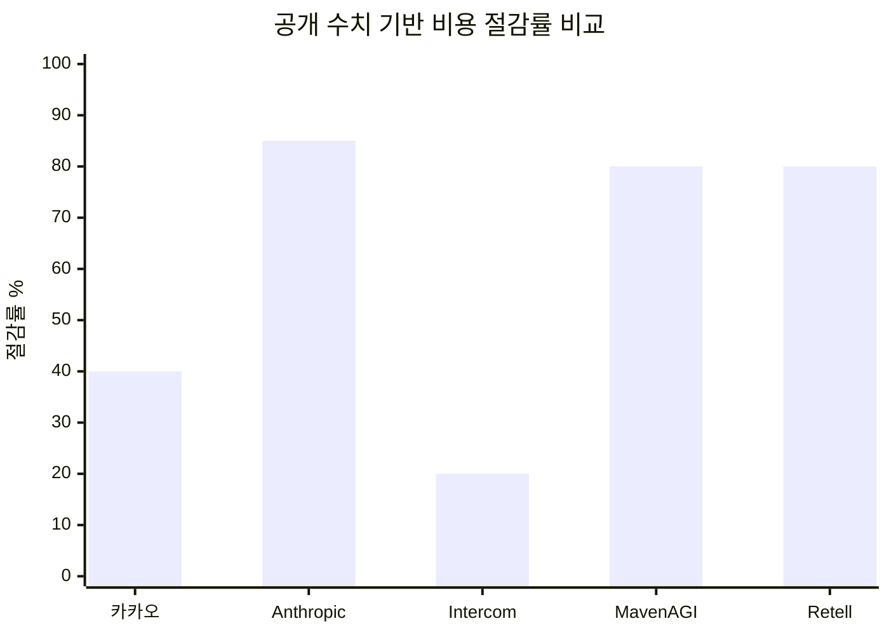
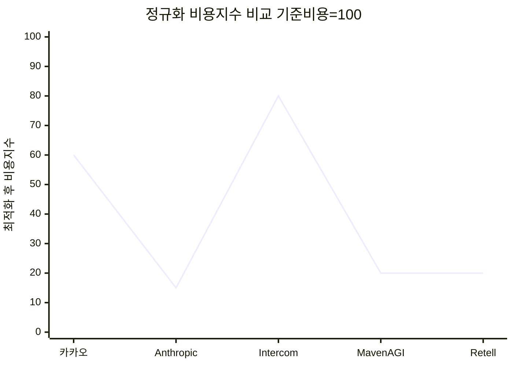
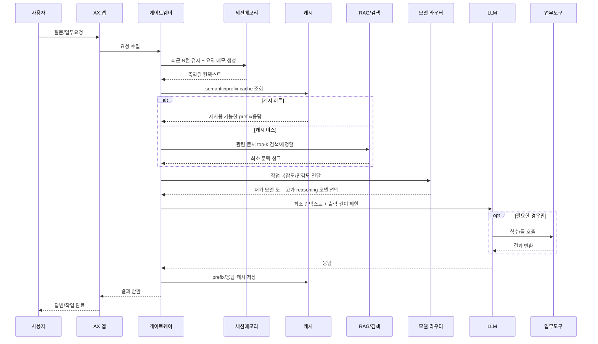
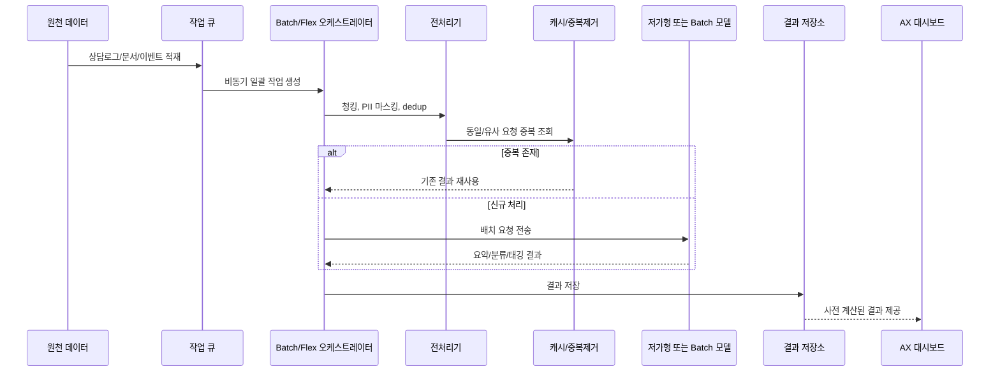

# AX 환경의 AI 에이전트 토큰 비용 최적화 심층 분석

## Executive summary

이 보고서는 사용자의 요청에 따라 **AX를 기본적으로 Application/Experience 플랫폼**으로 해석해 분석한다. 다만 한국 IT 업계 자료에서 **AX가 매우 자주 AI Transformation**을 뜻하므로, 국내 사례를 해석할 때는 그 의미를 별도로 표시한다. 실제로 LG CNS, KT Enterprise, S2W 등은 AX를 DX를 넘어선 **AI 기반 업무·운영 전환**으로 정의하고 있다. citeturn38search1turn38search3turn38search4turn38search11

가장 큰 직접 절감 레버는 여전히 **캐싱, 배치 처리, 모델 라우팅, 도구/컨텍스트 축소**다. 공식 문서 기준으로 OpenAI Prompt Caching은 **입력 토큰 비용을 최대 90%**, Anthropic Prompt Caching은 **최대 90%**, Google Vertex AI/Gemini의 context caching은 **입력 비용을 75% 수준까지**, OpenAI·Anthropic·Google의 batch/flex 계열은 **대체로 50% 할인**을 제공한다. 실증 사례에서는 Anthropic의 Tool Search가 **토큰 사용량 85% 절감**, Intercom의 GPT-4.1 전환이 **비용 20% 절감**, MavenAGI의 고객지원 에이전트가 **티켓당 비용을 40달러에서 8달러로 80% 절감**, Retell AI의 보이스 에이전트가 **콜 처리 비용 최대 80% 절감**, 카카오의 한국어 특화 토크나이저가 **학습 비용 최대 40% 절감**을 공개했다. citeturn26search4turn40search3turn8search5turn39search0turn39search1turn39search2turn40search0turn14view0turn16view0turn18view0turn24view0

국내 공개 사례는 해외보다 **원시 토큰 수나 요청당 비용을 세세히 공개하지 않는 경향**이 강했다. 카카오는 토크나이저 기반 상대 효율을, NAVER는 한국어 최적화 토크나이저 기반의 **낮은 비용과 최대 2배 속도**, LG CNS/LG디스플레이는 외부 유사 서비스 대비 **연간 100억 원 이상 절감**을 공개했지만, 대부분 **before/after 토큰 원장**은 비공개였다. 이는 곧 한국 기업의 AX 환경에서 토큰 최적화의 핵심 문제가 “모델 성능”만이 아니라 **FinOps·LLMOps 계측 체계 부재**라는 점을 시사한다. citeturn24view0turn19search0turn19search1turn21search1turn20search0turn6search10

경영진 관점의 결론은 명확하다. **단기적으로는 캐시·배치·출력 길이 통제·모델 라우팅으로 절감**, **중기적으로는 RAG·세션 메모리·도구 지연 로딩으로 구조 최적화**, **장기적으로는 sLLM/온프렘·튜닝·도메인 특화 토크나이저로 원가 곡선 자체를 낮추는 것**이 가장 현실적인 로드맵이다. 이때 KPI는 “1M 토큰당 비용”보다 **성공 과업당 비용**, **해결 티켓당 비용**, **세션당 uncached token 비중**, **cache hit율**, **환각·에스컬레이션율**로 관리해야 ROI가 보인다. citeturn20search0turn21search1turn16view0turn18view0turn6search10turn26search4turn39search1

## 정의와 범위

한국 기업 자료에서 **AX**는 보통 “AI Transformation”을 뜻한다. LG CNS는 AX를 “DX를 넘어 AI 중심으로 기업의 변화를 추구하는 개념”으로 설명하고, KT Enterprise 역시 AX를 디지털화된 프로세스를 **AI로 지능화·자율화**하는 단계로 해석한다. S2W도 AX를 조직 운영 전반을 AI 중심으로 재설계하는 과정으로 정의한다. 그러나 본 보고서는 사용자 요청에 따라 **AX = Application/Experience 플랫폼**을 기본 범위로 삼고, 국내 출처에서 AX가 AI Transformation 의미로 쓰일 때는 그 문맥을 그대로 병기한다. 즉, 여기서의 분석 대상은 **고객지원 앱, 협업 워크스페이스, 업무 포털, 카카오톡/메신저 기반 경험, 컨택센터 UI, 개발자 경험 툴**처럼 에이전트가 최종 사용자 경험에 붙는 응용 계층이다. citeturn38search1turn38search3turn38search4turn38search11

AI 에이전트는 자율성 수준에 따라 세 부류로 나누는 것이 실무적으로 유용하다. **챗봇**은 사용자의 질문에 주로 반응형으로 응답하는 낮은 자율성 인터페이스이고, **어시스턴트**는 대화 맥락을 유지하면서 검색·요약·도구 호출을 수행하는 중간 자율성 시스템이며, **자율형 에이전트**는 목표를 받아 계획·추론·도구 사용·상태 갱신을 반복하며 작업을 끝까지 추진하는 고자율 시스템이다. 최근 LLM 에이전트 연구들은 이런 시스템을 목표지향적 행동, 도구 사용, 외부 환경과의 상호작용, 메모리·계획 능력으로 구분한다. citeturn25search1turn25search2turn25search9turn25search12

토큰 과금은 보통 세 층으로 이해해야 한다. 첫째는 **입력/출력 토큰 분리 과금**이다. OpenAI는 선택한 모델의 input·output rate로 청구하고, Anthropic은 base input / cache write / cache hit / output을 분리하며, Google Gemini는 input·output·cached token·cache storage duration을 별도로 본다. 둘째는 **컨텍스트 윈도 기반 비용 구조**다. 일부 제공자는 긴 문맥에 대해 별도 가격 구간을 두거나, 긴 문맥을 수용해도 캐시/배치 최적화가 매우 중요해진다. 셋째는 **부가 요금**이다. 툴 호출, 검색 grounding, 컨테이너, 파일 검색 저장소, provisioned throughput 같은 비용이 순수 토큰 비용 외에 붙는다. citeturn26search0turn31view0turn26search10turn32view0

실무 계산식은 다음처럼 잡는 것이 가장 안전하다.  
**총 요청 비용 = (uncached input tokens × input rate) + (cached input/read tokens × cached rate) + (output tokens × output rate) + (cache write/storage fee) + (tool/search fee) + (provisioned or priority premium)**. OpenAI는 built-in tool 토큰도 모델별 토큰 단가로 과금하고 web search·file search·container를 별도 과금한다. Anthropic은 서버사이드 툴과 웹 검색에 추가 요금이 있을 수 있고, Google은 grounding query와 cached storage 시간이 따로 붙는다. Azure는 pay-as-you-go 외에 PTU(Provisioned Throughput Units) 계열을 제공해 예측 가능한 원가 통제가 가능하다. citeturn32view0turn31view0turn26search10turn7search13turn28search10

컨텍스트 윈도는 단순한 기능 스펙이 아니라 비용 변수다. OpenAI는 context window가 **입력+출력(+일부 모델의 reasoning tokens)**를 함께 담는 총량이라고 설명하고, reasoning tokens는 보이지 않아도 **context를 점유하며 output token으로 과금**된다고 밝힌다. Anthropic 역시 conversation history와 새 출력이 함께 context window에 들어가며, 최대 1M 토큰 모델을 제공한다. Google도 1M+ long context 사용 가이드를 별도로 제공한다. 즉 AX 환경에서 “긴 대화가 품질을 높인다”는 직관은 종종 맞지만, **요금·지연·캐시 적중률 악화**를 동시에 초래할 수 있다. citeturn33search0turn33search4turn33search2turn33search14turn33search3

## 과금 구조와 주요 공급자 가격 스냅샷

아래 표는 **2026년 7월 4일 시점 공개 문서 기준**으로, AX 환경에서 자주 거론되는 대표적 요금 구조만 뽑아 정리한 것이다. 실제 계약가는 리전, 데이터 레지던시, 볼륨 할인, 클라우드 마켓플레이스, 우선순위 처리, 장기 약정 여부에 따라 달라질 수 있다. 특히 Azure와 NAVER는 지역·계약형 과금 변형이 많아 **대표 예시**로 읽어야 한다. citeturn32view0turn31view0turn30view0turn28search0turn28search2turn7search4

| 공급자 | 대표 계층 예시 | 표준 토큰 가격 | 캐시/배치/우선 처리 | 컨텍스트·주의사항 |
|---|---|---|---|---|
| OpenAI | GPT-5.5 / GPT-5.4 / GPT-5.4-mini | GPT-5.5는 입력 $5, cached input $0.5, 출력 $30 / 1M tokens. GPT-5.4는 $2.5 / $0.25 / $15, GPT-5.4-mini는 $0.75 / $0.075 / $4.5다. citeturn32view0 | Batch와 Flex는 대체로 표준 대비 **50% 수준**, Priority는 프리미엄 요금이다. Prompt Caching은 입력 비용 **최대 90% 절감**과 지연 감소를 지원한다. citeturn32view0turn26search4turn39search0turn39search8 | long context 구간이 별도고, reasoning tokens는 output으로 과금된다. built-in web search, file search, containers도 별도 비용이 붙는다. citeturn33search4turn32view0 |
| Anthropic | Opus 4.8 / Sonnet 5 / Haiku 4.5 | Opus 4.8은 입력 $5, cache hit $0.5, 출력 $25 / MTok. Sonnet 5는 2026-08-31까지 입력 $2, cache hit $0.2, 출력 $10 / MTok이며 이후 $3 / $0.3 / $15로 전환된다. Haiku 4.5는 $1 / $0.1 / $5다. citeturn31view0 | 5분 cache write는 1.25×, 1시간 cache write는 2×, cache read는 base input의 0.1×다. Batch는 **50% 할인**이다. Prompt caching은 비용 **최대 90% 절감**, token-efficient tool use는 평균 14%, 최대 70% output token 절감을 공개했다. citeturn31view0turn26search5turn39search1turn40search1 | Sonnet 5·Opus 4.6+는 1M context를 표준 요금으로 제공한다. 다만 Opus 4.7+/Sonnet 5의 새 토크나이저는 동일 텍스트에서 **약 30% 더 많은 토큰**을 만들 수 있어, “같은 per-token 가격”이어도 실청구액은 달라질 수 있다. citeturn31view0turn33search18 |
| Google Gemini | Gemini 3.1 Pro / Gemini 3 Flash / Gemini 3.1 Flash-Lite | Gemini 3.1 Pro Standard는 200k 이하 prompt에서 입력 $2, 출력 $12, context caching $0.2, cache storage $4.5 / 1M tokens/hour다. Gemini 3 Flash Standard는 입력 $0.5, 출력 $3, caching $0.05. Flash-Lite는 입력 $0.25, 출력 $1.5, caching $0.025다. citeturn30view0 | Batch와 Flex PayGo는 보통 **50% 할인**이며, context caching은 공개적으로 **입력 비용 75% 절감** 또는 cached token에 대해 별도 낮은 단가·저장 요금 구조를 쓴다. Grounding query도 과금된다. citeturn30view0turn8search5turn39search2turn39search10turn26search10 | Pro는 200k 초과 prompt에서 더 높은 가격 구간이 적용된다. Google은 output 가격에 **thinking tokens 포함**이라고 명시한다. citeturn30view0 |
| Microsoft Azure OpenAI | GPT-Chat Latest / GPT-4.1 series / Provisioned | 검색 스니펫 기준 GPT-Chat Latest는 입력 $5, cached input $0.50, 출력 $30 / 1M tokens다. GPT-4.1 Data Zone 예시는 입력 $2.20, cached input $0.55, 출력 $8.80가 노출된다. citeturn28search2turn28search4turn28search5 | pay-as-you-go와 PTU(Provisioned Throughput Units)를 함께 제공한다. Provisioned는 시간·월·연 단위의 예측 가능한 비용 통제에 유리하다. Batch API 가격 열도 제공된다. citeturn7search13turn28search10turn27view0 | Azure는 Global / Data Zone / Regional 배포 옵션에 따라 원가와 데이터 경로가 달라진다. 긴 문맥·priority processing·data zone premium도 따져야 한다. citeturn27view0turn28search6 |
| NAVER CLOVA Studio | Basic / Exclusive / Neurocloud | 공식 페이지는 **토큰 사용량 기준 과금**과 Basic·Exclusive·Neurocloud 3계층을 안내하지만, 공개 웹페이지에서 일관된 per-token 수치는 쉽게 노출되지 않는다. 공식 포럼 운영자는 서비스 앱 기준으로 **입력+출력을 합산해 토큰 과금**한다고 설명했다. citeturn7search4turn29search3turn5search8 | Neurocloud는 사실상 전용형/구축형 선택지에 가깝고, 기업 보안·주권 요건에 유리하다. citeturn7search4 | HyperCLOVA X는 한국어 최적화 토크나이저로 **영어 중심 LLM보다 더 낮은 비용과 최대 2배 속도**를 주장한다. 한국어 AX 환경에서는 이 점이 매우 중요하다. citeturn19search0turn19search1 |

공급자 비교에서 특히 중요한 함정은 **“토큰 단가”만 보면 틀릴 수 있다는 점**이다. Anthropic은 새 토크나이저가 동일 텍스트에서 약 30% 더 많은 토큰을 만들 수 있다고 공개했고, Google은 200k 초과 prompt에서 Pro 가격이 올라가며, OpenAI는 long context/priority/data residency에 따라 단가가 달라진다. AX 운영팀은 따라서 **문자열 길이**가 아니라 **실제 공급자 tokenizer 산출 토큰 수**로 예산을 잡아야 한다. citeturn31view0turn30view0turn32view0

또 하나의 실무 포인트는 **“생성형 추론 토큰”도 비용**이라는 점이다. OpenAI는 reasoning tokens가 output으로 과금된다고 밝히고, Anthropic은 Claude Code 비용 가이드에서 thinking tokens가 output tokens로 청구된다고 명시하며, Google도 pricing page에서 output price에 thinking tokens를 포함시킨다. 즉 AX 환경의 자율형 에이전트는 보통 채팅형 UI보다 **숨겨진 출력 비용**이 더 높아진다. citeturn33search4turn26search13turn30view0

## 실증 사례 비교

먼저 전제부터 분명히 해야 한다. 공개 사례 전체를 검토해 보면, **국제 공급자는 토큰·티켓·콜 단위 비용을 비교적 자주 공개하는 반면**, 한국 기업은 **연간 절감액, 상대 효율, 속도 향상** 중심으로 발표하는 경향이 강하다. 따라서 아래 표에서 원시 토큰·before/after 비용이 없는 항목은 일부러 **“비공개/미지정(unspecified)”**로 두었다. 이는 데이터 부족을 숨기지 않기 위한 것이다. citeturn21search1turn24view0turn19search0turn16view0turn18view0

| 회사 | 국가 | AX 맥락 | 에이전트 유형 | 공급자 | 기준 토큰 사용량 | 적용 기법 | 비용 이전 | 비용 이후 | 절감률 | 구현 난이도 | 주요 리스크 |
|---|---|---|---|---|---|---|---|---|---|---|---|
| 카카오 citeturn24view0 | 한국 | 카카오톡 내 대화·커머스 경험, 분산형 에이전틱 플랫폼 | 어시스턴트 + 자율형 워크플로 | 자체 카나나 2.5 | 기존 토크나이저 대비 기준값 비공개 | **한국어 특화 토크나이저**, 경량 오케스트레이터 + 도메인 에이전트 분산 구조 | 비공개 | 비공개 | **학습 비용 최대 40% 절감**, 추론 속도 60% 개선 | 높음 | 토크나이저 호환성, 멀티도메인 오케스트레이션 복잡도 |
| NAVER HyperCLOVA X citeturn19search0turn19search1 | 한국 | 한국어 중심 AX/기업 AI 플랫폼 | 챗봇·어시스턴트 | 자체 HyperCLOVA X | 비공개 | **한국어 최적화 토크나이저** | 비공개 | 비공개 | **저비용 + 최대 2배 속도** 공개, 구체 $는 비공개 | 높음 | 글로벌 tokenizer/모델 이식성, 멀티언어 일관성 |
| LG CNS / LG디스플레이 citeturn21search1turn20search0 | 한국 | 임직원 공통업무·AICC·RAG 내장 업무혁신 플랫폼 | 어시스턴트 + 자율형 업무 에이전트 | LG CNS a:xink / sLLM + RAG | 비공개 | **sLLM**, 구축형/하이브리드, RAG, 업무 시스템 연동 | 외부 유사 서비스 기준, 세부 비공개 | 세부 비공개 | **연간 100억 원 이상 비용 절감**, 생산성 약 10% 향상 | 높음 | 구축형 통합 비용, 보안/데이터 거버넌스, 벤더 종속 |
| Anthropic 내부 사례 citeturn40search0turn40search1 | 미국 | Claude 개발자 플랫폼, 대규모 MCP 도구 라이브러리 | 자율형 개발·작업 에이전트 | Anthropic Claude | 전통 방식은 도구 정의 선적재로 **약 77K tokens**, Tool Search는 **약 8.7K tokens**; 다른 설명에서는 전통 122.8K vs Tool Search 191.3K context 보존 수치 병기 | **Tool Search**, `defer_loading`, token-efficient tool use | 금액 비공개 | 금액 비공개 | **토큰 사용량 85% 절감**, token-efficient tool use는 평균 14%, 최대 70% output 절감 | 중간~높음 | 검색 miss로 인한 도구 누락, 복잡한 tool registry 운용 |
| Intercom citeturn14view0 | 아일랜드/미국 | Fin AI Agent, 고객지원·업무 워크플로 | 어시스턴트 + 부분 자율형 작업 에이전트 | OpenAI GPT-4.1 / GPT-4o | raw token 비공개 | **모델 평가 기반 라우팅**, 더 단순한 스택, 작업 적합 모델 선택 | GPT-4o 기준 상대값 | GPT-4.1 기준 상대값 | **20% 비용 절감** | 중간 | 모델 전환 시 품질 regression, eval 파이프라인 운영 부담 |
| MavenAGI citeturn16view0 | 미국 | 고객지원 AX, help center·CRM·API 연동 | 고객지원 어시스턴트/에이전트 | OpenAI GPT-4 | raw token 비공개 | 대규모 콘텐츠 ingestion, CRM/API 통합, 자기평가, 자동 라우팅 | **티켓당 $40** | **티켓당 $8** | **80% 절감** | 중간~높음 | 잘못된 자동응답, CRM 권한/개인정보, 평가 데이터 편향 |
| Retell AI citeturn18view0 | 미국 | 보이스 컨택센터/콜 자동화 경험 | 음성 어시스턴트 + 자율형 보이스 에이전트 | OpenAI GPT-4o / GPT-4.1 | 기존엔 use case마다 **3,000-token prompts**를 수동 운용했다고 설명 | **모델 네이티브 function calling**, 수동 로직·fallback 제거, 간소한 프롬프트 | 구체 $ 비공개 | 구체 $ 비공개 | **콜 처리 비용 최대 80% 절감** | 중간 | 음성 오류 누적, function-call 오작동, 규제 산업 QA 부담 |

공개 수치가 있는 사례만 놓고 보면, **도구/컨텍스트 축소와 CX 자동화**가 가장 큰 절감 효과를 냈다. Anthropic은 Tool Search로 85%, MavenAGI와 Retell은 각각 80%, 카카오는 tokenizer 최적화로 40%, Intercom은 모델 교체만으로 20%의 절감을 공개했다. 이 안에는 “토큰 단가”보다 **토큰 총량·도구 수·불필요한 reasoning trace**가 더 큰 비용 변수라는 메시지가 들어 있다. citeturn40search0turn16view0turn18view0turn24view0turn14view0

차트를 해석할 때 주의할 점도 있다. 카카오는 **학습 비용**, Anthropic은 **토큰 사용량**, Intercom은 **모델 교체 후 운영비**, MavenAGI와 Retell은 **티켓/콜 단위 서비스비용**을 발표했기 때문에, 서로 완전히 동질적인 KPI는 아니다. 그럼에도 공통적으로 보이는 패턴은 다음 두 가지다. **첫째, 긴 프롬프트·많은 도구·많은 턴을 줄이는 것이 비용에 가장 즉각적이다. 둘째, 고성능 모델을 모든 요청에 고정하는 구조보다, 일감에 맞는 모델과 실행 경로를 고르는 구조가 장기 운영에 유리하다.** citeturn40search0turn14view0turn16view0turn18view0

국내 사례의 특징도 구분할 필요가 있다. 카카오와 NAVER는 **한국어 토크나이저/모델 아키텍처 자체를 최적화**하는 방향이고, LG CNS는 **sLLM·RAG·구축형 배치**로 외부 API 비용을 회피하거나 낮추는 방향이다. 즉 한국 AX 시장에서는 미국 API형 서비스처럼 “요청당 토큰 단가 경쟁”보다, **한국어 효율·보안·온프렘 배치·연동 비용 절감**이 훨씬 중요한 비용 축으로 보인다. citeturn24view0turn19search0turn19search1turn20search0turn21search1

## 토큰 최적화 기법 카탈로그

아래 표는 질문에 포함된 기법들을 **메커니즘, 공개된 절감 범위, 트레이드오프, 구현 복잡도** 기준으로 정리한 것이다. 절감 범위는 가능한 한 공식 문서·원논문·고객 사례로 뒷받침했고, 공식 수치가 부족한 경우에는 **“공개 정량치 제한”**으로 명시했다. 이는 과장된 내부 추정치를 피하기 위한 조치다. citeturn26search4turn31view0turn30view0turn35search0turn36search20

| 기법 | 메커니즘 | 공개 절감 범위 | 트레이드오프 | 구현 복잡도 |
|---|---|---|---|---|
| 프롬프트 엔지니어링 | 지시문을 짧고 명확하게 만들고, 출력 형식·길이를 강하게 제한해 불필요한 입력/출력을 줄인다. Anthropic은 prompt/output length 최적화를 명시적으로 권장하고, OpenAI·Anthropic 모두 프롬프트 구조화와 길이 통제를 권한다. citeturn34search10turn34search9turn36search5 | **일반적 업무 프롬프트는 공개 보편 수치 제한**, 다만 reasoning trace를 압축하는 Chain of Draft는 CoT 대비 **최대 92.4% 토큰 감소**를 보였다. citeturn35search0turn35search3 | 지나친 축약은 정확도·설명력·감사 가능성을 떨어뜨릴 수 있다. | 낮음 |
| 컨텍스트 윈도 관리 | 오래된 대화를 그대로 누적하지 않고 최근 N턴 유지, 요약 메모리 전환, 캐시 친화적 truncation으로 컨텍스트 폭증을 막는다. OpenAI는 긴 세션에서 trimming session과 retention ratio를, Anthropic은 progressive token accumulation을 설명한다. citeturn33search13turn33search16turn33search2 | **공개 정량치 제한**. 다만 장시간 대화형 AX에서는 비용과 cache bust를 동시에 줄이는 핵심 선행 조건이다. citeturn33search16turn33search2 | 요약이 잘못되면 사실 손실이 누적되고, 회복이 어렵다. | 중간 |
| 요약 메모리 | 전체 대화/문서를 압축 요약해 후속 턴에 짧은 메모만 재주입한다. 긴 세션·긴 문서 QA에서 유효하다. citeturn33search13turn33search3 | **공개 정량치 제한**. 실무상 long-session 앱에서는 가장 흔한 절감 레버다. | 요약 품질에 따라 핵심 근거가 누락될 수 있다. | 중간 |
| RAG | 전부를 프롬프트에 넣지 않고, 질의와 관련된 문서 조각만 검색·재정렬·주입한다. 원래의 RAG 논문은 외부 비매개 메모리 결합으로 정확도와 최신성, 출처 추적을 개선하는 구조를 제시했다. citeturn37search0turn37search2 | **직접 비용 절감은 공개 보편 수치 제한**, 그러나 context caching과 결합 시 OpenAI/Anthropic 최대 **90%**, Google **75%** 수준의 입력 비용 절감이 가능하다. citeturn26search4turn40search3turn8search5 | 검색 실패 시 환각보다 더 교묘한 누락 오류가 생긴다. | 중간~높음 |
| 모델 선택·라우팅 | 간단한 요청은 저가형/소형 모델, 복잡한 요청만 고가 reasoning 모델에 보낸다. Intercom은 GPT-4.1이 GPT-4o 대비 20% 비용 절감을 달성했다. citeturn14view0turn36search1 | **20%는 공개 실증치**, 전체 시스템 기준으론 80% 수준 사례도 있으나 이는 자동화·라우팅·워크플로 단순화가 함께 작동한 결과다. citeturn14view0turn16view0turn18view0 | 라우팅 오판 시 품질 급락, 모델 drift 대응 필요. | 중간 |
| 배치 처리 | 즉시 응답이 필요 없는 작업을 비동기로 묶어 처리한다. OpenAI, Anthropic, Google 모두 50% 할인 구조를 제공한다. citeturn39search0turn39search1turn39search2 | **약 50%**. 가장 예측 가능한 절감 기법이다. citeturn39search0turn39search1turn39search2 | 실시간 UX에는 부적합하고, SLA 설계가 달라진다. | 낮음 |
| 캐싱 | 반복되는 system prompt, 문서, few-shot, tool definitions를 재사용한다. OpenAI와 Anthropic은 최대 90%, Google은 75% 절감 계열을 공개했다. citeturn26search4turn40search3turn8search5turn26search5 | **75~90%**. 가장 큰 직접 절감 레버 중 하나다. citeturn26search4turn40search3turn8search5 | prompt prefix가 조금만 바뀌어도 hit율이 급락한다. storage/cached write 과금도 따져야 한다. | 낮음~중간 |
| 레이트 리미팅·동시성 제어 | 무분별한 실시간 호출을 줄이고 가치가 높은 요청만 우선 처리한다. Slack AI는 concurrency slot system과 야간 batch recap으로 비용 폭증을 회피했다. citeturn10view0 | **공개 정량치 제한**. 다만 peak cost·quota 초과·429 감소에 매우 효과적이다. Google도 API traffic/throughput 완화를 강조한다. citeturn8search9turn10view0 | 사용자 체감 지연, 우선순위 정책 분쟁 가능. | 낮음 |
| 하이브리드 온프렘/클라우드 | PII·사내지식은 sLLM/온프렘, 복잡 reasoning만 외부 frontier API로 보내 총비용과 보안 리스크를 동시에 줄인다. LG CNS는 sLLM 기반 상담 모델과 구축형 옵션, LG디스플레이는 외부 유사 서비스 대비 연 100억 원 이상 절감을 공개했다. citeturn20search0turn21search1 | **사례 기반으로 매우 큼**, 그러나 공개 표준 범위는 없다. LG디스플레이 공개치는 **연 100억 원+ 절감**이다. citeturn21search1 | 운영 복잡도, MLOps, 모델 업데이트 지연, 초기 CAPEX. | 높음 |
| 파인튜닝 vs 인스트럭션 튜닝 | 반복되는 긴 지시와 few-shot 예시를 모델 내부 행동으로 흡수해 프롬프트를 짧게 만든다. OpenAI는 fine-tuning이 prompt engineering 토큰을 줄일 수 있다고 안내한다. Anthropic은 Claude 3 Haiku fine-tuning 예시에서 **query당 토큰 85% 감소**를 공개했다. citeturn36search20turn40search6turn36search8 | **최대 85%**까지 공개 사례가 있다. 다만 모든 과제에서 일괄적으로 재현되지는 않는다. citeturn40search6 | 데이터셋 구축·평가·재학습 비용이 든다. 잘못 튜닝하면 일반성 손실이 난다. | 높음 |
| 토큰 압축 | prompt compression, draft reasoning, semantic compression, 도구 설명 축약 등으로 **같은 의미를 더 적은 토큰으로 표현**한다. IBM은 prompt compression 개념을, Chain of Draft는 간결한 중간 추론을 보여준다. 카카오·NAVER는 한국어 특화 tokenizer로 같은 텍스트를 더 촘촘히 인코딩한다. citeturn34search4turn35search0turn24view0turn19search0turn19search1 | reasoning trace 압축은 **최대 92.4%**, tokenizer 최적화는 카카오 **학습비 40% 절감**, NAVER는 **낮은 비용·최대 2배 속도**를 공개했다. citeturn35search0turn24view0turn19search1 | 압축이 과도하면 설명 가능성과 디버깅성이 떨어진다. | 중간~높음 |
| SDK·툴링 | token counting API, evals, dashboard, cost explorer, cache key, agents SDK 등을 써서 누수 지점을 찾고 자동 라우팅·실험을 운영한다. Anthropic은 token counting API와 cost visibility, OpenAI는 비용 대시보드·service tier grouping을 제공한다. citeturn39search18turn31view0turn39search8 | **공개 정량치 제한**. 직접 절감보다 “누수 탐지·운영 지속성” 효과가 크다. | 운영 도구 난립 시 오히려 관리비가 늘 수 있다. | 낮음~중간 |

위 표를 실무적으로 요약하면, **빠른 절감**은 캐싱·배치·출력 길이 통제에서 나오고, **지속 가능한 절감**은 모델 라우팅·RAG·세션 메모리·도구 지연 로딩에서 나오며, **원가 구조 자체를 낮추는 절감**은 tokenizer·sLLM·fine-tuning·hybrid deployment에서 나온다. 그래서 AX 환경에서는 “프롬프트를 다듬자”만으로는 부족하고, **아키텍처 자체를 토큰 친화적으로 바꾸는 설계**가 필요하다. citeturn26search4turn39search0turn40search0turn21search1turn24view0

## 아키텍처 패턴과 토큰 흐름

AX 환경에서 가장 흔한 비용 실패 패턴은 다음과 같다. **모든 대화 이력을 매 요청마다 재전송**, **도구 정의를 전부 선탑재**, **긴 문서를 통째로 프롬프트에 삽입**, **실시간이 필요 없는 작업까지 실시간 고가 모델에 투입**, **출력 길이 상한 부재**다. OpenAI·Anthropic·Google 문서는 각각 Prompt Caching, Tool Search, Batch/Flex, long context 관리의 중요성을 반복적으로 강조한다. citeturn26search4turn40search0turn39search0turn39search2turn33search3

### 실시간 AX 어시스턴트 패턴

이 패턴은 고객지원 포털, 사내 업무 포털, 메신저 내 어시스턴트에 적합하다. 핵심은 **요청 분류 → 세션 메모리 trimming → semantic cache 조회 → RAG 검색 → 모델 라우팅 → 응답 길이 통제**의 순서로 토큰을 자르는 것이다. 캐싱은 반복 문맥에, RAG는 외부 지식 주입에, 라우팅은 모델 단가 최적화에, trimming은 장기 세션 폭증 방지에 각각 대응한다. Slack AI, Intercom, Anthropic Tool Search 사례가 이 설계를 뒷받침한다. citeturn10view0turn14view0turn40search0turn33search13

### 대규모 요약·분류 AX 패턴

이 패턴은 **상담 요약, 회의록 생성, 문서 분류, 로그 태깅, FAQ 재생성**처럼 실시간성이 낮은 업무에 맞는다. Slack AI는 Recaps를 야간 batch로 생성해 피크 시간 비용 증가를 피했고, OpenAI·Anthropic·Google은 batch/flex 계열에 약 50% 할인 구조를 둔다. 비용 관점에서는 “실시간으로 바로 보여주고 싶은 유혹”을 이겨내고 **offline-first**로 전환하는 순간 원가가 급격히 내려간다. citeturn10view0turn39search0turn39search1turn39search2turn39search10

### 하이브리드 소버린 패턴

보안·주권·비용이 동시에 중요한 한국 기업 AX에는 **하이브리드 패턴**이 강력하다. 개인·민감 데이터와 사내지식 검색은 내부 sLLM/RAG 계층에서 처리하고, 복잡한 reasoning이나 고난도 생성만 외부 frontier API로 넘긴다. LG CNS는 AICC에서 sLLM과 구축형 옵션, RAG, 클라우드·온프렘 혼합 구성을 강조했고, LG디스플레이 사례에서는 외부 유사 서비스 대비 연 100억 원 이상 절감이 공개됐다. 이 패턴의 본질은 “모든 요청을 외부 최고가 모델에 보내지 않는다”는 것이다. citeturn20search0turn21search1

## 실행 플레이북과 KPI

토큰 비용 최적화는 “한 번의 프롬프트 수정”으로 끝나는 작업이 아니다. 실제로는 **감사(audit) → 분류(segmentation) → 빠른 절감(quick wins) → 구조 재설계 → 튜닝/배포 전략 → 운영 거버넌스**의 순서로 가야 한다. 삼성SDS는 AI 성과 측정에서 토큰·API 호출·모델 사용량 같은 운영지표를 별도 관리해야 한다고 강조하고, OpenAI·Anthropic도 생산 환경에서 cost visibility·rate limit·service tier를 함께 보라고 안내한다. citeturn6search10turn31view0turn39search8turn39search18

첫 단계는 **토큰 원장 만들기**다. 최소한 요청별로 `input_tokens`, `cached_input_tokens`, `output_tokens`, `tool_calls`, `search_calls`, `latency`, `model`, `task_type`, `user_segment`, `success/fallback`, `human_escalation`을 기록해야 한다. Anthropic은 token counting API와 CCU 기반 비용 가시성을, OpenAI는 service tier 구분과 built-in tools 비용 세분화를 제공한다. 이 데이터가 없으면 어떤 팀도 “왜 비용이 올랐는지” 설명할 수 없다. citeturn39search18turn31view0turn32view0

둘째는 **워크로드 분류**다. 모든 요청을 하나의 평균값으로 보면 답이 없다. 보통 AX 환경은 다음 다섯 갈래로 나뉜다. **짧은 FAQ형**, **긴 문서 QA형**, **업무 실행형**, **음성/실시간형**, **배치 요약형**이다. FAQ형은 캐시와 저가 모델, 긴 문서 QA형은 RAG·context caching, 업무 실행형은 tool filtering과 evaluation, 음성형은 짧은 turn·function-call precision, 배치형은 batch/flex가 각각 핵심이다. 사례별 절감 방식이 다르다는 점은 Intercom, Retell, Slack, Anthropic의 공개 자료가 잘 보여준다. citeturn14view0turn18view0turn10view0turn40search0

셋째는 **빠른 절감 패키지**를 2~4주 안에 적용하는 것이다. 우선순위는 보통 이 순서가 좋다.  
1. **출력 길이 상한**과 응답 포맷 통제.  
2. **system prompt 고정화**와 prompt cache key 설계.  
3. **배치 가능한 작업의 실시간 호출 제거**.  
4. **도구 정의 전부 선탑재 구조 제거**.  
5. **FAQ/반복 질의 semantic cache 도입**.  
6. **고가 모델의 무조건 기본값 해제**.  
이 여섯 가지만 해도 많은 기업이 첫 달에 눈에 띄는 원가 하락을 경험한다. 공식 할인만 봐도 cache 75~90%, batch/flex 50%, model swap 20% 사례가 있기 때문이다. citeturn26search4turn40search3turn39search0turn39search1turn39search2turn14view0

넷째는 **세션 구조를 다시 설계**하는 것이다. 장기 대화가 많은 AX 앱은 “모든 턴을 영구 기억”하는 대신, **최근 턴 + 장기 요약 + 필요한 외부 근거 재검색** 구조로 바꿔야 한다. OpenAI는 trimming session과 cache-friendly truncation을, Anthropic은 context accumulation 구조를 설명한다. 이 단계에서 중요한 것은 단순 절감이 아니라 **prompt cache hit율을 깨지 않는 메모리 정책**이다. 프롬프트를 매번 조금씩 바꾸면 캐시 절감이 사라진다. citeturn33search13turn33search16turn33search2turn26search4

다섯째는 **공급자·모델·배포 전략의 다층화**다. 한국어 중심 AX라면 한국어 tokenizer 효율이 높은 자체·국내 모델도 검토할 가치가 크다. 카카오와 NAVER 사례가 이를 뒷받침하며, 보안이 중요하면 LG CNS가 제시하는 sLLM/구축형/하이브리드 접근이 실무적으로 설득력이 높다. 반대로 글로벌 SaaS형 지원센터·보이스 에이전트는 OpenAI/Anthropic·Google 계열의 캐시·batch·tooling 생태계가 더 유리할 수 있다. 결론적으로 **단일 공급자 고집보다 workload-fit가 더 중요**하다. citeturn24view0turn19search0turn19search1turn20search0turn21search1turn14view0turn18view0

여섯째는 **튜닝 임계점**을 정하는 것이다. 같은 긴 지시와 example을 수백만 번 반복하고 있다면, 프롬프트 비용을 계속 내기보다 **파인튜닝/도메인 튜닝이 경제적**일 수 있다. OpenAI는 fine-tuning이 prompt engineering 토큰을 줄일 수 있다고 명시하고, Anthropic은 Haiku 튜닝 예시에서 query당 85% 토큰 감소를 공개했다. 다만 데이터셋 관리·재학습·품질 보증 비용이 있으므로, 보통은 **충분한 호출량과 안정된 과업 정의**가 있을 때만 정당화된다. citeturn36search20turn40search6turn36search8

마지막은 **운영 KPI 체계**다. 비용 최적화가 성공하려면 토큰만 줄이는 것이 아니라 **업무 성과당 비용**이 함께 내려가야 한다. 다음 KPI 세트가 가장 유용하다. citeturn6search10turn16view0turn18view0turn14view0

| KPI | 정의 | 왜 중요한가 |
|---|---|---|
| 요청당 총비용 | 토큰 + 툴 + 검색 + 캐시 저장 + 컨테이너 포함 총비용 | 순수 토큰 외 비용 누락을 막는다. citeturn32view0turn26search10 |
| 성공 과업당 비용 | `총비용 / 성공한 업무 완료 건수` | 토큰 절감이 실제 ROI로 이어지는지 본다. citeturn6search10 |
| 해결 티켓당 비용 | 지원센터·컨택센터용 핵심 지표 | MavenAGI와 Retell처럼 고객지원 AX에 직접 연결된다. citeturn16view0turn18view0 |
| 평균 input/output tokens | 세션·질의 유형별 평균 토큰 | 어떤 흐름이 비용을 태우는지 찾는 기본 지표다. citeturn26search0turn31view0 |
| uncached input 비중 | `(uncached input / total input)` | 캐시 설계가 먹히는지 바로 보여준다. citeturn26search4turn26search5 |
| cache hit율 | prefix/semantic cache 적중률 | 75~90% 절감 기회가 실제로 실현되는지 확인한다. citeturn26search4turn40search3 |
| 모델 라우팅 분포 | 소형·중형·고가 모델 사용 비중 | 모델 과사용과 라우팅 오판을 찾는다. citeturn14view0 |
| tool calls per success | 성공 1건당 평균 도구 호출 수 | 자율형 에이전트의 숨은 비용 누수를 본다. citeturn40search0turn31view0 |
| human escalation율 | 사람이 개입한 비율 | 비용 절감이 품질 하락으로 위장되지 않았는지 본다. citeturn16view0turn18view0 |
| TTFT / 전체 응답시간 | 첫 토큰까지 시간, 총 완료 시간 | 비용 절감과 사용자 경험의 균형을 측정한다. citeturn26search4turn34search12 |

종합하면, IT 기업의 AX 환경에서 토큰 비용 최적화는 **요금표 비교**보다 **요청 구조 재설계**가 더 중요하다. 공개 사례의 공통점은 “적게 보내고, 적게 생성하고, 덜 비싼 모델로 보내고, 가능한 것은 미리 계산해 두고, 반복되는 것은 캐시한다”는 다섯 문장으로 압축된다. 한국 기업이라면 여기에 한 가지를 더해야 한다. 바로 **한국어 토크나이저 효율과 하이브리드 배포 전략**이다. 이 두 축이 해외 사례보다 더 큰 차이를 만들 수 있다. citeturn24view0turn19search0turn19search1turn21search1turn26search4turn39search0turn40search0