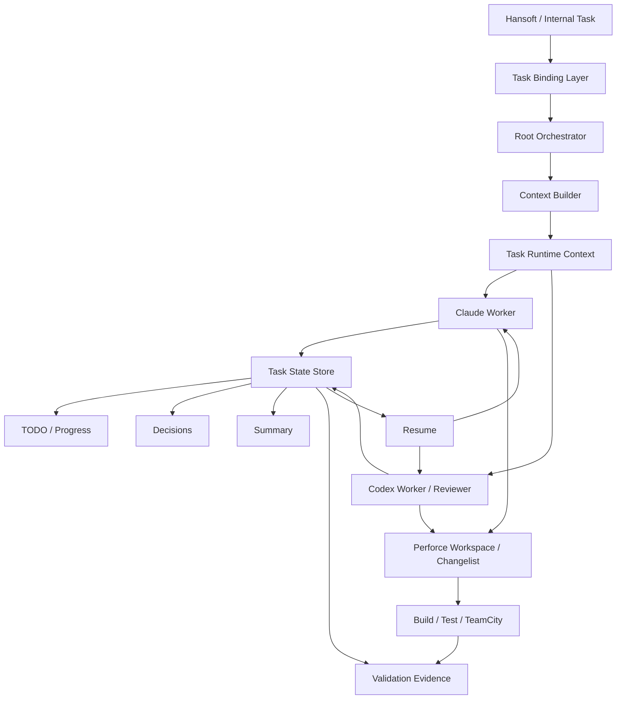

# Agent Kanban에서 얻는 회사 AI 개발 워크플로 인사이트

> Agent Kanban을 그대로 도입하기보다 **Task를 AI 세션의 영속적인 실행 단위로 만들고, Task ID를 중심으로 Context·TODO·Decision·Progress·Resume을 연결하는 패턴**을 Perforce/Hansoft 기반 사내 Harness에 이식하는 것이 핵심 인사이트다.

## 문서 목적

이 문서는 Agent Kanban 제품 자체의 기능 소개가 아니다. 제품 분석은 [`ai/tools/agent-kanban-vscode.md`](../tools/agent-kanban-vscode.md)에 별도로 정리한다.

여기서는 Agent Kanban의 설계에서 회사의 Claude Code/Codex 기반 개발 워크플로에 적용할 수 있는 구조적 아이디어를 추출한다.

핵심 질문은 다음과 같다.

- 개발자가 만든 업무 Task를 AI가 어떻게 이어받을 것인가?
- Claude/Codex 세션이 바뀌어도 업무 맥락을 어떻게 유지할 것인가?
- Agent의 계획/TODO/결정/진척도를 기존 업무 시스템과 어떻게 연결할 것인가?
- Git Worktree 패턴을 Perforce 환경에서는 무엇으로 대체할 것인가?
- 사람의 통제를 유지하면서 Agent 실행을 어디까지 자동화할 것인가?

## 가장 중요한 인사이트: Task가 Agent Context의 Primary Key

일반적인 AI 코딩 흐름은 Chat Session이 중심이다.

```text
Developer
   ↓
Claude/Codex Session
   ↓
Conversation Context
   ↓
Code Change
```

이 구조에서는 세션을 종료하거나 새 모델로 전환할 때 업무 컨텍스트가 끊어진다.

Agent Kanban에서 참고할 핵심은 중심축을 Session에서 Task로 이동시키는 것이다.

```text
                 ┌─ Claude Session A
                 │
Business Task ───┼─ Claude Session B
                 │
                 └─ Codex Review Session

Task ID
 ├─ Requirement
 ├─ Context
 ├─ Plan
 ├─ TODO
 ├─ Decisions
 ├─ Progress
 ├─ Conversation Summary
 └─ Validation Result
```

세션은 교체 가능한 실행기이고 **Task가 지속되는 상태 저장소**가 된다.

이 구조라면 Claude에서 구현하다가 Codex로 리뷰하거나, 다음 날 새로운 Claude 세션에서 작업을 재개해도 동일 Task ID를 기준으로 상태를 복구할 수 있다.

## Task 생성 주체

회사 워크플로에서는 상위 Task 생성 주체를 기본적으로 **사람 또는 기존 업무 관리 시스템**으로 두는 것이 적절하다.

```text
Developer / PM / Hansoft
          ↓
      Parent Task
          ↓
      AI Harness
          ↓
 Claude / Codex Agent
          ↓
   Agent Sub-TODO
```

권장 책임 분리는 다음과 같다.

| 구분 | 생성/관리 주체 |
|---|---|
| 요구사항 / Parent Task | 사람, Hansoft 등 기존 시스템 |
| 실행 계획 | Agent 제안 + 사람 승인 또는 정책 기반 자동 승인 |
| 세부 TODO | Claude/Codex Agent |
| 구현 상태 | Agent 자동 업데이트 |
| 기술 결정 | Agent 기록, 중요한 결정은 사람 확인 |
| Review 결과 | Reviewer Agent + 사람 |
| 완료 승인 | 사람 또는 CI/정책 Gate |

AI가 스스로 상위 업무를 무제한 생성하는 구조보다 **사람이 목적을 정의하고 Agent가 실행 단위로 분해하는 Human-in-the-loop 구조**가 사내 환경에 적합하다.

## 제안하는 회사용 구조



### 1. Task Binding Layer

Hansoft 또는 내부 Task ID와 AI 작업을 연결한다.

예:

```text
Task: DEV-18432
Project: P4VCustom
Agent: Claude
Reviewer: Codex
Workspace: agent-p4vcustom-18432
Pending CL: 812345
Status: Implementing
```

Agent에게 전체 프로젝트 히스토리를 매번 전달하기보다 Task ID를 통해 필요한 컨텍스트를 조회하도록 한다.

### 2. Thin Context Injection

Agent Kanban의 `AGENTS.md` sentinel 방식에서 참고할 부분이다.

상위 instruction 파일에 모든 정보를 넣지 않고 현재 Task를 찾기 위한 최소 정보만 주입한다.

```text
ACTIVE_TASK=DEV-18432
PROJECT=P4VCustom
CONTEXT=.ai/tasks/DEV-18432/context.md
TODO=.ai/tasks/DEV-18432/todo.md
```

Agent는 필요할 때 상세 파일이나 MCP를 통해 추가 정보를 읽는다.

이 방식은 항상 큰 context를 prompt에 넣는 것보다 토큰 사용량과 context pollution을 줄일 가능성이 있다.

### 3. Task Context Cache

Task별 로컬 상태를 둔다.

```text
.ai/
└─ tasks/
   └─ DEV-18432/
      ├─ context.md
      ├─ plan.md
      ├─ todo.md
      ├─ decisions.md
      ├─ progress.md
      ├─ summary.md
      └─ validation.md
```

중요한 것은 대화 전체를 영구 컨텍스트로 사용하는 것이 아니라 **Agent가 다음 실행에 필요한 상태를 구조화해서 남기는 것**이다.

### 4. Resume

새 세션은 과거 대화 전체를 복원하는 대신 Task 상태를 재구성한다.

```text
/resume DEV-18432
        ↓
Task Metadata
 + Current Plan
 + Remaining TODO
 + Decisions
 + Current CL
 + Recent Summary
 + Validation Status
        ↓
New Claude/Codex Session
```

이 패턴은 장기 세션 하나를 계속 유지하는 방식보다 모델 변경, 세션 종료, context window 압박에 강하다.

### 5. Agent가 TODO를 관리

상위 Task는 사람이 만들지만 세부 작업은 Agent가 관리하도록 한다.

```text
DEV-18432 P4V Submit Dialog 개선

[ ] 기존 Submit 흐름 분석
[ ] ViewModel 영향 범위 확인
[ ] UI 수정
[ ] Unit Test
[ ] Build
[ ] Codex Review
[ ] Pending CL 정리
```

Agent는 작업 완료 시 TODO와 progress를 갱신한다.

이렇게 하면 개발자는 Agent의 채팅을 계속 읽지 않아도 작업 상태를 파악할 수 있다.

## Git Worktree를 Perforce에 적용하는 방법

Agent Kanban의 Worktree를 그대로 사용할 수는 없지만 목적은 참고할 수 있다.

Worktree의 본질은 다음 세 가지다.

1. Agent별 파일 시스템 격리
2. Task별 변경사항 격리
3. 병렬 작업 충돌 최소화

Perforce에서는 다음처럼 대응할 수 있다.

| Git Agent Kanban | 회사 Perforce 대응 |
|---|---|
| Git Branch | Pending Changelist |
| Git Worktree | Agent 전용 Perforce Workspace/Client |
| Worktree path | Agent workspace root |
| Branch merge | Reconcile / Resolve / Submit 흐름 |
| Commit history | Changelist + Task history |

따라서 사내 Harness의 격리 단위는 다음처럼 잡을 수 있다.

```text
Task
 ↓
Agent Runtime
 ↓
Perforce Workspace
 ↓
Pending Changelist
```

장기적으로는 `One Workspace per Agent` 또는 `One Workspace per active Task` 중 운영 비용과 충돌 위험을 비교하는 PoC가 필요하다.

## Claude + Codex 역할 분리

Task 중심 구조는 모델 역할 분리와도 잘 맞는다.

```text
Task
 │
 ├─ Claude
 │   ├─ 분석
 │   ├─ 계획
 │   └─ 구현
 │
 └─ Codex
     ├─ Diff Review
     ├─ Requirement Check
     └─ Validation
```

두 모델에게 전체 대화 기록을 공유할 필요 없이 동일 Task State Store를 읽게 하면 된다.

```text
Claude ─┐
        ├── Task State ── Hansoft / Dashboard
Codex ──┘
```

이는 특정 모델에 종속되지 않는 Harness를 만드는 데 중요하다.

## 회사 Workflow에 적용할 수 있는 핵심 패턴

### 바로 적용 가능

**Task ID를 세션 이름과 작업 기록의 기준으로 사용**한다.

예:

```text
[P4VCustom][DEV-18432][Worker-Claude]
[P4VCustom][DEV-18432][Review-Codex]
```

Task별 `plan/todo/decision/summary` 파일을 남기고 새 세션은 이를 읽고 시작하도록 한다.

### PoC 가치 높음

**Task Binding MCP**를 만든다.

예상 도구:

```text
get_task(taskId)
get_task_context(taskId)
get_task_todos(taskId)
update_task_todo(taskId, todo)
add_task_decision(taskId, decision)
update_task_progress(taskId, progress)
get_pending_changelist(taskId)
report_validation(taskId, result)
```

Claude/Codex 모두 같은 MCP contract를 사용하면 Agent 구현을 교체하기 쉬워진다.

### PoC 가치 높음

**Root Orchestrator + Task Board**를 결합한다.

```text
Developer
   ↓
Task Board
   ↓
Root Orchestrator
   ↓
┌─────────┬─────────┬─────────┐
│ Project │ Project │ Project │
│ Agent A │ Agent B │ Agent C │
└─────────┴─────────┴─────────┘
   ↓
Perforce Workspace / CL
   ↓
Codex Review
   ↓
TeamCity Validation
```

Board는 단순 UI가 아니라 Agent runtime의 상태를 projection하는 화면이 된다.

## Dashboard에서 보여줄 정보

회사 내부 Agent Dashboard를 만든다면 다음 정도면 충분하다.

```text
┌─────────────────────────────────────────────┐
│ DEV-18432  P4V Submit Dialog 개선          │
├─────────────────────────────────────────────┤
│ Project      P4VCustom                      │
│ Worker       Claude                         │
│ Reviewer     Codex                          │
│ State        Implementing                   │
│ Progress     4 / 7 TODO                     │
│ Workspace    p4-agent-03                    │
│ Changelist   812345                         │
│ Last Update  3 min ago                      │
│ CI           Not Run                        │
└─────────────────────────────────────────────┘
```

개발자는 Agent의 내부 대화를 감시하는 대신 **Task 상태와 결과만 관찰**할 수 있어야 한다.

## 기대 효과

- Claude/Codex 세션 교체 비용 감소
- 장시간 세션의 context decay 완화
- 모델 간 업무 인수인계 단순화
- Agent 진행 상황의 가시성 향상
- 사람의 Task 관리와 Agent 실행 상태 연결
- Perforce 변경사항과 AI Task의 추적성 확보
- 향후 여러 Agent를 병렬 실행하기 쉬움
- Agent별 긴 프롬프트보다 Task 기반 progressive context loading 적용 가능

## 리스크 및 검토 사항

### Context 저장량 증가

모든 대화를 저장하면 결국 또 다른 거대한 context가 된다. 원문 transcript와 Agent용 summary/state를 분리해야 한다.

### 상태 동기화

Hansoft, 로컬 Task State, Perforce CL, Agent TODO가 각각 다른 상태를 가지면 운영 복잡도가 급증한다. Single Source of Truth와 projection 방향을 먼저 결정해야 한다.

### Agent의 과도한 Task 수정

Agent에게 상위 요구사항까지 자유롭게 수정하게 하면 업무 추적성이 깨질 수 있다. Parent Task는 read-mostly, Agent TODO는 write 가능처럼 권한을 구분하는 것이 좋다.

### 보안

Agent Kanban 신버전은 원격 서비스와 conversation turn capture 기능을 제공하지만, 회사에서는 소스/대화/Task 정보의 외부 전송 정책을 별도 검토해야 한다. 사내 구현에서는 내부 저장소와 MCP를 사용하는 것이 현실적이다.

### Perforce Workspace 비용

Task마다 workspace를 생성하면 client 수, disk, sync 시간, cleanup 비용이 커질 수 있다. Workspace pool 또는 Agent별 persistent workspace가 더 적합할 가능성이 있다.

## 권장 PoC

처음부터 전체 Kanban 시스템을 만들 필요는 없다.

### Phase 1 - Task Persistence

```text
Task ID
 + plan.md
 + todo.md
 + decisions.md
 + summary.md
```

Claude 세션을 종료한 뒤 새 세션이 정상적으로 이어서 작업할 수 있는지 검증한다.

### Phase 2 - Claude ↔ Codex Handoff

Claude가 구현한 Task를 동일 Task Context로 Codex가 리뷰하도록 한다.

성공 기준:

- 별도 장문의 handoff prompt 없이 리뷰 가능
- 요구사항/결정 누락 없음
- 불필요한 전체 transcript 전달 없음

### Phase 3 - Perforce Binding

Task에 Workspace와 Pending CL을 연결한다.

```text
Task ID ↔ Workspace ↔ Pending CL
```

### Phase 4 - MCP

파일 기반 PoC가 안정화된 후 Task State를 MCP API로 추상화한다.

### Phase 5 - Dashboard / Orchestrator

마지막에 Board와 자동 Agent 배정을 추가한다.

UI부터 만드는 것보다 **Task persistence와 resume가 실제로 context 문제를 해결하는지 먼저 검증**하는 편이 좋다.

## 도입 판단

**Agent Kanban 제품 자체**: 회사 환경에서는 외부 서비스 의존성과 Git 중심 격리 때문에 즉시 도입보다는 검토가 필요하다.

**Agent Kanban의 설계 패턴**: 사내 AI 개발 Harness에 적용할 가치가 높다.

특히 다음 네 가지는 우선 PoC 후보로 권장한다.

1. `Task ID = Agent Context Primary Key`
2. `Task Context Cache + Resume`
3. `Agent-managed Sub-TODO`
4. `Task ↔ Perforce Workspace ↔ Changelist Binding`

## 결론

Agent Kanban에서 가져올 가장 중요한 아이디어는 Kanban UI가 아니다.

**업무 Task와 AI Session을 분리하고, Task를 장기간 유지되는 상태의 중심으로 만드는 것**이다.

회사 환경에서는 Hansoft/내부 Task가 업무 목적의 Source of Truth가 되고, Claude/Codex는 Task에 연결되는 교체 가능한 Worker/Reviewer가 된다. Perforce Workspace와 Changelist까지 Task에 바인딩하면 AI 작업을 기존 개발 프로세스 안에서 추적 가능한 형태로 운영할 수 있다.

따라서 Agent Kanban은 직접 도입 후보인 동시에, 현재 구상하는 사내 Claude/Codex Harness의 **Task Persistence / Resume / Context Binding 설계에 대한 좋은 레퍼런스**로 보는 것이 적절하다.

## 참고 자료

- Agent Kanban VS Code Marketplace: https://marketplace.visualstudio.com/items?itemName=AppSoftwareLtd.agent-kanban-vscode
- Agent Kanban Public Repository: https://github.com/appsoftwareltd/agent-kanban-public
- Legacy/local VS Code Agent Kanban: https://github.com/appsoftwareltd/vscode-agent-kanban
- 기존 Wiki 분석: `ai/tools/agent-kanban-vscode.md`
