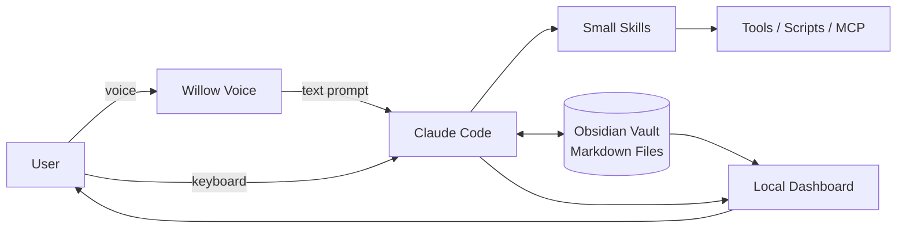

# Jarvis OS 4-Part Local AI Stack

> Claude Code를 실행 엔진, Obsidian을 파일 기반 장기 메모리, Willow Voice를 음성 입력, 단일 로컬 Dashboard를 관제 UI로 분리하는 개인용 local-first AI harness 패턴이다.

## 프로젝트 개요

Jack Roberts가 제안한 "Build your Jarvis OS"는 하나의 완제품 프로젝트라기보다 네 개의 교체 가능한 컴포넌트를 조합하는 개인 AI OS 레퍼런스 아키텍처다. 핵심은 각 요소가 하나의 역할만 맡게 하고, 거대한 단일 프롬프트 대신 작은 Skill과 평문 파일을 중심으로 자동화를 구성하는 것이다.

구성은 다음과 같다.

- Claude Code — Engine: 명령 해석, Skill 실행, 파일/도구 작업
- Obsidian — Memory: Markdown/plain-text 기반 영속 지식
- Willow Voice — Ears: push-to-talk 기반 speech-to-text 입력
- One dashboard — Face: 시스템 상태, 명령, 일정, Vault 노트를 한 화면에 표시

## 해결하려는 문제

일반적인 AI 비서는 대화 세션, 메모리, 입력 인터페이스, 실행 상태 UI가 서로 분리되어 있다. 이 패턴은 이를 로컬 파일 시스템을 중심으로 느슨하게 결합해 다음 문제를 줄이려 한다.

1. 대화가 끝나면 사라지는 컨텍스트
2. 긴 system prompt 하나에 모든 동작을 넣으면서 발생하는 유지보수성과 토큰 낭비
3. 여러 SaaS에 개인 데이터를 분산 저장하는 문제
4. 터미널 기반 Agent의 실행 상태를 한눈에 보기 어려운 문제
5. 반복 프롬프트 입력 비용과 마찰

## 핵심 기능

### 1. 작은 Skill 중심 실행

게시물은 "Five small skills beat one giant prompt"를 핵심 원칙으로 제시한다. 각 Skill을 단일 책임으로 나누면 필요한 작업만 로드하거나 호출할 수 있고 변경 영향 범위도 작아진다. 다만 실제 토큰 절감량은 Skill 로딩 방식과 Claude Code 컨텍스트 구성에 따라 달라지므로 게시물만으로 정량 효과를 입증할 수는 없다.

### 2. 파일 기반 Memory

Obsidian Vault를 `inbox/`, `notes/`, `outputs/` 정도의 단순 구조로 두고 Agent가 Markdown 파일을 직접 읽고 쓴다. 별도 DB가 필수는 아니며 Git, 검색, 백업과 결합하기 쉽다.

### 3. Voice → Agent 입력

Willow Voice는 데스크톱의 입력 가능한 위치에 음성을 텍스트로 삽입하는 dictation layer다. 따라서 Claude Code 자체에 음성 기능을 구현하지 않고도 프롬프트 입력을 음성화할 수 있다.

### 4. 단일 Dashboard

Dashboard는 OS의 핵심 엔진이 아니라 관제/표시 계층이다. 게시물의 예시는 노트북 상태, 명령 목록, 오늘 일정, Obsidian Vault의 live notes를 스크롤/탭 없이 한 화면에 표시하는 것을 목표로 한다.

## 아키텍처



실질적인 중심은 Dashboard가 아니라 `Claude Code ↔ Skills ↔ Markdown Vault` 루프다. Voice와 Dashboard는 각각 입력과 관찰성을 개선하는 교체 가능한 adapter로 보는 편이 적절하다.

## 장점

- 컴포넌트가 느슨하게 결합되어 Voice, Memory, UI를 독립적으로 교체하기 쉽다.
- Markdown이 source of truth라 vendor-specific DB에 비해 이식성과 Git 친화성이 높다.
- 작은 Skill 구조는 거대한 프롬프트보다 역할 분리, 테스트, 버전 관리에 유리하다.
- Claude Code가 로컬 파일/CLI를 직접 다루므로 개발 자동화와 자연스럽게 연결된다.
- Dashboard를 붙이면 여러 자동화가 동작할 때 상태 관찰성이 좋아질 수 있다.

## 단점 및 한계

- "OS"라는 표현과 달리 완성된 운영체제나 통합 Agent 플랫폼이 아니라 조합 패턴에 가깝다.
- 단순 Markdown은 규모가 커질수록 검색, 중복, stale knowledge, provenance 관리가 필요하다. 자동 정리/인덱싱이 없으면 Memory가 쉽게 누적 저장소가 된다.
- Claude Code의 파일 수정 권한을 넓게 주면 오작동 범위도 커진다. 특히 `--dangerously-skip-permissions`/bypass 계열 설정은 개인 실험 외에는 보수적으로 다뤄야 한다.
- Dashboard를 Claude Code에게 한 번 생성하게 하는 것만으로 실제 일정/상태/노트의 안정적인 실시간 동기화가 자동 확보되는 것은 아니다. connector와 상태 갱신 계층을 별도로 설계해야 한다.
- Willow는 완전 로컬 구성요소라고 단정하기 어렵다. 공식 문서는 cloud-based AI model 사용을 설명하며, offline dictation은 유료 기능으로 안내한다.
- 원 게시물의 "free plan, unlimited dictation" 표현은 2026-09-11 기준 공식 가격/도움말과 완전히 일치하지 않는다. 공식 페이지에는 Basic의 weaker model 사용이 unlimited로 표현되기도 하지만 도움말 비교표에는 Free가 주 2,000 words, 세션당 5분으로 기재되어 있어 정책 표기가 상충한다. 도입 전 현재 계정 화면을 확인해야 한다.
- 기업 환경에서는 음성 데이터, Vault 내 소스/문서, Claude Code의 파일/명령 권한에 대한 보안 검토가 필요하다.

## 활용 사례

- 개인 업무 비서: 일정/할 일/메모를 Vault에 모으고 Claude Code Skill로 morning brief 생성
- 개발자 command center: 프로젝트 상태, CI, Perforce/Git, 이슈 정보를 Skill/MCP로 조회하고 Dashboard에서 표시
- Knowledge workflow: inbox 수집 → 정리 Skill → notes → 결과물 outputs 흐름
- Voice-first coding: 긴 구현 지시나 회고 내용을 음성으로 Claude Code/Codex 입력창에 전달

## 기존 도구와 비교

이 패턴은 Open WebUI 같은 단일 AI UI나 범용 Agent Framework와 경쟁하기보다 Unix식 조합에 가깝다. 실행기, 메모리, 음성, UI를 하나의 제품이 소유하지 않는다.

최근 공개된 다른 Jarvis 계열 구현들은 이 아이디어를 더 통합한다. 예를 들어 `ethanplusai/jarvis`는 Claude Code 실행, Markdown memory, SQLite run/event 기록, 음성, Dashboard를 하나의 애플리케이션으로 묶으며 현재 macOS/Chrome 의존성이 있다. `dafire144/claude-code-jarvis`는 Claude Code hook을 이용한 음성/notification/HUD에 집중한다. 따라서 Jack Roberts 방식은 기능은 얕지만 교체 가능성과 구현 단순성이 강점이다.

## 활용 아이디어

### 바로 적용 가능

현재 로컬 AI workflow에서 `Engine / Memory / Input / Face` 네 경계를 설계 기준으로 채택할 가치가 있다. 특히 기존 Skill들을 거대한 공통 프롬프트가 아니라 작은 단일 책임 Skill로 유지하고, 결과를 Markdown으로 축적하는 방식은 즉시 적용 가능하다.

### PoC 가치 있음

개발 생산성 환경에서는 다음과 같은 변형이 더 실용적이다.

```text
Engine     = Claude Code + Codex CLI
Memory     = Git-backed Markdown Knowledge Base
Input      = Keyboard + Willow/Local Whisper
Skills     = Perforce / TeamCity / UE / Docs skills
Tools      = MCP + internal CLI
State      = SQLite or lightweight event store
Face       = local web dashboard
```

Dashboard가 Vault만 읽는 구조보다 실행 상태는 별도 state/event store에 기록하고, 영속 지식만 Markdown으로 승격하는 2-tier memory가 안정적이다.

### 아이디어 참고

"모든 것을 하나의 Agent에 넣기"보다 각 계층을 adapter로 취급하는 방식은 ATOM류 Orchestrator 구조에도 적용할 수 있다. 예를 들어 Claude/Codex 모델을 교체해도 Vault와 Dashboard 계약은 유지하도록 인터페이스를 분리한다.

### 현재는 도입 가치 낮음

업무상 민감한 소스와 음성을 외부 서비스로 보내기 어려운 Enterprise 환경에서 Willow를 기본 입력 계층으로 고정하는 것은 권장하지 않는다. 이 경우 faster-whisper/whisper.cpp 같은 로컬 STT adapter를 검토하는 편이 구조 취지에 더 맞는다.

## 결론

이 게시물의 가치는 특정 4개 제품 조합 자체보다 **Engine / Memory / Ears / Face를 분리하고 작은 Skill로 연결한다는 harness 설계 원칙**에 있다. 실제 생산 환경에서는 여기에 `Tools/MCP`, `Scheduler`, `State/Event Store`, `Permission/Approval` 계층을 추가해야 한다. 특히 Memory를 단순 파일 저장으로 끝내지 않고 자동 정리·검색·provenance 정책까지 설계하는 것이 장기 운영의 핵심이다.

## 참고 자료

- Jack Roberts, Build Your Own Jarvis OS With 4 Free Tools: https://www.linkedin.com/posts/jack-roberts-ai-automations_build-your-own-jarvis-os-with-4-free-tools-activity-7498772038036258816-cS4z
- Willow Voice: https://willowvoice.com/
- Willow pricing: https://willowvoice.com/pricing
- Willow privacy documentation: https://help.willowvoice.com/en/articles/12854269-how-willow-protects-your-data-and-privacy
- ethanplusai/jarvis: https://github.com/ethanplusai/jarvis
- dafire144/claude-code-jarvis: https://github.com/dafire144/claude-code-jarvis
