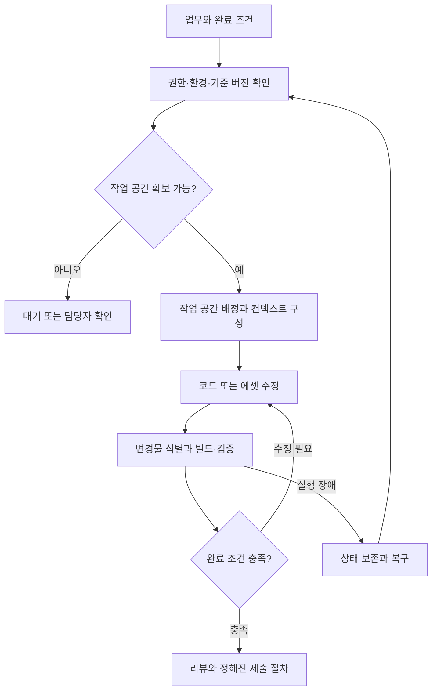

# Perforce·UE5 하네스 설계에 필요한 정보

> 무엇을 맡길지, 어디서 수정할지, 변경물을 어떻게 인계할지, 무엇으로 완료를 판정할지를 먼저 확정한다.

## 목적과 적용 범위

Perforce를 사용하는 UE5 개발 환경에서 AI 에이전트 실행·컨텍스트·도구·검증을 연결하는 하네스를 설계하기 위한 입력 정보 목록이다. 특정 프레임워크 도입안이나 이미 검증된 사내 구현을 설명하는 문서가 아니다.

현재 요청에서 확정된 환경은 Perforce와 UE5 사용이다. 아래 항목의 실제 값은 미확인이다. 도구명과 구성은 수집할 정보의 예시이며 도입 확정 사항이 아니다.

## 필수 정보 12개 묶음

| 번호 | 필요한 정보 | 구체적으로 확인할 내용 | 이 정보로 결정하는 설계 |
|---|---|---|---|
| 1 | 맡길 업무와 완료 조건 | 대표 업무 3개, 입력 자료, 기대 결과, 사용 주체, 코드 수정·리뷰·빌드 실패 분석·에셋 작업 중 범위, 사람이 완료를 판단하는 기준 | 최초 PoC 범위와 실행 단계 |
| 2 | UE·프로젝트 구성 | 정확한 UE 버전 및 엔진 CL/빌드 식별자, 소스 엔진/Installed Build 여부, 엔진 커스텀 수정, 프로젝트·플러그인·모듈 구조, 대상 플랫폼, MSVC·SDK·.NET 버전 | 재현 가능한 실행 환경과 의존성 |
| 3 | Perforce 구성 | 서버·CLI 버전, Streams/Classic depot 여부, stream/view/import 구조, Engine·Game·Tools의 위치 관계, client spec, 줄바꿈·대소문자·문자셋 설정, 접속·인증 갱신 방식 | P4 연동 계약과 경로 매핑 |
| 4 | 작업 공간과 동시 실행 | 사람과 에이전트의 디렉터리 공유 여부, 독립 client와 물리 root 확보 가능 여부, 작업/에이전트별 workspace 또는 pool 운용, 동시 편집·빌드 수, 미제출 변경 처리, Editor 실행 중 작업 허용 여부 | 파일·프로세스 격리와 스케줄링 |
| 5 | 작업 기준 버전과 변경물 인계 | head/검증된 CL/label 중 시작점, 혼합 revision 허용 여부, Task와 Pending CL의 관계, shelf 사용, 리뷰·CI에 수정본 전달 방법, 충돌 해결 담당자, 최종 submit 주체 | 재현성, 작업 인수인계, 제출 흐름 |
| 6 | 수정 대상과 파일 정책 | C++·C#·설정·스크립트·Blueprint·맵 중 허용 범위, .uasset/.umap 실제 filetype와 +l 여부, checkout/잠금 대기 정책, 신규·삭제·이동 파일 처리, p4ignore, 버전 관리 중인 Binaries 예외 | 텍스트/에셋 작업 분리와 변경 감지 |
| 7 | 실제 빌드·검증 방법 | 현재 성공하는 명령, 작업 디렉터리, 환경 변수, Target·Platform·Configuration, 관련 모듈 빌드, Automation/Commandlet/에셋 검증 범위, 실행 시간, 결과 파일 위치와 통과 조건 | 검증 실행기와 작업별 완료 판정 |
| 8 | 실행 머신과 자원 | Windows 네이티브/WSL/VM/서버, CPU·RAM·GPU·디스크 여유, workspace 용량, sync·빌드 시간, DDC·배포 엔진·캐시 이용 방식, GUI/대화형 로그인 필요 여부 | 병렬 수, workspace 수명, 실행 위치 |
| 9 | AI 실행기와 컨텍스트 | 승인된 CLI/API와 버전, 모델·인증 방식·호출 한도, 무인 실행 가능 여부, 프로젝트 지침, 문서·소스 검색 수단, 인덱스의 기준 CL과 갱신 방식, 로그 전달 범위 | 모델 연동, 컨텍스트 구성, 토큰 예산 |
| 10 | 권한과 데이터 경계 | 외부 모델에 보낼 수 있는 소스·로그 범위, 읽기/수정/shelve/submit/resolve/삭제 권한, 인증정보 보관, 실행 허용 명령·경로, 사람이 결정할 작업 | 실제 실행 권한과 정책 강제 위치 |
| 11 | 기존 시스템 연결 | TeamCity 등 CI, Hansoft 등 업무 시스템, 리뷰 시스템, 기존 P4 래퍼·Commandlet·스크립트·MCP의 존재, 입력/출력 계약, 인증, 담당자, 기준 상태를 보관하는 시스템 | 기존 기능 재사용과 상태 동기화 |
| 12 | 중단·복구와 운영 평가 | Task ID, 상태·로그·검증 증거 저장 위치, 재시도 한도, 모델 한도·네트워크 단절·빌드 hang·잠금 충돌 처리, 취소 후 보존/정리 범위, 운영 담당자, 시간·비용·성공률 목표 | 재개 가능한 상태 관리와 도입 효과 측정 |

모든 시스템을 실제로 도입해야 한다는 뜻은 아니다. 예를 들어 CI가 없다면 “없음, 로컬 검증만 수행”이 유효한 설계 입력이다. 비밀번호나 토큰 값은 수집하지 않고, 인증 방식과 권한 범위만 기록한다.

## Perforce·UE5에서 반드시 구분할 사항

### Workspace 격리와 Pending CL 분류

P4 client는 depot 파일과 로컬 파일을 연결하는 매핑이다. 독립 편집이 필요하면 client뿐 아니라 실제 쓰기 경로도 분리되는지 확인해야 한다. [Perforce p4 client](https://help.perforce.com/helix-core/server-apps/cmdref/current/Content/CmdRef/p4_client.html)

**설계 판단:** Pending CL을 여러 개 만든 것만으로 파일 시스템이 격리되지는 않는다. 같은 root에서 사람과 여러 에이전트가 수정하면 파일과 빌드 출력이 충돌할 수 있다. workspace를 분리해도 서로 같은 depot 파일을 수정할 때의 병합·잠금 문제는 별도로 남는다.

### 텍스트 코드와 바이너리 에셋

Epic 문서는 .uasset/.umap이 바이너리이며 텍스트 병합 도구로 병합할 수 없다고 설명한다. 파일 유형 및 쓰기 방식은 typemap과 함께 확인해야 한다. [Epic Perforce 연동](https://dev.epicgames.com/documentation/en-us/unreal-engine/using-perforce-as-source-control-for-unreal-engine)

**설계 판단:** 에셋까지 수정하려면 지원되는 Editor API·Python·Commandlet·플러그인 등의 접근 수단, 에셋 diff/검증 방법, 잠금 정책을 별도 입력으로 받아야 한다. typemap 설정만 보지 말고 기존 파일의 실제 filetype도 확인한다. 읽기 전용 속성을 강제로 해제하는 것을 checkout 대체 수단으로 삼지 않는다.

### 제출 전 변경물의 전달

Shelf는 제출 전에 작업 중인 파일을 서버에 보관하고 다른 workspace에서 가져올 수 있는 기능이다. Shelf 내용은 후속 shelving으로 교체될 수 있다. [Perforce p4 shelve](https://help.perforce.com/helix-core/server-apps/cmdref/current/Content/CmdRef/p4_shelve.html)

**설계 판단:** “Pending CL 번호”만 전달하는 대신 기준 버전, 변경 파일 목록, 해당 수정본의 digest 또는 별도 snapshot ID, 검증 결과를 함께 연결한다. CI가 base CL만 빌드하고 수정본을 누락하지 않도록 인계 계약을 정한다. Shelf 수정 후에는 이전 검증이 여전히 유효하다고 가정하지 않는다. 독점 잠금 파일은 검증 workspace로 가져오는 절차도 실제 서버 정책에서 확인한다.

### 빌드 성공과 작업 완료

UE Automation은 명령행 실행과 JSON/HTML 결과 내보내기를 지원한다. 프로젝트에서 필요한 테스트가 실제 등록·실행되는지, 실패·미실행 결과를 어떻게 판정하는지 확인해야 한다. [Epic Automation 실행](https://dev.epicgames.com/documentation/en-us/unreal-engine/run-automation-tests-in-unreal-engine)

BuildGraph를 사용하는 경우 노드·의존성과 공유 출력 경로를 파악한다. 공식 설명은 분산 실행 시 참여 에이전트의 changelist 일치와 외부 시스템의 머신 조정을 전제로 한다. [Epic BuildGraph](https://dev.epicgames.com/documentation/en-us/unreal-engine/buildgraph-for-unreal-engine)

**설계 판단:** C++ 빌드 통과, 에셋 검증, 런타임 동작 확인 중 무엇이 필요한지는 작업별로 정한다. 실제 변경한 파일 집합과 검증한 파일 집합을 일치시킨다.

## 설계 입력을 사용하는 흐름

아래는 수집 정보를 적용할 위치를 보여주는 제안 구조다. 에이전트 수나 자동 제출 여부는 아직 확정하지 않는다.

## 최소 수집 자료

다음 자료가 있으면 긴 인터뷰 없이 상당수 항목을 확인할 수 있다.

1. **대표 업무 3개:** 실제 요청문, 입력 예시, 기대 결과, 완료 조건.
2. **구조 자료:** 엔진/프로젝트/도구 폴더 트리, .uproject, 주요 .uplugin·Build.cs·Target.cs.
3. **P4 설정 자료:** 식별정보를 필요에 따라 가린 client spec, stream spec, 관련 typemap, p4ignore, 파일 유형 예시.
4. **검증 자료:** 현재 성공하는 빌드·테스트 명령과 성공/실패 로그 각각 한 건, 결과 보고서 예시.
5. **운영 한도:** 사용 가능한 머신, 동시 작업 수, 모델·호출 한도, 외부 전송 정책, 자동화 권한.
6. **업무 인계 사례:** Task → 수정 → Pending CL/Shelf → 리뷰 → CI → Submit의 실제 사례 한 건. 없는 단계는 생략 여부를 기록한다.

각 항목에는 현재 값, 근거 자료, 담당자, 확인일, 미확정 여부를 기록한다. 회사의 실제 설정과 내부 자료를 공개 Wiki에 그대로 올리지 않고 이 문서에는 일반 설계 질문만 유지한다.

## 장점과 한계

- 장점: 프레임워크 선정 전에 격리·재현·검증 계약을 정할 수 있어 구현 재작업을 줄인다.
- 장점: 기존 CI·P4 도구를 재사용하고, 필요한 연결부만 구체화할 수 있다.
- 한계: 설문만으로 잠금·인증 갱신·Editor 충돌 동작을 보장할 수 없다. 실제 환경 PoC가 필요하다.
- 비용: workspace 증가에 따른 디스크·sync·빌드 비용과 AI 호출 비용을 함께 측정해야 한다.
- 유지보수: UE·P4·모델 실행기 버전 변경 시 입력 정보와 검증 절차도 갱신해야 한다.
- 토큰: 전체 엔진 소스·전체 로그를 반복 주입하지 않도록 읽기 범위와 검색·결과 요약 계약을 정한다. 절감률은 측정 전 확정할 수 없다.

## 활용 아이디어

- **바로 적용 가능:** 위 12개 항목으로 현재 환경 정보를 수집하고 미확정 항목의 담당자를 지정한다.
- **PoC 가치 있음:** 한 개의 대표 코드 작업을 독립 workspace에서 실행해 수정본 인계, 검증, 중단 후 재개까지 확인한다.
- **아이디어 참고:** Task ID를 중심으로 모델 세션, workspace, base revision, Pending CL/Shelf, 검증 증거를 연결한다.
- **현재 우선순위 낮음:** 업무·검증 계약을 정하기 전에 대규모 다중 에이전트 조직이나 대시보드부터 구현하는 것.

## 기존 문서와의 관계

동일한 설계 입력 목록 문서는 검색에서 발견되지 않아 별도 작성했다. 아래 문서는 운영 패턴·컨텍스트 전략을 다루므로 본 문서에서는 구현 설명을 반복하지 않는다.

- [Agent Kanban 회사 워크플로 인사이트](agent-kanban-company-workflow-insights.md): Task 중심 상태와 인계 설계.
- [Evidence-First Agent Harness](evidence-first-agent-harness.md): 근거 확인과 고비용 검증 제어.
- [Perforce 토큰 최적화](../tips/perforce-p4.md): P4 출력과 컨텍스트 최적화.

이 문서에서 Pending CL은 변경 분류·추적 단위로 정의하며, 독립 workspace/물리 경로와 동일한 격리 수단으로 취급하지 않는다.

## 결론

먼저 답할 질문은 다섯 가지다.

1. 대표적으로 어떤 업무를 맡길 것인가?
2. 코드만 수정하는가, 에셋도 수정하는가?
3. 사람과 에이전트의 작업 공간을 어떻게 분리하는가?
4. 수정본을 어디까지 자동 처리하고 누구에게 넘기는가?
5. 어떤 실제 명령과 결과로 완료를 판정하는가?

이 다섯 답변을 바탕으로 환경·자원·인계·복구 정보를 채우면 하네스의 책임과 최소 구현 범위를 정할 수 있다.

## 참고 자료

- [Epic: Using Perforce as Source Control](https://dev.epicgames.com/documentation/en-us/unreal-engine/using-perforce-as-source-control-for-unreal-engine)
- [Perforce: p4 client](https://help.perforce.com/helix-core/server-apps/cmdref/current/Content/CmdRef/p4_client.html)
- [Perforce: p4 shelve](https://help.perforce.com/helix-core/server-apps/cmdref/current/Content/CmdRef/p4_shelve.html)
- [Epic: Run Automation Tests](https://dev.epicgames.com/documentation/en-us/unreal-engine/run-automation-tests-in-unreal-engine)
- [Epic: BuildGraph](https://dev.epicgames.com/documentation/en-us/unreal-engine/buildgraph-for-unreal-engine)

공식 문서 확인일: 2026-09-14. 최신 문서의 기능을 사내 설치 버전에서 사용할 수 있다고 가정하지 않으며, 실제 버전 지원 여부는 설계 입력 수집 시 확인한다.
