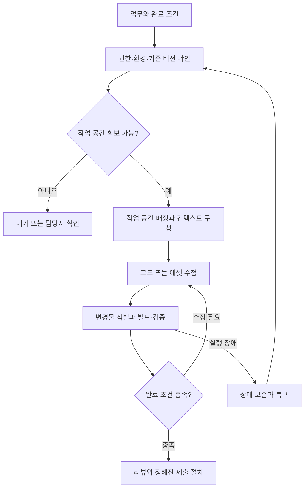
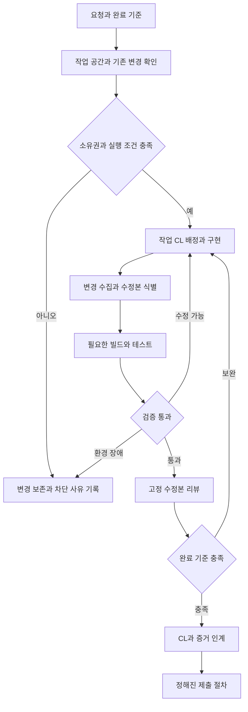

# Perforce·UE5 하네스 설계: 필수 정보와 Claude 운영안

> 무엇을 맡길지, 어디서 수정할지, 변경물을 어떻게 인계할지, 무엇으로 완료를 판정할지를 먼저 확정한다.

## 목적과 적용 범위

Perforce를 사용하는 UE5 개발 환경에서 AI 에이전트 실행·컨텍스트·도구·검증을 연결하는 하네스의 설계 입력과 Claude Code 운영안을 정리한다. 앞부분은 확인할 환경 정보, 뒷부분은 공식 문서에 근거한 권장 구성이다. 실제 사내 환경에서 검증된 구현을 설명하는 문서는 아니다.

현재 요청에서 확정된 환경은 Perforce와 UE5 사용이다. 아래 항목의 실제 값은 미확인이다. 도구명과 구성은 수집할 정보의 예시이며 도입 확정 사항이 아니다.

## 필수 정보 12개 묶음

| 번호 | 필요한 정보 | 구체적으로 확인할 내용 | 이 정보로 결정하는 설계 |
|---|---|---|---|
| 1 | 맡길 업무와 완료 조건 | 대표 업무 3개, 입력 자료, 기대 결과, 사용 주체, 코드 수정·리뷰·빌드 실패 분석·에셋 작업 중 범위, 사람이 완료를 판단하는 기준 | 최초 PoC 범위와 실행 단계 |
| 2 | UE·프로젝트 구성 | 정확한 UE 버전 및 엔진 CL/빌드 식별자, 소스 엔진/Installed Build 여부, 엔진 커스텀 수정, 프로젝트·플러그인·모듈 구조, 대상 플랫폼, MSVC·SDK·.NET 버전 | 재현 가능한 실행 환경과 의존성 |
| 3 | Perforce 구성 | 서버·CLI 버전, Streams/Classic depot 여부, stream/view/import 구조, Engine·Game·Tools의 위치 관계, client spec, 줄바꿈·대소문자·문자셋 설정, 접속·인증 갱신 방식 | P4 연동 계약과 경로 매핑 |
| 4 | 작업 공간과 동시 실행 | 사람과 에이전트의 디렉터리 공유 여부, 독립 client와 물리 root 확보 가능 여부, 작업/에이전트별 workspace 또는 pool 운용, 동시 편집·빌드 수, 미제출 변경 처리, Editor 실행 중 작업 허용 여부 | 파일·프로세스 격리와 스케줄링 |
| 5 | 작업 기준 버전과 변경물 인계 | head/검증된 CL/label 중 시작점, 혼합 revision 허용 여부, Task와 Pending CL의 관계, shelf 사용, 리뷰·CI에 수정본 전달 방법, 충돌 해결 담당자, 최종 submit 주체 | 재현성, 작업 인수인계, 제출 흐름 |
| 6 | 수정 대상과 파일 정책 | C++·C#·설정·스크립트·Blueprint·맵 중 허용 범위, .uasset/.umap 실제 filetype와 +l 여부, checkout/잠금 대기 정책, 신규·삭제·이동 파일 처리, p4ignore, 버전 관리 중인 Binaries 예외 | 텍스트/에셋 작업 분리와 변경 감지 |
| 7 | 실제 빌드·검증 방법 | 현재 성공하는 명령, 작업 디렉터리, 환경 변수, Target·Platform·Configuration, 관련 모듈 빌드, Automation/Commandlet/에셋 검증 범위, 실행 시간, 결과 파일 위치와 통과 조건 | 검증 실행기와 작업별 완료 판정 |
| 8 | 실행 머신과 자원 | Windows 네이티브/WSL/VM/서버, CPU·RAM·GPU·디스크 여유, workspace 용량, sync·빌드 시간, DDC·배포 엔진·캐시 이용 방식, GUI/대화형 로그인 필요 여부 | 병렬 수, workspace 수명, 실행 위치 |
| 9 | AI 실행기와 컨텍스트 | 승인된 CLI/API와 버전, 모델·인증 방식·호출 한도, 무인 실행 가능 여부, 프로젝트 지침, 문서·소스 검색 수단, 인덱스의 기준 CL과 갱신 방식, 로그 전달 범위 | 모델 연동, 컨텍스트 구성, 토큰 예산 |
| 10 | 권한과 데이터 경계 | 외부 모델에 보낼 수 있는 소스·로그 범위, 읽기/수정/shelve/submit/resolve/삭제 권한, 인증정보 보관, 실행 허용 명령·경로, 사람이 결정할 작업 | 실제 실행 권한과 정책 강제 위치 |
| 11 | 기존 시스템 연결 | TeamCity 등 CI, Hansoft 등 업무 시스템, 리뷰 시스템, 기존 P4 래퍼·Commandlet·스크립트·MCP의 존재, 입력/출력 계약, 인증, 담당자, 기준 상태를 보관하는 시스템 | 기존 기능 재사용과 상태 동기화 |
| 12 | 중단·복구와 운영 평가 | Task ID, 상태·로그·검증 증거 저장 위치, 재시도 한도, 모델 한도·네트워크 단절·빌드 hang·잠금 충돌 처리, 취소 후 보존/정리 범위, 운영 담당자, 시간·비용·성공률 목표 | 재개 가능한 상태 관리와 도입 효과 측정 |

모든 시스템을 실제로 도입해야 한다는 뜻은 아니다. 예를 들어 CI가 없다면 “없음, 로컬 검증만 수행”이 유효한 설계 입력이다. 비밀번호나 토큰 값은 수집하지 않고, 인증 방식과 권한 범위만 기록한다.

## Perforce·UE5에서 반드시 구분할 사항

### Workspace 격리와 Pending CL 분류

P4 client는 depot 파일과 로컬 파일을 연결하는 매핑이다. 독립 편집이 필요하면 client뿐 아니라 실제 쓰기 경로도 분리되는지 확인해야 한다. [Perforce p4 client](https://help.perforce.com/helix-core/server-apps/cmdref/current/Content/CmdRef/p4_client.html)

**설계 판단:** Pending CL을 여러 개 만든 것만으로 파일 시스템이 격리되지는 않는다. 같은 root에서 사람과 여러 에이전트가 수정하면 파일과 빌드 출력이 충돌할 수 있다. workspace를 분리해도 서로 같은 depot 파일을 수정할 때의 병합·잠금 문제는 별도로 남는다.

### 텍스트 코드와 바이너리 에셋

Epic 문서는 .uasset/.umap이 바이너리이며 텍스트 병합 도구로 병합할 수 없다고 설명한다. 파일 유형 및 쓰기 방식은 typemap과 함께 확인해야 한다. [Epic Perforce 연동](https://dev.epicgames.com/documentation/en-us/unreal-engine/using-perforce-as-source-control-for-unreal-engine)

**설계 판단:** 에셋까지 수정하려면 지원되는 Editor API·Python·Commandlet·플러그인 등의 접근 수단, 에셋 diff/검증 방법, 잠금 정책을 별도 입력으로 받아야 한다. typemap 설정만 보지 말고 기존 파일의 실제 filetype도 확인한다. 읽기 전용 속성을 강제로 해제하는 것을 checkout 대체 수단으로 삼지 않는다.

### 제출 전 변경물의 전달

Shelf는 제출 전에 작업 중인 파일을 서버에 보관하고 다른 workspace에서 가져올 수 있는 기능이다. Shelf 내용은 후속 shelving으로 교체될 수 있다. [Perforce p4 shelve](https://help.perforce.com/helix-core/server-apps/cmdref/current/Content/CmdRef/p4_shelve.html)

**설계 판단:** “Pending CL 번호”만 전달하는 대신 기준 버전, 변경 파일 목록, 해당 수정본의 digest 또는 별도 snapshot ID, 검증 결과를 함께 연결한다. CI가 base CL만 빌드하고 수정본을 누락하지 않도록 인계 계약을 정한다. Shelf 수정 후에는 이전 검증이 여전히 유효하다고 가정하지 않는다. 독점 잠금 파일은 검증 workspace로 가져오는 절차도 실제 서버 정책에서 확인한다.

### 빌드 성공과 작업 완료

UE Automation은 명령행 실행과 JSON/HTML 결과 내보내기를 지원한다. 프로젝트에서 필요한 테스트가 실제 등록·실행되는지, 실패·미실행 결과를 어떻게 판정하는지 확인해야 한다. [Epic Automation 실행](https://dev.epicgames.com/documentation/en-us/unreal-engine/run-automation-tests-in-unreal-engine)

BuildGraph를 사용하는 경우 노드·의존성과 공유 출력 경로를 파악한다. 공식 설명은 분산 실행 시 참여 에이전트의 changelist 일치와 외부 시스템의 머신 조정을 전제로 한다. [Epic BuildGraph](https://dev.epicgames.com/documentation/en-us/unreal-engine/buildgraph-for-unreal-engine)

**설계 판단:** C++ 빌드 통과, 에셋 검증, 런타임 동작 확인 중 무엇이 필요한지는 작업별로 정한다. 실제 변경한 파일 집합과 검증한 파일 집합을 일치시킨다.

## 설계 입력을 사용하는 흐름

아래는 수집 정보를 적용할 위치를 보여주는 제안 구조다. 에이전트 수나 자동 제출 여부는 아직 확정하지 않는다.



## 최소 수집 자료

다음 자료가 있으면 긴 인터뷰 없이 상당수 항목을 확인할 수 있다.

1. **대표 업무 3개:** 실제 요청문, 입력 예시, 기대 결과, 완료 조건.
2. **구조 자료:** 엔진/프로젝트/도구 폴더 트리, .uproject, 주요 .uplugin·Build.cs·Target.cs.
3. **P4 설정 자료:** 식별정보를 필요에 따라 가린 client spec, stream spec, 관련 typemap, p4ignore, 파일 유형 예시.
4. **검증 자료:** 현재 성공하는 빌드·테스트 명령과 성공/실패 로그 각각 한 건, 결과 보고서 예시.
5. **운영 한도:** 사용 가능한 머신, 동시 작업 수, 모델·호출 한도, 외부 전송 정책, 자동화 권한.
6. **업무 인계 사례:** Task → 수정 → Pending CL/Shelf → 리뷰 → CI → Submit의 실제 사례 한 건. 없는 단계는 생략 여부를 기록한다.

각 항목에는 현재 값, 근거 자료, 담당자, 확인일, 미확정 여부를 기록한다. 회사의 실제 설정과 내부 자료를 공개 Wiki에 그대로 올리지 않고 이 문서에는 일반 설계 질문만 유지한다.

## Claude Code 권장 운영안

> 아래는 2026-09-14 공식 문서를 바탕으로 구성한 설계 제안이다. 실제 회사의 Claude Code·P4·UE 버전, 권한, 빌드 명령은 아직 검증하지 않았다. Windows에서 실행하는 Claude Code를 기준으로 하며, 예시 명령명과 설정 파일은 새로 구현할 인터페이스다.

### 1. 추천 출발점

처음에는 **Claude Code 한 세션이 구현을 맡고, P4 어댑터가 작업 공간·checkout·CL을 관리하며, 기존 빌드 도구가 결과를 검증하는 구조**를 권장한다. 조사와 리뷰는 필요할 때 별도 읽기 전용 실행자로 분리한다. 작업 하나마다 분석·구현·검증·리뷰 모델을 모두 호출하는 고정 파이프라인은 초기 기본값으로 두지 않는다.

우선 최적화할 것은 모델 호출 횟수만이 아니다. 작업 외 파일 수정, 반복 sync, 잘못된 환경에서의 빌드, 전체 로그 재독해, 검증하지 않은 수정본 제출 같은 재작업을 줄인다.

| 구성 요소 | 책임 | 초기 구현 범위 |
|---|---|---|
| Claude Code | 조사, 수정 계획, 구현, 결과 설명 | 프로젝트 디렉터리에서 작업 단위 세션 |
| P4 어댑터 | 실제 client/root 확인, checkout, CL 분류, 변경 수집 | 기존 CLI 또는 사내 P4 코드 위에 작은 실행 래퍼 |
| 규칙과 Skills | 프로젝트 지식과 반복 절차 제공 | 짧은 공통 규칙, 경로별 규칙, 소수의 업무 절차 |
| Hooks | 도구 호출 전 확인, 호출 후 상태 기록 | 환경 요약, 파일 준비, 변경 기록 |
| 검증 실행기 | 지정된 build/test 실행과 증거 저장 | 현재 성공하는 로컬 명령부터 연결 |
| 작업 기록 | Task·CL·수정본·검증 결과 연결 | JSON과 파일 로그로 시작 |
| CI | 제출 전 통합 검증 | 필요할 때 TeamCity shelf build 연결 |

이 구조는 기존 [Evidence-First Agent Harness](evidence-first-agent-harness.md)의 근거 우선 조사와 [Agent Kanban 워크플로](agent-kanban-company-workflow-insights.md)의 작업 중심 상태 관리에 P4 실행 계약을 추가한 것이다.

### 2. 워크스페이스는 편집자 수에 맞춰 배정한다

| 방식 | 적용 조건 | 장점 | 비용과 한계 |
|---|---|---|---|
| 기존 workspace에서 사람과 Claude가 번갈아 편집 | 같은 파일·관련 빌드 출력을 동시에 변경하지 않음 | 저장 공간 추가 없이 시작 | 사용자의 기존 수정과 섞일 수 있어 시작 상태 보존 필요 |
| 전용 workspace 1개에서 Claude가 순차 작업 | 디스크 확보 가능, 한 번에 구현 작업 1개 | 사람 작업과 분리, 복구·검증 단순화 | 최초 sync와 보관 공간 필요 |
| 전용 workspace 풀 | 실제 병렬 구현 수요가 있음 | 매번 전체 복제하지 않고 재사용 | 대여 상태·dirty 검사·기준 버전 관리 필요 |
| 매 작업마다 새 workspace | 일회성 CI나 충분한 인프라 | 작업별 수명과 소유권 명확 | 대형 UE 저장소의 sync·디스크 비용 큼 |

**권장 기본값은 전용 workspace 1개와 동시 편집자 1명이다.** 추가 공간이 어렵다면 기존 workspace에서 사람과 Claude가 번갈아 작업하는 방식이 유효하다. 병렬 구현은 필요성이 확인된 후, 예를 들어 2개짜리 풀부터 측정한다. 숫자는 성능 보장값이 아니다.

- 각 독립 편집 workspace는 서로 다른 `P4CLIENT`와 실제 쓰기 root를 가진다.
- 같은 workspace에서 여러 Pending CL을 만들어도 같은 파일과 빌드 산출물을 공유한다.
- 일반 텍스트 파일은 여러 client가 동시에 열 수 있으므로, workspace 격리만으로 최종 병합 충돌이 사라지지 않는다. 작업 배정 시 파일·모듈 소유 범위를 조정한다.
- 바이너리의 독점 잠금은 client를 늘려 해결하지 않는다.
- 조사자는 동일 소스를 읽을 수 있지만, 리뷰는 구현을 잠시 멈춘 수정본이나 식별 가능한 snapshot을 대상으로 한다.
- 풀은 세션 종료만 보고 반환하지 않는다. 실행 중인 프로세스, 열린 파일, 미등록 변경, 검증 결과를 확인해 재사용 가능 여부를 결정한다.
- UBT·MSBuild·Editor가 쓰는 중간 파일과 출력 경로도 분리하거나 실행 잠금을 둔다. DDC와 사전 빌드 엔진은 지원되는 공유 방식으로 재사용하되, 동일 소스·Binaries·Intermediate를 여러 편집자가 쓰게 하지 않는다.

Client는 로컬 파일 매핑을 정의하고, 파일 변경 분류는 CL이 담당한다. 위 격리 정책은 이 특성에 근거한 설계 판단이다. [P4 client](https://help.perforce.com/helix-core/server-apps/cmdref/current/Content/CmdRef/p4_client.html)

### 3. P4 어댑터가 맡을 계약

어댑터의 목적은 Claude가 매번 P4 명령 조합과 예외 처리를 다시 추론하지 않도록 만드는 것이다. PowerShell 또는 기존 .NET CLI로 시작하고, 여러 실행기에서 재사용할 필요가 생기면 동일 기능을 좁은 MCP 도구로 노출한다. 아래 이름은 제안이며, 설치되어 있는 제품 기능이 아니다.

| 제안 인터페이스 | 동작과 반환값 |
|---|---|
| `workspace.inspect` | client/root/stream 또는 view, 인증 상태, 기존 열린 파일, 기준 revision, 진행 중인 빌드 |
| `task.begin` | 목표·범위·검증 기준 확정, 작업 ID와 번호 있는 Pending CL 연결, 시작 상태 저장 |
| `file.prepare` | 실제 경로·매핑·소유권·filetype 확인 후 기존 추적 파일 checkout |
| `task.changes` | 해당 작업의 add/edit/delete/move와 미등록 변경 후보 수집 |
| `build.run` | 허용된 build profile 실행, 종료 코드·핵심 오류·전체 로그 위치 반환 |
| `task.checkpoint` | 수정본 ID와 복구 기록 생성, 정책상 허용되면 shelf 갱신 |
| `task.finish` | 범위와 검증 결과 확인, CL 설명·인계 보고서 작성 |

`workspace.inspect`는 최초 연결 시 전체 환경을 점검하되, 이후 훅 호출에서는 현재 파일과 작업 상태에 필요한 정보만 조회한다. 매 편집마다 전체 depot의 `opened -a`나 전체 UE tree의 reconcile을 실행하지 않는다.

실제 P4 호출은 작업에서 지정한 서버·사용자·client와 작업 디렉터리를 사용하고, 반환된 root와 매핑이 계약에 맞는지 검증한다. `P4CONFIG`를 사용한다면 각 root의 로컬 설정과 유효 설정을 확인한다. `P4CONFIG`는 파일명 설정과 파일 내용이 모두 필요하며, 디렉터리와 상위 디렉터리에서 설정을 찾는다. 세션마다 전역 `P4CLIENT`를 바꾸는 방식은 여러 프로젝트 실행 시 피한다. [P4CONFIG](https://help.perforce.com/helix-core/server-apps/cmdref/current/Content/CmdRef/P4CONFIG.html)

파일 수정을 준비하는 절차는 다음과 같다.

1. 작업 범위 안의 경로인지 확인하고, Windows 대소문자·junction·실제 경로를 정규화한다.
2. 추적 파일 여부와 현재 client/CL의 open 상태를 확인한다. 다른 작업이나 사용자가 이미 수정한 파일이면 임의로 이동·덮어쓰기하지 않는다.
3. 기존 추적 파일은 `p4 edit -c <TASK_CL> <FILE>`로 준비한다. 명령 실패 시 편집을 진행하지 않는다.
4. 신규 파일은 생성 후 ignore·매핑·filetype을 확인해 작업 CL에 add한다. 추적되지 않은 기존 파일을 신규 파일로 오인해 덮어쓰지 않는다.
5. 삭제·이동은 승인된 작업 범위에 포함되었는지 확인한 뒤 P4 delete/move 절차로 처리한다.
6. 작업이 허용한 파일 범위에서 reconcile 미리보기로 누락을 찾고, 확인된 항목만 반영한다.

기본은 `noallwrite` 환경에서의 명시적 checkout이다. `allwrite + reconcile`은 코드만 다루는 별도 환경에서 비교할 수 있지만, 변경 소유권과 누락 검사를 별도로 설계해야 한다. 읽기 전용 속성 강제 해제를 checkout의 대체로 쓰지 않는다. `p4 opened`에는 아직 등록하지 않은 파일이 포함되지 않으므로 이것만으로 workspace 전체 상태를 판정하지 않는다. [P4 edit](https://help.perforce.com/helix-core/server-apps/cmdref/current/content/CmdRef/p4_edit.html), [P4 reconcile](https://help.perforce.com/helix-core/server-apps/cmdref/current/Content/CmdRef/p4_reconcile.html)

### 4. 규칙·Skills·Hooks·권한을 나누어 배치한다

| 위치 | 담을 내용 | 운영 원칙 |
|---|---|---|
| `CLAUDE.md` | P4 사용, 작업 시작점, 공통 완료 기준, 규칙·도구 안내 | 항상 필요한 짧은 내용 |
| `.claude/rules/perforce.md` | checkout·CL·변경물 인계 규칙 | 모든 코드 작업에 적용 |
| `.claude/rules/ue-cpp.md` | 실제 UE 모듈 관례·검증 profile | 관련 경로에 적용 |
| `.claude/rules/dotnet.md` | 실제 C#·WPF 구조와 검증 profile | 관련 경로에 적용 |
| `.claude/skills/<name>/SKILL.md` | 작업 시작, 빌드 실패 분석, CL 정리 등의 절차 | 반복 업무가 생길 때 추가 |
| `.claude/agents/` | 필요할 때 호출하는 조사·리뷰 역할 | 도구와 반환 형식 제한 |
| `.claude/settings.json` | 팀 공통 설정과 hook 연결 | 실제 시작 디렉터리에 적용되는지 확인 |
| `.claude/settings.local.json` | 머신별 경로·개인 설정 | P4에서 별도로 제외 |
| `docs/ai/` | 아키텍처, 결정 이유, 상세 운영 가이드 | 필요할 때 검색해서 읽기 |
| `.ai-state/` 또는 별도 상태 경로 | Task 기록, 수정본 식별자, build 로그 | 일반 소스 CL에서 제외 |

`CLAUDE.md`의 지시는 모델이 참고하는 컨텍스트다. 경로별 rules는 해당 파일을 읽을 때 로드되는 방식이며, 문서만으로 파일 접근 통제를 보장하지 않는다. Claude Code는 `AGENTS.md`를 기본 규칙 파일로 읽지 않으므로 공동 규칙을 쓰려면 `CLAUDE.md`에서 `@AGENTS.md`로 명시적으로 가져온다. [Claude Code 메모리와 규칙](https://code.claude.com/docs/en/memory)

Skills에는 긴 작업 절차를 두어 필요한 시점에 읽게 한다. 사용자만 호출할 절차는 `disable-model-invocation: true`로 구성할 수 있지만, 이것은 실행 권한 통제의 대체가 아니다. [Claude Code Skills](https://code.claude.com/docs/en/skills)

프로젝트별 세션을 쓴다면 정책 원본을 버전 관리하고, 각 세션 시작 위치에 필요한 설정을 배치하는 런처를 둔다. 상위 `CLAUDE.md`가 읽힌다고 모든 `.claude` 설정도 같은 방식으로 상속된다고 가정하지 않는다. 버전·정책 ID를 시작 기록에 남기면 설정 차이를 추적하기 쉽다.

### 5. Hooks는 P4와 실행기를 연결하는 얇은 계층으로 둔다

| 이벤트 | 제안 역할 | 실패·비용 처리 |
|---|---|---|
| `SessionStart` | client/root와 진행 중 Task 확인, 짧은 상태 요약 | 작업 시작·재개에 필요한 정보만 반환 |
| `PreToolUse` | 파일 준비, 작업 범위·CL·명령 정책 확인 | 쓰기 조건 불충족이면 해당 호출 차단 |
| `PostToolUse` | 변경 경로와 실행 결과 기록 | 전체 빌드나 LLM 리뷰를 매번 실행하지 않음 |
| `PreCompact` | 복구 기록 갱신 | 상시 기록을 보조하며 유일한 저장 시점으로 쓰지 않음 |
| `Stop` | 완료로 보고할 때 검증 증거와 수정본 일치 확인 | 질문·조사·차단 보고에는 완료 게이트를 강제하지 않음 |

이벤트와 연결 가능성은 공식 기능이며, 표의 작업별 동작은 제안이다. `PreToolUse`는 실행 전에 차단할 수 있고, `PostToolUse`는 이미 수행된 편집을 예방하지 못한다. [Claude Code Hooks](https://code.claude.com/docs/en/hooks)

구현 시 특히 다음을 구분한다.

- `Edit|Write`만 감시하면 Bash·PowerShell·스크립트·MCP를 통한 쓰기는 놓칠 수 있다. 실제 사용하는 모든 쓰기 경로를 대상으로 정책을 정한다.
- 문자열에 `p4 submit`이 있는지만 찾는 차단은 경로가 붙은 실행 파일, 옵션 위치, 래퍼 호출 등에 취약하다. 권한 규칙, 고정된 어댑터 인터페이스, 필요 시 P4 계정과 OS 권한을 함께 설계한다.
- 어댑터가 arbitrary shell이나 임의 스크립트 실행을 받으면 좁은 인터페이스의 이점이 사라진다.
- 훅 스크립트는 도구 입력을 명령문으로 평가하지 않고 구조화된 인자로 전달한다. 정책과 실행 어댑터는 일반 수정 Task가 임의로 바꾸는 대상에서 제외한다.
- P4 준비 훅 실패는 쓰기 차단으로 처리하고, 관측 로그 기록 실패는 별도 경고로 구분한다.
- `Stop`에서 검사를 반복하며 끝나지 않는 루프를 만들지 않도록 `stop_hook_active`, 작업 상태, 재시도 한도를 사용한다.

Claude의 명령별 allow/deny는 유용하지만 셸 전체에서 가능한 모든 경로를 막는 보안 경계로 간주하지 않는다. 조직에서 실행 제한이 필요하면 관리 설정과 실행 계정 경계를 별도로 적용한다. [Claude Code 권한](https://code.claude.com/docs/en/permissions)

### 6. 작업 흐름과 완료 계약

다음은 코드 수정 작업의 기본 흐름이다. 문서 조사나 단순 질의에는 checkout·빌드 단계를 적용하지 않는다.



초기에는 사람이 최종 submit을 수행하는 구성이 적합하다. 조회·허용 범위 안 편집·지정 build/test는 작업 위임 범위에서 계속 진행하고, 매 파일마다 재승인을 요구하지 않는다. 범위 변경, 다른 작업의 수정 처리, 최종 제출은 정한 정책을 따른다. 자동 submit을 나중에 도입하면 기술적으로 동일한 검증 계약을 적용한다.

| 자동 진행 후보 | 명시적 정책이나 추가 판단이 필요한 동작 |
|---|---|
| 소스 검색, 상태 조회, 해당 Task 파일 준비 | 사용자 기존 변경 이동·덮어쓰기 |
| 위임 범위 내 add/edit/delete/move | 작업 범위 확대, stream 변경 |
| 지정 build/test, 결과 요약 | 전역 sync·clean·revert, 강제 resolve |
| 해당 Task의 checkpoint·허용된 shelf | 최종 submit·배포 |

작업별로 기록할 최소 데이터는 다음과 같다.

- Task ID, 목표, 수정 허용 범위, 완료 조건.
- workspace/client와 담당 실행자.
- 기준 revision. 엔진·게임·도구가 다른 기준이면 각각 기록.
- Pending CL, shelf가 있으면 shelf CL.
- 실제 변경 파일의 action·revision·내용 digest를 포함한 수정본 manifest ID.
- 사용한 build profile, toolchain/engine 식별자, 실제 검증 코드 상태, 결과와 전체 로그 위치.
- 현재 상태, 차단 원인, 다음 행동.

**Pending CL 번호나 shelf 번호만으로 검증 대상을 식별하지 않는다.** 같은 shelf를 갱신할 수 있기 때문이다. 작업 수정 후에는 새 manifest를 만들고 이전 검증의 재사용 가능성을 다시 판단한다. 특히 편집과 빌드를 동시에 진행해 검증 중 소스가 바뀌지 않게 한다. [P4 shelve](https://help.perforce.com/helix-core/server-apps/cmdref/current/Content/CmdRef/p4_shelve.html)

완료 보고 형식은 짧게 고정한다.

```text
목표와 처리 결과
Task / CL / 수정본 ID
변경 파일과 주요 이유
실행한 검증과 결과
미검증 항목·남은 문제
다음 담당자의 행동
```

실제 검증을 실행하지 못했다면 `미검증`으로 남기고 성공으로 바꾸지 않는다.

### 7. UE5·.NET 검증은 실제 성공하는 명령을 profile로 만든다

Claude에게 매번 빌드 명령을 새로 추측하게 하지 않는다. 프로젝트마다 검증된 명령·작업 디렉터리·환경·성공 기준을 기록한 build profile을 만든다.

| 작업 | 초기 검증 전략 |
|---|---|
| C#·WPF 내부 도구 수정 | 관련 project/solution build와 변경 기능의 적절한 검증 |
| UE C++·플러그인 수정 | 영향받는 Target build, 필요하면 관련 Automation 실행 |
| Build.cs·Target.cs·공용 헤더 수정 | 의존 범위가 커지는지 확인하고 빌드 범위 조정 |
| Blueprint·맵·에셋 수정 | 지원되는 Editor API·Commandlet 등을 통해 수정하고 저장·로드·동작 검증 |
| 빌드 실패 분석 | 첫 원인 오류와 toolchain·환경을 확인한 뒤 수정 필요성 판단 |

편집마다 전체 UE 빌드·cook·package를 수행하지 않는다. 반대로 일부 모듈 빌드만으로 직렬화·에셋 로드·런타임 동작까지 확인했다고 판단하지 않는다. UHT 산출물과 일반 생성 파일은 직접 수정 대상에서 제외하고, 프로젝트가 버전 관리하는 예외 파일은 별도 정책을 둔다.

UE의 `.uasset/.umap`은 일반 텍스트 편집 대상으로 두지 않는다. 실제 filetype·독점 잠금·Editor 연결 방식을 확인한다. P4 ignore와 Claude 검색 범위도 구분한다. `Binaries`는 팀이 배포용 파일을 관리할 수 있어 일괄 무시하지 않는다. [Epic Perforce 가이드](https://dev.epicgames.com/documentation/en-us/unreal-engine/using-perforce-as-source-control-for-unreal-engine)

**TeamCity 연결 시 확인할 점:** 공식 Perforce Shelve Trigger는 shelf 변경으로 personal build를 시작할 수 있다. 공식 흐름은 unshelve 이후 최신 revision sync와 자동 resolve를 포함하므로, 개발 workspace의 고정 base와 shelf를 그대로 재현했다고 가정하면 안 된다. CI가 실제 사용한 revision과 통합된 파일 상태를 결과에 기록한다. [TeamCity Perforce Shelve Trigger](https://www.jetbrains.com/help/teamcity/perforce-shelve-trigger.html)

고정 base 검증과 최신 상태 통합 검증은 목적이 다르다. 전자는 재현성 확인, 후자는 제출 대상과의 호환성 확인으로 결과를 구분한다. CI cleanup은 CI 소유 workspace에서만 수행한다.

독점 잠금된 shelf 파일은 다른 사용자의 `p4 unshelve`가 실패할 수 있다. 읽기 검토에는 공식 문서의 `p4 print -o ... @=shelf` 방식이 대안이지만, 에셋을 포함한 CI 입력 구성은 추가·삭제·이동까지 포함해 별도 검증해야 한다. 잠금을 강제 해제해 해결하지 않는다. [P4 unshelve](https://help.perforce.com/helix-core/server-apps/cmdref/current/Content/CmdRef/p4_unshelve.html)

### 8. 컨텍스트와 역할 운영

프로젝트의 지속 지식과 실행 세션 수명을 분리한다. 프로젝트별 담당 역할은 유지하되, 모든 과거 대화를 한 세션에 계속 누적하기보다 작업이 끝나면 요약·검증 기록을 남기고 다음 작업에 필요한 정보만 제공한다.

| 역할 | 필요한 정보 | 도구·결과 원칙 |
|---|---|---|
| 주 실행자 | 목표, 현재 작업 상태, 관련 코드와 검증 profile | 구현과 결과 책임 |
| 조사자 | 구체 질문, 검색 범위, 기준 revision | 읽기 전용, 경로·근거·불확실성 반환 |
| 리뷰어 | 요구사항, 식별된 수정본, 관련 코드와 검증 결과 | 구현 완료 후 검토, 발견 사항과 근거 반환 |
| 빌드 실행기 | 고정 profile과 수정본 | 우선 일반 프로그램으로 실행; 실패 해석에 모델 사용 |

Claude Code subagent의 별도 컨텍스트는 파일 시스템 격리를 뜻하지 않는다. 역할을 나눌 때 작업 범위와 P4 계약을 전달하고, 필요한 규칙이 해당 실행자에 로드되는지 확인한다. [Claude Code Subagents](https://code.claude.com/docs/en/sub-agents)

토큰 최적화는 다음 순서로 적용한다.

1. 경로 목록 → 관련 선언부·호출부 → 필요한 코드 구간 순서로 읽는다.
2. 로그 전체는 파일에 보관하고, 종료 코드·첫 원인 오류·연관 줄·로그 위치를 반환한다.
3. P4 응답은 현재 Task의 파일·CL로 범위를 좁히고 구조화한다. 잘라낸 응답에는 누락 여부와 추가 조회 방법을 포함한다.
4. 검색 기본 범위에서 생성 폴더·대형 바이너리·무관한 엔진 영역을 제외하되, 필요한 원본은 조회할 수 있게 한다.
5. 코드 인덱스를 쓴다면 기준 revision과 로컬 미제출 변경의 반영 여부를 확인한다.
6. 다른 모델이나 subagent를 추가하기 전에 `rg`·정적 분석·로그 파서로 해결 가능한지 확인한다.
7. 처음에는 팀이 승인한 기본 모델을 사용하고, 어려운 설계·반복 실패 작업의 모델 조정은 실제 성과를 보고 결정한다.

사용량 절감률은 아직 측정하지 않았다. 조회 비용뿐 아니라 전체 작업 시간, 빌드 대기, 리뷰 재작업을 함께 측정한다. 세부 명령은 [Perforce 토큰 최적화](../tips/perforce-p4.md)를 참고한다.

### 9. WorktreeCreate를 Perforce에 연결하는 확장

Claude Code의 `WorktreeCreate`는 기본 Git worktree 생성을 사용자 구현으로 대체할 수 있다. 공식 문서가 Perforce를 적용 대상으로 명시한다. 이는 P4 workspace 생성·정리를 제품이 자동 구현해 준다는 뜻은 아니다. [Claude Code Worktree Hooks](https://code.claude.com/docs/en/hooks#worktreecreate)

구현 제안:

1. hook 입력에서 실행 식별자를 받고 workspace 풀에 대여를 요청한다.
2. 풀 관리자가 dirty·실행 프로세스·기준 revision을 검사해 전용 client/root를 배정한다.
3. 필요한 규칙과 로컬 설정을 준비한다. hook 자식 프로세스의 환경변수 변경이 상위 Claude에 전달된다고 가정하지 않는다.
4. hook은 준비된 절대 경로를 stdout에 반환하고, 작업 로그는 stderr나 로그 파일로 보낸다.
5. 대응하는 `WorktreeRemove`에서는 변경·shelf·프로세스를 확인한다. 미인계 작업은 보존 상태로 남기고, 재사용 가능한 workspace만 풀로 반환한다.

대형 sync를 매번 hook 안에서 수행하는 방식보다 미리 준비한 풀을 배정하는 방식부터 PoC한다. 실패·timeout·세션 종료 시에도 상태가 남아야 한다. 실제 설치 버전과 Windows 경로 처리에서 동작을 확인한 후 적용한다.

### 10. 바로 사용할 공통 규칙 초안

아래는 `CLAUDE.md`에 넣을 행동 지침 예시다. 어댑터와 hook의 실제 설치·권한 적용을 대신하지 않는다.

```markdown
# 작업 원칙

- 이 프로젝트의 버전 관리는 Perforce다. 프로젝트 상태 확인은 지정된 P4 도구를 사용한다.
- 시작 시 실제 client/root, 기존 변경, 현재 Task와 작업 CL을 확인한다.
- 기존 작업과 내 변경을 구분하고, 타 작업의 파일을 임의로 이동하거나 되돌리지 않는다.
- 기존 추적 파일은 수정 전에 해당 Task CL로 checkout한다. 실패하면 원인을 보고한다.
- 신규·삭제·이동 파일도 Task 변경 목록에 포함하고, 미등록 변경을 확인한다.
- 허용된 범위와 검증 절차 안에서는 작업을 계속 진행한다.
- 소스의 API·enum·설정을 추측하지 말고 실제 선언과 사용처를 확인한다.
- UE 에셋은 지원되는 Editor 도구로만 수정한다. 생성 파일은 원본을 수정한다.
- 빌드·테스트는 프로젝트의 검증 profile을 사용한다.
- 로그는 핵심 오류와 원본 위치를 보고한다. 검증하지 않은 항목은 미검증으로 표시한다.
- 완료 보고에는 Task, CL, 수정본 식별자, 변경 이유, 검증 결과, 남은 문제를 남긴다.
- 최종 submit은 정해진 제출 담당자가 수행한다.
```

### 11. 도입 순서와 평가

| 단계 | 먼저 구현할 것 | 다음 단계로 넘어갈 근거 |
|---|---|---|
| 1 | 공통 규칙, 번호 있는 작업 CL, checkout 준비, build profile | 한 개의 대표 코드 작업을 안정적으로 인계 |
| 2 | 환경 확인·편집 전 확인·상태 기록 hooks, 수정본 manifest | 재시작 후 같은 작업을 복구하고 잘못된 client를 탐지 |
| 3 | shelf 리뷰, TeamCity 입력·결과 연결 | 실제 검증한 수정본과 인계 수정본의 일치 확인 |
| 4 | 조사·리뷰 실행자, 전용 workspace 풀 | 병렬화의 시간 절감이 sync·통합 비용보다 큼 |
| 5 | MCP 재사용, 상태판, 자동 라우팅 | 실제 운영에서 반복되는 수작업과 병목 확인 |

PoC는 대표적인 작은 C# 도구 수정 또는 UE 텍스트 코드 작업에서 시작한다. 바이너리 에셋 편집은 checkout·검증·복구 흐름이 안정된 다음 확대한다.

최소 확인 사례는 잘못된 client, 타 작업에서 열린 파일, checkout 실패, 신규/삭제/이동 누락, 빌드 실패, shelf 갱신 후 이전 검증 무효화, 실행 중단 후 복구다. 이 문서에서는 이를 실행하지 않았으며 실제 환경의 도입 검증 항목으로 제안한다.

평가는 작업 완료 시간, 사용자 개입, 작업 외 파일 변경, 재빌드 횟수, 리뷰 재작업, 토큰 사용량, sync 시간·디스크 사용량을 함께 본다. 모든 프로젝트에 동일한 최적 구성이 있다고 가정하지 않는다.

## 장점과 한계

- 장점: 프레임워크 선정 전에 격리·재현·검증 계약을 정할 수 있어 구현 재작업을 줄인다.
- 장점: 기존 CI·P4 도구를 재사용하고, 필요한 연결부만 구체화할 수 있다.
- 한계: 설문만으로 잠금·인증 갱신·Editor 충돌 동작을 보장할 수 없다. 실제 환경 PoC가 필요하다.
- 비용: workspace 증가에 따른 디스크·sync·빌드 비용과 AI 호출 비용을 함께 측정해야 한다.
- 유지보수: UE·P4·모델 실행기 버전 변경 시 입력 정보와 검증 절차도 갱신해야 한다.
- 토큰: 전체 엔진 소스·전체 로그를 반복 주입하지 않도록 읽기 범위와 검색·결과 요약 계약을 정한다. 절감률은 측정 전 확정할 수 없다.

## 활용 아이디어

- **바로 적용 가능:** 위 12개 항목으로 현재 환경 정보를 수집하고 미확정 항목의 담당자를 지정한다.
- **PoC 가치 있음:** 한 개의 대표 코드 작업을 독립 workspace에서 실행해 수정본 인계, 검증, 중단 후 재개까지 확인한다.
- **아이디어 참고:** Task ID를 중심으로 모델 세션, workspace, base revision, Pending CL/Shelf, 검증 증거를 연결한다.
- **현재 우선순위 낮음:** 업무·검증 계약을 정하기 전에 대규모 다중 에이전트 조직이나 대시보드부터 구현하는 것.

## 기존 문서와의 관계

동일한 설계 입력 목록 문서는 검색에서 발견되지 않아 별도 작성했다. 아래 문서는 운영 패턴·컨텍스트 전략을 다루므로 본 문서에서는 구현 설명을 반복하지 않는다.

- [Agent Kanban 회사 워크플로 인사이트](agent-kanban-company-workflow-insights.md): Task 중심 상태와 인계 설계.
- [Evidence-First Agent Harness](evidence-first-agent-harness.md): 근거 확인과 고비용 검증 제어.
- [Perforce 토큰 최적화](../tips/perforce-p4.md): P4 출력과 컨텍스트 최적화.

이 문서에서 Pending CL은 변경 분류·추적 단위로 정의하며, 독립 workspace/물리 경로와 동일한 격리 수단으로 취급하지 않는다.

2026-09-14 보강: 같은 주제의 문서를 추가 생성하지 않고, 기존 입력 목록을 보존한 채 Claude Code 운영 구성·P4 어댑터·Hooks·검증·확장 단계를 추가했다.

## 결론

먼저 답할 질문은 다섯 가지다.

1. 대표적으로 어떤 업무를 맡길 것인가?
2. 코드만 수정하는가, 에셋도 수정하는가?
3. 사람과 에이전트의 작업 공간을 어떻게 분리하는가?
4. 수정본을 어디까지 자동 처리하고 누구에게 넘기는가?
5. 어떤 실제 명령과 결과로 완료를 판정하는가?

이 다섯 답변을 바탕으로 환경·자원·인계·복구 정보를 채우면 하네스의 책임과 최소 구현 범위를 정할 수 있다.

## 참고 자료

- [Epic: Using Perforce as Source Control](https://dev.epicgames.com/documentation/en-us/unreal-engine/using-perforce-as-source-control-for-unreal-engine)
- [Perforce: p4 client](https://help.perforce.com/helix-core/server-apps/cmdref/current/Content/CmdRef/p4_client.html)
- [Perforce: p4 shelve](https://help.perforce.com/helix-core/server-apps/cmdref/current/Content/CmdRef/p4_shelve.html)
- [Epic: Run Automation Tests](https://dev.epicgames.com/documentation/en-us/unreal-engine/run-automation-tests-in-unreal-engine)
- [Epic: BuildGraph](https://dev.epicgames.com/documentation/en-us/unreal-engine/buildgraph-for-unreal-engine)

- [Claude Code: 메모리와 규칙](https://code.claude.com/docs/en/memory)
- [Claude Code: Hooks](https://code.claude.com/docs/en/hooks)
- [Claude Code: 권한](https://code.claude.com/docs/en/permissions)
- [Claude Code: Skills](https://code.claude.com/docs/en/skills)
- [Claude Code: Subagents](https://code.claude.com/docs/en/sub-agents)
- [Perforce: P4CONFIG](https://help.perforce.com/helix-core/server-apps/cmdref/current/Content/CmdRef/P4CONFIG.html)
- [Perforce: p4 edit](https://help.perforce.com/helix-core/server-apps/cmdref/current/content/CmdRef/p4_edit.html)
- [Perforce: p4 reconcile](https://help.perforce.com/helix-core/server-apps/cmdref/current/Content/CmdRef/p4_reconcile.html)
- [Perforce: p4 unshelve](https://help.perforce.com/helix-core/server-apps/cmdref/current/Content/CmdRef/p4_unshelve.html)
- [TeamCity: Perforce Shelve Trigger](https://www.jetbrains.com/help/teamcity/perforce-shelve-trigger.html)

공식 문서 확인일: 2026-09-14. 최신 문서의 기능을 사내 설치 버전에서 사용할 수 있다고 가정하지 않으며, 실제 버전 지원 여부는 설계 입력 수집 시 확인한다.
