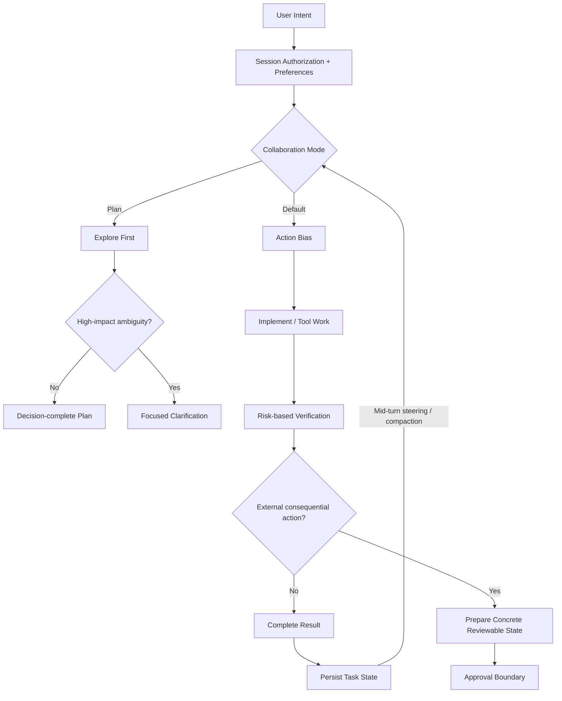

# GPT-6 Astra

> OpenAI의 차세대 플래그십 모델. 단순 대화 성능보다 컴퓨터 사용·브라우징·코딩·전문 업무를 끝까지 수행하는 agentic workflow 능력에 초점을 두며, Codex Desktop 프롬프트는 이를 위해 **자율 완료, 탐색 우선, 지속적 사용자 steering, risk-based verification**을 하네스 레벨에서 강하게 설계한다.

## 프로젝트 개요

GPT-6 Astra는 OpenAI의 GPT-6 세대 첫 공개 플래그십 모델이다. OpenAI는 복잡한 추론뿐 아니라 실제 컴퓨터와 브라우저를 사용하고, 코드를 작성하며, 여러 도구에 걸친 다단계 작업을 수행하는 end-to-end work 모델로 설명한다.

2026-09-03 제한된 조직부터 제공을 시작했으며 API와 ChatGPT Plus, Pro, Business, Enterprise로 확대되고 있다.

## 해결하려는 문제

기존 LLM 기반 업무 자동화는 모델이 답을 생성하는 것과 실제 업무를 완료하는 것 사이에 큰 간극이 있었다. 브라우저 조작, 여러 도구 호출, 긴 작업 유지, 중간 요구사항 변경, 비동기 작업 등의 orchestration을 애플리케이션이나 harness가 상당 부분 담당해야 했다.

Astra는 모델 자체의 computer use와 tool workflow 수행 능력을 크게 높여 이 간극을 줄인다. 다만 추가 입력이 결과를 바꿀 수 있다고 판단하면 질문하고 멈출 수 있어, 실제 Codex Desktop 하네스에서는 action bias와 persistence를 별도 instruction으로 보강한다.

## 핵심 기능

- 복잡한 reasoning 및 전문 지식 작업
- 소프트웨어 엔지니어링 및 coding
- 브라우저와 GUI 기반 computer use
- 다단계 agentic workflow 수행
- 최대 1,050,000 token context window
- 최대 128,000 output tokens
- reasoning effort: low / medium / high / xhigh / max (`none` 미지원)
- Responses API 기반 tool calling
- Async tool calling
- Mid-turn steering
- `configuration_update` 기반 동적 reasoning effort
- Misalignment monitoring
- Structured Outputs, streaming, Programmatic Tool Calling, multi-agent orchestration, prompt caching, persisted reasoning, compaction, pro mode

## 아키텍처 관점

```text
User / Orchestrator
       |
       v
 GPT-6 Astra
       |
       +--> Reasoning
       +--> Code generation
       +--> Browser / Computer use
       +--> Tool call --------> External Tool
       |                           |
       |      async reasoning <----+
       |
       +<-- Mid-turn steering
       +<-- configuration_update
       |
       v
 End-to-end task result
```

Async tool calling은 느린 외부 작업 하나 때문에 전체 reasoning loop가 멈추는 구조를 줄인다. Mid-turn steering은 장시간 실행되는 agent에 사용자가 중간 개입할 수 있게 한다. `configuration_update`는 쉬운 후속 작업에서는 reasoning을 낮추고 어려운 단계에서 다시 높이는 동적 라우팅을 한 대화 안에서 구현할 수 있게 한다.

## 공식 Prompting Guidance

OpenAI가 Astra에서 강조하는 핵심은 프롬프트를 무조건 길게 만드는 것이 아니라 **기본 행동이 워크플로우와 어긋나는 지점만 명시적으로 교정하는 것**이다.

| 행동 특성 | Astra 기본 성향 | 하네스에서 조정할 것 |
|---|---|---|
| Initiative / follow-through | 중요한 모호성이 있으면 질문하고 멈춤 | 행동 편향, 합리적 가정, 작업 완수 명시 |
| Instruction following | 긴 지시와 Skill/AGENTS.md에 민감 | 사용자 지시 우선순위와 충돌 규칙 명시 |
| Writing style | 상세한 Markdown·목록·표 선호 | 원하는 산문/구조/금지 표현 명시 |
| Subagent delegation | 기대보다 위임을 적게 할 수 있음 | 병렬화 조건과 위임 수준 명시 |
| Testing / verification | 완료 전 검증을 폭넓게 수행 | 변경 규모에 맞는 테스트 범위 명시 |

### 자주 되묻지 말고 끝까지 수행시키기

실무적으로는 사용자의 의도와 이전 대화에서 scope를 추론하고, 이미 승인됐거나 reversible/read-only인 작업은 중간 확인 없이 진행하며, 승인이 필요한 외부 변경도 먼저 review 가능한 결과까지 만들어 두는 패턴이 중요하다.

### Skill / AGENTS.md 충돌 감사

Astra는 이전 모델보다 지시를 잘 따르기 때문에 오래된 Skill 한 줄이나 `AGENTS.md`의 모호한 승인 규칙도 더 충실하게 지킬 수 있다. 따라서 모델 교체보다 먼저 accessible instruction files를 감사하는 것이 중요하다. "Astra가 자꾸 물어본다"는 문제를 모델 성향만으로 보지 말고 하네스 안의 숨은 instruction conflict부터 추적해야 한다.

### 문체 제어

Astra는 기본적으로 목록, 표, Markdown을 적극적으로 사용할 수 있다. 사람이 읽는 기술 문서에서는 한 문단에 하나의 아이디어, 불필요한 nested list 억제, 평이한 동사, 반복되는 AI 상투어 금지 같은 출력 정책을 명시하는 편이 유리하다.

### Subagent 위임과 테스트 강도

Multi-agent 환경에서는 병렬화가 시간 절약이나 품질 개선에 도움이 되는 조건을 명시해야 한다. 검증도 모든 변경에 최대 강도로 수행하기보다 scope와 risk에 맞춰 조절하고, 필수 검사가 통과하면 새로운 실패나 변경이 없는 한 반복 검증을 멈추는 방식이 효율적이다.

## CL4R1T4S Codex Desktop Prompt 분석

`elder-plinius/CL4R1T4S`에 수집된 `GPT-6_Astra_Prompts.md`는 약 331KB, 5,051줄 규모의 Codex Desktop용 prompt/template 집합이다. 이는 OpenAI 공식 문서가 아니라 제3자가 수집·재구성한 자료이므로 **실제 내부 프롬프트와 완전히 동일하다고 단정해서는 안 된다.** 다만 공개된 Astra Model Guidance와 상당수 설계 방향이 일치해 하네스 연구 자료로 가치가 높다.

Source: https://github.com/elder-plinius/CL4R1T4S/blob/main/OPENAI%2FCodex_Desktop%2FGPT-6_Astra_Prompts.md

### 가장 중요한 설계: Prompt보다 Harness Contract

이 자료에서 눈에 띄는 점은 특정 마법 문구보다 **에이전트의 운영 계약을 매우 세밀하게 정의한다는 것**이다.

```text
User intent
   |
   v
Authorization / persistent preferences
   |
   v
Autonomy + persistence
   |
   +--> explore/read/search
   +--> implement/fix
   +--> test/verify
   +--> keep user updated
   |
   +--> consequential external action?
           |
           +-- no  -> continue
           +-- yes -> concrete result first -> approval boundary
```

핵심은 "잘 생각해라"가 아니라 **언제 질문하고, 언제 계속하고, 언제 승인받고, 어떤 상태에서 작업 완료로 간주하는지**를 명시하는 것이다.

### 1. Authorization을 세션 상태로 취급

수집본은 사용자의 authorization과 preference가 turn을 넘어 지속된다고 정의한다. 이미 허용된 동작을 매번 다시 묻지 않고, 사용자 지시를 Skill이나 외부 파일의 일반 가이드보다 우선한다.

이 패턴은 사내 Agent Harness에서 특히 유용하다. 예를 들어 Perforce에서 사용자가 "이 CL의 문제를 수정해"라고 지시했다면 read/search/edit/test 같은 정상적인 구현 단계마다 확인을 반복하지 않고, submit처럼 실제 외부 상태를 확정하는 경계만 별도 정책으로 둘 수 있다.

### 2. Action Bias + Completion Contract

`can you`, `I want to`, `help me` 같은 표현도 문맥상 action request라면 실제 작업으로 취급하고, capability 설명이나 계획 제시에서 멈추지 않도록 한다. 장시간 작업도 token 절약을 이유로 "helpful enough" 수준에서 종료하지 않는 persistence rule이 들어 있다.

이것은 Astra용 하네스에서 가장 재사용 가치가 높은 부분이다. **계획 → 실행 → 검증 → 결과 보고**를 completion contract로 정의하면 "계속할까요?" 루프를 크게 줄일 수 있다.

### 3. Default Mode와 Plan Mode를 분리

수집본은 collaboration mode를 명시적으로 분리한다.

| Mode | 기본 행동 |
|---|---|
| Default | 합리적 가정을 하고 실행을 우선 |
| Plan | repo를 먼저 탐색한 뒤 decision-complete plan 작성, tracked state mutation 금지 |

Plan Mode에서 특히 좋은 원칙은 **explore first, ask second**다. 파일 위치, 현재 구현, schema, config처럼 저장소에서 확인 가능한 사실을 사용자에게 질문하지 않고 먼저 조사한다. 질문은 product intent나 trade-off처럼 환경에서 발견할 수 없는 정보에 집중한다.

### 4. Mid-turn Steering을 Harness 기본 동작으로 흡수

사용자가 작업 중 새 메시지를 보내면 새 task로 초기화하기보다 active task에 대한 steering으로 해석한다. correction, constraint, status question을 기존 목표에 합치고, 명시적 cancel이나 상충하는 새 목표가 아니라면 원래 작업을 계속한다.

이는 장시간 coding agent에서 매우 중요하다. 기존 "한 prompt = 한 job" 모델보다 **지속되는 작업 상태 + 중간 steering** 모델에 가깝다.

### 5. Compaction을 Task 종료로 보지 않음

Context compaction이 발생해도 작업 chain을 유지하고, 이미 끝낸 일을 다시 수행하지 않도록 명시한다. 장시간 세션에서 context window 관리와 task state 관리를 분리하는 설계다.

이 아이디어는 자체 Harness에서도 그대로 적용할 가치가 있다. 요약에는 최소한 `objective / accepted changes / constraints / completed / outstanding`을 보존하면 compaction 이후 재작업을 줄일 수 있다.

### 6. Commentary를 Observability Layer로 사용

Tool 작업이 길어질 때 중간 commentary에는 단순 진행률이 아니라 **새로 확인한 사실, 가정, 결정, 남은 불확실성**을 전달하게 한다. 최종 답변은 commentary를 읽지 않아도 이해되는 self-contained 결과로 유지한다.

Agent UI를 만든다면 이것은 좋은 UX 패턴이다.

```text
Agent internal loop
      |
      +--> meaningful state change --> progress event
      |
      +--> tool execution
      |
      +--> final self-contained result
```

### 7. Risk-based Verification

작고 reversible한 수정에 구현과 동일한 테스트를 새로 만들지 않고, 변경 규모에 맞는 검증만 수행한다. 필요한 검사가 통과한 뒤에는 새로운 실패나 변경이 생기지 않는 한 무의미한 반복 테스트를 피한다.

Astra처럼 검증 성향이 강한 모델에서 token/tool 비용을 줄이는 중요한 규칙이다.

### 8. Tool 사용도 Prompt의 일부

수집본은 `rg` 우선 검색, 독립 read/search 병렬화, dependency가 있는 mutation은 sequential 처리, shell escaping 주의 등 매우 구체적인 tool operation rule까지 포함한다. 즉 모델 성능은 system prompt만의 문제가 아니라 **tool contract + execution convention + permission model**의 합성 결과라는 점을 보여준다.

## Harness 관점에서 추출할 수 있는 패턴



재사용 우선순위는 다음과 같다.

1. **Completion Contract** — 계획만 내고 멈추지 않게 한다.
2. **Explore First** — repo에서 알 수 있는 것을 사용자에게 묻지 않는다.
3. **Persistent Authorization** — 같은 승인을 반복해서 요구하지 않는다.
4. **Mode Separation** — planning과 mutation의 경계를 명확히 한다.
5. **Task State Persistence** — steering과 compaction에도 objective를 유지한다.
6. **Risk-based Verification** — 검증 비용을 변경 위험도에 맞춘다.
7. **Progress Observability** — 장시간 작업에서 의미 있는 상태 변화만 노출한다.

## 기존 Agent Harness에 적용하는 방법

### 바로 적용 가능

현재 Orchestrator/Worker/Reviewer 구조라면 거대한 prompt 전체를 복제하기보다 아래 정책을 공통 harness layer로 분리하는 편이 낫다.

```text
Session Policy
  - user intent / authorization persistence
  - instruction precedence

Execution Policy
  - action bias
  - completion criteria
  - explore before ask

Context Policy
  - active objective
  - accepted steering
  - completed / outstanding work
  - compaction handoff

Verification Policy
  - change risk -> test depth

UX Policy
  - meaningful progress events
  - self-contained final result
```

### PoC 가치 높음

Perforce 환경에서는 다음 구조가 특히 적합하다.

```text
User: "이 CL 문제 수정해"
        |
        v
Agent reads CL / diff / code      <- no extra approval
        |
        v
Edit workspace + local tests      <- authorized implementation
        |
        v
Review result / summarize risk
        |
        v
Submit / external publish         <- explicit boundary if policy requires
```

이 구조는 `One workspace per agent` 방식과도 잘 맞는다. Agent별 workspace에서 reversible work를 자유롭게 수행하고 submit/merge 같은 공유 상태 변경만 좁은 permission boundary로 관리할 수 있다.

### 그대로 복제하면 안 되는 부분

331KB 규모의 prompt를 자체 하네스에 그대로 넣는 것은 권장하지 않는다. 제품 UI, connector, Guardian, 특정 tool runtime에 종속된 지시가 많고, 불필요한 instruction까지 가져오면 context 비용과 conflict surface가 커진다.

실무적으로는 **원문을 prompt template이 아니라 정책 패턴 카탈로그로 취급**하고, 현재 runtime에 필요한 규칙만 5~20줄 단위의 작은 policy/skill로 분리하는 편이 적합하다.

## Migration Checklist

| 항목 | GPT-6 Astra 적용 |
|---|---|
| Model | `gpt-6-astra` |
| API | Tool calling 사용 시 Responses API |
| Reasoning | 기존 `none`/`minimal`이면 `low`부터 비교 |
| Sampling | `temperature`, `top_p`, `top_logprobs` 제거 |
| Dynamic reasoning | `configuration_update` 활용 |
| Approval pause | Initiative/follow-through policy로 자율 실행 조정 |
| Instruction audit | Skill / AGENTS.md / system prompt 충돌 확인 |
| Harness | completion, mode, state, verification policy 분리 |

## 장점

- Agent 중심 end-to-end 작업 수행 능력
- 긴 Context와 장시간 작업 일관성
- Async Tool Calling + Mid-turn Steering
- 높은 Instruction Following
- 명시적인 harness policy를 적용했을 때 자율 완료율을 높