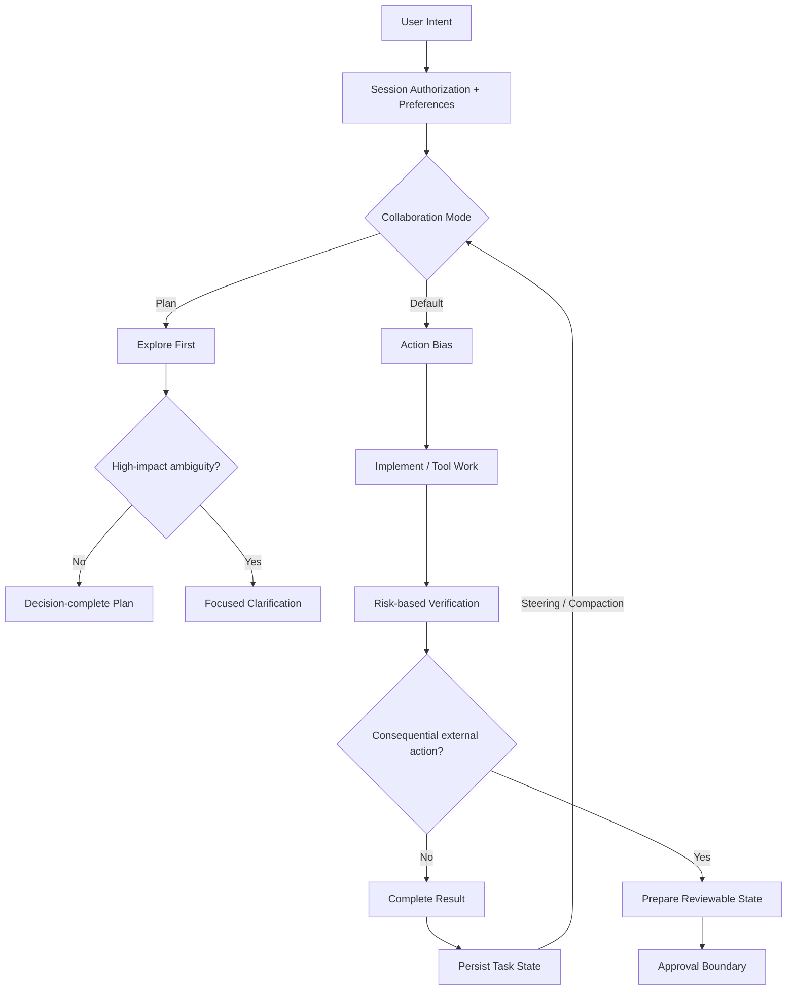

# GPT-6 Astra

> OpenAI의 차세대 agentic 모델. Codex Desktop 수집 프롬프트까지 함께 보면 핵심은 거대한 프롬프트 자체보다 **자율 완료, 탐색 우선, 세션 상태 유지, 중간 steering, 위험도 기반 검증을 명시한 Harness Contract**에 있다.

## 프로젝트 개요

GPT-6 Astra는 OpenAI가 computer use, browsing, software engineering, science, professional work와 다단계 agent workflow에 초점을 맞춘 모델이다. Responses API에서 async tool calling, mid-turn steering, `configuration_update`, prompt caching, persisted reasoning, compaction, multi-agent orchestration 등을 지원한다.

공식 Model Guidance와 함께 `elder-plinius/CL4R1T4S`에 수집된 Codex Desktop용 `GPT-6_Astra_Prompts.md`를 보면 모델 성능을 실제 작업 완료율로 연결하기 위해 상당한 양의 runtime policy가 사용된다는 점을 확인할 수 있다.

> 주의: CL4R1T4S는 OpenAI 공식 저장소가 아니라 제3자가 수집·재구성한 system prompt 아카이브다. 따라서 해당 파일을 실제 OpenAI 내부 프롬프트의 완전한 원본이라고 단정하면 안 된다. 다만 공개된 Astra Model Guidance와 여러 행동 원칙이 일치해 Harness 연구 자료로는 가치가 높다.

## 해결하려는 문제

기존 coding agent는 모델이 충분히 똑똑해도 다음 문제 때문에 실제 업무 완료율이 떨어진다.

- 이미 허용된 작업인데 반복해서 확인한다.
- 계획만 제시하고 실제 구현을 시작하지 않는다.
- 저장소에서 찾을 수 있는 정보를 사용자에게 다시 질문한다.
- 장시간 작업 중 새 메시지가 오면 기존 목표를 잃는다.
- context compaction 이후 완료한 일을 다시 수행한다.
- 작은 변경에도 과도한 테스트와 검증을 반복한다.
- Tool 호출 규칙과 permission boundary가 불명확하다.

Astra와 Codex Desktop의 설계는 이를 모델의 추론 능력만으로 해결하려 하지 않고, **행동 규칙과 실행 상태를 Harness 수준에서 명시**한다.

## 핵심 기능

- 최대 약 1.05M context, 128K output
- reasoning effort: low / medium / high / xhigh / max
- Responses API 기반 tool calling
- Async tool calling
- Mid-turn steering
- `configuration_update` 기반 동적 reasoning effort
- Structured Outputs / streaming
- Programmatic Tool Calling
- multi-agent orchestration
- prompt caching / persisted reasoning / compaction
- computer/browser use
- misalignment monitoring

## 기본 아키텍처

```text
User / Orchestrator
       |
       v
 GPT-6 Astra
       |
       +--> Reasoning
       +--> Code generation
       +--> Browser / Computer use
       +--> Tool call --------> External Tool
       |                           |
       |      async reasoning <----+
       |
       +<-- Mid-turn steering
       +<-- configuration_update
       |
       v
 End-to-end task result
```

Async tool calling은 느린 외부 작업 때문에 전체 reasoning loop가 멈추는 시간을 줄이고, mid-turn steering은 장시간 작업 중 요구사항 변경을 현재 task에 합칠 수 있게 한다. `configuration_update`는 prompt prefix/cache를 유지하면서 단계별 reasoning 강도를 조절하는 데 사용할 수 있다.

## 공식 Prompting Guidance

| 행동 특성 | Astra에서 생길 수 있는 현상 | Harness 조정 |
|---|---|---|
| Initiative | 중요한 모호성이 있으면 질문 | 합리적 가정 + action bias |
| Follow-through | 중간 결과에서 멈춤 | completion contract |
| Instruction following | Skill/AGENTS.md 영향 증가 | instruction audit / precedence |
| Writing style | 상세한 Markdown 선호 | 출력 스타일 명시 |
| Delegation | 자동 위임이 기대보다 적음 | 병렬화 조건 명시 |
| Verification | 검증 범위가 커질 수 있음 | risk-based testing |

Astra에서는 프롬프트를 무조건 길게 만들기보다 **모델 기본 행동과 실제 workflow가 충돌하는 지점만 교정하는 것**이 중요하다.

## CL4R1T4S Codex Desktop Prompt 분석

Source: https://github.com/elder-plinius/CL4R1T4S/blob/main/OPENAI%2FCodex_Desktop%2FGPT-6_Astra_Prompts.md

수집본은 약 331KB, 5,051줄 규모이며 base model instruction, collaboration modes, tool/runtime rules, computer/browser Guardian policy 등 다양한 template을 포함한다. 가장 중요한 점은 특정 "마법 프롬프트"가 아니라 **Agent 운영 계약이 세밀하게 정의되어 있다는 것**이다.

### 1. Authorization을 세션 상태로 취급

사용자의 authorization과 preference를 turn을 넘어 지속되는 상태로 취급한다. 이미 허용된 작업을 반복해서 묻지 않고, 사용자 지시를 Skill이나 외부 instruction file의 일반 가이드보다 우선하도록 설계한다.

Perforce 환경으로 옮기면 사용자가 "이 CL 문제를 수정해"라고 요청한 뒤 read/search/edit/local test 같은 정상 구현 단계는 계속 진행하고, submit처럼 공유 상태를 확정하는 경계만 별도 permission policy로 관리하는 구조가 가능하다.

### 2. Action Bias + Completion Contract

`can you`, `I want to`, `help me` 같은 표현도 문맥상 action request이면 실제 작업 지시로 취급한다. capability 설명, 계획 제시, 부분 해결에서 멈추지 않고 의도한 결과가 완성될 때까지 지속하도록 한다.

```text
Intent
  -> Explore
  -> Implement
  -> Verify
  -> Concrete result
  -> External irreversible boundary only when needed
```

이 패턴은 "계속할까요?" 루프를 줄이는 데 직접 활용할 수 있다.

### 3. Default Mode와 Plan Mode 분리

수집본은 collaboration mode를 명확히 분리한다.

| Mode | 행동 |
|---|---|
| Default | 합리적 가정을 하고 실행 우선 |
| Plan | non-mutating 탐색 후 decision-complete plan 작성 |

Plan Mode에서 특히 재사용 가치가 높은 원칙은 **explore first, ask second**다. 파일 위치, 현재 구현, schema, config처럼 repo에서 확인 가능한 사실은 먼저 조사한다. 질문은 product intent나 trade-off처럼 환경에서 발견할 수 없는 정보에 집중한다.

### 4. Mid-turn Steering을 기본 동작으로 흡수

작업 중 사용자의 새 메시지를 자동으로 새 task로 초기화하지 않는다. correction, constraint, status question은 active task의 steering으로 합치고, 명시적인 cancel이나 상충하는 새 목표가 아니면 기존 objective를 계속 유지한다.

이는 장시간 agent를 `one prompt = one job`보다 **persistent task + steering events**로 설계해야 한다는 의미다.

### 5. Compaction과 Task State 분리

Context compaction은 task 종료가 아니다. 이미 완료한 일을 다시 하지 않고, 요약된 상태에서 같은 작업 chain을 계속하도록 한다.

자체 Harness에서는 compaction handoff에 최소한 다음 상태를 보존할 가치가 있다.

```text
objective
accepted steering
constraints
decisions
completed work
outstanding work
verification state
```

### 6. Commentary = Observability Layer

장시간 tool 작업 중 사용자에게 단순한 "진행 중" 메시지를 반복하기보다 새로 확인한 사실, 중요한 결정, 남은 불확실성을 전달한다. 최종 결과는 중간 commentary를 읽지 않아도 이해되는 self-contained artifact로 만든다.

```text
Agent Loop
  +--> meaningful state change --> progress event
  +--> tool execution
  +--> verification
  +--> self-contained final result
```

이 패턴은 자체 Agent UI의 progress/event stream 설계에도 적용 가능하다.

### 7. Risk-based Verification

작고 reversible한 수정에는 불필요한 테스트를 새로 만들거나 전체 검증을 반복하지 않는다. 변경 scope와 risk에 맞는 검증을 수행하고 필요한 검사가 통과하면 새로운 실패나 변경이 없는 한 확장 검증을 멈춘다.

Astra처럼 검증 성향이 강한 모델에서는 이것이 token/tool 비용 제어 정책 역할을 한다.

### 8. Tool Contract까지 Prompt의 일부

수집본은 `rg` 우선 검색, 독립 read/search 병렬화, dependency가 있는 mutation의 순차 실행, shell escaping 등 구체적인 tool operation rule도 포함한다.

즉 실제 Agent 품질은 다음 합성 결과로 보는 편이 정확하다.

```text
Model
+ System / Developer Instructions
+ Skill / AGENTS.md
+ Tool Contract
+ Permission Model
+ Session State
+ Verification Policy
+ UI / Progress Protocol
= Agent Behavior
```

## Harness Flow



## 기존 Harness에 적용할 핵심 패턴

재사용 우선순위는 다음과 같다.

1. **Completion Contract** — 계획만 내고 멈추지 않는다.
2. **Explore First** — repo에서 알 수 있는 것을 사용자에게 묻지 않는다.
3. **Persistent Authorization** — 동일 승인을 반복하지 않는다.
4. **Mode Separation** — planning과 mutation의 경계를 분리한다.
5. **Task State Persistence** — steering/compaction에도 objective를 유지한다.
6. **Risk-based Verification** — 변경 위험도에 맞춰 검증한다.
7. **Progress Observability** — 의미 있는 상태 변화만 사용자에게 전달한다.

### 추천 Harness Policy 분리

```text
Session Policy
  - intent / authorization persistence
  - instruction precedence

Execution Policy
  - action bias
  - completion criteria
  - explore before ask

Context Policy
  - objective
  - steering
  - completed / outstanding
  - compaction handoff

Verification Policy
  - change risk -> test depth

UX Policy
  - meaningful progress events
  - self-contained final result
```

331KB prompt를 통째로 복제하는 것보다 이 정책을 runtime에 맞는 작은 module/skill로 분리하는 편이 context 비용과 instruction conflict를 줄이는 데 유리하다.

## Perforce 환경 적용 아이디어

```text
User: "이 CL 문제 수정해"
        |
        v
Read CL / diff / code
        |
        v
Edit isolated workspace
        |
        v
Local build / targeted tests
        |
        v
Review + risk summary
        |
        v
Submit / publish boundary
```

`One workspace per agent` 방식과 결합하면 agent별 workspace에서 reversible work를 수행하고 submit/merge 같은 공유 상태 변경만 좁은 permission boundary로 관리할 수 있다.

## 장점

- Agent가 실제 작업 완료까지 지속하도록 만들기 쉽다.
- 불필요한 clarification과 approval pause를 줄일 수 있다.
- 장시간 session과 compaction에 강한 상태 모델을 만들 수 있다.
- 검증 강도를 조절해 token/tool 비용을 제어할 수 있다.
- Plan/Execution/Permission 경계를 명확하게 만들 수 있다.
- Perforce 기반 coding harness에도 직접 적용 가능한 패턴이 많다.

## 단점 및 한계

### Prompt 크기

수집본 전체는 제품 runtime, connector, Guardian, 특정 tool 규칙까지 포함하므로 자체 harness에 그대로 복제하면 context 비용과 instruction conflict surface가 커질 수 있다.

### 출처 신뢰도

CL4R1T4S는 비공식 아카이브다. 개별 문구를 OpenAI의 공식 보장사항으로 인용하기보다 공개 Model Guidance와 교차 검증해야 한다.

### Instruction Debt

Astra의 높은 instruction following은 잘 관리된 환경에서는 장점이지만 오래된 Skill/AGENTS.md가 많으면 오히려 잘못된 행동을 더 충실하게 수행할 수 있다.

### 비용과 초기 안정성

Astra는 GPT-5.6 계열보다 고비용 모델이며, 2026-09 초기 Codex 사용자 이슈에는 benign prompt에서 `invalid_prompt` 또는 `misalignment_policy_violation`이 발생했다는 보고도 있다. 장시간 production harness에는 별도 안정성 측정이 필요하다.

## 활용 아이디어

### 바로 적용 가능

- Skill / AGENTS.md instruction audit
- `explore first, ask second` 규칙
- completion contract
- compaction handoff state 정의
- risk-based verification
- progress event 규칙

### PoC 가치 높음

현재 Orchestrator/Analysis/Work/Review 구조에서는 Astra를 모든 Worker에 투입하기보다 고난도 Orchestrator/Analysis/Review에 선택적으로 배치하고 routine implementation은 저비용 모델에 맡기는 구성이 우선 PoC 대상이다.

측정 KPI는 `task completion rate`, `clarification count`, `approval pause`, `retry count`, `tool calls`, `total tokens`, `latency`, `rework after compaction`이 적합하다.

### 아이디어 참고

- `configuration_update`로 planning/review에서만 reasoning 상승
- compaction summary schema 표준화
- instruction conflict를 발생시킨 Skill/AGENTS.md 추적 hook
- Perforce submit 전 reviewable-state checkpoint
- 독립 read/search를 병렬화하는 tool scheduler

### 현재 도입 가치 낮음

- 331KB 수집 prompt 전체 복사
- 단순 요약/짧은 코드 생성에 Astra 고정 사용
- 모든 Worker를 Astra로 통일
- runtime에 없는 Guardian/connector 규칙까지 이식

## 결론

이 자료에서 가장 가져올 가치가 큰 것은 GPT-6 Astra용 문구가 아니라 **Agent Harness 설계 방식**이다. 좋은 모델에게 단순히 긴 지시를 주는 대신 authorization, completion, mode, context state, verification, tool operation, progress UX를 각각 명시적인 contract로 만든다.

현재 개발 환경에는 특히 `Completion Contract + Explore First + Persistent Task State + Risk-based Verification` 네 가지를 먼저 적용할 가치가 높다. Perforce의 agent별 workspace와 결합하면 자율성은 높이면서 submit 같은 공유 상태 변경 경계는 명확하게 유지할 수 있다.

## 참고 자료

- OpenAI Model Guidance — GPT-6 Astra: https://developers.openai.com/api/docs/guides/latest-model
- OpenAI Help Center — Work and Codex: https://help.openai.com/ko-kr/articles/20001275
- CL4R1T4S — GPT-6 Astra Codex Desktop Prompts: https://github.com/elder-plinius/CL4R1T4S/blob/main/OPENAI%2FCodex_Desktop%2FGPT-6_Astra_Prompts.md
- OpenAI Codex issues — Astra 초기 Windows/invalid_prompt 사례: https://github.com/openai/codex/issues/43163
