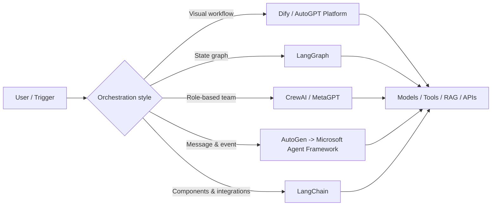

# AI Agent Framework 7종 비교 (2026)

> AutoGPT, LangChain, Dify, MetaGPT, AutoGen, CrewAI, LangGraph는 모두 '에이전트'를 다루지만 추상화 수준과 주 용도가 다르며, 2026년 신규 개발에서는 LangGraph·Dify·CrewAI를 우선 검토하고 AutoGen은 Microsoft Agent Framework로의 전환을 고려하는 편이 합리적이다.

## 조사 배경

Instagram 게시물에서 추천한 7개 저장소를 현재 공식 자료 기준으로 재검증했다. 게시물의 별 개수와 짧은 설명은 시점에 따라 달라질 수 있으므로 선택 근거로 사용하지 않았다.

## 프로젝트별 성격

| 프로젝트 | 핵심 추상화 | 적합한 용도 | 2026 관점 |
|---|---|---|---|
| AutoGPT | 완결형 agent platform / visual builder | 트리거·스케줄 기반 업무 자동화, self-host | 원조 autonomous loop보다 현재 Platform 중심으로 진화 |
| LangChain | LLM application components/integrations | 모델·툴·RAG 연결, 빠른 앱 개발 | 범용 생태계 레이어 |
| Dify | visual AI workflow/application platform | low-code PoC, RAG, 내부 AI 앱 | 비개발자 포함 빠른 프로토타이핑에 강점 |
| MetaGPT | software-company-style multi-agent | 역할 기반 소프트웨어 생성 실험 | 구조 아이디어/연구 참고 가치가 큼 |
| AutoGen | message/event 기반 multi-agent framework | 기존 AutoGen 시스템, 연구/실험 | **Maintenance Mode**. 신규 프로젝트는 Microsoft Agent Framework 권장 |
| CrewAI | role/crew 기반 multi-agent automation | 역할이 명확한 업무 파이프라인 | 이해하기 쉬운 고수준 멀티에이전트 모델 |
| LangGraph | state graph 기반 orchestration | 장기 실행, checkpoint, HITL, 복구 가능한 agent | production orchestration에 특히 적합 |

## 해결하려는 문제

LLM 호출만으로는 여러 단계 작업의 상태, 실패 복구, 도구 호출, 인간 승인, 에이전트 간 역할 분담을 안정적으로 운영하기 어렵다. 각 프레임워크는 이 문제를 서로 다른 추상화로 해결한다.

- LangChain: 재사용 가능한 component와 integration
- LangGraph: state/node/edge 기반 제어 가능한 실행 흐름
- CrewAI/MetaGPT/AutoGen: 여러 agent의 협업 및 메시지 전달
- Dify/AutoGPT Platform: 시각적 workflow와 배포/운영 경험

## 아키텍처 관점

핵심 차이는 '에이전트가 있느냐'가 아니라 **실행 흐름을 누가, 어떤 형태로 통제하느냐**다.

## 주요 장점

- **LangGraph**: 명시적 상태와 그래프가 있어 복잡한 분기, 재시도, checkpoint, human-in-the-loop를 표현하기 좋다.
- **Dify**: UI 중심으로 빠르게 PoC하고 운영 가능한 AI 앱 형태까지 가져가기 쉽다.
- **CrewAI**: researcher/writer/reviewer처럼 역할 중심으로 사고하기 쉬워 팀형 workflow를 빠르게 모델링할 수 있다.
- **LangChain**: 모델, retriever, tool 등 integration 생태계가 넓어 부품 계층으로 활용하기 좋다.
- **AutoGPT**: 현재는 visual builder, trigger/schedule, hosted/self-host 형태의 agent platform이라는 점이 실용적이다.
- **MetaGPT**: PM/architect/engineer/QA 같은 소프트웨어 조직의 역할 분해 아이디어를 관찰하기 좋다.

## 단점 및 한계

- 멀티에이전트는 agent 수가 늘수록 LLM 호출과 context 전달이 증가해 token/cost/latency가 커질 수 있다.
- 역할 기반 프레임워크는 자연스럽지만 복잡한 실패 복구나 deterministic control이 필요해지면 별도의 상태 관리가 필요할 수 있다.
- LangGraph는 제어력이 높은 대신 workflow를 명시적으로 설계해야 해 초기 구현량이 늘어난다.
- Dify/AutoGPT 같은 플랫폼형 제품은 자체 runtime·deployment 구조에 대한 운영 의존성이 생긴다.
- AutoGen은 2026년 현재 maintenance mode이며 신규 기능 개발의 중심이 Microsoft Agent Framework로 이동했다.
- Instagram 게시물의 'production-grade', star 수 등은 빠르게 변하므로 공식 저장소의 현재 상태를 우선해야 한다.

## 기존 도구와 비교 및 선택 가이드

### 바로 적용 가능

**LangGraph** — 코드 기반 production agent orchestration. 상태, 재시도, 승인, 장기 실행이 필요한 경우 우선 검토.

**Dify** — 사내 PoC와 업무 workflow를 빠르게 시각화하고 비개발자와 공유해야 할 때 적합.

### PoC 가치 있음

**CrewAI** — 역할 기반 멀티에이전트 설계를 빠르게 실험할 때 유용.

**AutoGPT Platform** — trigger/schedule 기반 범용 업무 자동화 플랫폼을 self-host/managed 형태로 검토할 때 가치 있음.

### 기반 부품으로 활용

**LangChain** — 독립적인 최종 orchestration 선택지라기보다 integration/component layer로 보는 것이 현재 생태계 이해에 더 적합하다. 복잡한 agent 제어는 LangGraph와 함께 고려한다.

### 아이디어 참고

**MetaGPT** — software company를 agent team으로 모델링하는 역할 분해 및 SOP 관점 참고.

### 신규 도입 우선순위 낮음

**AutoGen** — 기존 시스템 유지·마이그레이션 목적이 아니라면 신규 채택보다는 후속 Microsoft Agent Framework 검토가 우선이다.

## 개발 Harness 관점의 활용 아이디어

Orchestrator → Analysis → Work → Review처럼 역할이 이미 분명한 harness라면 CrewAI/MetaGPT의 '역할 정의' 자체보다 LangGraph식 **명시적 상태 머신**을 결합하는 편이 실무 가치가 높다.

예를 들어 `Analyze -> Implement -> Review -> (Pass | Rework)`를 graph로 만들고, 각 node 내부의 실제 coding agent는 Claude Code/Codex 같은 기존 실행기를 그대로 사용할 수 있다. 이렇게 하면 모델을 framework 내부 agent로 모두 교체하지 않고도 checkpoint, retry, routing, observability를 추가할 수 있다.

Perforce 환경에서도 핵심은 framework가 Git을 지원하느냐보다 worker별 workspace 격리, pending changelist ownership, 실패 시 rollback/retry 상태를 orchestration 계층이 얼마나 명시적으로 관리할 수 있느냐이다. 이 관점에서는 graph/state 기반 접근이 역할 대화형 multi-agent보다 잘 맞는다.

## 결론

이 7개를 동일한 '최고의 agent framework' 목록으로 보는 것은 정확하지 않다. 2026년 실무 선택 기준은 다음처럼 압축할 수 있다.

- **정교한 코드 기반 orchestration:** LangGraph
- **빠른 visual PoC / internal AI app:** Dify
- **역할 중심 multi-agent 실험:** CrewAI
- **범용 integration layer:** LangChain
- **완결형 automation platform:** AutoGPT Platform
- **software-company agent 연구:** MetaGPT
- **AutoGen 신규 도입:** 피하고 Microsoft Agent Framework 검토

특히 기존 자체 harness가 있다면 전체를 특정 framework로 갈아엎기보다 **LangGraph의 state/checkpoint/retry 개념만 orchestration layer에 선택적으로 흡수하는 접근**이 가장 현실적이다.

## 참고 자료

- https://github.com/Significant-Gravitas/AutoGPT
- https://github.com/langchain-ai/langchain
- https://github.com/langgenius/dify
- https://github.com/FoundationAgents/MetaGPT
- https://github.com/microsoft/autogen
- https://github.com/crewAIInc/crewAI
- https://github.com/langchain-ai/langgraph
- https://github.com/microsoft/agent-framework
