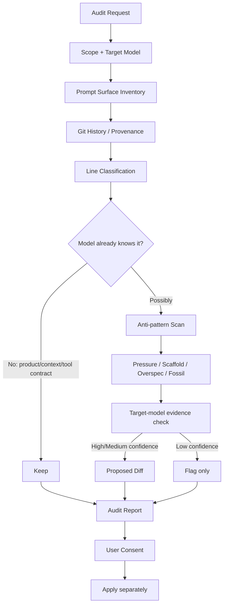

# Anthropic Prompt Audit

> 최신 Claude 모델을 기준으로 오래된 프롬프트 관행(prompt cruft)을 찾아내되, 단순 축약이 아니라 **모델 세대 변화로 더 이상 필요 없거나 오히려 품질을 떨어뜨리는 지시만 선별해 제거·교체하는 감사(audit) 방법론**.

## 프로젝트 개요

Anthropic의 공식 `anthropics/skills` 저장소에 포함된 `claude-api` Skill의 공유 가이드다. 독립 실행 도구라기보다 `/claude-api prompt-audit` 흐름이 참조하는 감사 규칙이며, 시스템 프롬프트·Tool description·Skill/CLAUDE.md·요청 생성 코드·few-shot 예시까지 모델에 전달되는 전체 prompt surface를 대상으로 한다.

핵심 철학은 "짧게 만들기"가 아니라 **Every token earns its place**다. 현재 모델이 이미 학습한 기본 행동, 구형 모델의 실패를 보정하던 workaround, 현재 API 기능으로 대체된 텍스트 scaffold를 걷어내되 제품 맥락·업무 규칙·도구 계약·품질 기준처럼 모델이 스스로 알 수 없는 정보는 보존한다.

## 해결하려는 문제

프롬프트는 모델 세대가 바뀌어도 과거의 보정 문구가 누적되기 쉽다.

- 구형 모델의 낮은 instruction following을 보완하기 위한 `MUST`, `NEVER`, `CRITICAL`
- 모델에게 계획을 강제하는 "think step by step", scratchpad, plan-before-acting 지시
- JSON 출력을 강제하기 위한 assistant prefill, stop sequence, parse retry
- 과도한 단계별 choreography와 금지 목록
- 특정 모델 버그를 우회하던 임시 지침
- 동일 규칙을 여러 위치에서 반복하는 reminder

최신 모델에서는 이런 문구가 단순한 토큰 낭비에 그치지 않고 tool over-triggering, over-planning, 경직된 응답, 예시 과적합, 불필요한 adaptive-thinking 비용을 유발할 수 있다는 것이 이 문서의 문제의식이다.

## 핵심 기능

### 1. Scope와 Target Model을 먼저 확정

Prompt cruft는 절대적인 개념이 아니라 **대상 모델에 상대적**이다. 동일한 지시가 구형 모델에서는 필요하지만 최신 모델에서는 불필요할 수 있으므로 감사 시작 전에 범위와 목표 모델을 결정한다.

### 2. Prompt Surface 전체 인벤토리

파일명에 prompt가 들어간 파일만 보지 않는다.

- system prompt 및 조립 코드
- tool/parameter description
- `SKILL.md`, `CLAUDE.md`, agent instruction
- model ID, thinking, sampling, stop sequence, retry 등 request builder
- few-shot 및 embedded examples

즉 프롬프트 최적화를 **텍스트 파일 정리**가 아니라 **LLM 입력 경로 전체 감사**로 정의한다.

### 3. Provenance 기반 판단

Git history가 있으면 `git blame`을 사용해 강한 지시가 언제, 어떤 실패를 막기 위해 들어왔는지 추적한다. 중요한 질문은 다음과 같다.

> 이 문장은 어떤 모델의 어떤 실패를 막았고, 그 실패가 현재 target model에서도 재현되는가?

근거를 찾지 못한 문장을 무조건 삭제하지 않고 confidence를 낮춰 flag만 남기는 보수적 접근을 취한다.

### 4. Anti-pattern 분류

주요 감사 대상은 다음과 같다.

#### Pressure language

`CRITICAL: MUST`, `IMPORTANT: NEVER`, `If in doubt, use...` 같은 과도한 압박을 평문 요구사항으로 바꾼다. 최신 Claude는 system instruction을 더 문자 그대로 따르기 때문에 과도한 강조가 오히려 over-triggering을 만들 수 있다.

#### API 기능으로 대체된 Scaffold

- `think step by step` / `<thinking>` → adaptive thinking + effort
- JSON 강제 prompt/prefill → structured outputs
- 고정 tool 강제 → 필요한 경우 auto steering 또는 structured output
- 모델이 계산해야 하는 큰 lookup/rubric → 파일·tool result·코드로 이동

중요한 점은 prompt 문구만 지우는 것이 아니라 이를 둘러싼 retry/parser/request-builder 코드까지 함께 감사한다는 것이다.

#### Over-specification

판단 작업을 STEP 1/2/3으로 과도하게 고정하거나, 긴 금지 목록·단일 gold example·bullet wall·generic virtue·grader vocabulary를 쌓는 패턴을 줄인다. 목표, 제약, 검증 기준을 남기고 모델 자체의 계획 능력을 활용한다.

#### Fossils / Patch Accretion

퇴역 모델용 workaround, "now/no longer" 같은 migration-relative 문구, 특정 incident마다 추가된 좁은 조건, 아무 코드나 eval이 확인하지 않는 unenforced rule, 주기적 reminder 등을 찾아낸다.

#### Prohibition Cluster

금지 문구 자체를 악으로 보지 않는다. 실제 비즈니스·보안·컴플라이언스 제약처럼 **이유와 provenance가 있는 금지 규칙은 유지**한다. 과거 모델의 말버릇을 막기 위한 스타일 금지처럼 근거가 약한 것은 긍정적인 스타일 목표로 통합한다.

## 아키텍처

감사의 출력은 항상 두 가지다.

1. **Audit report** — 위치, 증거 문구, 패턴, 왜 obsolete인지, confidence, action
2. **Proposed diff** — 실제 수정 후보

원본 규칙상 audit 단계에서는 변경을 자동 적용하지 않고 제안만 만든다.

## 장점

### 모델 업그레이드 시 Prompt Debt를 관리할 수 있음

모델 교체를 model ID 변경으로 끝내지 않고, 과거 모델에 맞춰 누적된 prompt workaround까지 migration 대상으로 본다는 점이 강하다.

### Token 절감보다 품질 저하 원인을 제거

무작정 짧게 만드는 방식과 다르다. 제품 정보나 업무 규칙처럼 정보량이 많은 context는 오히려 유지한다. 삭제 기준이 "길다"가 아니라 "현재 모델에 여전히 필요한가"다.

### Prompt와 Harness Code를 함께 본다

prefill, stop sequence, retry parser, sampling parameter처럼 prompt 주변 코드도 함께 조사한다. Harness 최적화 관점에서 특히 유용하다.

### 변경 근거를 Confidence로 분리

문서화된 현재 모델 동작은 High, 널리 관찰된 동작은 Medium, 단순 idiom dating은 Low로 구분하여 과감한 자동 삭제를 막는다.

## 단점 및 한계

### Claude 중심

핵심 원칙은 GPT/Gemini에도 참고할 수 있지만, adaptive thinking, effort, prefill 제약, structured output 세부사항은 Claude API 및 특정 Claude 세대에 종속된다. 타 provider에 그대로 적용하면 안 된다.

### Model Behavior 문서와 지속 동기화 필요

"obsolete" 판정은 target model에 상대적이므로 새 모델 출시 때마다 기준이 바뀔 수 있다. Prompt audit 규칙 자체도 다시 audit해야 하는 역설이 존재한다.

### Provenance 품질에 의존

Git history와 과거 incident 기록이 빈약하면 왜 특정 규칙이 들어갔는지 알기 어렵다. 이 경우 Low confidence flag가 늘어나며 자동화 효율이 낮아진다.

### 정량적 효과는 별도 Eval 필요

문서는 감사 방법론을 제공하지만 특정 프로젝트에서 토큰, latency, task success가 얼마나 개선되는지 보장하지 않는다. 실제 적용 전후 regression/eval이 필요하다.

## 활용 사례

### CLAUDE.md 정리

장기간 사용하면서 `MUST`, `NEVER`, 예외 규칙이 누적된 workspace instruction을 최신 모델 기준으로 재검토한다.

### Agent Skill 유지보수

오래된 Skill에서 모델에게 지나치게 세세한 작업 순서를 강제하거나 동일 규칙을 반복하는 부분을 탐지한다.

### Tool Description 감사

Tool을 과도하게 호출시키는 "default to", "if unsure" 류의 설명을 찾아 실제 호출 조건과 성공 기준 중심으로 다시 작성한다.

### Model Migration Gate

Claude 모델 업그레이드 PR에서 model ID/API parameter 변경과 함께 prompt-audit 결과를 첨부하도록 CI 또는 review checklist에 넣을 수 있다.

## 기존 방식과 비교

| 방식 | 판단 기준 | 위험 |
|---|---|---|
| 단순 Prompt 압축 | 토큰 수/문장 길이 | 중요한 domain context 삭제 |
| 수동 Prompt Review | 리뷰어 경험 | 일관성·재현성 부족 |
| Prompt Audit | target model + provenance + named anti-pattern | 모델별 최신 근거 유지 필요 |

Prompt Audit의 차별점은 **"프롬프트 최적화 = 압축"이라는 관점을 거부하고 model-relative technical debt 관리로 본다**는 데 있다.

## 활용 아이디어

### 바로 적용 가능 — CLAUDE.md / Skill Audit Command

개인 AI 개발 환경에 `$prompt-audit {path}` 형태의 Skill을 만들 가치가 높다.

권장 흐름:

1. target model 자동 탐지
2. prompt surface inventory
3. `git blame` / commit provenance 수집
4. anti-pattern grep
5. model migration 문서와 대조
6. report + proposed diff 생성
7. 사용자가 승인한 항목만 수정
8. 수정 전후 eval

### 바로 적용 가능 — Repository 준비 단계의 품질 Gate

새 프로젝트 kickoff/prepare 과정에서 기존 `CLAUDE.md`, `AGENTS.md`, Skill을 가져오는 경우 prompt audit을 한 번 수행하면 오래된 지침을 그대로 복제하는 것을 줄일 수 있다.

### PoC 가치 있음 — Prompt Linter + Model-aware Ruleset

정적 linter로 다음 후보를 자동 수집할 수 있다.

- 대문자 pressure keyword 밀도
- step-by-step scaffold
- repeated prohibition
- retired model name
- repeated reminder
- numeric output clamp
- assistant prefill / stop sequence / retry parser

다만 lint 결과를 곧바로 삭제로 연결하지 않고 target-model evidence와 provenance를 결합해야 한다.

### PoC 가치 있음 — Prompt Debt Metric

Repository별로 High/Medium/Low confidence finding 수, prompt surface token 수, model-version workaround 수를 추적하면 모델 migration 전후의 prompt debt 변화를 계량화할 수 있다.

### 아이디어 참고 — Harness Token Optimization

이 방법은 context compression과 결합하기 좋다. 먼저 prompt audit으로 **불필요한 behavioral instruction**을 제거하고, 그 다음 code/context virtualization 또는 retrieval을 적용하면 "필요한 context를 압축하다가 업무 규칙을 잃는" 문제를 줄일 수 있다.

## 실무 평가

이 자료의 가장 큰 가치는 개별 anti-pattern 목록보다 **프롬프트를 코드와 같은 세대별 기술 부채로 관리한다는 관점**이다.

특히 장기간 유지되는 CLAUDE.md, Skill, Agent Harness는 모델이 좋아질수록 기존 지침이 자동으로 좋아지는 것이 아니라, 과거의 보정 지시가 새 모델의 강한 instruction following과 충돌할 수 있다. 따라서 모델 업그레이드 때 API compatibility test뿐 아니라 prompt compatibility audit도 수행하는 운영 패턴이 유효하다.

도입 시에는 "자동 삭제 도구"보다 **감사 보고서 + diff 제안 + eval + 사용자 승인** 파이프라인으로 구현하는 것이 원문 철학과도 맞고 안전하다.

## 결론

Anthropic Prompt Audit은 Prompt Engineering을 "더 좋은 주문을 추가하는 일"에서 **불필요해진 주문을 증거 기반으로 제거하는 유지보수 작업**으로 확장한다.

AI Harness를 장기간 운영한다면 모델 migration 과정에 포함할 가치가 높으며, 특히 Skill/CLAUDE.md/Tool description이 계속 누적되는 환경에서는 독립적인 prompt-debt 관리 절차로 발전시킬 수 있다.

## 참고 자료

- Anthropic Skills — Prompt Audit
  - https://github.com/anthropics/skills/blob/main/skills/claude-api/shared/prompt-audit.md
- Anthropic Skills — Claude API Skill
  - https://github.com/anthropics/skills/blob/main/skills/claude-api/SKILL.md
- Anthropic Skills — Model Migration
  - https://github.com/anthropics/skills/blob/main/skills/claude-api/shared/model-migration.md
