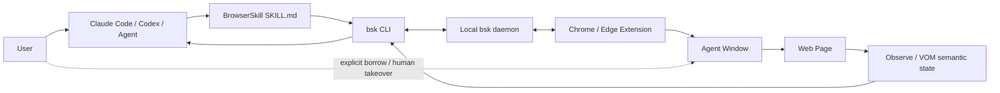

# BrowserSkill

> Claude Code·Codex 같은 셸 기반 AI 에이전트가 사용자의 **실제 로그인 상태를 가진 Chromium 브라우저**를 CLI와 확장 프로그램을 통해 안전하게 조작하도록 연결하는 Browser Skill.

## 프로젝트 개요

Tencent의 BrowserSkill은 AI 에이전트가 별도의 Playwright 테스트 브라우저나 신규 로그인 세션을 띄우는 대신, 사용자가 이미 로그인해 둔 Chrome/Edge를 활용해 웹 페이지 탐색, 입력, 클릭, 스크린샷, 파일 전송 등을 수행하게 하는 프로젝트다.

핵심은 특정 모델이나 에이전트 프레임워크에 브라우저 기능을 내장하는 것이 아니라, `bsk` CLI를 공통 인터페이스로 두어 **셸을 실행할 수 있는 에이전트라면 같은 브라우저 자동화 계층을 재사용**할 수 있게 한 점이다.

공식 지원/설치 대상으로 Cursor, Claude Code, Codex, OpenClaw, CodeBuddy, WorkBuddy, Pi, Hermes Agent 등이 명시되어 있고, DeepSeek Harness에는 전용 플러그인도 제공한다.

## 해결하려는 문제

기존 에이전트 브라우저 자동화에는 다음 문제가 자주 있다.

- 자동화 전용 브라우저는 사용자의 실제 로그인 세션과 분리된다.
- 로그인, CAPTCHA, MFA 같은 인간 개입 단계에서 자동화 흐름이 끊긴다.
- 에이전트마다 Playwright/MCP/브라우저 도구 연결 방식이 달라진다.
- 사용자가 작업 중인 브라우저를 직접 조작하면 업무를 방해할 수 있다.
- 브라우저 전체 권한을 에이전트에 넘기면 안전성과 제어 범위가 불명확해진다.

BrowserSkill은 별도 **Agent Window**, 명시적인 사용자 탭 borrowing, human-in-the-loop handoff, 세션 종료/반환 규칙을 통해 이 문제를 다룬다.

## 핵심 기능

1. **실제 로그인 상태 재사용**
   - 사용자가 이미 로그인한 Chrome/Edge 환경을 활용한다.
   - 자격 증명·쿠키·토큰 자체를 에이전트가 추출하는 방식은 금지한다.

2. **Agent Window 분리**
   - 에이전트 작업은 별도의 보이는 브라우저 창에서 수행한다.
   - 사용자는 자신의 일반 브라우징을 계속할 수 있다.

3. **명시적 Tab Borrowing**
   - 사용자가 열어 둔 탭을 사용해야 할 경우 명시적으로 borrow한다.
   - 작업 종료 후 해당 탭을 반환한다.

4. **CLI 기반 범용 연결**
   - `bsk navigate`, `observe` 등 CLI 명령을 에이전트가 호출한다.
   - 특정 LLM 또는 harness에 종속되지 않는다.

5. **Human-in-the-loop**
   - CAPTCHA, 로그인, 확인창처럼 사람이 처리해야 하는 단계에서 사용자에게 제어를 넘긴 뒤 다시 이어갈 수 있다.

6. **Semantic Observation / VOM**
   - 2026년 릴리스에서 VOM semantic graph 및 observation layer가 추가됐다.
   - 단순 픽셀 좌표보다 페이지의 의미 구조를 기반으로 에이전트가 요소를 인식하는 방향이다.

7. **파일 전송**
   - 0.2.0부터 upload/download와 drag-and-drop upload를 지원한다.

8. **Recorder / Evaluation**
   - semantic browser recording과 browser capability evaluation harness가 포함되어 있다.

## 구조 및 아키텍처

Repository는 Cargo + pnpm workspace다.

- `crates/bsk-cli`: CLI와 로컬 daemon
- `crates/bsk-protocol`: wire type 및 JSON schema
- `apps/extension`: Chromium browser extension
- `packages/ui`, `packages/i18n`: 확장 UI와 다국어 지원
- `packages/dsh-plugin-browserskill`: DeepSeek Harness 전용 플러그인
- `evals/browser`: 브라우저 기능 평가 환경
- `skill/SKILL.md`: 일반 shell-capable agent용 Skill 지침

### 실행 흐름



일반적인 작업은 다음 순서다.

```text
사용자 요청
  ↓
Agent가 BrowserSkill 호출
  ↓
bsk session start
  ↓
navigate 또는 기존 탭 borrow
  ↓
observe
  ↓
fresh ref를 이용해 click/fill/scroll 등 수행
  ↓
DOM/페이지 변경 후 다시 observe
  ↓
성공 확인
  ↓
bsk session stop
  ↓
borrow한 탭 반환
```

중요한 설계 포인트는 **observe → action → observe** 루프다. Skill 지침은 페이지 변경 뒤 이전 element ref를 계속 신뢰하지 않고 새로운 observation에서 얻은 ref를 사용하도록 한다.

## 설치 및 지원 환경

공식 README 기준:

- OS: macOS, Linux, Windows x64
- Browser: Chrome, Microsoft Edge
- 기타 Chromium 브라우저: unpacked Chromium extension을 지원하면 동작 가능성이 있음
- Firefox: planned

Windows에서는 PowerShell installer가 제공되며, 사용자 로컬 경로에 `bsk.exe`를 설치한다.

Skill은 다음과 같이 harness별 설치가 가능하다.

```bash
bsk install-skill
bsk install-skill --harness cursor --json
```

관리되는 Skill은 원본과 일치하는 경우 자동 갱신할 수 있고, 사용자가 로컬 수정한 Skill은 덮어쓰지 않도록 설계되어 있다.

## 장점

### 1. 로그인된 실사용 브라우저 활용

사내 도구, SaaS, GitHub, 관리 페이지처럼 인증이 필요한 실제 업무 자동화에서 테스트용 브라우저보다 활용도가 높다.

### 2. Harness 독립성

Claude Code와 Codex를 동시에 쓰는 환경에서도 같은 `bsk` 계층을 공유할 수 있다. 에이전트별로 별도의 브라우저 MCP를 구성하는 것보다 운영 표준화에 유리하다.

### 3. 브라우저 작업과 사용자 작업 분리

Agent Window라는 명시적인 실행 공간이 있어 브라우저 자동화가 사용자의 일반 탭을 무작위로 건드리는 위험을 줄인다.

### 4. Human-in-the-loop가 기본 설계

로그인/MFA/CAPTCHA처럼 완전 자동화하기 어려운 현실적인 웹 업무에 적합하다.

### 5. Skill + 실행 바이너리 분리

LLM에는 비교적 얇은 작업 지침만 주고 실제 브라우저 제어는 CLI/daemon/extension이 담당한다. 모든 로직을 긴 Skill prompt로 구현하는 방식보다 컨텍스트 사용 측면에서도 합리적이다.

## 단점 및 한계

### 1. 로컬 구성 요소가 많음

CLI, daemon, extension의 버전 및 연결 상태를 관리해야 한다. 0.2.x changelog에서도 Windows self-update, named pipe, daemon restart, extension protocol compatibility 관련 수정이 반복되어 이 부분이 실제 운영 복잡도라는 점을 보여준다.

### 2. 브라우저 확장 설치 필요

기업 환경에서 Chrome/Edge extension 설치 정책이 제한되어 있다면 도입이 어려울 수 있다.

### 3. 보안 검토 필요

로그인된 실제 브라우저를 다루므로 편리함과 동시에 권한 범위가 크다. 프로젝트가 tab borrowing과 secret extraction 금지 규칙을 두고 있더라도, Enterprise 도입 전에는 extension 권한, daemon IPC, 허용 도메인, 감사 로그, 데이터 반출 정책을 별도로 검토해야 한다.

### 4. Chromium 중심

현재 공식 지원은 Chrome/Edge이며 Firefox는 계획 단계다.

### 5. UI 자동화 특유의 불안정성

DOM 변화, iframe/shadow root, 다른 확장의 CDP 제한, 브라우저 업데이트 등에 영향을 받을 수 있다. 최근 changelog에서도 navigation recovery, form state matching, field verification 등이 지속적으로 수정됐다.

### 6. 아직 빠르게 진화 중

2026년 6월 첫 tagged release 이후 VOM, recorder, file transfer, DSH plugin 등이 짧은 기간에 빠르게 추가되었다. 기능 발전은 빠르지만 Enterprise 표준 도구로 고정하기 전 버전 호환성 검증이 필요하다.

## 활용 사례

### 바로 적용 가능

- Claude Code/Codex가 웹 문서를 열어 확인하고 개발 작업에 반영
- 로그인된 GitHub/Jira/사내 웹 도구에서 정보 조회
- 배포 후 실제 페이지 UI smoke test
- 웹 폼 반복 입력 및 간단한 운영 업무 자동화
- 페이지 전체 screenshot 및 결과 검증

### PoC 가치 있음

- Claude Code + Codex 공통 Browser Tool Layer
- 사내 개발 생산성 Harness의 browser worker
- 배포 Agent가 staging 페이지를 열어 regression test
- TeamCity 배포 후 BrowserSkill 기반 검증 단계
- Perforce 기반 개발 환경에서 외부/내부 웹 관리 도구와 Agent 연결

### 아이디어 참고

BrowserSkill의 **Skill은 얇게, 실행 로직은 CLI로** 분리하는 구조는 다른 Agent Skill 설계에도 참고할 만하다. 토큰을 소비하는 Skill 자체에 복잡한 실행 로직을 넣기보다 deterministic tool을 만들고 Skill은 호출 규칙과 안전 정책만 제공하는 패턴이다.

## Claude 기반 작업 워크스페이스 적용 아이디어

사용 중인 Claude 중심 workspace harness 관점에서는 BrowserSkill을 프로젝트별로 중복 설치하기보다 **workspace 공통 capability**로 두는 구성이 적합하다.

```text
root/
├─ .claude/
│  └─ skills/
│     └─ browser-skill/
├─ src/
│  ├─ project1/
│  └─ project2/
├─ release/
└─ docs/

Local Host
├─ bsk CLI / daemon
└─ Chrome or Edge
   └─ BrowserSkill Extension
```

각 프로젝트 Agent는 동일한 `bsk`를 호출하고, 브라우저 세션만 task 단위로 분리한다.

특히 release agent와 결합하면 다음 패턴이 유용하다.

```text
Code 변경
→ Build
→ Deploy
→ BrowserSkill session
→ 실제 배포 URL navigate
→ UI/텍스트/동작 observe
→ smoke test
→ screenshot/결과 수집
→ Review Agent에 전달
```

이 경우 BrowserSkill은 단순한 '웹 검색 Skill'보다 **실제 환경 검증용 actuator**에 가깝다.

## 기존 방식과 비교

| 방식 | 로그인 상태 재사용 | 사용자 브라우저 연계 | Harness 독립성 | 주요 성격 |
|---|---|---|---|---|
| BrowserSkill | 강점 | Agent Window + Borrow | 높음 | 실사용 브라우저 조작 |
| Playwright 직접 사용 | 별도 profile 구성 필요 | 낮음 | 높음 | 테스트/자동화 코드 |
| Browser MCP 계열 | 구현별 상이 | 구현별 상이 | MCP 지원 필요 | 표준 Tool 호출 |
| Agent 내장 Browser | 서비스별 상이 | 대체로 낮음 | 낮음 | 특정 Agent 전용 |

BrowserSkill의 차별점은 browser automation primitive 자체보다 **사용자의 로그인된 브라우저를 여러 shell-capable Agent가 공통 CLI로 안전하게 공유하는 운영 모델**에 있다.

## 프로젝트 성숙도

2026-09-18 확인 기준 repository는 활발히 업데이트되고 있으며, GitHub 조직 페이지에서도 당일 업데이트가 확인된다. 2026-09 changelog에는 0.2.0/0.2.1 릴리스가 기록되어 있고 파일 전송, VOM, evaluation harness, Windows 안정성 개선 등이 진행되었다.

따라서 방치된 실험 프로젝트보다는 실제 제품화 방향이 명확하지만, 아직 초기 0.x 버전이므로 사내 표준 도입 시에는 버전을 pin하고 업데이트 검증 절차를 두는 편이 안전하다.

## 활용 아이디어

### 바로 적용 가능

Claude Code와 Codex에 BrowserSkill을 함께 설치해 브라우저 자동화 인터페이스를 `bsk`로 통일한다.

### PoC 가치 있음

현재 설계 중인 workspace harness에서 `browser` capability를 공통 tool layer로 정의하고, project/release agent가 필요할 때만 BrowserSkill session을 생성하도록 구성한다.

PoC에서는 다음을 측정하는 것이 좋다.

- 동일 작업의 Playwright/MCP 대비 성공률
- 로그인 필요 업무의 자동화 가능 비율
- task당 토큰 사용량
- observe/action round-trip 수
- human takeover 발생 횟수
- UI 변경 후 복구 성공률
- session/tab cleanup 실패율

### 아이디어 참고

BrowserSkill의 session/borrow/return lifecycle과 human takeover 패턴은 사내 Agent Harness의 GUI 도구 권한 모델 설계에도 재사용할 가치가 있다.

### 현재는 도입 가치 낮음

브라우저 확장 설치가 금지된 폐쇄망 PC, 브라우저에서 민감 데이터 접근 자체가 정책상 허용되지 않는 환경, 완전히 deterministic한 CI E2E test가 필요한 경우에는 BrowserSkill보다 기존 Playwright 기반 자동화가 더 단순할 수 있다.

## 결론

BrowserSkill은 '브라우저를 조작하는 또 하나의 Skill'보다 **AI Agent와 사용자의 실제 Chromium 세션 사이에 공통 로컬 제어 계층을 제공하는 프로젝트**로 보는 것이 정확하다.

Claude Code와 Codex를 함께 운용하는 환경에서는 모델별 Browser Tool을 따로 구성하는 대신 하나의 `bsk` capability로 통일할 수 있다는 점이 특히 유용하다. 또한 Skill 자체는 사용 규칙만 제공하고 실제 동작을 CLI로 내리는 구조는 토큰 효율적인 Agent Tool 설계의 좋은 사례다.

다만 실제 로그인 브라우저에 접근한다는 특성상 Enterprise 적용 시 보안 검토가 필수이며, 아직 0.x 단계인 만큼 우선 PoC에서 안정성과 운영 비용을 측정한 뒤 공통 Harness capability로 승격하는 접근이 적절하다.

## 참고 자료

- https://github.com/Tencent/BrowserSkill
- https://github.com/Tencent/BrowserSkill/blob/main/README.md
- https://github.com/Tencent/BrowserSkill/blob/main/skill/SKILL.md
- https://github.com/Tencent/BrowserSkill/blob/main/CHANGELOG.md
- https://github.com/Tencent/BrowserSkill/blob/main/AGENT_INSTALL.md
- https://github.com/Tencent/BrowserSkill/tree/main/packages/dsh-plugin-browserskill
