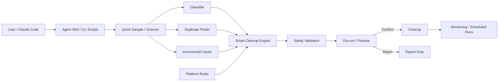

# oh-my-disk-cleaner

> Claude Code/Agent Skill 형태로 디스크를 분석하고, 위험도를 분류해 정리 후보를 제안·삭제하며, Windows/Linux/macOS의 개발 캐시와 임시 파일까지 다루는 Python 기반 디스크 관리 도구.

## 프로젝트 개요

`oh-my-disk-cleaner`는 Python 표준 라이브러리를 중심으로 구현된 크로스 플랫폼 디스크 분석·정리 프로젝트다. 일반적인 디스크 클리너와 달리 Agent Skill로 설치해 Claude Code 같은 에이전트가 자연어 요청을 받아 분석 스크립트를 실행하고 결과를 해석하는 사용 방식을 전제로 한다.

2026-09-12 조사 기준 저장소는 MIT License, Python 프로젝트이며 Windows/Linux/macOS를 지원한다고 명시한다. v2.1 문서에는 progressive scanning, duplicate detection, incremental cache, platform-specific cleanup, scheduling, safety validation 등이 포함되어 있다.

## 해결하려는 문제

개발 PC는 일반 사용자 PC보다 npm/pip/Gradle/Maven 캐시, 빌드 산출물, 로그, 임시 파일 등 정리 가능한 데이터가 빠르게 누적된다. 기존 GUI 클리너는 사용자가 직접 항목을 찾아야 하고 개발 도구별 캐시를 충분히 이해하지 못하는 경우가 많다.

이 프로젝트는 이를 다음 흐름으로 바꾼다.

1. 에이전트 또는 CLI가 디스크를 스캔한다.
2. 파일을 종류·위험도·나이 관점에서 분류한다.
3. 큰 파일, 중복 파일, 캐시/임시 데이터 등을 정리 후보로 만든다.
4. 안전성 검사를 수행한다.
5. dry-run/preview를 거쳐 선택적으로 삭제한다.
6. 필요하면 반복 모니터링 또는 예약 정리를 수행한다.

## 핵심 기능

- 디스크 용량 분석 및 대용량 파일/디렉터리 탐색
- Quick Sample 및 시간/파일 수 제한 Progressive Scan
- Type × Risk × Age 기반 파일 분류
- 중복 파일 탐지
- 반복 스캔을 위한 캐시/증분 처리
- 프로세스 및 파일 잠금 고려
- Windows/Linux/macOS별 정리 위치 인식
- 개발 도구 캐시(npm, pip, Gradle, Maven 등) 탐색
- dry-run 기반 정리 미리보기
- 실시간 디스크 사용량 모니터링
- 예약 정리 작업
- Agent Skill 패키징 및 bootstrap/diagnostic 지원

## 아키텍처

확인된 핵심 Python 패키지는 다음과 같이 분리되어 있다.

- `diskcleaner/core/scanner.py`: 파일 시스템 스캔
- `classifier.py`: 파일 분류
- `duplicate_finder.py`: 중복 탐지
- `cache.py`: 스캔 캐시
- `safety.py`: 삭제 안전성 검증
- `process_manager.py`: 프로세스/파일 사용 상태 관련 처리
- `smart_cleanup.py`: 분석 결과를 정리 의사결정으로 결합
- `interactive.py`: 대화형 선택 UI
- `organizer.py`: 파일 정리 관련 기능
- `growth_analyzer.py`: 디스크 증가 분석
- `optimization/`: 성능 최적화 계층
- `platforms/`: OS별 정리 규칙



핵심은 LLM이 파일을 직접 삭제하는 구조라기보다, Python으로 구현된 결정론적 스캐너/안전 계층을 Agent Skill이 호출하고 에이전트가 결과를 사용자에게 설명하는 형태라는 점이다.

## 장점

### Agent와 CLI의 역할 분리

자연어 인터페이스는 에이전트가 담당하고 실제 파일 시스템 조작은 Python 코드가 담당한다. 순수 프롬프트 기반 파일 정리보다 동작을 검토하고 테스트하기 쉽다.

### 개발 PC에 적합한 정리 범위

일반 임시 파일뿐 아니라 npm, pip, Gradle, Maven 등의 개발 캐시까지 대상으로 삼는다. Claude/Codex를 활용한 개발 워크스테이션 관리 자동화와 잘 맞는다.

### 대용량 디스크 대응

전체 스캔 전에 sampling을 수행하고 시간/파일 개수 제한을 둔 progressive scan을 제공한다. 수백 GB 이상의 개발 디스크에서 무제한 재귀 스캔이 에이전트 세션을 장시간 점유하는 문제를 줄이는 방향이다.

### 외부 Python 의존성이 작음

README 기준 Python 표준 라이브러리만으로 동작하도록 설계되어 배포 부담이 비교적 낮다.

## 단점 및 한계

### 파일 삭제 도구라는 본질적 위험

이 프로젝트는 실제 파일 삭제 권한을 가진다. 특히 Agent가 자동으로 명령을 선택하는 환경에서는 잘못된 경로 지정이 데이터 손실로 이어질 수 있으므로 항상 preview/dry-run을 기본 정책으로 두는 것이 필요하다.

### 실제 Critical 데이터 손실 이력이 있음

Issue #9에는 과거 `clean_disk.py --path ... --force`가 광범위한 사용자 홈/프로젝트 디렉터리를 재귀 삭제할 수 있고 dry-run이 영향을 과소평가한다는 Critical 보고가 있었다. 2026-09-03 관련 PR이 병합되었고 이후 커밋에는 validated root binding, top-level boundary 보존, Windows reparse entry 안전 처리, custom cleanup path hardening 등이 포함됐다.

따라서 현재 버전은 해당 문제에 대한 방어가 강화되었지만, 이 도구를 unattended 자동 삭제 작업으로 사용하는 것은 권장하지 않는다.

### AI 자체가 정리 판단을 학습하는 구조는 아님

README의 'AI-powered suggestions' 표현과 달리 확인된 핵심 구조는 규칙·분류·스캔 엔진 중심이다. LLM은 Skill 실행과 결과 해석 계층에서 활용되는 것으로 보는 것이 정확하다.

### 프로젝트 성숙도

2026-09-12 기준 비교적 작은 커뮤니티 규모이며, 최근에도 안전 관련 수정이 활발하다. 개인 개발 PC PoC에는 적합하지만 Enterprise 표준 정리 도구로 바로 배포하려면 별도 보안 검토와 allowlist 정책이 필요하다.

## Windows / Enterprise 적용성

Windows 전용 경로와 콘솔 인코딩 대응, Windows Update/Temp/브라우저/개발 도구 캐시 인식 등이 있어 Windows 개발 환경과 궁합은 좋다.

다만 회사 PC에서는 다음 정책을 추가하는 편이 안전하다.

- 삭제 가능한 root를 명시적 allowlist로 제한
- Perforce workspace 및 프로젝트 root 전체 보호
- `src`, `.p4config`, Unreal Engine 프로젝트/DerivedData 정책 별도 정의
- 자동 실행은 분석까지만 허용하고 삭제는 사용자 승인 필수
- 삭제 전 JSON report 보존
- 관리자 권한 상승 금지 또는 별도 승인

## 활용 사례

### 바로 적용 가능

**개발 PC 디스크 진단 Skill**로 사용하는 것이 가장 적합하다. 예를 들어 "C 드라이브가 왜 부족한지 분석해줘"라고 요청하면 quick sample → 상위 용량 디렉터리 → 개발 캐시 후보 → 정리 가능 용량 순으로 보고하게 할 수 있다.

### PoC 가치 있음

Claude Code/Codex 기반 PC maintenance agent의 실행 도구로 활용할 가치가 있다. 단, 삭제 작업보다 `analyze → classify → report` 기능을 우선 사용하고 실제 삭제는 승인 단계 뒤에 둔다.

### 아이디어 참고

자체 사내 PC 정리 Skill을 만든다면 이 프로젝트의 `scanner → classifier → safety → preview → cleanup` 파이프라인과 progressive scan 설계는 좋은 참고 구조다.

### 현재는 도입 가치 낮음

무인 스케줄러가 사용자 홈이나 개발 workspace를 자동으로 청소하도록 맡기는 방식은 안전 리스크 때문에 권장하지 않는다.

## 기존 도구와 비교

일반 GUI 디스크 클리너와 비교하면 이 프로젝트의 차별점은 UI가 아니라 **Agent Skill + scriptable engine**에 있다. 자연어 요청, JSON 출력, CLI, CI/CD 연계가 쉬워 AI 개발 워크플로우에 포함하기 좋다.

반면 WizTree/WinDirStat류의 전문 디스크 시각화 도구에 비해 시각적 탐색성과 오랜 검증 이력은 약하다. 따라서 '정확한 디스크 시각화'보다 '에이전트가 반복적으로 진단하고 정리 후보를 만드는 자동화'에 더 적합하다.

## 활용 아이디어

개인/회사 AI Harness에 넣는다면 다음 형태가 적합하다.

```text
/clean-pc
   ↓
Disk Analyzer (read-only)
   ↓
Cache / Large File / Duplicate Classification
   ↓
Risk Filter
   ├─ SAFE       → 자동 정리 후보
   ├─ REVIEW     → 사용자 승인
   └─ PROTECTED  → 절대 삭제 금지
   ↓
Preview Report
   ↓
User Approval
   ↓
Cleanup Executor
   ↓
Before/After Report
```

특히 Windows + Perforce 환경에서는 `workspace`, `src`, `release`, `docs`, Unreal 프로젝트 등 개발 영역을 protected root로 추가하고 `%TEMP%`, 패키지 캐시, 명확한 build cache만 allowlist로 관리하는 변형이 더 적합하다.

## 결론

**평가: PoC 가치 높음 / 자동 삭제는 보수적으로 사용.**

`oh-my-disk-cleaner`는 단순 프롬프트 Skill이 아니라 실제 Python 디스크 관리 엔진을 포함하고 있어 Claude Code 기반 PC 관리 자동화에 바로 실험해볼 만하다. 특히 progressive scan, 개발 캐시 인식, safety 계층은 실용적이다.

다만 과거 Critical 데이터 손실 Issue가 실제로 보고된 프로젝트이므로, 'AI에게 PC 정리를 전권 위임'하기보다는 **분석 자동화 + 승인 기반 정리** 형태가 적절하다. 자체 PC 관리 Harness를 만든다면 프로젝트를 그대로 채택하는 것보다 분석 엔진과 안전 설계를 참고해 회사/개인 환경에 맞는 protected/allowlist 정책을 추가하는 것을 권장한다.

## 참고 자료

- Repository: https://github.com/open-agent-power/oh-my-disk-cleaner
- Critical safety issue #9: https://github.com/open-agent-power/oh-my-disk-cleaner/issues/9
- 2026-09-03 safety hardening merge: https://github.com/open-agent-power/oh-my-disk-cleaner/commit/09be414322e6cfd3ccfedfe1b8fab7145418082d
