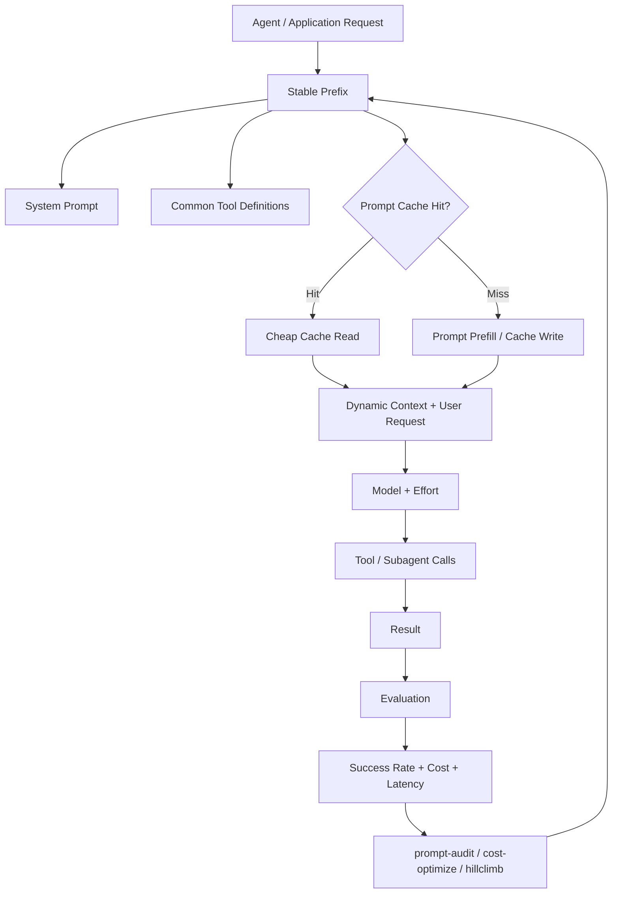

# Claude API 비용 최적화 - 캐싱, 지침 부채, Effort

> Claude 비용 최적화의 핵심은 단순히 토큰 단가를 낮추는 것이 아니라, **성공한 작업 1건당 비용(cost per successful task)** 을 낮추도록 캐시 적중률·프롬프트 지침·Effort를 함께 조정하는 것이다.

## 프로젝트 개요

Anthropic이 2026-09-08 공개한 Claude Platform 비용/성능 최적화 가이드다. 핵심 레버는 세 가지다.

1. Prompt Cache 적중률 극대화
2. 구형 모델을 보정하기 위해 누적된 Prompt Instruction Debt 제거
3. 작업 난이도에 맞는 Effort 및 모델 조합 선택

Claude Code용 공식 `claude-api` Skill에는 이를 자동화하는 `prompt-audit`, `cost-optimize`, `hillclimb` 명령이 포함된다.

## 해결하려는 문제

LLM 비용 최적화를 단순히 입력/출력 토큰 수나 저가 모델 선택으로만 접근하면 실제 작업 성공률이 떨어지고 재시도·추가 Tool Call 때문에 전체 비용이 오를 수 있다.

특히 장기간 운영한 Agent/Harness는 다음 문제가 누적되기 쉽다.

- 매 요청마다 동일한 System Prompt와 Tool Definition을 다시 처리
- 과거 모델의 약점을 보정하기 위한 지침이 최신 모델에서도 유지됨
- 모든 작업에 동일하게 높은 추론 강도 적용
- Tool 호출, 재시도, 장황한 출력이 실제 필요 이상으로 증가

따라서 비용 지표를 `cost/token`보다 `cost/successful task` 중심으로 바꾸는 것이 중요하다.

## 핵심 기능 및 방법론

### 1. Prompt Caching

Claude는 응답 전 prompt를 내부 working state(KV cache)로 처리한다. 동일 prefix가 반복되면 이를 재사용해 입력 처리 비용과 latency를 줄일 수 있다.

캐시 적중을 높이려면:

- System Prompt와 자주 쓰는 Tool Definition처럼 정적인 내용을 앞쪽에 둔다.
- timestamp, request ID 등 동적 값은 prefix에서 제거한다.
- Tool Definition 순서를 요청마다 바꾸지 않는다.
- 모델과 Effort 변경을 최소화한다.
- 드물게 쓰는 Tool은 `defer_loading`을 활용한다.
- 긴 Tool/Subagent 작업으로 기본 cache TTL을 넘기지 않도록 한다.
- 필요하면 1-hour TTL을 검토한다.
- 세션 시작 시 `max_tokens: 0` 요청으로 cache pre-warm을 고려한다.

### 2. Instruction Debt 제거

모델이 부족했던 시절 추가한 보정 지침이 최신 frontier model에서는 오히려 비용과 정확도를 악화할 수 있다.

대표 anti-pattern:

- `double-check`, `verify twice` 같은 검증 의식
- `be maximally thorough`, 반복적인 `CRITICAL/MUST ALWAYS` 강조
- 고정된 step-by-step/scratchpad 절차
- 구형 모델 실패 패턴에 맞춘 stale few-shot example
- 서로 충돌하는 규칙
- 구형 모델용 thinking budget/configuration

Anthropic의 Opus 4.8 → Opus 5 고객지원 benchmark 예에서는 `/claude-api prompt-audit` 적용 후 평균 비용이 14.6% 감소하고 정확도가 5.3% 향상됐다. 단, 특정 benchmark 결과이므로 일반화하지 말고 실제 workload evaluation으로 검증해야 한다.

### 3. Effort Calibration

높은 Effort가 항상 좋은 것은 아니다. 복잡한 작업에서는 탐색과 검증이 늘어 성능이 향상될 수 있지만 단순 작업에서는 over-thinking으로 비용과 latency가 증가할 수 있다.

반대로 지나치게 낮은 Effort는 필요한 Tool Call이나 검증을 생략해 성공률을 떨어뜨릴 수 있다.

따라서 다음 조합을 실제 평가셋에서 sweep하는 방식이 적합하다.

```text
Model × Effort × Prompt × Cache Strategy
                 ↓
         Evaluation / Cost
                 ↓
       Cost per Successful Task
```

중요한 관찰은 **강한 최신 모델 + 낮은 Effort**가 **약한 모델 + 높은 Effort**보다 싸고 정확할 수 있다는 점이다.

## Claude Code `claude-api` Skill

### `/claude-api prompt-audit`

Prompt, Skill, Tool description, `CLAUDE.md`, API 호출 코드를 검사해 최신 모델에서 불필요하거나 충돌하는 지침을 찾는다.

모델 업그레이드 직후 가장 먼저 적용할 가치가 높다.

### `/claude-api cost-optimize`

Claude API 애플리케이션의 비용 사용처를 분석하고 다음 항목을 우선순위화한다.

- prompt caching
- prompt/instruction 정리
- request context 축소
- output bounding
- Batch API
- Effort 조정
- model selection

Anthropic 공개 benchmark에서는 사례별 약 52~73% 비용 절감이 보고됐다. SWE-bench Verified 사례에서는 effort를 medium으로 낮추고 출력 길이를 제한해 median step이 29→17, prompt token이 75.2M→33.7M으로 감소했다.

### `/claude-api hillclimb`

Evaluation을 train/test로 나누고 Model, Effort, Prompt configuration을 반복 변경하면서 baseline 성능을 유지하거나 높이는 더 저렴한 구성을 탐색한다.

Anthropic 고객지원 예에서는 held-out test 기준 정확도 78.6% → 90.5%, 비용은 원래 구성의 약 1/5 수준으로 보고됐다.

## 아키텍처



## 장점

- 토큰 수 자체가 아니라 작업 성공 비용으로 최적화 기준을 바꾼다.
- 캐싱, Prompt, Model, Effort를 하나의 시스템으로 본다.
- Claude Code Skill로 반복적인 audit/optimization을 자동화할 수 있다.
- 모델 업그레이드 시 오래된 `CLAUDE.md`와 Skill 지침을 정리하는 실용적인 기준을 제공한다.
- Agent가 많은 Tool을 사용하는 환경에서 불필요한 Tool Call 감소 효과가 클 수 있다.

## 단점 및 한계

- Anthropic benchmark 수치를 자체 workload에 그대로 적용할 수 없다.
- Cache는 동일 prefix, 모델, 설정, TTL에 민감해 Agent 구조가 동적일수록 적중률 관리가 어렵다.
- Subagent가 오래 실행되면 부모 cache TTL이 만료될 수 있다.
- `prompt-audit`가 지침을 줄였다고 해서 프로젝트 고유의 안전/업무 규칙까지 불필요한 것은 아니다. 자동 변경 후 regression evaluation이 필요하다.
- Model/Effort sweep은 초기 평가 비용이 필요하다.
- Claude Platform 전용 기능에 의존하는 부분이 있어 다른 provider에는 원칙만 이식 가능하다.

## 활용 사례

### 바로 적용 가능

- `CLAUDE.md`와 대형 Skill에 `prompt-audit` 수행
- System Prompt의 timestamp/request ID 제거
- Tool Definition 순서 안정화
- 반복 Tool은 prefix에, 희귀 Tool은 deferred loading으로 분리
- 단순 작업의 Effort를 낮추고 성공률 비교
- Agent 출력 길이에 명시적 upper bound 적용

### PoC 가치 있음

- Harness의 Task Classifier가 작업 난이도에 따라 Model/Effort를 선택하도록 구성
- Cache hit/miss, Tool Call, retry, latency를 작업별로 로깅
- 평가셋 기반 `hillclimb` 방식으로 최적 조합 탐색
- Subagent 장기 실행 시 1-hour cache TTL의 비용 효과 비교

### 아이디어 참고

현재의 `Orchestrator → Analysis → Work → Review` 유형 Harness에 적용한다면 모든 단계에 최고 추론 강도를 고정하기보다 작업 유형별로 Effort를 달리하고, 공통 규칙/Tool Definition은 stable prefix로 유지하는 방식이 적합하다.

예:

```text
Task
 ↓
Classifier
 ├─ 단순 조회/정형 작업 → Strong Model / Low Effort
 ├─ 일반 구현          → Strong Model / Medium Effort
 └─ 복잡 분석/검증     → Strong Model / High Effort
             ↓
      Shared Stable Prefix
             ↓
     Cache + Tool Execution
             ↓
   Success/Cost Telemetry
```

## 기존 방식과 비교

| 방식 | 최적화 기준 | 위험 |
|---|---|---|
| 저가 모델로 교체 | token 단가 | 성공률 하락 및 재시도 증가 |
| Prompt 무조건 축약 | 입력 token | 필요한 context 손실 |
| 모든 작업 High Effort | 최대 추론 | 과도한 비용/latency |
| Anthropic 제안 방식 | successful task당 비용 | evaluation/telemetry 구축 필요 |

## 실무 평가

**도입 가치: 높음.**

특히 장기간 누적된 `CLAUDE.md`, Skill, Agent Prompt가 있다면 `instruction debt` 개념은 즉시 점검할 가치가 있다. 큰 Skill 파일을 단순히 압축하는 것보다 먼저 **실제로 필요 없는 지침·중복 검증·구형 모델 보정 규칙을 제거**하는 것이 더 본질적인 최적화다.

또한 Harness에서는 모델 라우팅만 최적화하지 말고 `Model × Effort × Cache × Prompt`를 하나의 configuration space로 관리하는 것이 적합하다.

## 결론

Anthropic의 가이드에서 가장 중요한 메시지는 **"싼 모델을 써라"가 아니라 "불필요한 compute를 제거하라"** 이다.

우선순위는 다음과 같이 잡는 것이 현실적이다.

1. Prompt/Skill instruction debt audit
2. Cache hit rate 계측 및 stable prefix 정리
3. 불필요한 output/Tool Call 제한
4. Task별 Effort calibration
5. Evaluation 기반 Model/Effort hillclimb

## 참고 자료

- Anthropic, *Reducing cost and improving performance with Claude Platform*, 2026-09-08
  - https://claude.com/blog/reducing-cost-and-improving-performance-with-claude-platform
- Anthropic `claude-api` Skill
  - https://github.com/anthropics/skills/tree/main/skills/claude-api
- AI타임스, *앤트로픽, 클로드 API 비용 절감 방법 공개…‘지침 부채’ 없애고 캐싱 활용*
  - https://www.aitimes.com/news/articleView.html?idxno=215093
