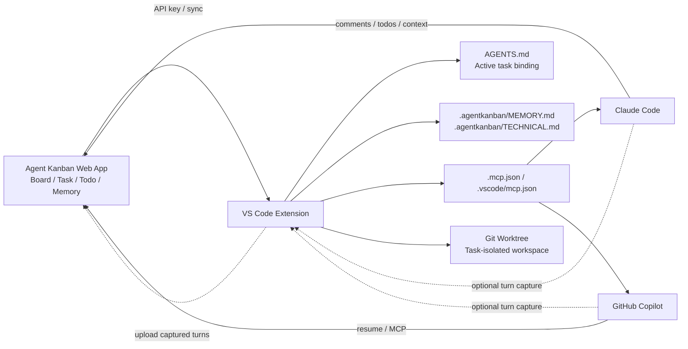

# Agent Kanban (VS Code)

> VS Code 작업공간을 Agent Kanban의 원격 태스크 보드와 연결하고, `AGENTS.md`·로컬 캐시·MCP·Git worktree를 이용해 Copilot/Claude Code가 태스크 컨텍스트를 이어서 작업하게 만드는 컨텍스트/워크플로 관리 도구.

## 프로젝트 개요

Agent Kanban (VS Code)은 `agentkanban.io` 웹 앱의 companion extension이다. 보드와 태스크 자체는 원격 서비스에서 관리하고, VS Code 확장은 현재 작업공간과 선택한 태스크를 바인딩한다.

기존의 로컬 전용 `vscode-agent-kanban` 확장과 구분해야 한다. 구버전은 로컬 Markdown 태스크 중심이며 계속 무료 로컬 워크플로용으로 제공된다. 현재 `AppSoftwareLtd.agent-kanban-vscode`는 원격 보드, 팀 협업, API key, MCP, resume 중심의 신버전이다.

## 해결하려는 문제

장시간 AI 코딩 작업에서는 다음 문제가 반복된다.

- 새 채팅/세션에서 이전 태스크 맥락을 다시 설명해야 함
- 여러 태스크를 병렬 진행하면 에이전트가 다른 작업의 컨텍스트를 섞기 쉬움
- 계획, TODO, 대화, 기술 결정이 채팅 안에만 남아 추적하기 어려움
- 사람의 태스크 보드와 AI 에이전트의 실제 작업 컨텍스트가 분리됨

Agent Kanban은 보드의 태스크를 에이전트 컨텍스트의 기준점으로 만들고, 필요한 정보를 파일/MCP/resume 흐름으로 다시 공급한다.

## 핵심 기능

### Board / Task 바인딩

VS Code 사이드바에서 원격 보드와 현재 작업 태스크를 선택한다. 선택된 태스크가 현재 workspace의 active task가 된다.

### AGENTS.md 컨텍스트

확장이 workspace 루트의 `AGENTS.md`에 관리 영역(sentinel section)을 추가한다. 선택 태스크의 제목, UUID, 보드 지침, MCP 도구 참조 등이 들어가므로 에이전트가 별도 복사 없이 현재 태스크를 식별할 수 있다.

### Board 문서 로컬 캐시

보드 수준의 공통 정보는 다음 파일로 동기화된다.

- `.agentkanban/MEMORY.md`
- `.agentkanban/TECHNICAL.md`

에이전트가 API를 매번 호출하지 않고 일반 파일처럼 읽을 수 있다.

### Resume

새 AI 세션에서 이전 태스크를 이어갈 수 있다.

- Copilot: 사이드바의 `Resume in Copilot Extension` 또는 `@kanban /resume`
- Claude Code: `Resume in Claude Extension`을 누르면 Claude Code를 열고 resume prompt를 클립보드에 넣는다. 붙여넣어 실행하면 Claude가 MCP를 통해 태스크 컨텍스트를 가져온다.

### Turn Capture

Copilot/Claude Code의 사용자-에이전트 대화 turn을 원격 태스크에 저장할 수 있다. workspace별 opt-in이며 기본값은 꺼져 있다. 활성화 이전 대화는 읽지 않는다.

Claude Code는 shared session transcript를 관찰하는 방식이라 VS Code가 해당 workspace를 열고 있으면 VS Code extension, integrated terminal, external terminal에서 실행한 Claude Code도 캡처 대상이 될 수 있다.

### MCP

Setup Wizard가 다음 설정을 자동 생성한다.

- Copilot: `.vscode/mcp.json`
- Claude Code: `.mcp.json`

예시 MCP 기능은 `get_task_context`, `add_comment`, `list_todos`, `update_todo`, `update_board_memory` 등이다.

### Git Worktree

태스크마다 별도 branch + sibling worktree를 만들고 별도 VS Code 창에서 열 수 있다. 태스크와 workspace가 분리되므로 병렬 에이전트 작업에 특히 유용하다.

기본 worktree root 설정은 `../{repo}-worktrees`이며 `agentKanban.worktreeRoot`로 변경할 수 있다.

## 설치 및 기본 사용법

1. `agentkanban.io`에서 계정을 만들고 Board를 생성한다.
2. VS Code Marketplace에서 `Agent Kanban (VS Code)` (`AppSoftwareLtd.agent-kanban-vscode`)를 설치한다.
3. VS Code Activity Bar에서 Agent Kanban 뷰를 연다.
4. Command Palette에서 `Agent Kanban: Setup Remote Connection`을 실행한다.
5. Agent Kanban 서버 URL과 API key를 입력하고 보드를 연결한다.
6. 사이드바에서 Board와 Task를 선택한다.
7. Copilot 또는 Claude Code의 Resume 버튼을 눌러 태스크 컨텍스트를 새 세션으로 로드한다.
8. 작업 중 필요한 TODO/코멘트/메모리는 MCP를 통해 조회·갱신한다.
9. 큰 작업이나 병렬 작업은 `Agent Kanban: Create Worktree`로 독립 worktree를 생성한다.

## 주요 명령

| 명령 | 용도 |
|---|---|
| `Agent Kanban: Setup Remote Connection` | 서버 URL/API key/보드 설정 |
| `Agent Kanban: Select Remote Board...` | 보드 전환 |
| `Agent Kanban: Select Remote Task...` | active task 선택 |
| `Agent Kanban: Create Worktree` | 선택 태스크용 worktree 생성 |
| `Agent Kanban: Delete Worktree` | worktree와 branch 제거 |
| `Agent Kanban: Uninitialise` | 관리 AGENTS.md 영역, API key, MCP 설정, workspace 상태 제거 |
| `@kanban /resume` | Copilot Chat에서 현재 태스크 컨텍스트 로드 |

## 아키텍처



핵심은 Kanban UI 자체보다 `Task = 지속 가능한 agent context 단위`로 만드는 데 있다.

## 권장 실전 흐름

```text
Board에서 Task 생성
  ↓
VS Code에서 Task 선택
  ↓
AGENTS.md + MEMORY/TECHNICAL 캐시 동기화
  ↓
작은 작업: 현재 workspace에서 Resume
큰/병렬 작업: Task별 Worktree 생성
  ↓
Claude Code / Copilot이 MCP로 상세 context 조회
  ↓
구현 + TODO 갱신 + comment/decision 기록
  ↓
필요 시 Turn Capture로 대화 이력 축적
  ↓
새 세션에서 Resume → 작업 지속
```

## Claude Code 중심 사용 예

1. Board에 `P4V Submit Dialog 개선` 같은 태스크를 만든다.
2. VS Code에서 해당 태스크를 선택한다.
3. 큰 변경이면 task worktree를 생성한다.
4. `Resume in Claude Extension`을 클릭한다.
5. 생성된 resume prompt를 Claude Code에 붙여넣는다.
6. Claude는 Agent Kanban MCP의 task context/TODO/board memory를 읽고 작업한다.
7. 구현 중 발견한 결정이나 TODO를 MCP로 태스크에 반영한다.
8. 새 Claude 세션을 열어도 Resume으로 동일 태스크를 이어간다.

이 구조는 Claude Code의 자체 `CLAUDE.md`/Skills와 경쟁하는 별도 agent harness라기보다, 상위의 task/context persistence 계층에 가깝다.

## 장점

- 태스크 상태와 AI 컨텍스트를 연결할 수 있음
- 새 세션에서 context 재설명 비용을 줄일 수 있음
- `AGENTS.md`와 Markdown cache로 에이전트가 평범한 파일 읽기만으로 핵심 맥락을 얻음
- MCP를 통해 TODO/코멘트/메모리를 양방향 갱신 가능
- worktree를 이용한 태스크별 격리가 멀티 에이전트/병렬 작업과 잘 맞음
- Copilot과 Claude Code를 동일 태스크 체계 아래 사용할 수 있음
- Turn Capture가 선택적(opt-in)이라 필요에 따라 기록 범위를 제어 가능

## 단점 및 한계

- 신버전은 `agentkanban.io` 원격 서비스와 API key에 의존하므로 구버전 로컬-only 방식보다 외부 서비스 의존성이 커짐
- 소스 코드나 대화가 민감한 Enterprise 환경에서는 Turn Capture 및 원격 저장 정책을 별도로 검토해야 함
- `AGENTS.md`, `.mcp.json`, `.vscode/mcp.json`을 이미 조직 표준으로 관리한다면 충돌/관리 정책 검토가 필요함
- Git Worktree가 핵심 격리 수단 중 하나라 Perforce 중심 환경에서는 이 장점을 그대로 사용할 수 없음
- Kanban/TODO 업데이트까지 에이전트가 자주 수행하면 MCP 호출과 운영 규칙이 추가되어 작은 작업에는 오버헤드가 될 수 있음
- 원격 서비스의 가격/장기 운영 안정성 및 Enterprise 보안 조건은 도입 시점에 별도 확인 필요

## Perforce 환경 관점

Perforce를 사용하는 회사 환경에서는 `Git Worktree` 기능을 핵심 가치로 보면 적합도가 낮다. 대신 다음 부분은 참고 가치가 높다.

- `Task ID ↔ workspace/session` 바인딩
- task context를 `AGENTS.md`에 얇게 주입
- 공통 memory/technical context의 로컬 캐시
- MCP를 통한 task 상태/TODO/decision 양방향 동기화
- 세션 재시작 시 Resume 패턴

즉 Perforce에서는 Agent Kanban 자체를 그대로 표준화하기보다, 현재 사용하는 프로젝트별 Claude 세션/Perforce workspace 구조에 `task binding + resume + context cache` 아이디어를 이식하는 PoC가 더 현실적이다.

## 기존 로컬 버전과 비교

| 항목 | 구버전 `vscode-agent-kanban` | 신버전 `agent-kanban-vscode` |
|---|---|---|
| 저장 | 로컬 Markdown task | 원격 Agent Kanban board 중심 |
| 협업 | Git으로 task 파일 공유 | 팀/조직 + realtime remote board |
| Agent 연결 | `@kanban /task`, `/refresh` | Resume + MCP |
| 컨텍스트 | INSTRUCTION/task file | AGENTS.md + MEMORY/TECHNICAL + MCP |
| Worktree | 지원 | 지원 |
| Claude Code | 주로 기존 harness 활용 | 공식 resume/MCP/turn capture 흐름 |
| 로컬-only | 가능 | 원격 서비스 연결이 기본 |

## 활용 아이디어

### 바로 적용 가능

개인 Git 프로젝트에서 Claude Code/Copilot을 번갈아 쓰고, 여러 태스크를 장기간 이어서 작업한다면 바로 시험할 가치가 있다.

### PoC 가치 있음

회사 개발환경에서는 `Task → Agent Session → Context → Resume` 모델을 검증하는 용도로 가치가 높다. 특히 프로젝트별 상시 Claude 세션과 태스크 현황판을 구축하려는 경우 구조적 참고점이 된다.

### 아이디어 참고

Perforce 기반 자체 Harness에는 다음 패턴만 차용할 수 있다.

```text
Hansoft/Jira/Internal Task
        ↓
Task Binding
        ↓
Workspace AGENTS.md sentinel
        +
Local task context cache
        ↓
Claude / Codex session
        ↕ MCP
Task TODO / decisions / progress
        ↓
Resume token or Task ID
```

Git worktree 대신 `Perforce workspace/client per agent`를 대응 개념으로 두면 유사한 격리를 만들 수 있다.

## 결론

Agent Kanban 신버전의 핵심은 단순한 AI용 칸반 보드가 아니라 **태스크를 에이전트 세션의 지속 가능한 컨텍스트 단위로 만드는 것**이다. Claude Code에서는 MCP 기반 Resume, board memory, TODO 동기화가 특히 유용하다.

Git 기반 개인 프로젝트에는 직접 도입 가치가 높고, Perforce 기반 회사 환경에는 전체 제품 도입보다 task binding/resume/context cache 패턴을 자체 Harness에 이식하는 PoC 가치가 더 높다.

## 참고 자료

- VS Code Marketplace: https://marketplace.visualstudio.com/items?itemName=AppSoftwareLtd.agent-kanban-vscode
- Web App: https://agentkanban.io
- Documentation: https://agentkanban.com
- Legacy/local extension repository: https://github.com/appsoftwareltd/vscode-agent-kanban
