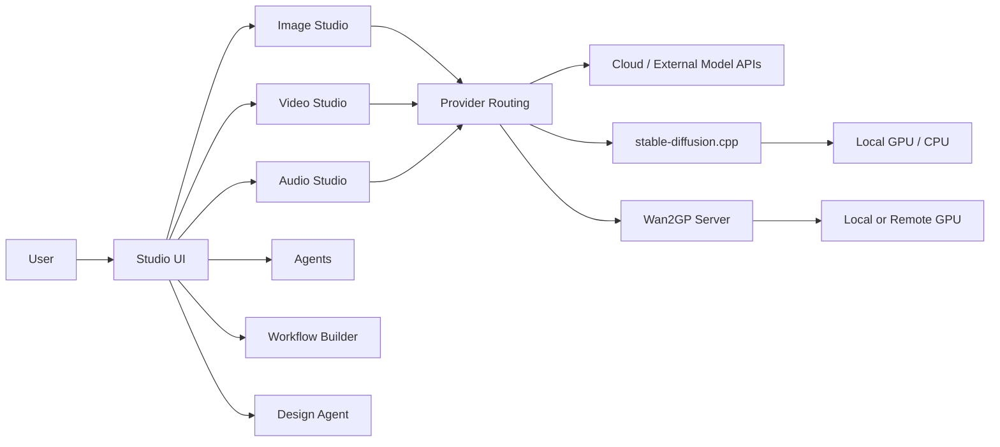

# Open Generative AI

> 이미지·비디오·오디오 생성, 로컬 추론, Agent와 Workflow까지 하나의 오픈소스 데스크톱/웹 Studio로 묶은 생성형 AI 프런트엔드 플랫폼.

## 프로젝트 개요

Open Generative AI는 여러 생성형 AI 모델과 API를 하나의 Studio UI에서 다루기 위한 MIT 라이선스 프로젝트다. Next.js/React 기반 웹 애플리케이션과 Electron 데스크톱 앱을 함께 제공하며, 이미지·비디오·오디오 생성뿐 아니라 Agent, Workflow Builder, Design Agent 패키지를 workspace/submodule 형태로 통합한다.

2026-09-13 조사 기준 GitHub 저장소는 약 450 commits 규모이며 v2.0.0 릴리스가 공개되어 있다. 최근에도 multi-provider AI, XSS 방지, generation stage 처리 등 PR이 진행되고 있어 개발 활동은 활발한 편이다.

## 해결하려는 문제

생성형 미디어 도구는 모델마다 서로 다른 웹 UI, API, 인증 및 과금 체계를 사용한다. 또한 로컬 모델과 클라우드 모델을 함께 사용하려면 별도의 도구를 조합해야 한다.

이 프로젝트는 이를 하나의 Studio UX로 통합하고, 필요에 따라 API 기반 모델과 로컬 추론 엔진을 선택할 수 있게 하는 것을 목표로 한다.

## 핵심 기능

- Image Studio: text-to-image 및 image-to-image 생성
- Video Studio: text/image-to-video 생성
- Audio Studio: 음악/오디오 생성 및 편집
- Local Inference: stable-diffusion.cpp 기반 로컬 이미지 생성
- Wan2GP 연동: 별도 GPU 서버를 통한 Flux/Qwen-Image/Wan/Hunyuan/LTX 계열 실행
- Agent UI: Agent 생성·탐색·대화
- Workflow Builder: 생성 작업을 workflow 형태로 구성
- Design Agent 통합
- Electron 기반 Windows/macOS/Linux 데스크톱 배포
- 모델 저장 위치 지정 및 로컬/원격 provider 라우팅

## 아키텍처

package.json 기준 주요 workspace는 다음과 같다.

- `packages/studio`: 생성형 AI Studio UI
- `packages/Vibe-Workflow/packages/workflow-builder`: Workflow Builder
- `packages/Open-Poe-AI/packages/agents`: Agent 기능
- `packages/Open-AI-Design-Agent/packages/design-agent`: Design Agent
- `electron/`: 데스크톱 shell 및 로컬 AI IPC/provider
- Next.js/React: 웹 애플리케이션
- Vite/Electron Builder: 데스크톱 번들링



핵심 구조는 '모델 자체를 모두 내장'하는 방식이 아니라 Studio가 provider/router 역할을 하고, 일부 모델은 외부 API로, 일부는 stable-diffusion.cpp 또는 Wan2GP 같은 로컬 엔진으로 전달하는 방식이다.

## 로컬 AI 관점

로컬 추론은 두 계층으로 나뉜다.

1. stable-diffusion.cpp: 앱에서 관리하며 SD 1.5, SDXL, Z-Image 계열을 로컬 실행
2. Wan2GP: 별도 Gradio GPU 서버를 사용하며 Flux, Qwen-Image, Wan 2.2, Hunyuan, LTX 등으로 범위를 확장

따라서 완전한 단일 프로세스 로컬 AI 앱이라기보다 '로컬 inference backend까지 통합할 수 있는 Studio'에 가깝다.

## 장점

- 여러 생성 모델을 하나의 UI에서 탐색하고 실행할 수 있다.
- 웹과 Electron 데스크톱을 모두 지원한다.
- 로컬 모델과 API 모델을 동일한 UX에서 사용할 수 있다.
- Windows/macOS/Linux 빌드가 제공된다.
- Agent/Workflow/Design 기능까지 같은 앱 안에 통합하려는 방향성이 있다.
- MIT 라이선스로 소스 수정 및 내부 도구화가 용이하다.
- 생성형 AI 도구를 직접 구현할 때 provider abstraction과 Studio UX 참고 자료로 가치가 있다.

## 단점 및 한계

### 외부 Provider 의존성

'오픈소스'라고 해서 모든 모델이 무료 또는 로컬인 것은 아니다. 많은 모델은 외부 API/provider를 통해 호출되므로 실제 비용과 서비스 의존성이 남는다.

### 로컬 비디오 구성 복잡도

Wan2GP는 별도 GPU 서버와 Gradio endpoint가 필요하다. 모델/서버 버전에 따라 function name을 맞춰야 할 수도 있어 일반 사용자에게는 운영 난도가 높다.

### 보안

2026년 공개 이슈에는 upload proxy target URL validation 강화 요청이 존재하고, 최근 PR에는 Studio history XSS 방지 수정도 보인다. 외부 URL/API key/업로드를 다루는 애플리케이션이므로 Enterprise 환경에서는 네트워크 경계와 credential 저장 방식을 별도로 검토할 필요가 있다.

### 공급자·모델 변화 대응 비용

생성형 AI API는 endpoint와 parameter가 자주 변경된다. 실제 릴리스에서도 lipsync prompt, API endpoint, model URL, aspect ratio 등 provider별 수정이 반복된다. 모델 수가 많아질수록 catalog 유지보수 비용이 증가한다.

### 데스크톱 배포 신뢰성

과거 릴리스에서 Windows build가 Tailwind 버전 충돌로 깨졌던 사례가 있고 일부 배포 파일은 code signing/notarization 관련 경고가 있었다. 기업 배포 전 별도 signing/build pipeline을 권장한다.

## 활용 사례

- 이미지/영상 생성 모델을 비교하는 사내 AI Playground
- 여러 생성 API를 하나의 UI로 통합하는 Creator Studio
- 로컬 GPU + 클라우드 API hybrid 생성 환경
- AI 콘텐츠 제작 자동화 Workflow의 frontend
- 사내 디자인/마케팅팀용 생성형 미디어 포털
- 새로운 이미지/영상 모델의 UX 및 provider abstraction 연구

## 기존 도구와 비교

### ComfyUI와의 차이

ComfyUI는 node graph 기반의 세밀한 inference pipeline 구성에 강하다. Open Generative AI는 모델별 복잡한 graph를 직접 구성하기보다 일반 사용자가 Studio 형태로 빠르게 모델을 선택하고 생성하는 UX에 더 가깝다.

### 단일 SaaS 생성 플랫폼과의 차이

특정 vendor에 고정된 SaaS와 달리 여러 provider 및 로컬 backend를 하나의 UI로 묶는 것이 핵심 차별점이다. 반면 provider별 API 비용과 호환성 문제까지 제거해 주는 것은 아니다.

## AX / Harness 관점 평가

이 프로젝트의 가장 흥미로운 부분은 생성 모델 자체보다 `Studio + Agent + Workflow + Provider Routing + Local AI`를 하나의 desktop shell로 결합한 구조다.

개발용 Claude/Codex harness와 직접 경쟁하는 프로젝트는 아니지만, 개인/사내 AI Workspace를 만들 때 다음 패턴을 참고할 가치가 있다.

```text
Unified Desktop Shell
        ↓
Task-specific Studios
        ↓
Workflow / Agent Layer
        ↓
Provider Router
   ↙          ↘
Local AI     Cloud API
```

즉 AI 기능을 각각 독립 앱으로 배치하기보다 하나의 Shell 아래 Studio/Agent/Workflow를 plugin처럼 배치하는 방식이다.

## 활용 아이디어

### 바로 적용 가능

- 여러 이미지/영상 모델을 테스트하는 통합 Playground로 사용
- 로컬 GPU와 API 모델의 품질/비용 비교 환경 구축

### PoC 가치 있음

- 사내 AI Workspace UI 구조 참고
- Claude/Codex 중심 개발 Harness에 `Studio` 개념을 적용해 Code, Review, Docs, Release 등의 task-specific 화면으로 분리
- Provider Router 패턴을 모델 라우팅 계층에 적용

### 아이디어 참고

현재 개인 Harness의 root UI를 단순 Agent 목록이 아니라 기능별 Studio로 구성할 수 있다.

예:

```text
AI Workspace
├─ Code Studio
├─ Review Studio
├─ Research Studio
├─ Release Studio
├─ Media Studio
├─ Agents
└─ Workflows
```

각 Studio는 동일한 Agent/Model Router를 사용하되 task context와 UI만 다르게 제공하는 방식이다.

### 현재 도입 가치 낮음

Claude/Codex 기반 코드 생산성만이 목적이라면 프로젝트 전체를 도입할 필요는 낮다. 생성형 미디어 기능 비중이 크고, 개발 agent harness와 목적이 다르기 때문이다.

## 결론

Open Generative AI는 단순 이미지 생성 앱보다 범위가 넓다. 여러 생성 모델, 로컬 inference, Agent, Workflow, Design 기능을 하나의 웹/Electron Studio로 묶으려는 '오픈 생성형 AI Workspace'에 가깝다.

개발 생산성 Harness 자체로 채택하기보다는 **통합 AI Desktop Shell, task-specific Studio, provider routing, local/cloud hybrid 구조를 설계할 때 참고할 프로젝트**로 보는 것이 적절하다.

실무 평가: **PoC 가치 있음 / 아키텍처 아이디어 참고 가치 높음**.

## 참고 자료

- GitHub: https://github.com/Anil-matcha/Open-Generative-AI
- Releases: https://github.com/Anil-matcha/Open-Generative-AI/releases
- Issues: https://github.com/Anil-matcha/Open-Generative-AI/issues
- Wan2GP: https://github.com/deepbeepmeep/Wan2GP
