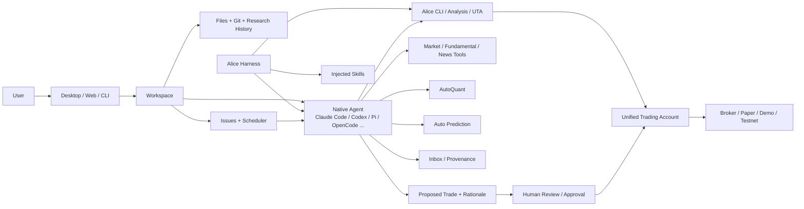

# OpenAlice

> Claude Code·Codex 같은 범용 코딩 에이전트에 시장 데이터, 영속 Workspace, 스케줄 작업, 정량 분석, 브로커 연결과 승인 기반 주문 실행을 붙여 **로컬 AI 트레이딩 워크스테이션**으로 만드는 오픈소스 프로젝트.

## 프로젝트 개요

OpenAlice는 특정 자체 LLM 하나로 투자 결정을 내리는 봇이라기보다, 기존 Coding Agent가 금융 리서치와 트레이딩 업무를 수행할 수 있도록 협업 기반(substrate)을 제공하는 AI orchestrator다. Claude Code, Codex, OpenCode, Pi, Oh My Pi 등의 native agent를 사용할 수 있으며 대화·파일·Git history·시장 도구·Issues·scheduled task·trading account를 하나의 로컬 Workspace에 연결한다.

프로젝트는 Desktop(macOS/Windows), CLI/remote, Docker 실행 경로를 제공한다. 저장소는 2026-09-10 기준 4천 개 이상의 commit을 가진 활발한 프로젝트지만 trading execution은 공식적으로 beta/experimental로 경고하고 있다.

## 해결하려는 문제

일반 LLM에게 종목 분석을 요청하면 대화가 끝날 때 연구 맥락도 함께 끊기기 쉽고, 시장 데이터 조회·정량 실험·주기적 재검증·포지션 상태 확인·주문 실행이 서로 다른 도구에 흩어진다.

OpenAlice의 핵심 발상은 Coding Agent가 Git, 파일, issue, terminal 같은 개발 협업 기반 덕분에 강력해진 것처럼 금융 업무에도 동일한 작업 기반을 제공하는 것이다. 즉 '트레이딩 전용 모델'보다 **에이전트가 지속적으로 일할 수 있는 환경**에 초점을 둔다.

## 핵심 기능

- **Native Agent 연결**: Claude Code, Codex, OpenCode, Pi, Oh My Pi 등 기존 agent loop를 그대로 사용한다.
- **Workspace**: conversation, research file, Git history를 프로젝트 단위로 보존한다.
- **Market tooling**: 가격, fundamentals, news, quantitative tool을 agent가 호출한다. 실제 가용 데이터는 설정한 provider에 좌우된다.
- **AutoQuant**: 정량 연구와 실험을 별도 전문 Workspace/Studio로 분리한다.
- **Auto Prediction**: prediction-market research용 전문 Workspace를 제공한다.
- **Tracked + Issues**: asset/topic과 연구를 연결하고 후속 분석을 Issue로 만든다.
- **Scheduling**: morning scan, weekly macro review, thesis 재검증 같은 작업을 기존 Workspace agent/context로 반복 실행한다.
- **Inbox / provenance**: scheduled/headless 결과를 모으고 결과를 만든 session 및 research file로 다시 이동할 수 있다.
- **Unified Trading Account (UTA)**: broker holdings/order/account state를 공통 인터페이스로 노출한다.
- **Trading as Git**: agent가 주문 operation과 rationale을 제안하고 사람이 검토·승인하는 흐름을 제공한다.
- **Alice Harness injection**: Workspace에 Alice CLI와 `alice`, `alice-analysis`, `alice-uta`, `traderhub`, `self-scheduling` Skill을 주입하고 버전·업데이트·충돌을 관리한다.

## 아키텍처

### 실행 흐름

1. 사용자가 Workspace에서 연구 목표를 agent에 전달한다.
2. agent는 Workspace 파일, Git, Alice Skill/CLI와 market tool을 이용해 자료를 수집한다.
3. 결과와 thesis를 파일로 남겨 세션 이후에도 재사용한다.
4. 정량 검증이 필요하면 AutoQuant로 위임할 수 있다.
5. 지속 관찰이 필요한 thesis는 Issue + schedule로 전환한다.
6. scheduled/headless run은 동일 Workspace의 agent와 context를 사용한다.
7. 결과는 Inbox/provenance를 통해 원본 session 및 artifact와 연결된다.
8. 거래가 필요한 경우 UTA를 통해 operation을 준비하고 rationale을 기록한다.
9. 기본적으로 사람이 검토/승인 후 실행하는 흐름을 취한다. 자동매매 옵션도 존재하지만 프로젝트 UI 자체가 실계좌 사용을 강하게 경고한다.

## Alice Harness에서 참고할 점

OpenAlice의 가치 중 하나는 금융 기능보다 **Harness 운영 방식**이다.

- Project의 실행 CLI와 Workspace에 복사되는 Skill을 분리한다.
- `.agents/skills`를 primary, `.claude/skills`를 runtime mirror로 관리한다.
- Workspace별 Skill/CLI enable 상태를 별도 config로 관리한다.
- Skill install/update/remove/restore를 단일 Skill 단위로 preview 후 수행한다.
- local customization과 upstream 변경을 three-way comparison으로 다룬다.
- update transaction에 checkout serialization, preview digest, atomic replacement, Git commit, rollback/recovery를 포함한다.
- Skill 파일이 업데이트돼도 이미 실행 중인 model context는 자동 reload되지 않으므로 agent가 다시 읽어야 한다.

이 패턴은 사내 AI Harness에서 공용 Skill 배포와 프로젝트별 커스터마이징을 동시에 허용해야 할 때 특히 참고 가치가 높다.

## 장점

### 1. 모델보다 Workspace를 중심에 둔다

Agent를 교체해도 연구 파일·Git history·Issue·schedule을 유지할 수 있어 특정 모델에 대한 lock-in을 줄이는 방향이다.

### 2. Research → Follow-up → Execution이 연결된다

일회성 분석에서 끝나지 않고 thesis를 저장하고 일정 기반으로 다시 검증하며 필요하면 주문 검토까지 연결한다.

### 3. Local-first

Workspace가 실제 directory/Git repository이고 OpenAlice 자체 상태는 기본적으로 로컬 `~/.openalice`에 둔다. 사용자가 파일을 직접 inspect/edit/backup할 수 있다는 점이 강점이다.

### 4. Human-in-the-loop 거래 구조

Agent가 rationale과 operation을 준비하고 사람이 승인하는 Trading as Git 접근은 완전 자동 주문보다 auditability와 통제에 유리하다.

### 5. Harness/Skill lifecycle이 구체적이다

Skill injection을 단순 파일 복사로 끝내지 않고 버전, baseline, conflict review, rollback/recovery까지 다룬다는 점은 일반 AI 개발 Harness 설계에도 참고할 만하다.

## 단점 및 한계

### Trading layer가 아직 Beta

프로젝트 자체가 correctness, reliability, profitability, loss prevention을 보장하지 않으며 paper/demo/testnet부터 사용할 것을 명시한다. 실계좌 자동 주문 플랫폼으로 즉시 신뢰할 단계로 보기는 어렵다.

### 데이터 품질은 Provider 의존

OpenAlice가 모든 금융 데이터를 자체적으로 보장하는 구조가 아니다. 어떤 market/fundamental/news 데이터가 사용 가능한지는 구성한 provider에 따라 달라진다.

### 운영 복잡도

Agent runtime, model credential, data provider, Workspace, Skill injection, scheduler, broker connector를 함께 관리해야 한다. 단순 챗봇 기반 투자 분석보다 설치·디버깅 포인트가 많다.

### 비용 및 Token 사용량

여러 agent와 반복 scheduled research를 사용하면 LLM/API 비용이 커질 수 있다. 저장소 문서에서 범용적인 비용 상한이나 token 최적화 효과가 보장된 것은 확인되지 않았다.

### 보안

Broker credential은 at-rest sealing을 제공한다고 설명하지만, agent 자체와 외부 data/model provider는 각 서비스 정책을 따른다. Workspace를 수정할 수 있는 agent에게 Skill enable/disable 설정 자체가 강력한 security sandbox가 되는 것은 아니라고 Harness 문서도 명시한다.

### Windows / runtime 호환성

Desktop은 Windows를 지원하지만 Harness 문서에는 shell PATH/login-profile, Cursor adapter 등 runtime별 discovery 문제가 기록돼 있다. 2026-09-09 acceptance도 일부 runtime은 인증/실행 문제 때문에 검증되지 않았다. Enterprise Windows 환경에서는 agent CLI discovery와 credential routing을 별도 검증하는 편이 안전하다.

### 라이선스

저장소는 AGPL-3.0이다. 사내 수정·서비스화 등 배포 형태에 따라 라이선스 검토가 필요하다.

## 활용 사례

- 특정 종목의 장기 thesis를 파일로 만들고 매주 자동 재검증
- macro/news morning scan을 Issue schedule로 실행
- 정성 분석 결과를 AutoQuant 실험으로 넘겨 검증
- paper account에서 agent가 주문안을 만들고 사람이 승인
- 여러 agent를 동일 research Workspace에 연결해 역할별 분석
- prediction market 연구 프로젝트 운영

## 기존 도구와 비교

| 관점 | 일반 AI Chat | Quant Framework | OpenAlice |
|---|---|---|---|
| 핵심 단위 | Conversation | Strategy/Code | Workspace |
| 장기 Context | 제한적 | 코드/DB에 직접 구현 | Files + Git + Issues |
| Agent 교체 | 제품 종속 | 직접 통합 | 여러 native coding agent 지원 |
| 정량 연구 | 별도 구현 | 강함 | AutoQuant Workspace |
| 반복 연구 | 외부 scheduler 필요 | 코드로 구현 | Issue + schedule 내장 |
| Broker 연결 | 대체로 없음 | 프레임워크별 | UTA abstraction |
| 주문 통제 | 해당 없음 | 전략 코드 중심 | proposal + rationale + approval |
| 주 목적 | 질의응답 | 자동매매 엔진 | AI research/trading orchestration |

따라서 OpenAlice를 NautilusTrader 같은 execution/strategy engine의 직접 대체재로 보기보다, **AI agent가 금융 research lifecycle 전체를 운영하도록 만드는 orchestration layer**로 보는 편이 정확하다.

## 활용 아이디어

### 바로 적용 가능 — Harness 설계 참고

OpenAlice 전체를 도입하지 않더라도 Skill injection lifecycle, Workspace provenance, Issue 기반 self-scheduling, agent/runtime 분리 방식은 사내 AI Harness 설계에 바로 참고할 가치가 높다.

### PoC 가치 있음 — 개인 투자 Research Workspace

실계좌 주문은 제외하고 관심 종목/ETF/거시경제 thesis를 Workspace로 관리하고 scheduled research 결과를 누적하는 용도로 PoC할 가치가 있다.

### PoC 가치 있음 — Soccer Decision System과 구조적 비교

현재처럼 데이터 수집 → 분석 → 구매 판단 → 정산/복기를 반복하는 시스템에도 OpenAlice의 `Workspace + scheduled Issue + provenance + human approval` 패턴을 차용할 수 있다. 금융 기능을 그대로 가져오기보다는 decision lifecycle 구조를 참고하는 접근이 적합하다.

### 아이디어 참고 — 사내 ATOM/Workspace Harness

`Orchestrator → Analysis → Work → Review` 구조에 OpenAlice식 Workspace provenance와 managed Skill upgrade를 붙이면 agent가 무엇을 근거로 작업했고 어떤 Skill 버전을 사용했는지 추적하기 쉬워진다.

### 현재는 도입 가치 낮음 — 실계좌 완전 자동매매

Trading execution이 beta이고 프로젝트가 명시적으로 real-money auto-trading을 강하게 경고하므로 현재 시점에는 실계좌 무인 운용을 핵심 목적으로 도입하는 것은 권장하지 않는다.

## 결론

OpenAlice의 핵심은 'AI가 주식을 잘 맞힌다'가 아니다. **Coding Agent가 강력해진 이유인 Workspace, Git, Issues, Tooling, Scheduling을 트레이딩 도메인에 옮긴 것**이 핵심이다.

금융 Agent 프로젝트로도 흥미롭지만 AI/AX 관점에서는 `persistent workspace + native agent + injected skills + scheduled issues + provenance + approval-gated action`을 실제 제품 수준으로 묶은 Harness 사례라는 점이 더 중요하다.

현 시점 평가는 **Harness 구조는 적극 참고, research-only PoC는 가치 높음, 실계좌 자동매매는 보류**가 적절하다.

## 참고 자료

- https://github.com/TraderAlice/OpenAlice
- https://github.com/TraderAlice/OpenAlice/blob/master/README.md
- https://github.com/TraderAlice/OpenAlice/blob/master/docs/alice-harness.md
- https://github.com/TraderAlice/OpenAlice/releases
