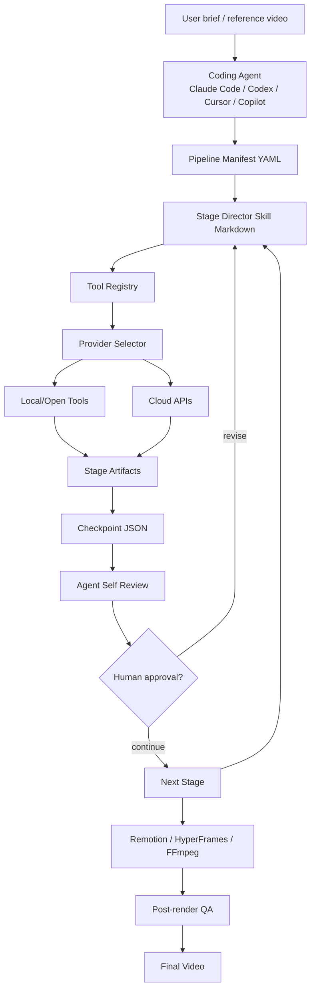

# OpenMontage

> Claude Code·Codex 같은 코딩 에이전트를 제어면(control plane)으로 사용해 조사→대본→에셋 생성→편집→렌더링→검수까지 영상 제작 전체를 실행하는 오픈소스 Agentic Video Production 시스템.

## 프로젝트 개요

OpenMontage는 단일 프롬프트로 짧은 생성형 영상 클립 하나를 만드는 도구가 아니라, 실제 영상 제작팀에 가까운 단계형 프로덕션 파이프라인을 AI 코딩 에이전트가 운영하도록 만든 프로젝트다. 핵심 특징은 별도의 Python LLM 오케스트레이터를 두지 않고 Claude Code, Codex, Cursor, Copilot 등의 코딩 에이전트 자체를 오케스트레이터로 사용한다는 점이다.

2026-09-12 조사 기준 저장소는 12개 수준의 제작 파이프라인, 100개 이상의 도구, 700개 이상의 Agent Skill/production knowledge 파일을 표방한다. AGPL-3.0 라이선스이며 공식 GitHub Release 패키지는 아직 제공하지 않는다.

## 해결하려는 문제

일반 AI 영상 생성 서비스는 대체로 `prompt -> clip`에 집중한다. 실제 콘텐츠 제작에는 조사, 사실 검증, 스크립트, 장면 계획, 소스 수집, 생성 모델 선택, 음성·음악, 편집, 자막, 렌더링, 품질 검수와 비용 통제가 필요하다.

OpenMontage는 이 과정을 pipeline manifest + skill + tool + checkpoint로 구조화한다. 특히 무료 stock/archive의 실제 motion footage를 검색·편집할 수 있어 이미지 몇 장에 움직임만 주는 방식과 구분된다.

## 핵심 기능

- Agent-first orchestration: 코딩 에이전트가 YAML pipeline을 읽고 단계별 Skill을 수행한다.
- 다중 제작 파이프라인: explainer, cinematic, talking-head, podcast repurpose, localization/dub, screen demo, clip factory, character animation 등.
- Provider abstraction/selection: TTS·image·video provider를 가용성, 품질, 비용, 지연시간 등의 기준으로 선택한다.
- 무료/로컬 경로: Piper TTS, Archive.org/NASA/Wikimedia, FFmpeg, Remotion 등의 조합을 지원한다.
- Cloud 생성 경로: 이미지·영상·TTS 공급자를 추가해 생성 품질을 높일 수 있다.
- Checkpoint와 human approval gate를 이용한 단계별 상태 저장 및 승인.
- 예산 추정, spend cap, 단일 action 승인 threshold 등 비용 거버넌스.
- post-render self review와 validation을 통한 품질 게이트.
- Remotion 및 HyperFrames 기반 composition.

## 아키텍처



### 핵심 구조

`lib/`는 설정, checkpoint, pipeline loader 등 런타임 기반을 담당한다. `tools/`는 분석·음성·이미지·영상·후처리 기능을 Python Tool로 제공하며 registry가 `BaseTool` 구현을 자동 탐색한다. `pipeline_defs/`에는 제작 과정의 단계와 산출물, 사용할 Skill, 검수 조건을 선언한 YAML manifest가 있다. `skills/`와 `.agents/skills/`는 에이전트가 각 작업과 외부 기술을 사용하는 방법을 Markdown 지침으로 제공한다.

가장 중요한 설계는 **Python은 도구와 상태 저장을 담당하고, 판단과 orchestration은 코딩 에이전트가 담당한다**는 것이다. 즉 일반적인 LangGraph/CrewAI 형태의 별도 agent runtime보다 Harness/Skill 중심 접근에 가깝다.

## 실행 흐름

1. 사용자가 영상 목표나 reference를 전달한다.
2. 에이전트가 적절한 pipeline manifest를 선택한다.
3. 현재 stage의 director Skill을 읽는다.
4. registry에서 필요한 Tool/provider를 선택해 실행한다.
5. 결과 artifact와 상태를 checkpoint에 저장한다.
6. reviewer Skill로 결과를 자체 검수한다.
7. 정책에 따라 사용자 승인을 받거나 다음 stage로 이동한다.
8. Remotion/HyperFrames/FFmpeg 등으로 composition/render한다.
9. 렌더 결과를 frame/audio/ffprobe 기반으로 다시 검사한 뒤 최종 결과를 제공한다.

## 장점

### 1. Harness 관점에서 매우 참고 가치가 높음

OpenMontage의 진짜 가치는 영상 생성 모델 자체보다 `Manifest -> Skill -> Tool -> Artifact -> Checkpoint -> Review` 구조다. 특정 도메인의 복잡한 업무를 코딩 에이전트가 수행하게 만드는 범용 Harness 패턴으로 재사용할 수 있다.

### 2. 에이전트가 이미 가진 LLM을 재사용

별도 범용 LLM API runtime을 강제하지 않고 Claude Code/Codex 등의 세션을 control plane으로 사용한다. 기존 코딩 에이전트 구독과 파일·shell 실행 능력을 그대로 활용할 수 있다.

### 3. Provider lock-in 완화

이미지·영상·TTS를 selector 뒤에 배치하고 로컬과 API provider를 함께 지원한다. 특정 생성 API가 변경되거나 비용이 올라가도 대체 경로를 구성하기 쉽다.

### 4. 비용·품질을 workflow에 포함

예산 cap, approval threshold, validation, post-render review를 처음부터 pipeline의 일부로 본다는 점이 실무적이다.

### 5. 실제 footage 기반 제작

무료 stock/open archive를 이용한 영상 제작 경로가 있어 반드시 유료 video generation 모델을 사용할 필요가 없다.

## 단점 및 한계

- 에이전트 지침과 Skill이 매우 많아 context 관리와 instruction drift 가능성이 있다. 700+ knowledge/skill 파일은 강점인 동시에 탐색·유지보수 비용이다.
- control plane이 코딩 에이전트이므로 결과의 재현성과 orchestration 안정성이 deterministic workflow engine보다 낮을 수 있다.
- Python/Node/FFmpeg/Remotion 및 선택 provider별 dependency가 있어 완전한 SaaS형 원클릭 도구보다 환경 구축이 복잡하다.
- 생성형 영상 API를 적극 사용하면 비용과 처리 시간이 빠르게 증가할 수 있다. budget governance가 있지만 실제 비용은 선택 모델과 재시도에 좌우된다.
- 외부 provider/API key를 사용할 경우 콘텐츠와 데이터의 외부 전송 정책을 Enterprise 환경에서 별도로 검토해야 한다.
- AGPL-3.0이므로 사내 제품/서비스와 결합하거나 수정 배포할 때 라이선스 검토가 필요하다.
- 2026-09-12 기준 GitHub Releases가 없어 안정 버전 경계가 명확하지 않다.
- 최근에도 provider adapter, Remotion/HyperFrames, schema 관련 issue가 보고되고 있어 빠르게 발전하는 프로젝트 특성상 운영 안정성 검증이 필요하다.
- 공식 저장소를 사칭한 악성 Windows installer 사례가 보고되었다. 공식 저장소는 `calesthio/OpenMontage`이며 임의의 바이너리를 실행하지 않는 것이 중요하다.

## 활용 사례

- 기술 블로그/문서를 짧은 설명 영상으로 자동 변환
- 사내 Tool의 screen demo 및 onboarding 영상 생성
- 긴 발표/Podcast를 여러 short-form clip으로 재가공
- 제품 teaser와 cinematic concept 제작
- 다국어 subtitle/dubbing pipeline
- 공개 자료를 조사해 documentary/educational 콘텐츠 제작
- reference 영상의 구성·리듬을 분석해 유사 목적의 새로운 영상 production plan 생성

## 기존 도구와 비교

### 단일 AI Video Generator 대비

Runway/Veo/Kling류가 주로 개별 장면 생성 엔진이라면 OpenMontage는 여러 생성·검색·편집 엔진을 연결하는 production orchestration layer에 가깝다.

### Remotion 대비

Remotion은 React 기반 programmable video renderer이고 OpenMontage는 Remotion을 최종 composition runtime 중 하나로 사용한다. 즉 경쟁 관계보다 상위 orchestration과 하위 renderer 관계에 가깝다.

### LangGraph/CrewAI류 대비

OpenMontage는 별도 agent runtime graph에서 LLM API를 호출하는 대신 사용자가 실행한 coding agent가 Markdown Skill과 YAML manifest를 해석해 작업한다. 따라서 AI coding harness에 가까운 구조다.

## 활용 아이디어

### 바로 적용 가능

**AI/AX 기술 조사 결과를 영상화하는 후단 파이프라인**으로 활용할 수 있다. Wiki Markdown을 입력으로 받아 60~120초짜리 기술 브리핑 영상으로 변환하는 형태가 특히 적합하다.

예: `GitHub 조사 -> Wiki 문서 -> OpenMontage explainer -> Shorts/사내 공유 영상`.

### PoC 가치 있음

현재 사용하는 Claude/Codex Harness에 OpenMontage의 패턴을 가져오는 것이 프로젝트 자체 도입보다 더 큰 가치가 있다.

```text
Goal
  -> Manifest
  -> Role/Stage Skill
  -> Tool selection
  -> Artifact
  -> Checkpoint
  -> Reviewer
  -> Approval
  -> Next stage
```

특히 장시간 작업에서 checkpoint와 artifact contract를 두고 에이전트가 중간 산출물을 검증하도록 하는 패턴은 개발 Harness에도 그대로 적용할 수 있다.

### 아이디어 참고

OpenMontage의 provider selector처럼 Claude/Codex/로컬 모델 또는 MCP Tool을 capability 단위로 registry에 등록하고 비용·품질·latency·availability를 점수화해 선택하는 방식은 범용 AX Harness 설계에 유용하다.

### 현재는 도입 가치 낮음

영상 제작이 반복 업무가 아니거나 단순 clip 생성만 필요하다면 전체 OpenMontage stack은 과하다. 이런 경우 개별 video API나 Remotion template만 사용하는 편이 운영 비용이 낮다.

## Enterprise / Windows 관점

Windows에서도 Python/Node/FFmpeg 기반 구성 자체는 가능하지만 provider별 CLI와 local GPU dependency, browser 기반 Remotion render 등의 조합은 사내 표준 이미지에서 검증이 필요하다. 사내망에서는 stock/archive/API endpoint 접근과 API key 관리도 별도 고려해야 한다.

Enterprise 도입 시에는 AGPL 라이선스, 외부 생성 API로 전송되는 데이터, generated asset의 사용권, secrets 관리, reproducibility와 audit log 보존 정책을 먼저 검토하는 것이 좋다.

## 프로젝트 성숙도

2026-09-12 기준 저장소는 매우 높은 관심과 활발한 PR/Issue 활동을 보인다. 최근 commit도 2026-09-06 확인되었다. 반면 공식 Release가 아직 없고 open issue/PR이 상당하므로 **아이디어와 Harness 구조는 적극 참고할 가치가 높지만, 핵심 사내 production pipeline에 즉시 의존하기보다는 PoC 후 고정 commit으로 운영하는 편이 안전하다.**

## 결론

OpenMontage는 'AI 영상 생성기'라고만 보면 핵심을 놓치기 쉽다. 더 흥미로운 부분은 **코딩 에이전트를 도메인 전문 production orchestrator로 만드는 대규모 Skill/Tool Harness의 실제 사례**라는 점이다.

AI/AX 관점에서는 프로젝트 전체를 도입하는 것보다 `pipeline manifest + stage skill + capability registry + checkpoint + reviewer + approval + budget governance` 설계를 분석해 기존 Claude/Codex Harness에 이식하는 가치가 높다.

**평가: PoC 가치 높음 / Harness 설계 참고 가치 매우 높음.**

## 참고 자료

- https://github.com/calesthio/OpenMontage
- https://github.com/calesthio/OpenMontage/blob/main/docs/ARCHITECTURE.md
- https://github.com/calesthio/OpenMontage/blob/main/AGENT_GUIDE.md
- https://github.com/calesthio/OpenMontage/issues
- https://github.com/calesthio/OpenMontage/releases
