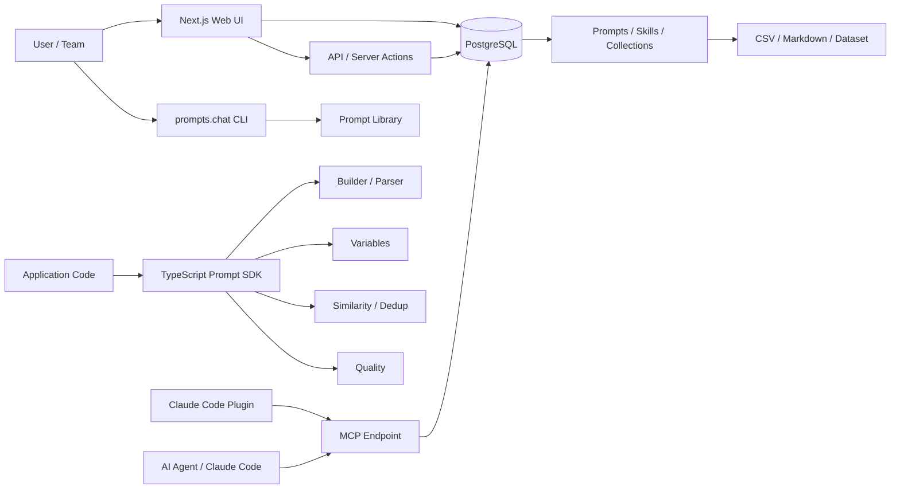

# prompts.chat

> 단순 프롬프트 모음에서 출발해, 프롬프트를 검색·공유·관리하고 CLI·MCP·Claude Code·TypeScript API로 재사용할 수 있게 만든 오픈소스 Prompt Infrastructure 플랫폼.

## 프로젝트 개요

prompts.chat은 과거 **Awesome ChatGPT Prompts**로 알려졌던 프로젝트다. 현재는 ChatGPT 전용 프롬프트 목록을 넘어 ChatGPT, Claude, Gemini, Llama, Mistral 등 여러 모델에서 사용할 수 있는 공개 프롬프트 라이브러리와 이를 운영하기 위한 웹 애플리케이션을 함께 제공한다.

공식 저장소 기준 주요 제공 형태는 다음과 같다.

- 웹 기반 프롬프트 탐색·공유·컬렉션
- `prompts.csv`, `PROMPTS.md`, Hugging Face dataset 형태의 데이터
- `npx prompts.chat` 터미널 프롬프트 브라우저
- Claude Code plugin
- MCP server
- `prompts.chat` npm 패키지의 type-safe prompt builder/parser/quality 도구
- 조직 내부용 self-hosting 및 white-label 구성
- Prompt Engineering interactive book

2026-09-26 조사 시점 GitHub README는 143k+ stars를 표기하고 있다.

## 해결하려는 문제

프롬프트가 팀과 코드베이스 곳곳에 문자열로 흩어지면 다음 문제가 발생한다.

1. 좋은 프롬프트를 다시 찾기 어렵다.
2. 팀원별 작성 형식이 달라 일관성이 떨어진다.
3. 변수 표기, 출력 구조 등의 오류가 런타임까지 발견되지 않는다.
4. 비슷한 프롬프트가 중복 생성된다.
5. Chat UI, CLI, Coding Agent 등 실행 환경마다 프롬프트를 다시 복사해야 한다.
6. 사내 프롬프트를 외부 SaaS에 저장하기 어려운 조직은 별도 관리 시스템이 필요하다.

prompts.chat은 **Prompt Library + Registry + Distribution + SDK**를 한 프로젝트로 묶어 이 문제를 해결하려 한다.

## 핵심 기능

### 1. 공개 Prompt Library

커뮤니티 프롬프트를 웹에서 검색하고 공유할 수 있다. 데이터는 CSV/Markdown/Hugging Face Dataset 형태로도 접근할 수 있어 단순 웹 서비스에 종속되지 않는다.

### 2. CLI

`npx prompts.chat`으로 터미널에서 프롬프트를 검색하고 선택할 수 있다.

주요 동작:

- 검색
- 페이지 탐색
- 변수 입력 후 복사
- raw prompt 복사
- 브라우저 열기
- ChatGPT/Claude 등에서 실행

Coding Agent 작업 중 브라우저를 왕복하지 않고 프롬프트를 찾는 용도로 의미가 있다.

### 3. MCP Server

Remote MCP endpoint:

```text
https://prompts.chat/api/mcp
```

로컬 실행도 지원한다.

```text
npx -y prompts.chat mcp
```

저장소의 MCP 구현은 DB와 연결되어 있으며 프롬프트뿐 아니라 Skill 관련 데이터도 다룬다. MCP URL에 사용자나 카테고리 필터를 적용하는 UI/문서도 존재한다.

### 4. Claude Code Plugin

저장소에 Claude Code용 plugin이 별도로 포함되어 있다.

구조상 plugin manifest, MCP 설정, commands 등을 묶으며 기본 MCP 설정은 prompts.chat의 remote MCP endpoint를 가리킨다.

즉 Claude Code 안에서 프롬프트/Skill 저장소를 탐색하는 배포 계층 역할을 한다.

### 5. TypeScript Prompt Builder

npm 패키지 `prompts.chat`은 단순 데이터 클라이언트가 아니라 Prompt SDK에 가깝다.

지원 범위:

- structured text builder
- chat builder
- image prompt builder
- video prompt builder
- audio/music prompt builder
- variable detection/normalization
- prompt similarity/deduplication
- local quality validation
- YAML/JSON/Markdown/plain-text parser
- template 제공

예를 들어 role/context/task/constraints/output/variables/examples를 fluent API로 구성할 수 있다.

### 6. Self-hosting

`npx prompts.chat new my-prompt-library`로 별도 인스턴스를 scaffold할 수 있다.

Docker Compose 및 pre-built image도 지원한다. PostgreSQL을 사용하며 GitHub/Google/Azure AD 인증, branding/theme/features 등을 설정할 수 있다.

이 기능 때문에 prompts.chat은 공개 prompt 사이트뿐 아니라 **사내 Prompt Registry 후보**로도 볼 수 있다.

## 아키텍처

저장소 내부 문서와 소스 구조를 종합하면 핵심 애플리케이션은 다음 형태다.



### Web application

프로젝트 내부 가이드 기준:

- Next.js 16 App Router
- React 19
- TypeScript
- PostgreSQL
- Prisma
- NextAuth
- next-intl
- Tailwind CSS
- React Hook Form + Zod

주요 디렉터리는 `src/app`, `src/components`, `src/lib`이며 AI integration, auth, plugin 계층을 별도 lib로 관리한다.

### 데이터 흐름

공개 사이트에서는 사용자가 프롬프트를 추가하고 데이터가 서비스 DB에 관리되며, 저장소에는 `prompts.csv` 및 `PROMPTS.md` 같은 소비 가능한 데이터 형태도 제공된다.

Agent 측에서는 웹 UI를 거치지 않고 MCP/Claude plugin을 통해 라이브러리에 접근할 수 있다.

Application 개발자는 npm SDK를 사용해 프롬프트를 구조적으로 생성·검증·파싱할 수 있다.

## 장점

### Prompt를 실행 환경과 분리할 수 있음

프롬프트를 특정 Chat UI 안에만 저장하지 않고 데이터/API/MCP/CLI 형태로 사용할 수 있다. Agent Harness에서 재사용 가능한 Prompt Registry를 구성할 때 유리하다.

### Self-hosting

사내 프롬프트나 업무 지침을 외부 공개 서비스에 두기 어려운 환경에서 독립 인스턴스를 만들 수 있다.

### MCP와 Coding Agent 연결

Prompt library를 사람이 검색하는 웹사이트에서 끝내지 않고 Agent가 직접 조회할 수 있는 리소스로 만든 점이 중요하다.

### SDK의 범위가 넓음

Builder뿐 아니라 variables, similarity, quality, parser가 있어 프롬프트 작성 규칙을 코드 수준에서 표준화하기 쉽다.

### 데이터 이동성이 높음

CSV, Markdown, dataset 등의 형태를 제공하므로 특정 UI에 완전히 잠기지 않는다.

## 단점 및 한계

### 공개 Prompt 품질은 균일하지 않음

커뮤니티 Prompt Library의 규모 자체가 품질을 보장하지 않는다. 모델 버전과 작업 환경이 달라지면서 오래된 prompt pattern이 오히려 불필요하거나 역효과를 낼 수도 있다.

따라서 공개 prompt는 그대로 복사하기보다 참고 자료 또는 seed로 사용하는 편이 안전하다.

### Prompt Builder가 모델 동작을 보장하지는 않음

Type safety와 구조화는 개발 경험을 개선하지만 실제 모델 응답 품질은 모델, context, tool, system instruction 등에 좌우된다.

SDK의 `quality.check` 결과 역시 실제 task benchmark를 대신할 수 없다.

### Prompt 중심 추상화의 한계

현대 Coding Agent는 prompt 하나보다 repository context, skill, tool, memory, runtime policy, verification loop가 더 중요해지고 있다.

따라서 Harness 전체를 prompts.chat으로 대체하기보다는 **Prompt/Skill Registry 계층**으로 사용하는 것이 적절하다.

### 운영 요소

Self-hosting 시 PostgreSQL, 인증, 업데이트, 백업, 권한 관리가 추가된다. 조직 규모가 작고 프롬프트 수가 적다면 Git repository만으로 관리하는 편이 단순할 수 있다.

### 보안

사내 Prompt Registry로 사용할 경우 prompt 안에 credential, 내부 URL, 고객 데이터 등이 들어가지 않도록 별도의 정책이 필요하다. MCP로 Agent가 접근할 경우 읽기 범위와 API key 관리도 검토해야 한다.

### 현재 확인되는 이슈

2026년 GitHub issue에는 MCP endpoint와 Next.js 16 response realm 관련 문제, Docker 초기 실행 문제, taxonomy/tag 관련 개선 요청 등이 확인된다. 따라서 self-host/MCP 도입 전 현재 버전의 issue와 release 상태를 다시 확인하는 것이 좋다.

## 활용 사례

### 개인 Prompt Knowledge Base

반복해서 사용하는 조사, 코드 리뷰, 설계, 문서화 prompt를 중앙 저장소에서 검색하고 CLI/MCP로 불러온다.

### 팀 내부 Prompt Registry

Self-hosted 인스턴스를 구축하고 GitHub/Google/Azure AD 인증을 연결해 팀 전용 prompt library로 운영한다.

### Coding Agent의 Prompt/Skill Discovery

Claude Code 또는 MCP client가 필요한 작업에 맞는 prompt/skill을 검색하고 불러오는 구조를 만들 수 있다.

### Prompt 품질 관리 파이프라인

SDK의 parser, variable normalization, similarity, quality 기능을 CI와 결합해 중복·형식 오류를 검사할 수 있다.

## 기존 방식과 비교

| 방식 | 강점 | 한계 |
|---|---|---|
| Markdown/Git 저장 | 단순, 변경 이력 명확 | 검색·실행·변수 처리 기능을 직접 만들어야 함 |
| ChatGPT/Claude 내부 Prompt | 사용이 간편 | 다른 모델/Agent로 이동·공유하기 어려움 |
| prompts.chat | Web + CLI + MCP + SDK + self-host를 통합 | 별도 플랫폼 운영 복잡도와 community prompt 품질 편차 |
| Agent Skill | 지침뿐 아니라 파일/스크립트까지 패키징 가능 | 단순 prompt 공유에는 무거울 수 있음 |

prompts.chat 자체도 Skill 영역을 확장하고 있어 Prompt Registry와 Skill Registry의 경계가 점차 가까워지는 모습이다.

## 활용 아이디어

### 바로 적용 가능 — 공개 Prompt/Skill 탐색

새로운 workflow를 설계할 때 prompts.chat을 참고 데이터베이스로 사용한다.

특히 반복 작업을 새로 설계할 때 처음부터 prompt를 작성하기보다 기존 패턴을 조사하는 용도로 가치가 있다.

### PoC 가치 있음 — 개인 AI Workspace용 Prompt Registry

현재 AI Wiki가 **기술 지식 저장소** 역할을 한다면 prompts.chat은 **실행 가능한 prompt/skill 저장소** 역할로 분리할 수 있다.

예:

```text
AI Wiki
  └─ 조사 / 설계 / 운영 지식

Prompt Registry
  ├─ coding
  ├─ research
  ├─ review
  ├─ planning
  └─ perforce / ue5 workflows
        ↓
     MCP
        ↓
Claude Code / Codex / Agent Harness
```

이 구조는 문서 지식과 실행 지침을 분리하면서 Agent가 필요한 지침만 조회하게 할 수 있다는 점에서 PoC 가치가 있다.

### PoC 가치 있음 — Prompt CI

팀에서 관리하는 prompt를 parser로 읽고 다음 검사를 자동화할 수 있다.

- 필수 변수 존재 여부
- 변수 표기 통일
- 유사 prompt 중복 탐지
- 구조 validation
- 기본 quality lint

단, 최종 품질 평가는 실제 task benchmark와 함께 해야 한다.

### 아이디어 참고 — Code Virtualization/Harness와 결합

Harness가 작업 유형을 판단한 뒤 Prompt Registry에서 필요한 지침만 MCP로 가져오는 구조를 고려할 수 있다.

핵심은 모든 prompt를 항상 context에 넣지 않고 **필요한 순간에 retrieval**하는 것이다. 이는 context 절약 관점에서도 연구 가치가 있다.

## 실무 평가

prompts.chat의 가장 흥미로운 부분은 방대한 공개 prompt 목록 자체보다 **프롬프트를 관리 가능한 개발 자산으로 취급하기 시작했다는 점**이다.

특히 다음 조합이 실무적으로 의미 있다.

```text
Prompt/Skill Registry
        +
      Search
        +
       MCP
        +
 Coding Agent / Harness
```

개인 사용에서는 공개 라이브러리와 CLI만으로도 충분하지만, 조직/Agent 환경에서는 self-hosting + MCP + SDK가 핵심이다.

반대로 수십 개 정도의 prompt만 관리한다면 별도 서버를 운영할 이유가 크지 않다. Git + Markdown + Agent Skill 구조가 더 단순하다.

## 결론

prompts.chat은 더 이상 단순한 “좋은 ChatGPT 프롬프트 모음”으로 평가하기 어렵다. 현재 형태는 **Prompt/Skill을 발견하고, 저장하고, 구조화하고, Agent에 배포하기 위한 오픈소스 인프라**에 가깝다.

AI Harness 관점에서는 실행 엔진 자체라기보다 **Harness가 필요할 때 지침을 조회하는 Registry/Distribution 계층**으로 보는 것이 가장 유용하다.

개인/팀 Harness를 설계할 때 특히 참고할 부분은 다음 세 가지다.

1. Prompt/Skill을 중앙 registry로 관리하는 구조
2. MCP를 통한 on-demand retrieval
3. parser/similarity/quality를 이용한 Prompt CI

전체 플랫폼 도입보다 이 세 패턴을 기존 workflow에 선택적으로 가져오는 방식이 우선적인 PoC 후보이다.

## 참고 자료

- https://github.com/f/prompts.chat
- https://prompts.chat/
- https://github.com/f/prompts.chat/blob/main/packages/prompts.chat/README.md
- https://github.com/f/prompts.chat/blob/main/CLAUDE-PLUGIN.md
- https://github.com/f/prompts.chat/blob/main/DOCKER.md
- https://github.com/f/prompts.chat/issues
