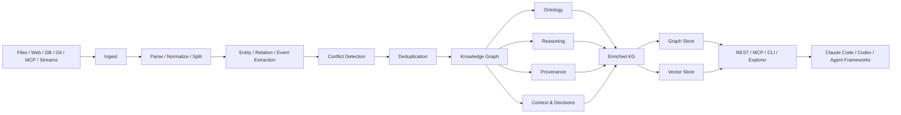
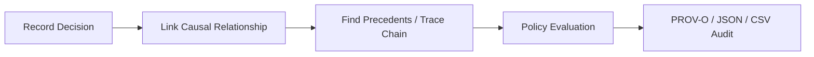
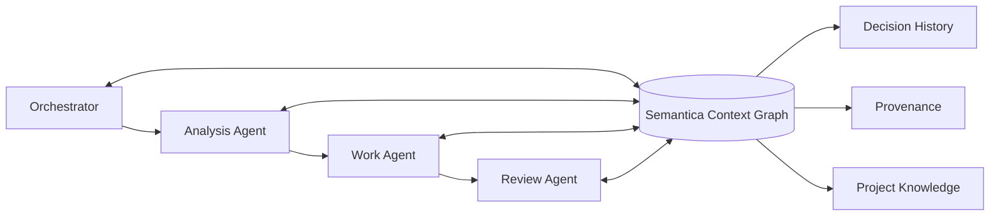

# Semantica

> 단순 Vector RAG를 넘어, AI Agent가 사용하는 지식·관계·결정·근거를 Context Graph로 구조화하고 추적 가능한 reasoning/provenance 계층을 제공하는 오픈소스 graph-native AI infrastructure.

## 프로젝트 개요

Semantica는 LLM이나 Agent Framework 자체가 아니라 그 아래에 배치하는 **Context / Knowledge Infrastructure**다. 문서·DB·웹·스트림·Git·MCP 등의 데이터를 수집하고 엔티티/관계/이벤트를 추출해 Knowledge Graph를 만든 뒤, ontology, deterministic reasoning, provenance, temporal intelligence, decision intelligence를 결합한다.

LangChain/LlamaIndex/Agno/CrewAI 등을 대체하기보다는 이들이 사용하는 context를 더 구조적이고 감사 가능하게 만드는 계층에 가깝다. MIT 라이선스이며 self-hosting과 backend 교체를 지향한다.

조사 기준 최신 릴리스는 v0.6.5(2026-08-11)다.

## 해결하려는 문제

일반적인 Vector RAG는 embedding similarity에는 강하지만 다음 질문에는 약하다.

- 어떤 정보와 어떤 정보가 실제로 연결되어 있는가?
- 이 사실은 어디에서 왔는가?
- 특정 결정은 어떤 근거와 선행 결정 때문에 내려졌는가?
- 서로 충돌하는 사실이 들어오면 어떻게 처리하는가?
- 특정 시점에 시스템이 알고 있던 사실은 무엇인가?
- 정책/규칙을 deterministic하게 검증할 수 있는가?

Semantica는 entity, relation, fact, decision, provenance를 graph의 first-class object로 만들어 이 문제를 해결하려 한다.

## 핵심 기능

1. **Context Graph / Knowledge Graph** — entity와 관계뿐 아니라 agent context와 decision history를 graph로 저장하고 traversal 가능.
2. **Knowledge Pipeline** — ingest → parse → normalize → split → entity/relation/event extraction → conflict detection → deduplication → KG construction.
3. **Deterministic Reasoning** — forward chaining, Rete, Datalog, SPARQL 기반 추론과 설명 경로.
4. **Provenance** — W3C PROV-O 기반 출처 및 변경/결정 추적.
5. **Decision Intelligence** — decision 기록, precedent 검색, causal chain, impact 분석, policy evaluation.
6. **Ontology / Governance** — OWL, SHACL, SKOS, ontology alignment/validation.
7. **Temporal Intelligence** — 과거 시점 snapshot 및 bi-temporal fact 처리.
8. **Polyglot Storage** — Neo4j/FalkorDB/AGE/Neptune 계열 LPG, Oxigraph/Blazegraph/Jena/RDF4J 계열 RDF, FAISS/Qdrant/Pinecone 등의 vector backend.
9. **Agent Integration** — MCP, REST API, CLI, Agno/CrewAI/LangChain integration과 Claude Code/Cursor/Codex 등의 plugin bundle.
10. **Knowledge Explorer** — graph, timeline, decision causal chain, entity resolution, ontology를 브라우저에서 탐색.

## 아키텍처

핵심은 Vector DB를 없애는 것이 아니라 **Graph + Vector를 함께 사용**한다는 점이다. similarity retrieval은 vector store가 담당할 수 있고, 관계 탐색·causal chain·provenance·rule reasoning은 graph/intelligence layer가 담당한다.

### Decision Intelligence 흐름

## MCP / Agent 활용

MCP 서버는 entity/relation extraction, decision 기록/검색, precedent 검색, causal chain 조회, KG node/edge 조작, reasoning, graph analytics, export/query 등의 기능을 agent tool로 노출한다.

따라서 Claude Code나 Codex 같은 coding agent에서 Semantica를 연결하면 단순한 `memory MCP`보다 강한 형태의 **structured project memory + decision provenance**를 구성할 수 있다.

예를 들어 다음 정보를 graph화할 수 있다.

- Repository / Module / Class 관계
- 설계 결정과 결정 근거
- Issue / ChangeList / Commit 관계
- 장애와 원인 및 해결 방법
- 팀 규칙과 예외
- Agent가 수행한 작업과 결과

## 장점

- Vector RAG가 놓치는 multi-hop 관계를 graph traversal로 표현 가능.
- 사실과 결정에 provenance를 붙여 AI 결과를 추적하기 좋다.
- 특정 LLM vendor에 강하게 묶이지 않는다.
- RDF/LPG/vector backend 선택지가 많아 기존 enterprise infra와 통합하기 좋다.
- deterministic reasoning과 policy validation을 LLM 추론과 분리할 수 있다.
- MCP/REST/CLI가 있어 기존 Agent Harness에 별도 SDK 종속 없이 연결 가능하다.
- temporal/decision intelligence가 일반적인 agent memory 프로젝트보다 훨씬 강하다.

## 단점 및 한계

- 단순 coding assistant memory 용도에는 지나치게 큰 스택일 수 있다.
- ontology/schema/entity resolution을 제대로 운영하려면 초기 모델링 비용이 발생한다.
- Graph DB + Vector DB + extraction pipeline을 함께 운영하면 인프라와 관측 복잡도가 증가한다.
- semantic extraction에 LLM을 사용할 경우 ingest 비용과 token 비용이 추가된다.
- graph가 커질수록 deduplication, conflict resolution, ontology 품질 관리가 별도의 운영 업무가 된다.
- repository의 자체 benchmark는 backend/hardware/dataset 의존성이 크므로 실제 사내 데이터로 재검증해야 한다.
- v0.6.5가 Explorer API의 인증 누락과 Cypher injection 등 Critical 취약점을 수정한 보안 릴리스였으므로 이전 버전 사용은 피하는 것이 좋다.
- open issues에는 ontology write atomicity, provenance storage failure test coverage, Agno integration error handling 등 production 관점에서 확인할 항목이 남아 있다.

## 성능

프로젝트가 공개한 v0.5.0 benchmark는 118k-node graph에서 node search, embedding cache, semantic deduplication 등의 큰 개선을 보고한다. 다만 일부 수치는 자동 benchmark assertion이 아니라 changelog에 기록된 historical measurement이며, 프로젝트도 hardware/data/backend에 따라 결과가 달라진다고 명시한다.

따라서 도입 판단에서는 자체 benchmark보다 **실제 사내 graph 규모와 query pattern으로 PoC 측정**하는 편이 안전하다.

## 기존 방식과 비교

| 방식 | 강점 | 약점 | Semantica와의 관계 |
|---|---|---|---|
| Vector RAG | 구현 단순, semantic retrieval | 관계/근거/결정 추적 약함 | Semantica 내부에서도 vector retrieval을 함께 사용 |
| Plain Agent Memory | 대화/작업 기억 구현이 쉬움 | 구조·provenance·causal query 부족 | Semantica가 더 무겁지만 구조적 memory 제공 |
| Neo4j 직접 구축 | graph modeling 자유도 높음 | ingest/reasoning/provenance/agent integration 직접 구현 | Semantica는 이 상위 application/infrastructure layer 제공 |
| LangChain/LlamaIndex | Agent/RAG workflow 구성 | governance/decision provenance가 핵심은 아님 | 경쟁보다는 보완 관계 |

## 활용 사례

### Enterprise Agent Memory

Agent가 프로젝트의 문서만 검색하는 것이 아니라 설계 결정, 변경 이유, 담당 component, 장애 이력을 관계로 따라가게 할 수 있다.

### AI Code / DevOps Knowledge Graph

Repository → Project → Module → File → Symbol → ChangeList → Issue → Build → Incident 관계를 구축하면 코드와 운영 이력을 하나의 context graph로 연결할 수 있다.

### Audit 가능한 Agent Workflow

Agent가 중요한 작업을 수행할 때 입력 context, 적용 policy, 결정, 결과를 decision/provenance graph에 남겨 이후 원인 분석과 감사에 활용할 수 있다.

## 현재 AI Workflow와 결합 아이디어

### PoC 가치 높음 — ATOM의 Shared Memory / Decision Layer

현재의 Orchestrator → Analysis → Work → Review 구조에서 Semantica를 모델 실행기 자체로 쓰기보다 **공유 Context/Decision 계층**으로 배치하는 것이 적합하다.

Analysis Agent가 설계 결정을 기록하고 Work Agent가 그 결정을 조회하며 Review Agent가 코드 변경과 원래 결정/정책의 일치 여부를 검증하는 구조가 가능하다.

### PoC 가치 높음 — Perforce 기반 개발 지식 Graph

Git 중심 memory 도구보다 Perforce 환경에서는 직접 connector가 필요할 가능성이 높지만, P4 Changelist를 graph node로 모델링하면 가치가 크다.

예시 관계:

`Issue → CL → File → Symbol → Build → Crash → Fix CL`

이 구조는 Crash Butler, P4VCustom, TeamCity 데이터와 결합할 여지가 있다.

### 바로 전면 도입은 비추천

단순히 Claude Code가 과거 세션을 기억하게 하는 목적이라면 claude-mem류의 가벼운 memory layer가 구축/운영 비용 측면에서 더 적합하다. Semantica의 강점은 memory 자체보다 **관계 + provenance + temporal + decision reasoning**이 필요한 경우에 나타난다.

## 도입 판단

**평가: PoC 가치 높음 / 전면 도입은 요구사항 확인 후**

특히 다음 조건이면 검토 가치가 높다.

- 여러 Agent가 장기간 동일 프로젝트 context를 공유한다.
- 설계 결정과 코드 변경 이유를 추적해야 한다.
- Perforce/TeamCity/Issue/Crash 정보를 연결하고 싶다.
- Agent 행동을 audit하고 싶다.
- 단순 similarity RAG가 아니라 관계 기반 query가 필요하다.

반대로 개인 coding assistant의 session memory 정도가 목적이면 과도하다.

## 결론

Semantica는 또 하나의 Agent Framework라기보다 **Agent가 의존할 수 있는 graph-native context/decision infrastructure**다. 특히 Knowledge Graph, provenance, deterministic reasoning, temporal history, decision intelligence를 하나의 stack으로 묶었다는 점이 차별점이다.

현재 개발 생산성 환경에서는 `Claude/Codex를 Semantica 위에서 실행`하기보다는, **ATOM 및 사내 Agent Harness의 장기 공유 메모리·설계 결정·변경 이력 계층으로 Semantica를 붙이는 PoC**가 가장 현실적인 활용 방향이다.

## 참고 자료

- Repository: https://github.com/semantica-agi/semantica
- Architecture: https://github.com/semantica-agi/semantica/blob/main/ARCHITECTURE.md
- Releases: https://github.com/semantica-agi/semantica/releases
- Documentation: https://docs.getsemantica.ai/
