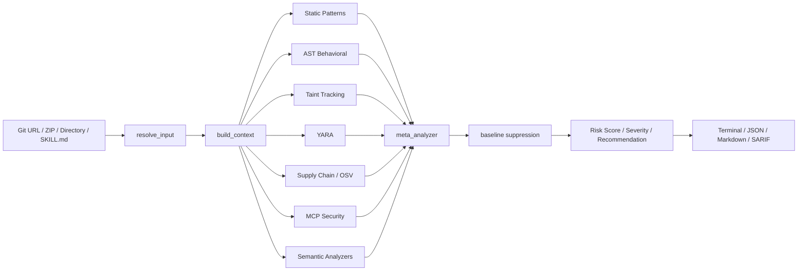
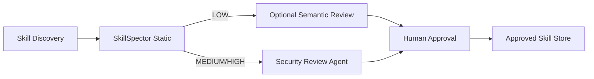

# NVIDIA SkillSpector

> Claude Code, Codex CLI, Gemini CLI 등의 Agent Skill을 설치하기 전에 정적 분석과 선택적 LLM 분석으로 악성 패턴·취약점·공급망 위험을 검사하는 NVIDIA의 오픈소스 보안 스캐너.

## 프로젝트 개요

SkillSpector는 Agent Skill을 신뢰하기 전에 검사하기 위한 보안 게이트다. Git repository, URL, ZIP, 디렉터리, 단일 파일을 입력으로 받아 취약 패턴을 분석하고 0~100 risk score, severity, 설치 권고 및 SARIF/JSON/Markdown/터미널 보고서를 만든다.

NVIDIA Verified Skills 파이프라인에서는 SkillEvaluator Tier 1 보안 검사 구성요소로 사용된다. 즉 단순 lint 도구라기보다 Agent Skill 공급망의 사전 검증 단계에 가깝다.

조사 기준: 2026-09-10, 최신 공개 릴리스 v2.11.2.

## 해결하려는 문제

Agent Skill은 자연어 지침뿐 아니라 script, command, tool/MCP 호출, 외부 URL 및 dependency를 포함할 수 있다. 사용자가 GitHub나 marketplace에서 Skill을 바로 설치하면 일반 패키지 의존성보다 더 넓은 권한을 에이전트에게 간접적으로 넘길 수 있다.

SkillSpector는 다음 질문에 답하려 한다.

- Skill 안에 prompt injection이나 anti-refusal 지침이 있는가?
- credential/environment data를 외부로 유출할 가능성이 있는가?
- shell/exec/subprocess 등 위험 실행 경로가 있는가?
- dependency에 알려진 취약점이 있는가?
- MCP tool description이나 권한 범위가 위험한가?
- 이전 검사 이후 MCP 정의가 바뀌는 rug-pull 형태가 있는가?
- 정적 패턴만으로 애매한 결과를 LLM이 의미적으로 재평가할 필요가 있는가?

## 핵심 기능

- Git URL, 파일 URL, ZIP, directory, `SKILL.md` 등 다중 입력 지원
- 17개 범주의 71개 취약 패턴 검사
- regex/YARA/Python AST/taint tracking 기반 정적 분석
- OSV.dev 기반 dependency CVE 조회 및 offline fallback
- MCP least privilege, tool poisoning, rug-pull 검사
- 선택적 LLM semantic/meta analysis
- 0~100 risk score와 LOW/MEDIUM/HIGH/CRITICAL severity
- SAFE/CAUTION/DO_NOT_INSTALL 권고
- Terminal, JSON, Markdown, SARIF 출력
- baseline/fingerprint 기반 false-positive suppression
- CLI, Python API, LangGraph workflow, MCP server 형태로 통합 가능
- ingest 100 MiB, ZIP 10,000 entries, 개별 분석 파일 1 MiB 등의 resource bound와 fail-closed 처리

## 아키텍처

SkillSpector 자체는 LangGraph workflow로 구성된다.



실행 흐름은 `resolve_input → build_context → parallel analyzers → meta_analyzer → report`다. Analyzer들은 fan-out으로 병렬 실행되고 결과를 `findings`에 모은 뒤 meta analyzer에서 LLM 기반 필터/보강을 수행한다. 마지막 report 단계에서 baseline suppression 후 risk score와 SARIF를 생성한다.

개발 문서 기준 analyzer node는 22개이며 pattern analyzer, AST behavioral analyzer, taint tracking, YARA, MCP analyzer, semantic analyzer 등으로 구성된다.

## LLM 사용 방식과 데이터 경계

LLM 분석은 선택 사항이다. `--no-llm`을 사용하면 Skill 내용 자체를 외부 모델로 보내지 않고 정적 분석만 수행할 수 있다. 다만 dependency 취약점 확인을 위한 OSV.dev 조회는 dependency 이름/버전을 외부로 전송한다.

LLM provider는 OpenAI, Anthropic, NVIDIA inference, Bedrock, 로컬/호환 endpoint 및 CLI provider 등을 지원한다. Claude CLI/Codex CLI provider는 기존 CLI 로그인 세션을 활용할 수 있다.

Enterprise/사내 코드에서는 먼저 `--no-llm`을 기본값으로 두고, 허가된 사내 inference endpoint가 있을 때 semantic scan을 추가하는 구성이 안전하다.

## MCP 통합

SkillSpector는 MCP server로 실행해 Claude Code/Codex/Gemini 등에서 `scan_skill`을 호출하는 runtime guardrail로 사용할 수 있다.

```text
Skill 발견
   ↓
SkillSpector MCP scan_skill
   ↓
Risk / safe_to_install 판단
   ├─ SAFE → 설치 후보
   ├─ CAUTION → 사람 검토
   └─ DO_NOT_INSTALL → 차단
```

HTTP transport 자체에는 인증이 없으므로 외부 인터페이스에 직접 노출하면 안 된다. 로컬 stdio 또는 localhost 사용을 우선하고 원격 노출 시 인증 reverse proxy 같은 별도 보호가 필요하다.

## 장점

### Agent Skill에 특화된 위협 모델

일반 SAST와 달리 prompt injection, system prompt leakage, memory poisoning, excessive agency, anti-refusal, MCP tool poisoning 등 Agent/LLM 특유의 위험을 직접 다룬다.

### 정적 분석 + 의미 분석 조합

정적 규칙은 빠르고 결정적이며 LLM 단계는 자연어 지침의 의도와 문맥을 평가한다. 둘을 결합해 단순 regex scanner보다 넓은 범위를 다룬다.

### CI/CD에 넣기 쉬움

SARIF/JSON, risk score, exit code, baseline 기능이 있어 GitHub Actions나 사내 CI에서 install/publish gate로 만들기 쉽다.

### Skill을 실행하지 않고 검사

검사 대상 Skill 자체를 실행하지 않는 정적 접근이라 설치 전 preflight 검사에 적합하다.

### MCP까지 검사 범위 확장

Skill 내부의 MCP 설정과 tool definition 변화까지 다루므로 Agent 공급망 검사의 범위가 넓다.

## 단점 및 한계

### Sandbox가 아니다

SkillSpector는 위험을 탐지하는 defense-in-depth 도구이지 실행을 격리하는 sandbox가 아니다. 검사를 통과했다고 Skill 실행이 안전하다는 보장은 없다.

### False Positive / False Negative

정적 패턴은 정상적인 shell/subprocess/security 문서도 위험 신호로 볼 수 있다. baseline 기능이 있지만 baseline을 무분별하게 누적하면 실제 신규 위험을 숨길 수 있다.

### LLM 분석 시 데이터 외부 전송

기본 LLM 분석에서는 analyzer 대상 파일 내용이 선택한 provider로 전달될 수 있다. 회사 내부 Skill이나 proprietary script에는 보안 정책 검토가 필요하다.

### 정적 분석의 근본적 한계

runtime behavior, binary/encrypted payload, 이미지 안의 공격 텍스트 등은 완전하게 분석할 수 없다. 비영어권 자연어 패턴 역시 탐지 정확도가 낮을 수 있다.

### Python 3.12+ 운영 부담

Windows 중심 사내 개발 환경에서는 Python runtime/uv/venv 또는 Docker를 별도로 관리해야 한다. 다만 Docker/CLI 형태로 CI runner에 격리하면 개발자 PC 의존성은 줄일 수 있다.

### Token/비용

정적 모드는 LLM token 비용이 없지만 semantic/meta 분석은 파일별 또는 chunk별 LLM 호출을 수행한다. Skill 수가 많아지면 batch scan 비용과 latency를 관리해야 한다.

## 활용 사례

### 사내 Skill Registry의 설치 게이트

외부 Skill을 사내 `.claude/skills`, Codex skill 디렉터리 등에 넣기 전에 자동 검사한다.

```text
External Skill Repo
      ↓
SkillSpector static scan
      ↓
Risk threshold
      ↓
Optional approved LLM scan
      ↓
Human review
      ↓
Internal approved skill registry
```

### PR 보안 검사

Skill 변경 PR에서 SARIF를 생성하고 신규 HIGH/CRITICAL finding이 있으면 merge를 막는다. 기존 허용 항목은 fingerprint baseline으로 관리한다.

### MCP 변경 감시

Skill에 포함된 MCP tool/manifest 변경을 검사해 권한 증가나 tool poisoning/rug-pull 위험을 검토한다.

## 기존 도구와 비교

| 구분 | SkillSpector | 일반 SAST | 수동 Skill 리뷰 |
|---|---|---|---|
| Prompt injection | 강점 | 거의 없음 | 가능 |
| AST 위험 코드 | 지원 | 강점 | 가능 |
| Dependency CVE | 지원 | 도구별 상이 | 어려움 |
| MCP 위험 | 지원 | 거의 없음 | 가능하지만 번거로움 |
| 자연어 의도 분석 | LLM 옵션 | 거의 없음 | 강점 |
| 자동 CI gate | 쉬움 | 쉬움 | 어려움 |
| Runtime 격리 | 없음 | 없음 | 없음 |

따라서 기존 SAST를 대체하기보다 Agent Skill 전용 preflight layer로 추가하는 것이 적절하다.

## 활용 아이디어

### 바로 적용 가능 — 로컬 Skill 설치 전 검사

현재 로컬에서 여러 Skill을 직접 만들어 사용하거나 외부 Skill을 가져오는 환경이라면 우선 정적 검사만 적용할 가치가 높다.

```bash
skillspector scan ./skills/my-skill --no-llm
```

외부 GitHub Skill도 설치 전에 URL을 직접 검사할 수 있다.

### 바로 적용 가능 — GitHub Wiki/Skill 조사 파이프라인 연결

새로운 Agent Skill repository를 조사할 때 문서 분석과 별개로 SkillSpector 결과를 보안 메타데이터로 남길 수 있다.

예: `Security: SkillSpector 18/100 LOW`, `LLM scan: disabled`처럼 기록하면 추천 여부 판단이 더 객관적이 된다.

### PoC 가치 높음 — 사내 Skill Registry Guard

Perforce/Git 환경과 무관하게 사내 Skill 배포 디렉터리 앞단에 scanner를 두는 방식이 좋다. TeamCity에서 Skill 패키징 전에 static scan → SARIF 보관 → threshold gate를 구성할 수 있다.

### PoC 가치 높음 — Claude Code/Codex 공통 보안 MCP

SkillSpector MCP를 로컬 guard service로 띄워 Claude Code와 Codex가 외부 Skill을 설치/복사하기 전에 동일한 검사 정책을 사용하도록 만들 수 있다.

### 아이디어 참고 — Harness의 Security Reviewer 역할

Orchestrator가 외부 Skill/Tool을 발견하면 SkillSpector를 deterministic security reviewer로 먼저 호출하고, 결과가 애매한 경우에만 고성능 Review Agent에게 넘기는 구조가 비용 효율적이다.



## 도입 평가

**평가: 바로 적용 가능 + 사내 배포 파이프라인은 PoC 가치 높음.**

특히 외부 Agent Skill을 자주 조사·설치하는 환경에서는 단순히 `SKILL.md`를 사람이 읽는 것보다 일관된 사전 검증 단계를 제공한다. 처음부터 LLM scan을 강제하기보다는 `--no-llm` 정적 검사를 기본으로 하고, MEDIUM 이상 또는 외부 배포 Skill에만 semantic review를 추가하는 계층형 정책을 권장한다.

## 결론

SkillSpector의 핵심 가치는 '좋은 Skill을 만들어주는 도구'가 아니라 **신뢰되지 않은 Skill을 설치하기 전에 검사하는 보안 게이트**라는 점이다. Agent Skill 생태계가 커질수록 npm/pip의 dependency scanning과 비슷한 역할이 필요해지는데, SkillSpector는 여기에 prompt/MCP/agent-specific threat model을 추가한다.

개인 개발 환경에서는 외부 Skill 설치 전 scanner로 바로 사용할 수 있고, 조직 환경에서는 TeamCity/GitHub Actions + SARIF + baseline + 승인된 LLM endpoint를 조합한 Skill supply-chain gate로 발전시키는 것이 가장 실용적이다.

## 참고 자료

- https://github.com/NVIDIA/SkillSpector
- https://docs.nvidia.com/skills/scanning-agent-skills
- https://docs.nvidia.com/skills/agent-skill-trust-pipeline
- https://github.com/NVIDIA/SkillSpector/releases
