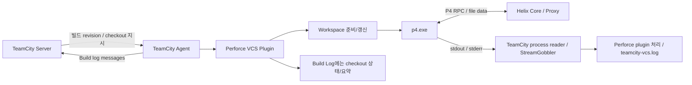
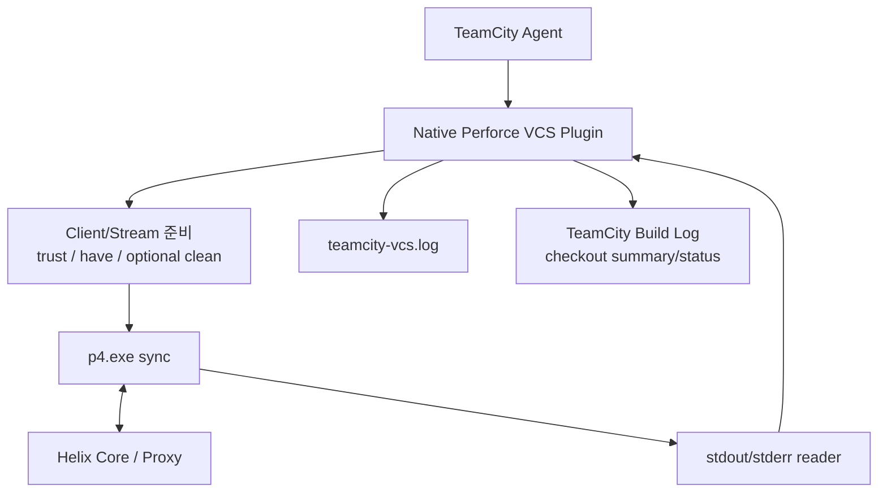
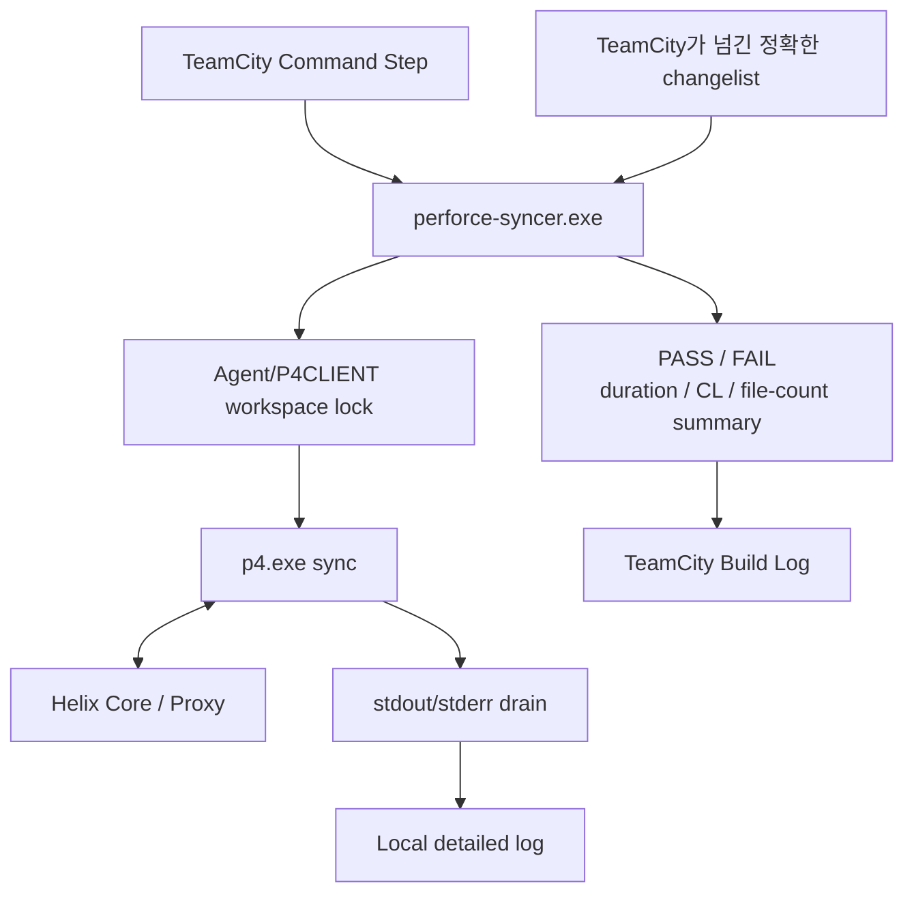
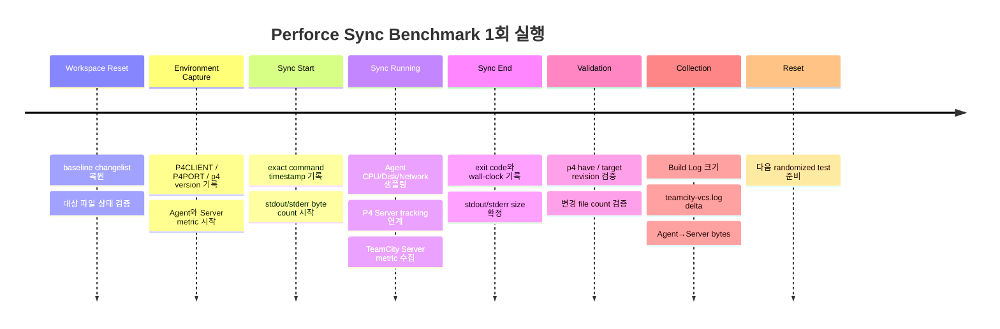

# TeamCity + Perforce `p4 sync` stdout/stderr 출력 처리 성능 오버헤드 심층 리서치

## Executive Summary

**조사 대상 가설**

> TeamCity가 Perforce `p4 sync` 중 발생하는 대량의 stdout/stderr 또는 파일 단위 진행 정보를 수집·가공하여 Build Log로 기록하는 과정이, 대규모 UE5 환경에서 `p4 sync` 전체 실행 시간을 유의미하게 늘리는가?

본 보고서의 결론은 이 가설을 **“부분 채택하되, 핵심 원인으로 단정해서는 안 된다”**이다.

표기법은 다음과 같다.

| 표기 | 의미 |
|---|---|
| **[확인]** | 공식 문서, JetBrains 답변/YouTrack, Perforce/Microsoft 문서에서 직접 확인 |
| **[추론]** | 확인된 구현·OS 동작으로부터 도출되는 합리적인 추론 |
| **[가설]** | 환경 의존성이 커서 실제 Agent에서 계측해야 확정 가능 |

가장 중요한 발견부터 요약하면 다음과 같다.

**[확인] TeamCity의 Agent-side Perforce checkout은 P4Java를 주 경로로 사용하는 구조가 아니라 실제 `p4.exe` CLI를 실행한다.** 현재 TeamCity 2026.1 문서는 Agent-side checkout에서 Perforce command-line client인 `p4.exe`의 경로를 지정하도록 하고, 별도로 TeamCity가 “corresponding `p4 sync` command”를 실행한다고 명시한다. `p4 clean`, `p4 have`, `p4 sync -p`, `p4 sync -f`, `p4 trust` 같은 명령도 공식 문서에 직접 등장한다. 따라서 최소한 Agent-side checkout의 실제 파일 동기화 경로는 CLI 기반이라고 보아도 된다. citeturn15view0turn15view1turn23search1

**[확인] TeamCity가 Native Perforce checkout 중 `p4 sync`의 stdout을 전혀 보지 않는 것도 아니다.** 2015년 JetBrains 지원 사례에는 `jetbrains.buildServer.StreamGobbler`가 `p4 ... sync`로부터 약 **10.49 MB**의 출력을 읽은 뒤 “too large output” 경고를 낸 실제 로그가 있으며, JetBrains는 이 문제를 피하려면 VCS Root의 sync option에 **`-q`를 추가하라**고 권고했다. 즉, 적어도 해당 구현에서는 `p4.exe` → pipe/stream → TeamCity reader라는 경로가 존재했다. citeturn11search0turn15view4

그러나 여기서 중요한 반전이 있다.

**[확인, 역사적] Native Perforce checkout에서 그 파일별 `p4 sync` 출력이 곧바로 TeamCity Build Log에 한 줄씩 전달되었다고 볼 근거는 없다. 오히려 반대 증거가 있다.** TeamCity 8.1 사용자가 “`p4 sync`/`p4 sync -f` 호출은 보이는데 파일 목록이 Build Log에 안 보인다”고 질문하자 JetBrains는 해당 출력을 Build Log에서 표시할 수 없으며, 필요하면 `p4` wrapper를 만들어 직접 stdout에 출력하라고 답했다. citeturn16search0

따라서 중앙 가설을 정확히 분해해야 한다.

> **Native TeamCity checkout의 `p4 stdout`을 TeamCity가 로컬 Agent에서 읽는 비용은 실제로 존재한다. 하지만 “수십만 파일의 `p4 sync` 출력이 모두 Build Log 메시지로 변환되어 Agent→Server로 실시간 전송되기 때문에 Native checkout이 느리다”는 더 강한 가설은 현재 증거로는 지지되지 않는다.**

현재 TeamCity 문서도 Perforce plugin 작업 자체는 `teamcity-vcs.log`에 기록된다고 설명하며, raw 파일별 sync 출력을 Build Log로 전달한다고 설명하지 않는다. citeturn23search1

반면 **Command Line Build Step에서 직접 `p4 sync`를 실행하면 상황이 전혀 다르다.** TeamCity 공식 문서상 Build Log는 빌드 중 시작된 프로세스의 console output을 capture하여 내부 형식으로 저장하며, Agent는 build log messages를 Server로 전송한다. 따라서 다음과 같은 Build Step은:

```text
p4 sync
```

파일별 출력이 많다면 실제로 **p4 → pipe → TeamCity Agent → build messages → TeamCity Server → build log storage** 경로를 타게 된다. TeamCity는 공식적으로 큰 Build Log가 Agent→Server 메시지 파이프라인을 포함한 인프라에 부담을 주므로 로그를 작게 유지하라고 권고하고 있으며, System Requirements에서는 일반적으로 수십 MB 이하, 가능하면 **10 MB 미만**을 권장한다. citeturn15view2turn14search2

또 하나의 매우 중요한 반증 사례가 있다.

**[확인, 사용자 사례] 2023년 JetBrains Support에는 `p4 ... sync -q -f --parallel=threads=12`를 TeamCity Command Line Step에서 실행하면 직접 실행할 때보다 약 3배 느리고, Native VCS checkout도 비슷하게 느렸다는 사례가 있다.** 이 사례는 TW-83560으로 이관됐다. 이미 `-q`를 사용하고 있었기 때문에 적어도 이 사례의 **3× 차이를 대량 stdout만으로 설명할 수는 없다.** citeturn16search3turn17search0

이것은 이번 조사의 가장 강력한 반증 자료 중 하나다.

### 종합 판정

| 질문 | 조사 결과 | 신뢰도 |
|---|---|---:|
| TeamCity가 Native Perforce checkout에서 `p4.exe`를 실행하는가? | **그렇다.** | 매우 높음 |
| P4Java가 Native sync의 주 경로인가? | **그렇다는 증거 없음. 공식 자료는 CLI를 가리킨다.** | 높음 |
| TeamCity가 `p4 sync` stdout을 읽는가? | **그렇다. 적어도 실제 StreamGobbler 사례가 존재한다.** | 높음 |
| Native checkout의 파일별 stdout이 모두 Build Log로 전송되는가? | **역사적 증거는 오히려 아니라고 한다. 현행 정확한 구현은 버전별 실측 필요.** | 중상 |
| 대량 stdout 자체가 sync를 늦출 수 있는가? | **그렇다.** Windows pipe backpressure와 처리 비용상 가능하다. | 높음 |
| `p4 -q sync`가 `>NUL`보다 근본적으로 유리한가? | **대체로 그렇다.** `-q`는 출력 생성 자체를 억제하고, NUL은 생성 후 버린다. | 중상 |
| TeamCity Build Log가 지나치게 크면 성능 문제가 있는가? | **공식 문서와 YouTrack 모두 그렇다고 확인한다.** | 매우 높음 |
| 이것만으로 Native checkout의 체감 차이를 설명할 수 있는가? | **아니다.** | 높음 |
| 100k 파일 cold sync에서 예상 로그 효과 | **대부분의 경우 0~5% 수준일 가능성이 높다는 사전 추정. 단, 실측 전 확정 불가.** | 낮음~중간 |
| 빠른 LAN/Proxy + 많은 작은 파일 + 10k~100k 변경에서 | **수 %~10%대가 될 가능성이 있으며, Build Log까지 전달되면 더 커질 수 있음.** | 중간 이하 |
| pipe/server가 실제로 막히는 병적 상황 | **수십 % 이상 또는 stall까지 가능.** | 중간 |
| 별도 `perforce-syncer`가 합리적인가? | **그렇지만 우선 `-q`와 Plugin overhead를 분리 측정한 후 결정하는 것이 맞다.** | 높음 |

여기서 제시한 `0~5%`, `수 %~10%대`는 **공개된 TeamCity+Perforce 벤치마크 수치가 아니라 이번 아키텍처 분석을 기반으로 한 사전 engineering prior**이다. 실제 결과로 취급해서는 안 된다. 공개 자료에서는 이 질문에 대한 범용 `%` 벤치마크를 발견하지 못했다.

## 핵심 결론

### 핵심 가설은 세 개의 서로 다른 비용으로 분리해야 한다

**[추론] “TeamCity 로그 오버헤드”를 하나로 취급하면 원인을 잘못 찾기 쉽다.** 실제 경로에는 최소한 다음 세 층이 있다.

| 비용 | 발생 위치 | Native Perforce Checkout | Command Line `p4 sync` |
|---|---|---:|---:|
| P4가 파일별 문자열을 생성·format하는 비용 | `p4.exe` | 있음, `-q`로 감소 | 있음, `-q`로 감소 |
| stdout/stderr pipe를 TeamCity가 drain/capture하는 비용 | Agent | **있다는 직접 증거 있음** | 있음 |
| 각 라인을 Build Log 메시지로 만들어 Server까지 보내는 비용 | Agent + Network + Server | **파일별 전달 여부는 입증되지 않음; 역사적으로는 파일 목록 미표시** | **일반 Build Step 출력이므로 있음** |

이 구분이 이번 조사의 핵심이다. citeturn11search0turn16search0turn15view2turn14search2

### Native checkout에서 가장 먼저 시험해야 할 것은 Plugin 우회가 아니라 `-q`

**[확인] Perforce는 quiet 옵션을 제공하고 `p4 sync` 자체도 `-q`를 지원한다.** Perforce 문서는 scripting 사례에서 sync 결과가 수천 줄이 될 수 있다고 직접 경고하고 있다. TeamCity 역시 과거 10 MB가 넘는 sync output을 읽은 사례에서 바로 `-q`를 권고했다. citeturn24view4turn24view5turn8search0turn11search0

따라서 Native VCS Root에서:

```text
Extra sync options:
-q
```

와 동일한 quiet sync를 적용한 A/B 비교는 매우 가치가 높다.

**[추론] 이 테스트는 한 번에 두 비용을 줄인다.**

`p4`의 파일별 informational-message 생성/formatting 비용과 TeamCity의 pipe/StreamGobbler 처리량 모두 줄어든다.

반면:

```bat
p4 sync > NUL
```

은 `p4`가 정상 출력 자체를 생성하는 작업까지 없애지는 않는다. 단지 OS가 그 바이트의 최종 목적지를 NUL device로 바꾼다. 따라서 출력 자체의 비용을 제거하는 목적에서는 일반적으로 `-q`가 더 깨끗한 실험이다. Perforce가 quiet 모드에서 정상 informational output을 억제한다는 점과 Windows에서 redirected handle은 console handle과 다른 I/O 경로를 사용한다는 점이 이 추론을 뒷받침한다. citeturn8search0turn24view2turn24view3

### 하지만 `-q`로 빨라져도 “Build Log가 원인”이라고 할 수는 없다

이 역시 중요하다.

Native checkout에서:

```text
default sync → 120 sec
sync -q     → 108 sec
```

가 나온다고 하자.

이 결과로 확정할 수 있는 것은:

> **stdout 생성 + pipe/capture 관련 경로에 12초가 있었다.**

이지,

> **12초가 Agent→Server Build Log 전송이었다.**

가 아니다.

역사적으로 Native Perforce checkout은 파일별 목록을 Build Log에 표시하지 않았기 때문이다. citeturn16search0turn11search0

### 반대로 TeamCity Command Line Step에서는 로그 전송 가설이 훨씬 강하다

다음은 명확히 다른 실험이다.

```text
TeamCity Build Step
    p4 sync
```

TeamCity는 빌드 중 프로세스 output을 capture하여 Build Log에 저장한다. Server Requirements 문서 역시 Agent network traffic에 “sending build log messages back to the server”를 직접 포함한다. citeturn15view2turn14search2

따라서 아래 두 실행 사이에 큰 차이가 난다면:

```bat
p4 sync
```

```bat
p4 sync > NUL 2>&1
```

Command Line Step에 대해서는 **Build Log 처리 비용**이라는 해석이 훨씬 설득력 있다.

### `3×` 정도의 차이를 로그만으로 예상해서는 안 된다

2023년 사례가 특히 중요하다.

보고자는 다음 명령을 TeamCity Command Line Step에서 돌렸다.

```text
p4 -c workspace_name -p ssl:server.address:1666 sync -q -f --parallel=threads=12
```

이미 `-q`이고, Native VCS Root도 유사하게 느렸는데 direct 실행보다 약 **3배** 느렸다고 보고했다. JetBrains는 이 사례를 TW-83560으로 추적했다. citeturn16search3turn17search0

**[추론] 따라서 TeamCity 내외 차이가 2×~3×처럼 매우 크다면 가장 먼저 의심해야 할 것은 raw stdout 양이 아니다.**

그 경우에는 다음 계층도 동시에 분리해야 한다.

```text
Windows service account / session
P4 환경변수와 P4CONFIG
P4 executable/version
P4CLIENT spec
p4 -f 여부
parallel 설정
workspace reuse 여부
TeamCity native pre/post operations
Defender/AV 정책
Agent Java process 아래에서 실행되는 child process 환경
P4 server/proxy/cache 상태
```

이 항목들은 현재 상황에서 가능한 **[가설]**이며, 각각 동일 조건 benchmark로 검증해야 한다.

## TeamCity Perforce Checkout 내부 동작

### Agent-side checkout은 실제 `p4.exe` 경로다

**[확인] 현행 TeamCity 2026.1 문서는 새 configuration에서 Agent-side checkout을 선호하는 것이 기본이고, Perforce Agent checkout을 위해 Agent에 command-line client가 필요하다고 설명한다.** Perforce 설정에는 아예 “P4 path on the build agent — path to the Perforce command-line client (`p4.exe`)" 필드가 있다. citeturn23search0turn15view0

또한 TeamCity의 Perforce integration 문서는 Agent-side checkout을 할 때 전용 Perforce workspace를 준비하고 **`p4 sync`를 실행한다**고 명시한다. citeturn23search1

따라서 Native checkout의 핵심 흐름은 다음과 보는 것이 타당하다.



마지막 `p4 raw output → Build Log` 부분은 일부러 직접 연결하지 않았다. **그 경로가 Native checkout의 파일별 출력에 대해 현행 버전에서 존재한다고 확인되지 않았기 때문이다.** 역사적 JetBrains 답변에서는 파일 목록이 Build Log에 노출되지 않았다. citeturn16search0

### P4Java 여부

**[확인] Perforce에는 P4Java API 자체가 존재하지만, 이번 조사에서 TeamCity의 Agent sync가 P4Java를 사용한다는 근거는 찾지 못했다.** 반대로 TeamCity가 Agent와 Server 모두에서 `p4` binary를 요구하고 `p4 sync`, `p4 clean`, `p4 have`, `p4 trust` 등을 명시적으로 실행한다는 자료는 충분하다. citeturn15view0turn23search1

따라서 정확한 표현은:

> **[확인] Agent-side source synchronization은 CLI 기반이다.**
>
> **[미확인] Perforce plugin의 모든 보조 operation이 100% CLI뿐이라고 소스 코드 수준에서 단언하지는 않는다.**

이번 조사에서는 JetBrains가 공개한 저장소에서 현행 TeamCity Perforce plugin 전체 구현 소스를 확보하지 못했기 때문에, stdout reader의 2026.1 exact implementation까지 source-level로 확정하지는 않았다. 대신 공식 문서, JetBrains Support의 stack/class명과 YouTrack을 교차 검증했다.

### Native checkout에서 추가되는 작업

TeamCity Native checkout을 단순히:

```text
p4 sync
```

와 동일하게 비교해서는 안 된다.

현행 문서에서 확인되는 추가 동작은 다음과 같다.

| 작업 | 상태 | 성능 의미 |
|---|---|---|
| Perforce workspace 생성 또는 갱신 | **[확인]** | Client spec 처리/RPC 추가 |
| client/stream mapping 반영 | **[확인]** | Mapping 변경 시 동작량 증가 가능 |
| 기본적으로 incremental `p4 sync` | **[확인]** | 일반적으로 효율적 |
| Clean checkout에서 `p4 sync -f` | **[확인]** | 대규모 workspace에서 매우 큰 차이 가능 |
| 선택적으로 `p4 clean` | **[확인]** | 파일시스템 scan 비용 추가 |
| have-list 사용 시 `p4 have` | **[확인]** | 추가 P4 query |
| “Skip have list update” 시 `p4 sync -p` | **[확인]** | 동작 의미 자체가 달라짐 |
| SSL checkout 때 `p4 trust` | **[확인]** | 매 checkout 추가 command |
| custom Client reuse | **[확인]** | `teamcity.perforce.agent.reuse.client=true` 조건부 지원 |
| revision/change 정보 수집은 Server에서 수행 | **[확인]** | Agent sync와 별도의 P4 workload |

citeturn15view0turn15view1turn23search0

특히 사용자의 환경처럼 persistent workspace가 중요한 경우 `teamcity.perforce.agent.reuse.client=true`는 조사 가치가 높다. 현재 TeamCity는 Client 방식과 default checkout rules 조건에서 기존 지정 client를 재사용할 수 있다고 문서화한다. citeturn15view0

### `p4 sync -f`는 로그보다 훨씬 큰 변수일 수 있다

**[확인] TeamCity는 정상 Agent checkout에서 incremental `p4 sync`를 사용하지만, clean checkout에는 보통 `p4 sync -f`가 연관된다.** 현재 버전에서는 interrupted checkout 후 무조건 다음 build를 clean checkout하지 않도록 개선돼 있지만, 과거에는 이것이 실질적인 문제였다. citeturn15view1

실제 JetBrains Support 사례에서는 수백 GB 규모 Perforce 프로젝트가 TeamCity의 `sync -f` 때문에 전체를 다시 받아 **수 시간**이 걸렸고, 당시 JetBrains가 manual checkout을 workaround로 안내하기도 했다. 이 사례의 exact behavior는 현행 버전과 같지 않지만, **force sync 여부가 stdout 최적화보다 훨씬 큰 변수일 수 있음**을 보여준다. citeturn16search8

따라서 Native와 CLI 비교 시 반드시 실제 실행 command가 다음 수준까지 동일한지 확인해야 한다.

```text
revision
-f
-p
-q
--parallel
file/path specs
client name
P4PORT
P4USER
charset
retry options
```

### 여러 Stream/Depot 경로를 같은 Client로 쓰는 현재 구조

**[추론] 하나의 Agent에 지속적인 P4 client를 유지하고 여러 Sandbox/Lib path를 같은 client mapping에 포함하는 구조 자체는 이번 로그 가설을 방해하지 않는다.** 다만 benchmark에서는 TeamCity가 그 client spec을 다시 수정하는지와 실제 sync file specification을 별도 기록해야 한다.

특히 여러 Build Configuration이 동일 client와 같은 local files를 재사용한다면, external syncer를 도입할 경우 **workspace 단위의 exclusive lock**이 반드시 필요하다. 두 build가 동시에 같은 client have-list와 local files를 다른 changelist로 움직이면 stdout 성능보다 더 심각한 correctness 문제가 생길 수 있다. 이것은 **[아키텍처 추론]**이다.

## `p4 sync` stdout/stderr 성능 분석과 TeamCity Build Log 처리 비용

### `p4 sync`는 파일 수가 많으면 출력 자체도 커진다

Perforce의 현행 `p4 sync` 문서는 `-q`를 지원하며, scripting 설명에서 제한하지 않은 sync preview는 **수천 줄의 output**을 만들 수 있다고 명시한다. 또한 일반 sync는 workspace에 필요한 파일을 하나씩 처리한다. citeturn24view4turn24view5

따라서 **[추론] 출력량은 전체 workspace 파일 수보다 “이번 명령이 실제로 보고하는 파일 수”에 더 직접적으로 비례한다.**

즉:

```text
Workspace = 500,000 files
Actual changes = 100 files
```

이라면 일반 incremental sync의 출력 부담은 500,000줄이 아니라 대체로 변경/처리되는 파일 수에 가까운 수준이다.

반대로:

```text
p4 sync -f
Cold Sync
100,000 changed files
```

이면 파일별 결과가 100k 규모가 될 수 있다.

평균 한 줄을 단순히 **80~200 bytes**라고 가정하면 다음 정도다. 이는 benchmark 전 계산용 가정값이다.

| 실제 출력 line 수 | 예상 raw text |
|---:|---:|
| 100 | 약 8~20 KB |
| 1,000 | 약 80~200 KB |
| 10,000 | 약 0.8~2 MB |
| 100,000 | 약 8~20 MB |
| 500,000 | 약 40~100 MB |

100k 파일이면 TeamCity가 권장하는 “가능하면 Build Log 10 MB 미만” 영역을 쉽게 넘길 수 있다. **단, 이는 해당 출력이 실제 Build Log로 전달되는 Command Line Step에서는 직접적인 의미가 있지만 Native checkout에는 그대로 적용하면 안 된다.** citeturn14search2turn16search0

### 명령별 예상 차이

| 형태 | `p4`의 정상 출력 생성 | Console rendering | Pipe reader | Local disk log | TeamCity Build Log | 출력 경로만 본 예상 |
|---|---:|---:|---:|---:|---:|---|
| `p4 sync` 직접 console | 많음 | 있음 | 없음 | 없음 | 없음 | 높을 수 있음 |
| `p4 -q sync` | 매우 적음 | 거의 없음 | 없음 | 없음 | 없음 | **가장 낮은 축** |
| `p4 sync > NUL 2>&1` | 많음 | 없음 | 없음 | 없음 | 없음 | 낮음 |
| `p4 sync > sync.log 2>&1` | 많음 | 없음 | 없음 | 있음 | 없음 | 낮음~중간 |
| TeamCity Step `p4 sync` | 많음 | 없음 | 있음 | Server 저장 | 있음 | **중간~높음** |
| Native checkout default | 많을 수 있음 | 없음 | **있음** | plugin log 가능 | 파일별 전달은 미확인 | 낮음~중간 추정 |
| Native checkout `-q` | 매우 적음 | 없음 | 있음, 데이터 적음 | 적음 | 적음 | **낮음** |

**[추론] 최대 성능이 목적이면 일반적으로 `p4 -q sync`/`p4 sync -q`가 `>NUL`보다 더 좋은 candidate다.** NUL redirect는 출력 destination만 바꾸지만 quiet는 정상 informational output 자체를 억제하기 때문이다. citeturn8search0turn24view4

### Windows Console과 pipe는 동작이 다르다

Microsoft 문서에서 console handle은 `WriteConsole`/`WriteFile`로 screen buffer에 문자를 기록하는 경로이고, stdout이 파일이나 pipe로 redirect되면 일반 console handle과 다른 방식으로 처리된다. `WriteConsole`은 redirected standard handle에서는 사용할 수 없다. citeturn24view2

따라서:

```text
Interactive cmd.exe
   ↓
Windows Console renderer
```

와:

```text
TeamCity Agent
   ↓
p4.exe
   ↓
anonymous pipe
```

는 동일한 출력 비용이 아니다.

흥미로운 점은 **console rendering 자체도 느릴 수 있기 때문에**, 사용자가 “직접 console 실행은 더 빠르고 TeamCity가 느리다”고 관찰했다면 console drawing은 오히려 TeamCity slowdown을 설명하지 못하는 방향의 변수라는 것이다.

### Windows pipe backpressure는 실제로 자식 프로세스를 정지시킬 수 있다

Microsoft의 anonymous pipe 문서는 매우 명시적이다.

**[확인] pipe buffer가 가득 찬 상태에서 writer가 추가 데이터를 쓰면 `WriteFile`은 reader가 데이터를 읽어 공간을 확보할 때까지 반환하지 않는다.** 또한 anonymous pipe의 read/write는 synchronous semantics를 가진다. citeturn24view1

따라서 이 구조에서:

```text
p4.exe
  │
  │ stdout/stderr
  ▼
[Windows Pipe]
  │
  ▼
TeamCity / wrapper
  │
  ├─ decode
  ├─ line split
  ├─ parse
  ├─ format
  └─ forward
```

reader가 충분히 빠르면 pipe 비용은 주로 memory copy, syscall, text decode 정도다.

하지만 reader가 다음 작업 때문에 느려지면:

```text
per-line parsing
TeamCity service-message 검사
message allocation
queue contention
network delivery
server backpressure
```

pipe가 차고 `p4.exe` 자체가 wait할 수 있다. 이는 **[확인된 Windows 메커니즘 + 합리적 추론]**이다. citeturn24view1

중요하게도 “Windows anonymous pipe buffer는 무조건 4 KB다/64 KB다” 같은 고정값을 전제로 해서는 안 된다. Microsoft 문서는 pipe 생성자가 buffer size를 지정한다고 설명한다. citeturn24view1

### stdout flush는 현재 확정할 수 없는 변수다

**[검증 필요] `p4.exe`가 sync 파일 결과마다 C stdio buffer를 flush하는지, chunk 단위로 쓰는지에 대한 현행 P4 CLI 내부 구현 자료는 이번 조사에서 찾지 못했다.**

따라서:

> “파일마다 flush하므로 100k syscall이 발생한다”

라고 단정하면 안 된다.

이것은 Windows Performance Recorder/ETW 또는 Process Monitor로 `WriteFile` 호출 수와 byte distribution을 측정하는 것이 가장 정확하다.

### `>NUL` 테스트에서는 stderr도 반드시 제어해야 한다

Windows에서는:

```bat
p4 sync > NUL
```

만으로 stderr까지 사라지는 것은 아니다. stdout과 stderr redirect는 별도다. Microsoft의 command redirection 문서도 이를 구분한다. citeturn24view3

따라서 benchmark용 discard test는:

```bat
p4 sync > NUL 2>&1
```

이어야 한다.

그리고 실제 원문의 테스트도 보존하기 위해:

```text
C1  p4 sync > NUL
C2  p4 sync > NUL 2>&1
```

을 한 번 비교하면 p4의 stderr 비중도 알 수 있다. 커뮤니티 사례에서는 일부 P4 메시지가 stderr로 나오는 동작이 보고되어 있다. citeturn25search5

### TeamCity Build Log pipeline에는 실제 비용이 있다

**[확인] TeamCity는 Build Log를 단순 terminal text가 아니라 hierarchical internal representation으로 저장한다.** 프로세스의 출력을 capture하고 build messages로 다룬다. citeturn15view2

**[확인] TeamCity 공식 System Requirements는 Agent 네트워크 트래픽의 주요 항목으로 Build Log message의 Server 전송을 꼽고 있으며, 많은 로그가 Server load 요인임을 명시한다.** citeturn14search2

**[확인] Build Log body는 단순히 외부 artifact storage에 넘겨지는 것이 아니라 TeamCity Data Directory의 internal build-log storage에 유지된다.** 따라서 “S3 artifact storage를 쓰니까 대형 Build Log도 Server 부담이 없다”는 가정은 맞지 않는다. citeturn2search3turn2search4

그래서 Command Line Step에서 100k개의 파일 결과를 그대로 TeamCity로 내보내면 개념적으로:

```text
p4 formatting
   ↓
Windows pipe
   ↓
Agent process reader
   ↓
line/message representation
   ↓
Agent-side build message queue
   ↓
Agent → Server network
   ↓
Server message processing
   ↓
Build log storage
   ↓
Web UI rendering/indexing/partial view
```

비용이 생길 수 있다. citeturn15view2turn14search2

### Agent → Server 메시지 전송은 실제로 backpressure 문제를 겪은 적이 있다

JetBrains YouTrack TW-76340에는 Agent의 `AgentLogProxyImpl`가 **“148 log messages”**를 `buildServer.log` remote command로 전달하다 server/proxy response가 40초 이상 지연되어 timeout된 실제 stack/message가 남아 있다. 이 버그는 2022.04.1에 수정됐지만, 2024.03에서도 유사 증상을 경험했다는 사용자 댓글이 있다. citeturn16search1

이것이 `p4 sync` 전용 이슈라는 뜻은 아니다.

그러나 다음은 확인한다.

> **[확인] Build Log message의 Agent→Server 전달은 비용이 0인 비동기 마법이 아니며, Server/proxy가 느릴 경우 전달 자체가 병목이 될 수 있다.**

### Agent 메모리도 역사적으로 문제가 되었다

TW-1693은 TeamCity Agent가 Build Log message queue를 memory에 보관하던 구조 때문에 큰 Build Log + Server disconnect 상황에서 OOME 위험이 있었고, disk caching 개선이 **TeamCity 2020.1**에 반영된 performance issue다. citeturn16search4

따라서 이 문제를 현재 버전에 그대로 적용하면 안 된다.

다만 그것은 TeamCity Build Log가 역사적으로도 **agent-side queueing → server delivery**라는 실제 비용이 있는 subsystem이라는 강한 구현 증거다.

### 압축 여부는 성능 모델의 확정 변수가 아니다

**[미확인] 현행 TeamCity Agent→Server의 모든 build message가 어떤 방식으로 압축되는지에 대해, 이번 조사에서 현재 버전에 적용 가능한 공식 보장을 찾지 못했다.**

따라서 benchmark에서:

> “압축되니까 네트워크 비용은 무시 가능”

이라고 가정하지 말고 **실제 Agent↔TeamCity Server byte count를 측정**하는 것이 맞다.

마찬가지로 Build Log를 ZIP으로 download할 수 있다는 사실은 live Agent→Server transport compression의 증거가 아니다. citeturn15view2

## Native Checkout vs 외부 Sync Utility 비교

### Native 구조



TeamCity Native 방식의 장점은 source revision, checkout rules, stream semantics, clean checkout, personal build/unshelve 같은 CI 기능을 TeamCity가 관리해 준다는 것이다. Agent-side checkout은 현재 TeamCity가 권장하는 기본 방식이고, 일반적으로 server-side checkout보다 VCS data transfer 측면에서도 효율적이라고 문서화한다. citeturn23search0turn15view1

하지만 사용자가 CLI 한 줄과 비교하면 plugin이 수행하는 workspace preparation과 추가 P4 command까지 모두 포함되므로, 정확한 apples-to-apples 비교가 아니다. citeturn15view0turn15view1

### External `perforce-syncer` 구조



TeamCity에서 **Do not check out files automatically** 모드를 사용하더라도 TeamCity 자체의 VCS change/revision 수집은 계속 Server에서 이루어진다. 공식 문서는 manual checkout 시 TeamCity가 넘겨주는 `build.vcs.number.*` revision을 사용해야 TeamCity의 change 정보와 실제 build source가 일치한다고 설명한다. citeturn23search0

따라서 외부 syncer는 다음 구조가 바람직하다.

```text
TargetRevision = TeamCity build.vcs.number.<root>
P4CLIENT       = Agent에 고정된 client
WorkspaceLock  = 해당 client에 대해 exclusive
Command        = p4 sync [-q] [--parallel=...] @TargetRevision
Detailed Log   = local disk
TeamCity Log   = revision + duration + exit code + summary only
```

### 두 방식의 비용 비교

| 요소 | Native Perforce Checkout | External `perforce-syncer` |
|---|---|---|
| exact build revision 연계 | **TeamCity가 자동 관리** | 직접 구현 필요 |
| Stream/client 준비 | 자동 | 직접 관리 |
| `p4 trust` 등 보조 작업 | TeamCity가 수행 | 필요 시 직접 |
| `p4 have`/clean 정책 | plugin 설정 | 완전한 제어 가능 |
| `sync -f` 발생 정책 | TeamCity 정책 영향 | 완전한 제어 가능 |
| stdout suppression | `-q` 옵션 가능 | 완전한 제어 |
| 파일별 local detailed log | 제한적 | 쉬움 |
| TeamCity Build Log 최소화 | Native에서 raw list는 원래 제한적인 것으로 보임 | 확실하게 최소화 가능 |
| 동일 client 재사용 | 조건부 공식 지원 | 자유롭게 구현 가능 |
| 여러 Stream/path orchestration | TeamCity VCS model에 종속 | 원하는 순서/경로로 구현 가능 |
| personal/pre-tested build | Native가 유리 | 상당한 재구현 가능성 |
| 장애 복구 | TeamCity 정책 활용 | 직접 설계 |
| 관측성 | TeamCity 통합 | 원하는 telemetry 구현 가능 |
| Plugin 자체 overhead | 있음 | 없음 |
| 유지보수 비용 | 낮음 | 높음 |

### 성능만 본다면 external syncer는 합리적인가

**[추론] 합리적이다. 그러나 이유를 “TeamCity Build Log를 피하기 위해서” 하나로 정의해서는 안 된다.**

실제로 external syncer의 더 큰 장점은 다음을 통제할 수 있다는 것이다.

```text
항상 같은 P4CLIENT
항상 같은 P4 executable
항상 같은 sync flags
force sync 금지 정책
정확한 parallel settings
client mapping 변경 차단
workspace mutex
local log policy
retry policy
metrics
```

반대로 Native checkout에 `-q`, 기존-client reuse, 정확한 `--parallel` 설정을 적용했더니 direct CLI와 오차범위 내로 같아진다면, Plugin을 버리는 것은 복잡성만 늘릴 수 있다.

### 상세 로그를 로컬 파일로 보내는 것은 좋은 TeamCity 운영 패턴이다

TeamCity 자체도 큰 detailed output은 Build Log에 계속 흘리기보다 별도 파일로 저장하는 방향을 권장한다. Build Log가 커질수록 Agent→Server message piping과 UI/server infrastructure를 부담시키기 때문이다. citeturn15view2turn14search2

따라서 external syncer가 필요하다면:

```text
성공 시:
[PERFORCE] synced CL 123456
[PERFORCE] duration: 42.8 s
[PERFORCE] exit: 0

실패 시:
[PERFORCE] sync failed
[PERFORCE] CL: 123456
[PERFORCE] exit: 1
[PERFORCE] local log: C:\P4Logs\...
[PERFORCE] last errors: ...
```

정도만 TeamCity Build Log에 내보내는 설계가 적절하다.

다만 **최대 성능을 원한다면 detailed file list를 로컬 파일로 redirect하는 것보다 `-q`로 아예 생성하지 않는 것이 더 유리할 가능성이 높다.** 상세 파일 목록이 실제로 필요한 build만 non-quiet diagnostic mode를 선택하는 것이 좋다.

## 발견된 JetBrains / Perforce 이슈 및 실제 사례

이번 조사는 공식 자료와 커뮤니티 자료의 증거 강도를 구분했다.

### 가장 직접적인 TeamCity 사례

| 자료 | 관찰 | 이번 가설에 주는 의미 |
|---|---|---|
| JetBrains Support, 2015 | `StreamGobbler`가 `p4 sync` 출력 약 **10.49 MB**를 읽어 limit warning. JetBrains가 `-q` 권고 | **Native plugin이 p4 stdout을 읽는다는 직접 증거** citeturn11search0 |
| JetBrains Support, 2014 | Native checkout Build Log에 sync file list가 보이지 않으며 직접 표시 기능 없음 | **raw sync output = Build Log라는 가설을 반박** citeturn16search0 |
| JetBrains Support, 2023 / TW-83560 | `p4 sync -q -f --parallel=threads=12`가 TeamCity 안에서 direct보다 약 **3× 느림**; Native도 비슷 | **대량 stdout만으로 TeamCity slowdown을 설명할 수 없음을 강하게 시사** citeturn16search3turn17search0 |
| TW-1693 | 큰 Build Log로 Agent message queue memory 문제가 있었음; 2020.1 fixed | Build Log path에 실제 Agent resource cost 존재 citeturn16search4 |
| TW-76340 | Agent가 `148 log messages` 전송 중 XML-RPC/server/proxy timeout | Agent→Server build-message path가 backpressure 영향을 받을 수 있음 citeturn16search1 |
| TW-26908 | 약 180개의 Perforce roots에서 change checking 시 Server CPU 100% 사례 | **Perforce plugin Server-side work 자체도 별도 병목 가능**, stdout과 무관 citeturn17search3 |
| JetBrains Support, 2014 | 수백 GB project에서 `p4 sync -f`로 몇 시간 재동기화 | force checkout이 로그보다 훨씬 큰 성능 변수일 수 있음 citeturn16search8 |

### 2023년 `3×` 사례는 특히 중요하다

해당 사례가 이 조사에서 갖는 의미를 다시 강조할 필요가 있다.

```text
Direct:
p4 ... sync -q -f --parallel=threads=12
       ↓
빠름

TeamCity Command Line:
동일한 명령
       ↓
약 3× 느림

TeamCity Native VCS checkout:
       ↓
비슷하게 느림
```

citeturn16search3turn17search0

`-q`이므로 정상 파일별 output은 이미 억제되어 있었다.

따라서:

**[강한 추론] TeamCity 내부에서 `p4`가 느려지는 현상이 존재한다고 해도 원인은 stdout뿐일 필요가 없으며, 어떤 환경에서는 stdout이 주원인이 아닐 가능성이 높다.**

TW-83560의 공개 검색 결과에서는 최종 root-cause/해결 내용을 충분히 확보하지 못했으므로, 이 사례를 특정 TeamCity 버그의 원인까지 확정해 인용하지는 않는다.

### TeamCity version에 따라 동작이 달라진다

버전을 unspecified로 두는 이번 조사에서 역사적 자료를 그대로 현재에 적용하면 위험하다.

몇 가지 중요한 변화가 확인된다.

| 시기 | 변화/이슈 | 의미 |
|---|---|---|
| TeamCity 8.x | Native sync file list 미표시 사례 | 현재에도 같은지 실측 필요 |
| TeamCity 9.0 시기 | Extra sync option으로 `-q` 사용할 수 있다는 JetBrains 안내 | 출력 억제 가능 citeturn11search0 |
| TeamCity 2020.1 | Build Log Agent memory caching 관련 TW-1693 fixed | 오래된 OOME 문제를 현재에 직접 적용하면 안 됨 citeturn16search4 |
| TeamCity 2022.04.1 | log-message remote timeout TW-76340 fix | 전송 robustness 변화 citeturn16search1 |
| TeamCity 2023.05+ | Perforce Extra sync/global option semantics 확장·정리 | 버전별 command 생성 차이 가능 citeturn17search11 |
| TeamCity 2026.1 | Agent CPU/disk/memory performance tracking이 기본 제공 | benchmark 관측성 향상 citeturn14search0turn14search1 |

또한 2026.1.1에도 Perforce output parser와 관련된 `p4 changes` parsing bug가 실제로 수정됐다. 이는 sync 출력 문제 자체는 아니지만 **Perforce plugin의 command-output parsing logic이 버전별로 계속 바뀌고 있음**을 보여준다. citeturn17search10

### Build Log와 Server CPU

TeamCity의 현재 System Requirements는 다음을 운영 권장사항으로 둔다.

Build Log는 “tens of megabytes at most”, 가능하면 **10 MB 이하**로 유지하고, 대량 logging build가 매우 많이 동시에 실행되는 경우 multinode까지 고려하도록 한다. Agent traffic에는 build log message 전송이 포함된다. citeturn14search2

따라서 Command Step 기반 외부 sync를 만들면서 파일 100k개의 결과를 그대로 TeamCity stdout에 재출력하는 것은 좋은 설계가 아니다.

### Stack Overflow / Reddit 등 community evidence

Stack Overflow에서 TeamCity+Perforce 자체의 정확한 stdout-performance benchmark는 찾지 못했다. 검색된 자료들은 TeamCity가 실제 P4 command-line executable과 workspace 환경에 의존한다는 운영 사례가 주를 이뤘다. 예를 들어 Agent-side checkout의 `TC_p4_...` workspace와 `P4CLIENT` 환경을 직접 조사하는 사례가 있다. citeturn25search0turn25search2

Perforce output 자체에 대해서는 커뮤니티에서 일부 informational/error message가 stderr로 나가는 예와 `-s` 등을 이용해 output channel을 제어하는 방법이 확인된다. 따라서 benchmark 시 stdout만 redirect해서는 결과를 잘못 해석할 수 있다. citeturn25search5

또한 일반적인 console-vs-NUL microbenchmark에서는 수백만~수천만 line의 화면 출력이 파일/NUL보다 매우 느릴 수 있다는 사례가 있으나, 이것은 P4나 TeamCity benchmark가 아니므로 본 보고서의 정량 근거로 사용하지 않는다. citeturn10search11

이번 검색에서는 **정확히 “TeamCity Native Perforce checkout의 파일별 stdout 때문에 sync가 몇 % 느려진다”는 신뢰할 만한 Reddit 벤치마크는 발견하지 못했다.** 따라서 커뮤니티 경험담으로 결론을 채우기보다 공식 구현 증거와 직접 benchmark를 우선하는 것이 타당하다.

## 직접 수행할 벤치마크 설계와 권장 아키텍처

이번 환경에서는 단순히 A~F 한 번씩 측정해서는 원인을 분리할 수 없다. 최소 A~F를 유지하되, 몇 가지 control을 추가해야 한다.

### 먼저 테스트가 구분해야 할 가설

| Hypothesis | 의미 |
|---|---|
| H1 | P4가 file-by-file output을 생성하는 것 자체가 비싸다 |
| H2 | stdout/stderr pipe capture가 비싸다 |
| H3 | TeamCity Agent가 내용을 Build Log message로 변환/전송하는 것이 비싸다 |
| H4 | Native Perforce plugin의 workspace/extra commands가 비싸다 |
| H5 | TeamCity Agent process/service context 안에서 `p4.exe` 자체가 느리다 |
| H6 | 실제 병목은 P4 Server/network/disk이고 output은 거의 무관하다 |

### 기본 A–F

| Test | 실행 | 목적 |
|---|---|---|
| **A** | TeamCity Native Perforce Checkout | 실제 운영 baseline |
| **B** | TeamCity Command Line: `p4 sync` | TC Build Log 경로 포함 |
| **C** | TeamCity Command Line: `p4 sync >NUL 2>&1` | TeamCity output pipeline 제거 |
| **D** | TeamCity Command Line: `p4 sync >local.log 2>&1` | Server log 대신 local sequential write |
| **E** | 별도 process가 stdout/stderr pipe를 실시간 drain | 순수 pipe/reader 비용 |
| **F** | syncer가 pipe를 읽어 local log에 쓰고 TeamCity에는 summary만 출력 | 목표 아키텍처 |

그리고 반드시 추가할 baseline은:

```text
G
TeamCity 밖에서 동일 Agent / 동일 Windows account로
동일 p4.exe / 동일 P4CLIENT / 동일 exact command 실행
```

이다.

**G가 없으면 “TeamCity가 얼마나 느린가”를 측정할 수 없다.**

### 각 Test의 파생 variant가 더 중요하다

특히 다음 비교를 추가한다.

```text
A0 = Native default output
Aq = Native + sync -q

B0 = TeamCity Command Line p4 sync
Bq = TeamCity Command Line p4 sync -q

G0 = Direct p4 sync
Gq = Direct p4 sync -q
```

가장 해석력이 높은 차이는 다음이다.

| 비교 | 주로 검증하는 것 |
|---|---|
| `G0` vs `Gq` | **P4 출력 생성 + local console 비용** |
| `A0` vs `Aq` | **Native plugin의 p4 output generation/capture 효과** |
| `B0` vs `Bq` | **Build Log 포함 output-heavy 경로 효과** |
| `B0` vs `C` | **TeamCity capture/Build Log + pipe 효과** |
| `C` vs `D` | **NUL과 local file write 차이** |
| `D` vs `E` | **직접 redirect와 parent pipe-reader 차이** |
| `E-forward` vs `F` | **TeamCity로 per-line 전달하는 비용** |
| `Aq` vs `Bq` | **Native Perforce Plugin extra work** |
| `Bq` vs `Gq` | **stdout과 무관한 TeamCity process context 차이** |

특히 **`Bq vs Gq`가 이번 연구에서 가장 중요할 수 있다.**

2023년 3× 사례가 바로 이 계열의 현상을 시사하기 때문이다. citeturn16search3turn17search0

### 명령 조건은 완전히 동일해야 한다

예를 들어:

```text
p4.exe absolute path
P4PORT
P4USER
P4CLIENT
P4CHARSET
P4CONFIG
P4TICKETS
working directory
target changelist
sync path
-f / -p
-q
--parallel
retry options
Windows account
```

를 run metadata에 저장한다.

가장 좋은 방법은 실행 직전에 manifest를 남기는 것이다.

```text
Agent
Build ID
Timestamp
p4.exe path
p4 -V
P4CLIENT
P4PORT
P4USER
Target CL
Command Line
Workspace Root
CPU
Free Memory
Disk Free
```

### Cold와 Incremental은 절대 섞지 않는다

**Cold / Full-transfer**

```text
100,000+ files
```

에서는 두 종류를 구분하는 것이 좋다.

첫째는 실제 empty-like workspace:

```text
p4 sync //...#none
필요한 residual files 정리
p4 sync @TARGET
```

둘째는 repeatable forced-transfer:

```text
p4 sync -f @TARGET
```

이다.

`-f`는 “cold workspace”와 완전히 동일한 의미는 아니지만 파일 전송량을 반복 가능하게 만드는 실험으로 유용하다. Perforce 공식 문서에서 `-f`는 이미 have-list에 같은 revision이 있어도 다시 sync하게 하는 옵션이다. citeturn24view5

**Incremental**

```text
100 files
1,000 files
10,000 files
```

은 가능하면 실제 준비된 changelist pair를 사용한다.

```text
Baseline CL100000
   ↓
Target CL100100: 100 files changed

Baseline CL200000
   ↓
Target CL201000: 1,000 files changed

Baseline CL300000
   ↓
Target CL310000: 10,000 files changed
```

이 방식이 가장 재현성이 좋다.

### 파일 크기도 별도 축이어야 한다

UE5에서는 파일 개수만으로 sync cost를 설명하기 어렵다.

동일 10,000개라도:

```text
10,000 × 4 KB source/meta files
```

와:

```text
10,000 × 50 MB binary assets
```

는 완전히 다른 병목이다.

Perforce도 parallel sync가 특히 high-latency network, 단일 TCP flow가 bandwidth를 다 쓰지 못하는 상황, large compressed binary의 decompression workload에서 효과적이라고 문서화한다. 지나치게 많은 thread는 오히려 성능을 떨어뜨릴 수 있다. citeturn24view4turn24view5

따라서 최소한:

```text
Small-file heavy
Large-binary heavy
Mixed UE5 realistic
```

세 workload가 바람직하다.

### 측정 항목

사용자가 요청한 항목에 몇 가지를 추가하는 것이 좋다.

| 영역 | Metric |
|---|---|
| 전체 | wall-clock elapsed |
| P4 | P4 Server elapsed / CPU / DB I/O / network I/O |
| p4 process | CPU time, working set, IO read/write bytes |
| TeamCity Agent | Java CPU, memory, IO |
| Agent host | total CPU, disk queue/throughput, memory |
| P4 Network | Agent ↔ P4 server/proxy bytes |
| TC Network | Agent ↔ TeamCity Server bytes |
| TeamCity Server | Java CPU, disk write, network |
| Log | Build Log raw/download size |
| Native diagnostic | `teamcity-vcs.log` size delta |
| P4 output | stdout bytes, stderr bytes, lines |
| Sync content | files added/updated/deleted, total transferred bytes |
| command | exact command line |
| correctness | final target changelist / have-list verification |

### P4 Server 작업시간은 Server에서 측정한다

클라이언트 wall clock만으로는:

```text
P4 server가 느린 것
```

과:

```text
P4 서버는 끝났는데 client output path가 느린 것
```

을 완전히 구분하기 어렵다.

Perforce 2026.1 Server Administration 문서는 command performance tracking을 제공하며 CPU, elapsed time, DB I/O, network I/O 등이 기준을 넘는 command를 P4LOG에 기록할 수 있고 `track` level을 설정할 수 있다고 설명한다. `server=2` 이상에서는 command start/stop tracing도 가능하다. citeturn24view6

실행 중에는:

```text
p4 monitor show -a
```

로 command와 elapsed time을 볼 수도 있다. citeturn14search4turn24view7

따라서 benchmark window에서:

```text
client
user
command
timestamp
```

을 기준으로 P4LOG record와 CI run을 correlate한다.

단, 고수준 diagnostic logging 자체가 추가 overhead를 만들 수 있으므로 Perforce 문서의 경고대로 controlled benchmark window에서만 켜고, production 대표 수치는 tracing off 상태도 따로 확보한다. citeturn24view6

### TeamCity/Windows 측 계측

TeamCity 2026.1에서는 모든 build가 기본적으로 Agent CPU/disk/memory usage를 기록하여 Performance Monitor에서 볼 수 있다. Windows Agent에서는 WMI 기반 계측도 지원한다. citeturn14search0turn14search8

하지만 이것은 machine-wide 데이터이므로 `p4.exe`와 TeamCity `java.exe`를 분리하려면 Windows PerfMon/WPR를 추가하는 것이 좋다.

권장 counter는 대략:

```text
Process(p4)\% Processor Time
Process(p4)\IO Read Bytes/sec
Process(p4)\IO Write Bytes/sec

Process(java)\% Processor Time
Process(java)\Working Set
Process(java)\IO Write Bytes/sec

PhysicalDisk\Disk Bytes/sec
PhysicalDisk\Avg. Disk sec/Transfer
Network Interface\Bytes Total/sec
```

이며, Agent→P4와 Agent→TeamCity를 분리하려면 destination별 ETW/network capture를 사용하는 것이 더 정확하다.

### 반복 횟수와 통계

**[권장]** Incremental test는 각 variant **최소 7~10회**, Cold/full transfer는 비용 때문에 최소 3~5회가 적절하다.

한 test를 연속으로 몰아서 하면:

```text
A A A A A
B B B B B
```

OS cache, P4 Proxy cache, Server load 변화가 bias를 만든다.

가능하면:

```text
A C B F D E
D A F B E C
...
```

처럼 순서를 randomize한다.

보고 수치는 평균 하나보다:

```text
median
p25 / p75
p95
min / max
coefficient of variation
```

을 같이 둔다.

### benchmark 실행 timeline



### 결과 해석을 위한 판정표

Benchmark가 끝난 뒤 다음처럼 해석하면 된다.

| 관찰 | 가장 강한 해석 |
|---|---|
| `A0 >> Aq`, `Aq ≈ Gq` | **Native p4 output capture가 실질 원인** |
| `A0 ≈ Aq`, `Aq >> Gq` | **output이 아니라 Plugin/TeamCity context** |
| `B0 >> C`, `C ≈ G0` | **TeamCity Build Log/output capture가 주요 원인** |
| `B0 ≈ C`, 둘 다 `>> G` | **stdout 가설 반증, TeamCity process context 조사** |
| `C ≈ D ≈ E ≈ F` | **NUL/file/pipe 차이 미미** |
| `E-forward >> F` | **Agent→Server Build Log pipeline가 실제 병목** |
| `Aq >> Bq` | **Native plugin의 extra operations가 큼** |
| 모든 variant 비슷함 | **P4 server/network/disk가 지배적** |
| P4 Server elapsed 동일하지만 client wall만 증가 | **Agent-side/client/output 경로 의심** |
| P4 Server elapsed 자체가 함께 증가 | **P4 Server/load/network 쪽 비중 큼** |

### 사전 예상치

아래 값은 공개 benchmark가 아니라 **실험 전에 세우는 engineering prior**이다.

| workload | output 관련 예상 영향 | 신뢰도 |
|---|---:|---:|
| 100k+ files, 수십~수백 GB Cold UE5 sync | 대체로 **0~5%** 가능성이 높음 | 낮음~중간 |
| 100k tiny files, 빠른 LAN/Proxy | **2~10%+** 가능 | 중간 이하 |
| 10k tiny-file incremental, sync 자체가 수초~수십초 | **5~15%**도 가능 | 중간 이하 |
| TeamCity Command Step에서 100k line Build Log 전송 | **수 %~수십 % 가능** | 중간 |
| Agent→Server/Server storage가 overloaded | **수십 % 이상/stall 가능** | 중간 |
| TeamCity vs direct가 2~3× 차이 | **stdout 하나로 설명될 가능성은 낮음** | 높음 |

왜 Cold UE5에서는 상대적으로 작을 것으로 예상하는지를 간단한 숫자로 보면 이해하기 쉽다.

100k output lines가 15 MB라고 해도, 수십 GB의 `.uasset`/`.pak`/binary를 P4에서 받아 disk에 쓰고 decompress하는 작업과 비교하면 순수 text byte volume은 매우 작다. 반면 실제 file transfer가 1~2 GB/s에 가까운 local proxy/SSD 환경이고 파일이 작으며 sync가 10~20초 안에 끝나는 workload에서는 수백 ms~몇 초의 line-processing이 전체의 5~15%가 되기 쉽다. 이것이 **“파일 수는 많지만 데이터량이 작은 incremental test”가 반드시 필요한 이유**다. Perforce도 parallel sync 효과가 workload와 network 특성에 따라 달라짐을 공식적으로 설명한다. citeturn24view4turn24view5

### 권장 아키텍처 의사결정

지금 즉시 Native checkout을 버리기보다는 다음 순서가 가장 합리적이다.

```text
Phase 1
Native + 현재 설정
        ↓
Native + -q
        ↓
Native + 동일 --parallel 설정
        ↓
기존 P4 client reuse 확인

Phase 2
TeamCity Command Step -q
        ↔
동일 Windows account Direct CLI -q

Phase 3
NUL / local.log / pipe / summary 비교

Phase 4
그래도 Native가 지속적으로 느림
        ↓
External perforce-syncer 적용
```

**[권장] Native + `-q`가 Direct `-q` 대비 median 5% 이내라면 Plugin 우회의 성능 ROI는 낮다고 보는 것이 합리적이다.**

**[권장] 10% 이상 차이가 반복적으로 유지되고 P4 Server time이 동일하다면 Agent-side TeamCity/plugin path를 더 조사할 가치가 충분하다.**

**[권장] 20% 이상 차이가 반복되고 `Aq >> Bq ≈ Gq`라면 external syncer의 경제성이 매우 높다.**

이 `5%/10%/20%`는 TeamCity 공식 threshold가 아니라 실무적 decision threshold다.

## 최종 판단 및 GitHub 문서화 계획

### 최종 질문에 대한 직접 답변

요청문에 명시적으로 열거된 최종 질문은 일곱 개이므로, 여기에 이번 연구의 가장 중요한 판별 질문 하나를 추가해 여덟 항목으로 정리한다.

| 질문 | 최종 판단 | 신뢰도 |
|---|---|---:|
| **TeamCity의 로그 처리 때문에 `p4 sync`가 느려질 가능성이 실제로 존재하는가?** | **예.** Native에서 p4 output을 StreamGobbler가 실제로 읽은 증거가 있고, Command Step에서는 Build Log로 전달된다. 다만 Native의 파일별 결과가 Server Build Log로 모두 전달된다는 전제는 지지되지 않는다. citeturn11search0turn16search0turn15view2 | 높음 |
| **존재한다면 일반적으로 어느 정도 영향을 줄 수 있는가?** | 공개된 범용 수치는 없음. Cold/대용량 binary sync에서는 **대개 작은 비율일 가능성**, tiny-file/high-speed 또는 Build Log forwarding에서는 **수 %~10%대**, backpressure 상황에서는 훨씬 커질 수 있다. 이 수치는 실험 전 추정이며 반드시 benchmark 필요. | 중간 이하 |
| **파일 수가 많아질수록 영향이 증가하는가?** | **예. 특히 이번 sync가 실제로 출력하는 파일 수에 따라 증가한다.** 100k force/cold sync가 100-file incremental보다 훨씬 민감하다. Perforce도 unrestricted output이 수천 줄이 될 수 있다고 설명한다. citeturn24view5 | 높음 |
| **TeamCity Perforce Plugin 자체에서 발생하는 추가 작업은 무엇인가?** | workspace/client preparation, mapping update, optional `p4 clean`, `p4 have`, clean checkout의 `sync -f`, `p4 sync -p`, SSL `p4 trust`, revision/change handling 등이 있다. citeturn15view0turn15view1 | 매우 높음 |
| **`p4 sync` 상세 출력을 TeamCity에 전달하지 않는 것만으로 성능 향상을 기대할 수 있는가?** | Command Step에서는 **분명 기대할 수 있다.** Native에서는 `-q`로 local p4/pipe 비용을 줄일 수 있지만 파일별 결과가 원래 Build Log로 전송되지 않았을 가능성이 높으므로 효과가 제한될 수 있다. citeturn16search0turn11search0 | 높음 |
| **별도 `perforce-syncer`가 합리적인가?** | **예.** 특히 persistent single client, 여러 stream/path orchestration, strict workspace reuse, `-f` 차단, 로컬 logging이 중요한 UE5 farm에서는 합리적이다. 단 personal/pre-tested build 등 TeamCity native semantics를 직접 보존해야 한다. | 중상 |
| **핵심은 로그 억제인가, Plugin 우회인가, 다른 요인인가?** | 현재 증거로는 **로그 억제는 1차 최적화이며, Plugin 우회는 2차 결정이다.** force sync/workspace management/parallelism/Agent execution context가 더 큰 변수가 될 수 있다. `-q` 상태에서도 3× 느렸던 실제 사례가 이를 강하게 뒷받침한다. citeturn16search3turn17search0 | 높음 |
| **2~3× 같은 큰 차이가 나오면 로그를 주범으로 봐야 하는가?** | **아니다.** `Bq vs Gq`, `Aq vs Bq`, P4 Server elapsed를 먼저 비교해야 한다. `-q`에서도 3× 차이가 난 공개 사례가 있기 때문이다. citeturn16search3turn17search0 | 높음 |

### 가장 중요한 최종 결론

**[최종 판단] 현재 자료만 놓고 보면 “TeamCity Native Perforce checkout이 느린 주된 이유는 수십만 개의 `p4 sync` 파일 출력을 Build Log에 전송하기 때문이다”라는 가설은 그대로는 채택하기 어렵다.**

더 정확한 설명은 다음과 같다.

> **TeamCity Native Perforce plugin은 실제 `p4.exe`를 실행하고 그 stdout/stderr를 Agent에서 읽으므로 output capture 비용 자체는 실제로 존재한다. 많은 출력은 10 MB를 넘을 정도가 될 수 있고 JetBrains도 `-q`를 권고한 적이 있다. 그러나 Native checkout의 그 파일별 결과가 TeamCity Build Log에 실시간으로 한 줄씩 전송됐다는 증거는 없고, 역사적 JetBrains 답변은 오히려 파일 목록을 Build Log에 표시하지 않았다고 한다. 따라서 Native checkout에서의 핵심 로그 비용은 우선 Agent-local `p4 output generation + pipe/capture`로 보아야 하며, Agent→Server Build Log pipeline을 주범으로 가정해서는 안 된다.** citeturn11search0turn16search0turn23search1

반대로:

> **TeamCity Command Line Build Step에서 일반 `p4 sync`를 실행한다면 대량 stdout이 Build Log pipeline에 진입한다는 가설은 매우 강하다. 이 경우 `-q`, `>NUL`, local file, summary-only wrapper 사이에서 명확한 성능 차이가 날 수 있고, 대량 log가 TeamCity Agent/Network/Server에 부담이 된다는 것은 공식 문서로도 확인된다.** citeturn15view2turn14search2turn16search1

그리고 가장 중요한 반증은:

> **`-q` 상태에서도 TeamCity 내부 실행이 direct보다 3× 느렸다는 사례가 있기 때문에 stdout은 충분조건도, 보편적 주원인도 아니다.** citeturn16search3turn17search0

따라서 실제 조사 우선순위는 다음처럼 잡는 것이 가장 효율적이다.

```text
1. Native A0 vs Native Aq
          │
          ├─ 차이 큼 → p4 output/capture 실제 영향
          │
          └─ 차이 작음 → stdout 가설 약화
                         │
2. TeamCity Bq vs Direct Gq
          │
          ├─ 거의 같음 → TeamCity process context 정상
          │
          └─ 차이 큼 → stdout 아닌 TC execution context 문제
                         │
3. Native Aq vs Command Bq
          │
          ├─ 거의 같음 → Native plugin overhead 작음
          │
          └─ Native만 느림 → Plugin workspace/extra commands 분석
                         │
4. P4 Server elapsed 비교
          │
          ├─ Server도 느림 → P4/network/server
          │
          └─ Server는 같음 → Agent/TeamCity/local I/O
```

### 현 시점 권장 아키텍처

성능과 운영 복잡성을 함께 고려하면 우선순위는 다음과 같다.

**첫 번째 선택은 Native Perforce checkout 유지 + `-q` + persistent client reuse + 동일한 parallel option이다.** 이것이 Direct CLI 성능에 근접하면 가장 단순하고 TeamCity native semantics도 유지한다. TeamCity는 현재 기존 Perforce client reuse를 조건부로 공식 지원하고 Extra sync options에서 `--parallel`을 전달할 수 있다. citeturn15view0

**두 번째 선택은 Native checkout을 유지하되 불필요한 clean/force sync가 없는지 검증하는 것이다.** 대형 UE5 depot에서 의도치 않은 `sync -f` 한 번의 비용은 stdout 미세 최적화 수십 회보다 클 수 있다. 현행 TeamCity는 정상 checkout에 incremental sync를 사용하고 clean checkout에서 force sync를 사용한다. citeturn15view1turn16search8

**세 번째 선택은 benchmark에서 Native 자체의 10~20% 이상 gap이 지속적으로 확인될 때 external `perforce-syncer`로 전환하는 것이다.** 이 경우 외부 utility는 단순 wrapper가 아니라 **P4 workspace lifecycle owner**로 설계해야 한다.

권장 형태는:

```text
TeamCity
   │
   ├─ revision/change detection
   │
   ▼
perforce-syncer
   │
   ├─ workspace mutex
   ├─ client/mapping validation
   ├─ target CL validation
   ├─ p4 sync -q / controlled flags
   ├─ retry + timing
   ├─ local diagnostic log
   │
   └─ TeamCity stdout:
          PASS/FAIL
          target changelist
          elapsed
          files/bytes summary
```

이다.

### `jaywapp/wiki` 문서화 계획

연결된 `jaywapp/wiki` 저장소를 기준으로, 연구 내용과 실제 benchmark 결과를 다음과 같이 분리하는 구성이 적합하다. 저장소의 기본 개발 흐름을 존중해 별도 feature branch에서 작성한 뒤 `develop`으로 PR하는 형태를 권장한다.

```text
deep-research/
└─ teamcity-perforce-sync-performance/
   ├─ README.md
   ├─ evidence.md
   ├─ benchmark-plan.md
   ├─ architecture.md
   ├─ results/
   │  ├─ README.md
   │  └─ YYYY-MM-DD-agent-name/
   │     ├─ summary.csv
   │     ├─ environment.md
   │     └─ findings.md
   ├─ scripts/
   │  ├─ README.md
   │  ├─ run-sync-benchmark.ps1
   │  └─ collect-perf-counters.ps1
   └─ adr/
      └─ perforce-checkout-strategy.md
```

`README.md`에는 이번 보고서의 Executive Summary, 핵심 결론, 두 개의 Mermaid architecture diagram을 둔다.

`evidence.md`에는 증거를 반드시 다음 schema로 분리해 기록한다.

| Field | 예 |
|---|---|
| Claim | Native checkout uses p4 CLI |
| Classification | Confirmed |
| Source Type | JetBrains Official |
| Source | TeamCity 2026.1 Perforce Docs |
| Version relevance | Current |
| Evidence | `p4.exe`, `p4 sync` explicitly documented |
| Caveat | exact internal StreamGobbler code not public |

`benchmark-plan.md`에는 A~G와 `Aq/Bq/Gq` variant, reset procedure, PerfMon/P4LOG 계측, 반복 횟수와 판정식을 고정한다.

`results/<date-agent>/summary.csv`는 향후 여러 Agent와 TeamCity upgrade를 비교할 수 있도록 최소 다음 column을 고정하는 것이 좋다.

```text
timestamp
teamcity_version
agent
p4_version
test
target_cl
changed_files
sync_bytes
quiet
force
parallel_threads
wall_ms
p4_server_ms
p4_cpu_ms
agent_java_cpu_ms
agent_disk_read_bytes
agent_disk_write_bytes
p4_network_bytes
teamcity_network_bytes
stdout_bytes
stderr_bytes
build_log_bytes
teamcity_vcs_log_delta_bytes
exit_code
```

마지막 `adr/perforce-checkout-strategy.md`에는 benchmark 후 다음 중 하나를 Architecture Decision으로 남긴다.

```text
Decision A
Native checkout 유지
Reason:
Native -q가 Direct -q 대비 <5%

Decision B
Native checkout 유지 + 설정 최적화
Reason:
Plugin 자체보다 sync -f / parallel / client reuse가 원인

Decision C
External perforce-syncer
Reason:
Native -q가 Direct 동일-context 대비 반복적으로 >10~20% 느리고
P4 Server elapsed는 동일
```

이 구조의 핵심은 **처음부터 “TeamCity logging이 원인”이라는 결론을 문서화하지 않는 것**이다. 현재 확보된 증거로 가장 타당한 연구 결론은 다음 한 문장으로 요약된다.

> **TeamCity에는 `p4 sync` output 처리 오버헤드가 실제로 존재하며 `-q`로 제거할 가치가 있지만, Native Perforce checkout의 파일별 출력이 모두 Build Log/Server로 전송된다는 가정은 자료와 맞지 않고, `-q`에서도 TeamCity가 3× 느렸던 공개 사례가 있으므로 실제 성능 개선의 핵심은 “로그 억제”와 “Plugin/Agent 실행 경로”와 “P4 자체 sync 조건”을 분리 benchmark하여 판별하는 데 있다.** citeturn11search0turn16search0turn16search3turn15view0turn15view1