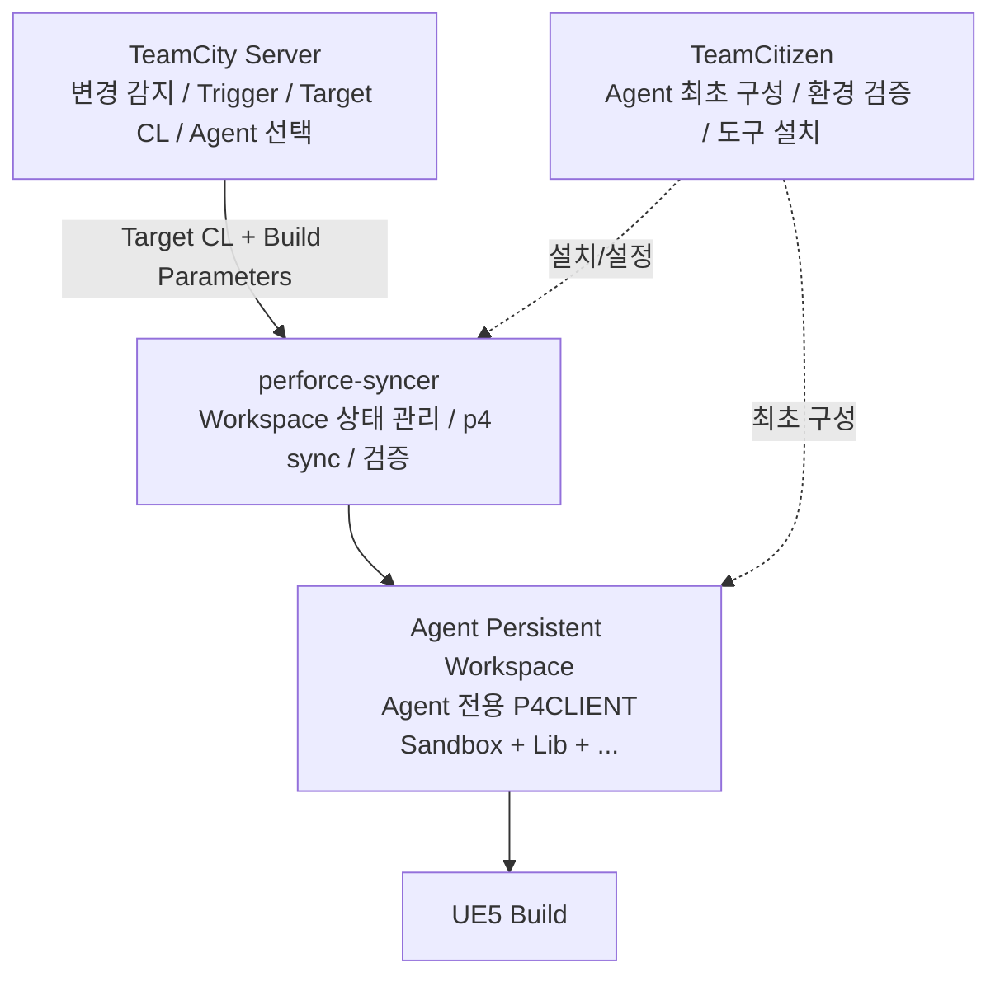

# TeamCity + Perforce Persistent Workspace 최적화 설계

> **상태:** 설계 초안
> **목표:** TeamCity가 Perforce Workspace를 직접 관리하는 비중을 줄이고, 각 Build Agent가 하나의 영속적인 P4 Client Workspace를 지속적으로 재사용하도록 구성한다.

---

## 1. 배경

현재 TeamCity + Perforce 기반의 대규모 UE5 빌드 환경에서 TeamCity의 Auto Checkout을 그대로 사용할 경우 다음 문제가 있다.

- VCS 설정 변경이 의도하지 않은 Full Sync로 이어질 수 있다.
- 대규모 UE5 Workspace에서는 Full Sync 비용이 매우 크다.
- Workspace의 생명주기를 Build Configuration보다 Agent에 귀속시키고 싶다.
- TeamCity가 직접 Perforce 동기화를 수행하기보다, Agent가 자신의 Workspace 상태를 지속적으로 유지하는 구조가 운영과 성능 측면에서 더 예측 가능하다.

추가로 다음 가설이 있으나, 이는 **별도 성능 리서치 및 벤치마크 대상으로 분리**한다.

> TeamCity가 Perforce 동기화 중 발생하는 대량의 출력(stdout/stderr, 파일 단위 진행 정보)을 수집·가공하여 Build Log에 남기는 과정이 `p4 sync` 성능에 추가 오버헤드를 만들 수 있다.

이 문서는 이 가설을 사실로 전제하지 않는다. 핵심 목적은 **Workspace 소유권과 Sync 책임을 Agent 측으로 이동하는 아키텍처**를 정리하는 것이다.

---

## 2. 핵심 원칙

### 2.1 Agent당 하나의 Persistent P4 Client

각 TeamCity Agent는 자신만의 P4 Client를 하나만 유지한다.

```text
Agent01
  P4CLIENT = TC_AGENT01
  PERFORCE_SPACE = D:\Perforce\Workspace

Agent02
  P4CLIENT = TC_AGENT02
  PERFORCE_SPACE = D:\Perforce\Workspace
```

Workspace는 Build Configuration에 종속되지 않는다.

```text
Build Configuration A ─┐
Build Configuration B ─┼─> Agent01 ─> TC_AGENT01 Workspace
Build Configuration C ─┘
```

즉, **Workspace는 Build의 임시 작업 공간이 아니라 Agent가 소유하는 영속적인 자산**이다.

### 2.2 Stream별 Workspace를 만들지 않는다

현재 빌드 구조는 하나의 Stream당 하나의 Workspace를 두는 형태가 아니다.

예를 들어 하나의 빌드에서 Sandbox와 Lib을 모두 필요로 하며, 이를 **하나의 P4 Client View**에서 함께 받아 사용한다.

```text
TC_AGENT01
  |
  +-- Sandbox 영역
  +-- Lib 영역
  +-- 기타 빌드에 필요한 Depot/Stream 경로
```

따라서 다음 구조는 사용하지 않는다.

```text
X Agent01-Sandbox Client
X Agent01-Lib Client
X Build Configuration별 Client
```

모든 Build Configuration은 Agent에 고정된 동일 P4 Client와 동일 로컬 Workspace를 사용한다.

### 2.3 TeamCity는 "무엇을 빌드할지" 결정한다

TeamCity는 다음 책임을 유지한다.

- VCS 변경 감지
- Build Trigger
- Build Queue 관리
- Build 대상 Revision/Changelist 결정
- Agent 선택
- Build 결과 관리

반대로 실제 파일 Checkout/Sync와 Workspace 상태 관리는 Agent 측으로 이동한다.

### 2.4 정확한 Target CL을 Sync한다

`perforce-syncer`는 단순히 최신 상태로 `p4 sync`해서는 안 된다.

Build가 Queue에서 기다리는 동안 새로운 Changelist가 제출될 수 있으므로, **TeamCity가 해당 Build에 할당한 Revision을 정확히 사용해야 한다.**

개념적인 흐름:

```text
TeamCity Build #1234
  Target CL = 582314
        |
        v
perforce-syncer --cl 582314
        |
        v
P4 Workspace @ 582314
        |
        v
UE5 Build
```

TeamCity의 `build.vcs.number.*` 계열 값을 `perforce-syncer`에 전달하는 방향을 기본안으로 한다.

---

## 3. 전체 아키텍처



각 컴포넌트의 책임을 한 문장으로 정리하면 다음과 같다.

- **TeamCity:** 무엇을 언제 빌드할지 결정한다.
- **TeamCitizen:** Agent를 표준 빌드 환경으로 구성한다.
- **perforce-syncer:** Agent의 Perforce Workspace를 빌드해야 할 정확한 상태로 만든다.

---

# 4. TeamCity 빌드 설정

## 4.1 기본 방향

TeamCity의 VCS Root는 유지하되, 파일 Checkout 용도가 아니라 다음 용도로 사용한다.

- 변경 감지
- VCS Trigger
- Build에 귀속될 Revision 계산
- 변경 내역 표시

Checkout Mode는 다음 방향을 사용한다.

```text
Do not check out files automatically
```

TeamCity가 Workspace를 직접 생성·삭제·Clean Checkout하지 않도록 하고, Build Step에서 `perforce-syncer`를 호출한다.

## 4.2 권장 Build Flow

```text
1. TeamCity가 Build 생성
2. Target CL 결정
3. Agent 선택
4. perforce-syncer 실행
5. Workspace를 Target CL 상태로 동기화
6. Sync 성공 확인
7. UE5 Build 실행
8. 결과 수집
```

예시:

```text
perforce-syncer sync --cl %build.vcs.number.<VCS_ROOT_ID>%
```

실제 Parameter 명칭과 전달 방식은 TeamCity 설정 확정 단계에서 결정한다.

## 4.3 실패 정책

다음 경우 Build를 즉시 실패시키는 것을 기본으로 한다.

- Target CL 확인 실패
- P4 Client 확인 실패
- Perforce 인증/연결 실패
- Sync 실패
- Sync 후 Workspace 검증 실패

Build 자체는 **정상적인 Sync가 완료된 Workspace에서만 시작**되어야 한다.

## 4.4 Agent Requirement

Build가 아무 Agent에서나 실행되지 않도록, TeamCitizen이 구성한 Agent만 선택될 수 있는 Requirement를 두는 방향을 권장한다.

예:

```text
TEAMCITIZEN_READY = 1
PERFORCE_SPACE = D:\Perforce\Workspace
P4CLIENT = TC_AGENT01
```

실제 변수와 Agent Parameter 이름은 TeamCitizen 설계에서 확정한다.

---

# 5. Agent 환경 세팅 — TeamCitizen

`TeamCitizen`은 새로운 TeamCity Agent를 빌드 팜에 편입할 때 필요한 환경을 표준화하는 전용 설정 마법사다.

## 5.1 목표

> 어떤 Agent에 Build가 배정되더라도 동일한 Perforce/빌드 실행 환경을 보장한다.

수작업 설정을 최소화하고, Agent 간 설정 편차를 제거한다.

## 5.2 담당 범위

초기 후보는 다음과 같다.

- Perforce CLI 설치 여부 및 버전 확인
- P4PORT 설정
- P4USER 설정
- 인증 상태 확인
- Agent 전용 P4CLIENT 생성/검증
- `PERFORCE_SPACE` 생성/설정
- P4 Client Root 및 View 검증
- Sandbox / Lib 등 필수 경로 매핑 검증
- `perforce-syncer` 설치 및 업데이트
- TeamCity Agent용 환경변수/Parameter 구성
- 디스크 여유 공간 확인
- 기본 진단 수행

## 5.3 책임 경계

TeamCitizen은 **Agent의 최초 구성과 구성 검증**을 담당한다.

지속적인 Sync 상태 관리는 TeamCitizen이 아니라 `perforce-syncer`의 책임으로 둔다.

```text
TeamCitizen
  └─ 설치 / 구성 / 검증

perforce-syncer
  └─ 매 Build마다 Workspace 상태 관리
```

## 5.4 환경 예시

```text
P4PORT=perforce.example.com:1666
P4USER=build-agent
P4CLIENT=TC_AGENT01
PERFORCE_SPACE=D:\Perforce\Workspace
TEAMCITIZEN_READY=1
```

비밀번호나 Ticket 등 인증 정보의 실제 저장 방식은 별도 보안 설계가 필요하다.

---

# 6. perforce-syncer 설계

`perforce-syncer`는 이 구조의 핵심 컴포넌트다.

## 6.1 역할

> TeamCity가 지정한 Target CL을 기준으로 Agent의 Persistent Workspace를 빌드 가능한 정확한 상태로 만든다.

기본 실행 흐름:

```text
환경 검증
  ↓
P4CLIENT / Workspace 확인
  ↓
Target CL 확인
  ↓
현재 Workspace 상태 확인
  ↓
필요한 p4 sync 수행
  ↓
결과 검증
  ↓
PASS / FAIL
```

## 6.2 CLI 초안

가장 단순한 형태:

```text
perforce-syncer sync --cl 582314
```

추후 필요하면 다음과 같은 확장을 고려한다.

```text
perforce-syncer sync --cl 582314 --profile ue5-build
perforce-syncer verify
perforce-syncer status
perforce-syncer repair
```

단, 초기 버전은 기능을 과도하게 넓히지 않고 **정확한 증분 Sync + 실패 복구 가능성 확보**에 집중한다.

## 6.3 Incremental Sync

정상적인 사용에서는 기존 Workspace를 삭제하지 않는다.

```text
Build #100
Workspace @ CL 10000

Build #101
Target CL 10025
      |
      v
Incremental Sync
      |
      v
Workspace @ CL 10025
```

Persistent Workspace의 가장 중요한 목적은 대규모 Full Sync를 반복하지 않는 것이다.

## 6.4 과거 CL로 돌아가는 경우

Build 순서나 재실행으로 현재 Workspace보다 과거 CL을 요구할 수 있다.

```text
현재 Workspace : CL 10100
Target Build    : CL 10080
```

따라서 syncer는 단순히 "현재보다 최신인가"만 판단해서는 안 되며, **지정된 Revision 상태로 되돌리는 동기화**도 정상 시나리오로 처리해야 한다.

## 6.5 중단 및 복구

다음 상황을 반드시 고려한다.

- `p4 sync` 진행 중 Agent 프로세스 종료
- Agent 재부팅
- 네트워크 단절
- Perforce 서버 연결 실패
- 디스크 Full
- 일부 파일만 Sync된 상태
- `p4 have` 정보와 실제 로컬 파일의 불일치

중간에 Sync가 실패하더라도 다음 Build에서 Workspace 전체를 무조건 삭제하는 대신, **현재 상태를 다시 확인한 뒤 목표 CL로 수렴시키는 방식**을 우선한다.

강제 재동기화(`-f`)나 Workspace 재생성이 필요한 조건은 별도의 명확한 정책으로 정의한다.

## 6.6 로그 정책

TeamCity에는 운영에 필요한 최소 요약만 남긴다.

성공 예:

```text
[P4Sync] PASS
Client : TC_AGENT01
Target : 582314
Elapsed: 00:01:42
```

실패 예:

```text
[P4Sync] FAIL
Client : TC_AGENT01
Target : 582314
Reason : P4 connection failed
Log    : D:\Perforce\Logs\p4sync-20260814-073500.log
```

Perforce의 상세 출력은 Agent 로컬 로그 파일에 저장하는 것을 기본안으로 한다.

```text
TeamCity Build Log
  └─ PASS / FAIL / 요약

Agent Local Log
  └─ p4 상세 출력 / 오류 / 진단 정보
```

이 구조의 성능 이점은 별도의 `p4 sync` 출력 오버헤드 벤치마크에서 검증한다.

## 6.7 종료 코드

CI에서 명확하게 사용할 수 있도록 단순한 종료 규칙을 유지한다.

```text
0 = 성공
non-zero = 실패
```

세부 오류 분류가 필요하면 로그와 별도의 오류 코드 체계를 추가하되, TeamCity 관점에서는 성공/실패가 명확해야 한다.

---

# 7. Workspace 동시 접근 정책

모든 Build Configuration이 동일 Agent의 동일 Workspace를 사용하므로, 한 Workspace를 동시에 둘 이상의 프로세스가 변경하면 안 된다.

기본 전제는 TeamCity Agent가 한 번에 하나의 Build를 실행하는 구조를 이용하는 것이다.

추가 방어책으로 `perforce-syncer` 자체에 Workspace Lock을 두는 방안을 검토한다.

```text
PERFORCE_SPACE\.perforce-sync.lock
```

다음과 같은 TeamCity 외부 프로세스가 Workspace를 건드리는 상황도 고려해야 한다.

- 수동 `p4 sync`
- 별도 유지보수 스크립트
- 다른 서비스 프로세스
- 잘못 구성된 두 번째 TeamCity Agent

---

# 8. 빌드 산출물과 Source Workspace 분리

Persistent Workspace를 오래 유지하려면 Source Sync와 Build Output의 책임도 구분해야 한다.

가능하면 다음 항목은 Perforce 관리 영역과 명확히 분리하거나, Build 시작 전 별도 정책으로 정리한다.

- Intermediate
- Saved
- DerivedDataCache
- 패키징 산출물
- 임시 로그
- 이전 Build가 생성한 캐시/중간 파일

`perforce-syncer`의 책임은 **Perforce가 관리하는 파일 상태**에 집중하고, UE Build 산출물 정리는 별도 Build Step 또는 전용 Cleanup 정책으로 분리하는 것을 기본으로 한다.

---

# 9. 책임 분리

| 영역 | TeamCity | TeamCitizen | perforce-syncer |
|---|---|---|---|
| 변경 감지 | O |  |  |
| Build Trigger | O |  |  |
| Target CL 결정 | O |  |  |
| Agent 선택 | O |  |  |
| Agent 최초 환경 구성 |  | O |  |
| P4 Client 생성/검증 |  | O | 실행 시 검증 |
| Workspace Root 구성 |  | O | 실행 시 확인 |
| 매 Build Sync |  |  | O |
| Target CL 상태 보장 |  |  | O |
| Sync 실패 복구 |  |  | O |
| 상세 P4 로그 |  |  | O |
| UE5 Build 실행 | O | 환경 제공 | 선행 조건 제공 |

---

# 10. 현재 확정된 것 / 아직 결정할 것

## 확정된 방향

- Agent당 P4 Client는 하나만 유지한다.
- Client는 Sandbox, Lib 등 빌드에 필요한 여러 경로를 하나의 View에서 처리한다.
- Build Configuration마다 별도 Workspace를 만들지 않는다.
- 모든 Build Configuration은 실행된 Agent의 Persistent Workspace를 재사용한다.
- TeamCity Auto Checkout에 의존하지 않는다.
- TeamCity는 Target Revision을 결정하고 `perforce-syncer`에 전달한다.
- 실제 Sync는 Agent 로컬에서 `perforce-syncer`가 수행한다.
- TeamCitizen을 통해 Agent 환경을 표준화한다.

## 추가 설계 필요

### TeamCity

- 정확한 VCS Root / Checkout / Trigger 설정
- Target CL Parameter 전달 규칙
- Build Configuration별 Sync 범위가 다른 경우의 표현 방법
- Agent Requirement 표준
- 실패 조건 및 Retry 정책

### TeamCitizen

- 설치 마법사 화면/단계
- 환경변수와 TeamCity Agent Parameter 표준
- P4 인증 방식
- P4 Client Spec 생성 규칙
- perforce-syncer 배포/업데이트 방식
- Agent Health Check

### perforce-syncer

- CLI 계약
- `p4 sync` 명령 구성
- 현재 상태 판별 방식
- 과거 CL 이동 처리
- 실패 후 복구 알고리즘
- `p4 have`와 로컬 파일 불일치 대응
- Workspace Lock
- Local Log 보관 기간
- Verify / Repair 기능의 범위

---

# 11. 별도 검증 과제

다음은 이 설계와 분리해 실제 측정이 필요한 성능 과제다.

## `p4 sync` 출력 처리 오버헤드

검증할 가설:

> TeamCity가 `p4 sync`의 대량 출력을 수집하고 Build Log로 처리하는 과정이 직접 CLI로 실행하는 경우보다 Sync 시간을 증가시키는가?

비교 후보:

```text
TeamCity Native Perforce Checkout
p4 sync
p4 sync > nul
p4 sync > local.log
stdout/stderr를 Parent Process가 Pipe로 수집
perforce-syncer가 상세 로그는 로컬에 저장하고 TeamCity에는 요약만 출력
```

이 결과에 따라 `perforce-syncer`의 로그 전략이 실제 성능 최적화 효과를 가지는지 판단한다.

---

# 12. 목표 상태

최종적으로 원하는 운영 모델은 다음과 같다.

```text
Agent 최초 도입
    |
    v
TeamCitizen
    |
    +-- Perforce 환경 구성
    +-- Agent 전용 P4CLIENT 구성
    +-- Persistent Workspace 구성
    +-- perforce-syncer 설치
    |
    v
Ready Agent

매 Build
    |
    v
TeamCity
    |
    +-- 변경 감지
    +-- Target CL 결정
    +-- Agent 선택
    |
    v
perforce-syncer
    |
    +-- 기존 Workspace 재사용
    +-- 정확한 Target CL로 증분 Sync
    +-- 상태 검증
    |
    v
UE5 Build
```

핵심은 다음 한 문장으로 요약할 수 있다.

> **TeamCity는 빌드의 의도를 관리하고, Agent는 자신의 Perforce Workspace를 소유하며, perforce-syncer가 그 Workspace를 매 Build에 필요한 정확한 상태로 수렴시킨다.**
