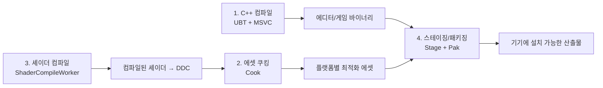
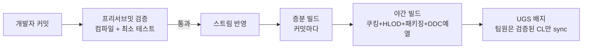

# 01. 개념과 용어 — UE5 빌드 생태계 입문

> 이 챕터만 제대로 이해하면 나머지 챕터는 "설치 매뉴얼"이 된다.
> UE5도, CI/CD도 처음이라는 전제로 쓴다.

---

## 1. "빌드 환경"이 왜 필요한가

혼자 개발할 때는 에디터를 열고 Ctrl+B(컴파일) → 플레이 버튼이면 끝이다.
팀이 되는 순간 다음 문제가 터진다.

| 문제 | 증상 | 해결 키워드 |
|---|---|---|
| 컴파일이 느리다 | 풀빌드 30분~2시간, 팀원 수만큼 중복 낭비 | 분산 빌드 (Horde/UBA) |
| 셰이더 컴파일 지옥 | 맵 열 때마다 수천~수만 개 셰이더 컴파일 | 공유 DDC, ODSC |
| "내 PC에선 되는데요" | 커밋이 다른 사람 빌드를 깨뜨림 | CI (프리서브밋 검증) |
| 기기 테스트가 느리다 | 빌드 → 패키징 → 콘솔/모바일 복사에 수십 분 | Zen Streaming |
| 아트 자산 반입 병목 | 아티스트 임포트 작업이 수작업·비일관 | DCC Nightly 패턴 |
| 뭐가 느린지 모른다 | 감으로 최적화 | stat / Insights / Telemetry |

**빌드 환경 = 위 문제들을 자동화·공유·관측으로 흡수하는 인프라 전체**다.

## 2. UE5 빌드가 실제로 하는 일

"빌드"라는 말 안에 서로 다른 4가지 작업이 섞여 있다. 구분이 안 되면 대화가 안 통한다.

| 작업 | 도구 | 무엇을 하나 | 시간 지배 요인 |
|---|---|---|---|
| **C++ 컴파일** | UnrealBuildTool(UBT) + 컴파일러 | 게임/에디터 코드 → 실행 파일 | CPU 코어 수, 분산 여부 |
| **쿠킹(Cook)** | UnrealAutomationTool(UAT) | 에디터용 에셋 → 플랫폼(Win64/PS5/Android...) 최적 포맷 | 에셋 수, DDC 적중률 |
| **셰이더 컴파일** | ShaderCompileWorker(SCW) | 머티리얼 그래프 → GPU 셰이더 바이너리 | DDC 적중률, 분산 여부 |
| **스테이징/패키징** | UAT | 쿠킹 결과를 pak/utoc/ucas 컨테이너로 묶고 배치 | 디스크/네트워크 I/O |

## 3. 핵심 용어집 (알파벳순)

처음 보는 용어가 나오면 여기로 돌아올 것.

| 용어 | 한 줄 정의 |
|---|---|
| **BuildGraph** | 빌드 파이프라인을 XML로 정의하는 UE 내장 스크립트 언어. "무엇을 어떤 순서로 빌드할지"의 설계도. Horde 잡의 스크립트로도 쓰인다 |
| **Commandlet** | UI 없이 커맨드라인에서 에디터 기능을 실행하는 방식 (`-run=<이름>`). 자동화의 기본 단위 |
| **DDC (Derived Data Cache)** | 셰이더·텍스처 압축 등 "원본에서 파생된 데이터"의 캐시. 공유하면 한 명의 컴파일 결과를 전원이 재사용 |
| **DCC** | Digital Content Creation 도구. Maya, Blender, Houdini 등 |
| **Horde** | Epic의 빌드 팜 서버. CI/CD + 원격 컴파일 + 테스트 자동화 + 분석 대시보드 통합체 |
| **HLOD** | Hierarchical LOD. 원거리의 수많은 액터를 프록시 메시 하나로 묶어 드로우 콜 절감 |
| **Interchange** | UE 5.1+의 확장 가능한 에셋 임포트 프레임워크. Python/BP/C++로 커스터마이즈 |
| **ODSC** | On-Demand Shader Compilation. 화면에 필요한 셰이더만 컴파일 (5.1부터 기본 활성) |
| **Perforce (P4)** | 대용량 바이너리에 강한 중앙집중형 버전 관리. UE 스튜디오 표준 |
| **PSO Precache** | Pipeline State Object를 미리 만들어 런타임 첫 사용 시 히칭 방지 |
| **SCW** | ShaderCompileWorker. 셰이더 컴파일을 수행하는 별도 프로세스 |
| **Stream (Perforce)** | 브랜치의 Perforce식 표현. `//Proj/Main`, `//Proj/Dev` 처럼 계층 구조를 가짐 |
| **Trace / Unreal Insights** | 고속 이벤트 추적(.utrace) 및 분석 UI. 성능 정밀 분석의 표준 경로 |
| **UAT** | UnrealAutomationTool. 쿠킹·패키징·테스트 등 상위 자동화 실행기 (`RunUAT.bat`) |
| **UBA** | Unreal Build Accelerator. C++(5.5부터 셰이더도) 로컬/분산 컴파일 가속기 |
| **UBT** | UnrealBuildTool. C++ 컴파일을 지휘하는 도구 (`Build.cs` 해석) |
| **UGS** | UnrealGameSync. 팀원이 "검증된 빌드"를 받게 해 주는 Perforce 클라이언트 |
| **ushell** | 커맨드라인 개발 워크플로 도구. `.cook`, `.stage`, `.deploy`, `.run` 등 |
| **Zenserver** | 로컬/공유 스토리지 서버. DDC 저장소이자 cooked output store |
| **Zen Streaming** | pak 복사 없이 타깃 기기가 Zenserver에서 콘텐츠를 직접 받아 실행하는 개발용 워크플로 |

## 4. CI/CD를 처음 듣는 사람을 위한 30초

- **CI (Continuous Integration)** — 누군가 코드를 올릴 때마다 자동으로 빌드·테스트해서 "이 커밋이 팀을 깨뜨리는지" 즉시 알려주는 것.
- **CD (Continuous Delivery)** — 검증된 빌드를 자동으로 패키징·배포 가능한 상태로 만들어 두는 것.
- UE5 세계에서 CI/CD의 구체적 형태가 **Horde + BuildGraph**다. 일반 IT의 Jenkins/GitHub Actions 역할을 UE에 특화해 수행한다.

## 5. 여섯 키워드의 관계 (원본 보고서 요약)

원본 보고서([`../ue5-build-farm.md`](../ue5-build-farm.md))의 여섯 키워드를 이 가이드의 챕터에 매핑하면:

| 키워드 | 역할 비유 | 담당 챕터 |
|---|---|---|
| **stat/telemetry** | 체온계→MRI→건강검진 통계 | 09 |
| **Shader Build + DDC** | 팀 공용 밑준비 냉장고 | 05 |
| **Zen Streaming** | 사내 넷플릭스 (파일 복사 제거) | 08 |
| **HLOD** | 원경용 미니어처 모형 | 07 (야간 빌드 잡에 편입) |
| **Horde** | 빌드 공장 관제탑 | 06~07 |
| **DCC Nightly Build** | 야간 물류 창고 | 07 (야간 잡 패턴) |

## 다음 챕터

→ [02. 인프라 준비](02-infrastructure.md) — 어떤 머신이 몇 대 필요한지부터 정한다.
