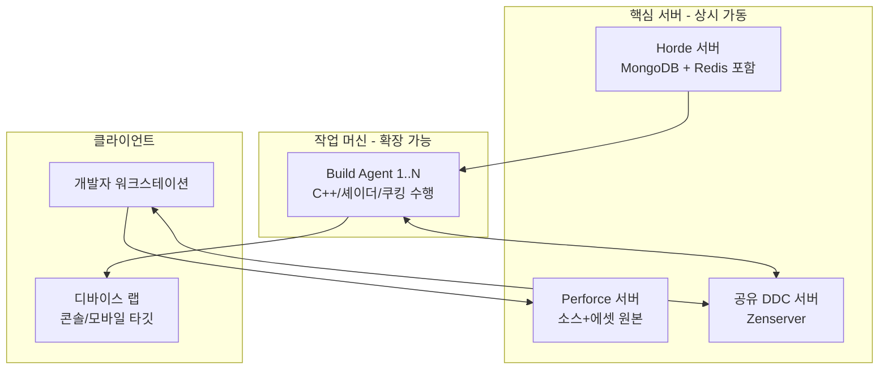
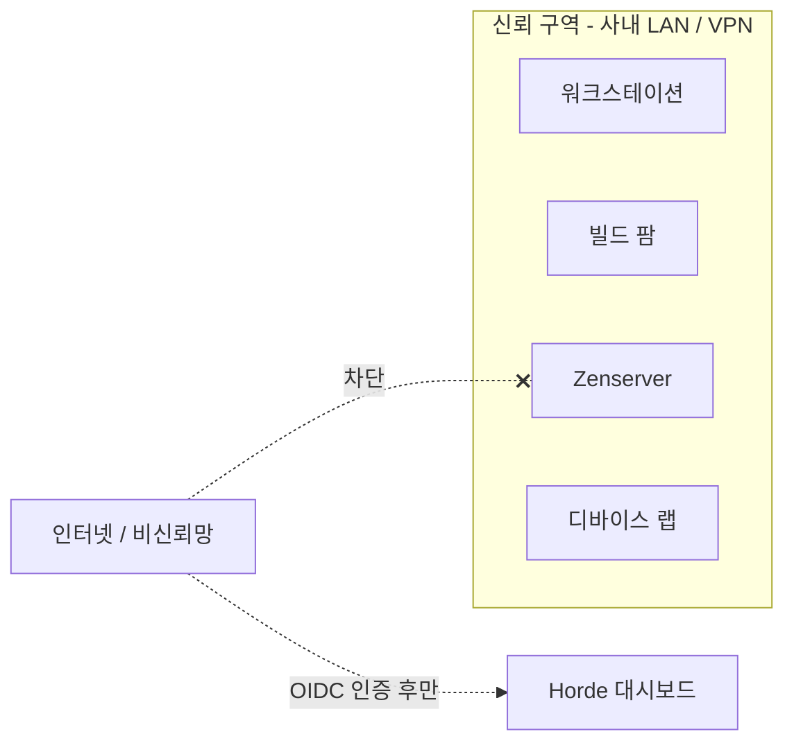

# 02. 인프라 준비 — 하드웨어·네트워크·머신 역할

> "서버 몇 대를 어떤 사양으로 사야 하나요?"에 답하는 챕터.
> Epic 공식 문서가 사양을 명시하지 않은 항목은 **미지정**으로 표기하고 보수적 권장값을 제안한다.

---

## 1. 머신 역할부터 정한다

빌드 환경은 최소 4가지 역할의 머신으로 구성된다. **처음부터 4대를 살 필요는 없다** — 역할을 이해하고, 규모에 따라 합치거나 나눈다.

| 역할 | 하는 일 | 규모별 판단 |
|---|---|---|
| **Perforce 서버** | 소스·에셋 원본 저장. 죽으면 팀 전체가 멈춤 | 5명 이하도 필수. 전용 머신 권장 |
| **공유 DDC (Zenserver)** | 셰이더/파생 데이터 캐시 공유 | **5명부터 즉시 효과.** 초기엔 NAS/파일서버로 시작 가능 |
| **Horde 서버** | 잡 스케줄링·대시보드. 자체 부하는 낮음 | 10명+ 또는 기기 패키징 잦을 때 |
| **Build Agent** | 실제 컴파일·쿠킹 노동. CPU를 여기에 몰빵 | Horde와 함께. 1대로 시작해 증설 |
| **디바이스 랩** | 콘솔/모바일 테스트 기기 + 유선 네트워크 | 타깃 플랫폼 생기면 |

### 규모별 최소 구성 시나리오

| 팀 규모 | 구성 |
|---|---|
| ~5명 | Perforce 서버 1대 + 공유 DDC(파일서버/NAS) 1대. CI는 아직 없어도 됨 |
| 5~15명 | 위 + Horde 서버(가상머신 가능) + Build Agent 1~2대 |
| 15~30명 | 위 + Agent 3~5대 + MongoDB/Redis 외부 분리 + 디바이스 랩 |

## 2. 사양 가이드

> Epic이 공식 최소 사양을 명시하지 않은 항목이 많다(미지정). 아래는 UE 빌드 특성(코어 수·RAM·NVMe에 비례)에 근거한 보수적 권장값이다.

### Build Agent (가장 중요 — 돈은 여기에 쓴다)

| 항목 | 권장 | 이유 |
|---|---|---|
| CPU | 16코어 이상 (32코어+ 이상적) | C++/셰이더 컴파일은 코어 수에 거의 선형 비례 |
| RAM | 64GB 이상 (코어당 2~4GB) | 링킹·쿠킹 시 메모리 피크 |
| 디스크 | NVMe 2TB+ | 워크스페이스 + DDC 로컬 캐시 + 중간 산출물 |
| OS | Windows (UBA 원격 C++ 컴파일 튜토리얼이 Windows 기준) | Mac/Linux 원격 컴파일 기대치는 낮게 |
| GPU | 쿠킹/HLOD 잡용이면 필요 (`-AllowCommandletRendering`) | HLOD 빌더는 렌더링 필요 |

### Horde 서버

- 서버 자체는 조율만 하므로 8코어/16GB/SSD면 충분. Windows/Linux 지원.
- **기본 설치형(내장 MongoDB/Redis)은 테스트·소규모용.** 프로덕션은 MongoDB/Redis 외부 분리 권장 (Epic 공식 권장).
- 스토리지: 로컬 디스크 / 네트워크 공유 / S3 / Azure Blob 선택 가능.

### 공유 DDC 서버 (Zenserver)

- CPU보다 **디스크와 네트워크**가 성능을 결정. NVMe + 10GbE이면 이상적.
- 용량: 프로젝트 규모에 따라 수백 GB~수 TB. 정기적 정리(가비지 컬렉션)를 전제로 1~2TB에서 시작.
- **UE 5.5 문서 기준 공유 DDC 용도의 production-ready 평가는 Windows 버전에만** 부여됨. Linux는 로컬 DDC 수준.

### Perforce 서버

- SSD/NVMe 필수 (에셋 depot는 수백 GB~TB 단위로 큼), RAM 32GB+, 일일 체크포인트+오프사이트 백업.

## 3. 네트워크 설계

빌드 환경의 체감 성능 절반은 네트워크가 결정한다.

| 구간 | 최소 | 권장 | 근거 |
|---|---|---|---|
| 워크스테이션 ↔ 공유 DDC | 1GbE 유선 | 10GbE | DDC 적중 시 다운로드가 컴파일을 대체 |
| Agent ↔ DDC/Perforce | 1GbE | 10GbE | 쿠킹·풀싱크 부하 집중 |
| 워크스테이션/Agent ↔ 디바이스 랩 | 1GbE 유선, **Wi-Fi 금지** | 10GbE(부팅/로딩 개선) | Epic 가이드: 1Gbps면 인게임 충분, 10Gbps는 부팅/로딩에 유리 |

### 방화벽에서 열어야 하는 포트 (한눈에)

| 포트 | 용도 | 챕터 |
|---|---|---|
| `1666` | Perforce (기본값) | 03 |
| `13340` | Horde 대시보드/HTTP | 06 |
| `7000–7010` | UBA 원격 컴파일 (워크스테이션 ↔ Agent) | 06 |
| `8558` | Zenserver HTTP/1.1 | 05, 08 |
| `1981` | Unreal Trace Server recorder | 09 |

### 보안 경계 (중요)

- **Zenserver는 인증이 없는 서버다.** 도달 가능한 사용자는 전원 read/write/delete 권한을 가진다. 반드시 사내 LAN/VPN 안에만 둔다. 통신도 비암호화 HTTP/1.1이고 로드밸런서 경유는 비권장.
- Horde는 Anonymous 인증으로 시작할 수 있지만 **데모용**이다. 06장에서 OIDC/내장 계정으로 전환한다.
- 원격 Python 실행(07장 DCC 자동화)은 bind address를 열면 공격 표면이 된다 — 헤드리스 commandlet + 에이전트 로컬 실행이 기본.

## 4. Day 0 체크리스트

- [ ] 머신 역할표 작성 (무엇을 합치고 무엇을 분리할지)
- [ ] Build Agent 최소 1대 확보 (16코어+/64GB+/NVMe)
- [ ] 사내 유선 1GbE 이상 확인, 디바이스 랩 Wi-Fi 배제
- [ ] 위 포트 목록 방화벽 정책 초안
- [ ] Perforce 서버 백업 정책(체크포인트 + 오프사이트) 문서화
- [ ] "신뢰 구역" 네트워크 다이어그램 확정 — Zenserver가 인터넷에서 절대 도달 불가함을 확인

## 다음 챕터

→ [03. 소스 관리 (Perforce)](03-source-control.md)
