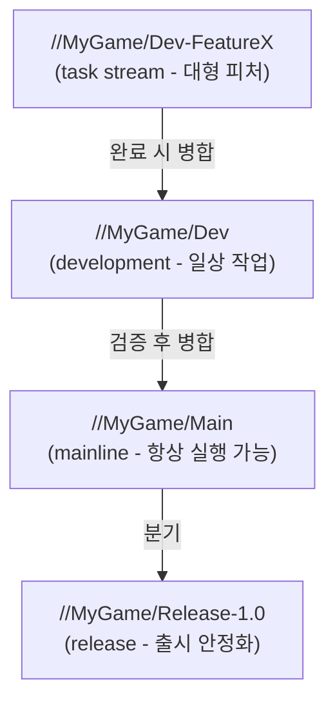

# 03. 소스 관리 — Perforce(Helix Core) 구축과 스트림 설계

> UE 팀이 git이 아니라 Perforce를 쓰는 이유부터, 서버 설치·스트림 설계·typemap·UGS까지.
> **Horde 빌드 자동화 예제가 UE 5.4+ Perforce 스트림을 전제**하므로, Horde를 쓸 계획이면 이 챕터는 필수다 (legacy branch 방식은 지원되지 않음).

---

## 1. 왜 Perforce인가 (git과의 비교)

| 관점 | git | Perforce |
|---|---|---|
| 대용량 바이너리(.uasset/.umap) | LFS로 보완해도 느리고 용량 폭발 | 네이티브로 강함. 스튜디오 표준 |
| 파일 잠금(둘이 같은 맵을 수정하는 사고 방지) | 없음(LFS lock은 제한적) | 체크아웃 기반 배타 잠금 |
| 부분 동기화(아티스트는 아트만) | 어려움 | 워크스페이스 매핑으로 자연스러움 |
| Horde/UGS 연동 | 미지원(빌드 자동화 예제 기준) | 공식 지원 |
| 러닝커브/비용 | 익숙, 무료 | 학습 필요, 5명까지 무료(Helix Core 무료 티어) |

> 소규모 프로토타입은 git + LFS로 시작해도 되지만, 아티스트가 합류하고 에셋이 수십 GB를 넘는 시점에 Perforce 전환 비용이 급격히 커진다. **팀 프로젝트라면 처음부터 Perforce를 권장.**

## 2. 서버 설치 (Windows 기준)

1. [Perforce 홈페이지](https://www.perforce.com/downloads/helix-core-p4d)에서 **Helix Core Server (p4d)** 를 서버 머신에 설치한다.
2. 설치 시 포트는 기본 `1666`, 저장소 루트는 NVMe 디스크로 지정한다.
3. 슈퍼유저 계정을 만들고, 즉시 다음을 설정한다:

```bat
:: 보안 레벨 (평문 비밀번호 금지)
p4 configure set security=3

:: 대소문자 구분 정책 확인 (Windows 혼용 팀은 case-insensitive 유지)
p4 info

:: 일일 체크포인트 (스케줄러에 등록)
p4d -r <저장소루트> -jc
```

4. 클라이언트는 각 팀원 PC에 **P4V**(GUI) + **p4**(CLI)를 설치한다.

> 백업 없는 Perforce 서버는 시한폭탄이다. 체크포인트(메타데이터) + depot 파일을 매일 다른 물리 위치로 복사하는 잡을 2장 체크리스트대로 먼저 만든다.

## 3. 스트림 설계 — UE 프로젝트 표준 구조

스트림(stream)은 Perforce의 브랜치다. UE 팀의 검증된 기본 구조:



| 스트림 | 타입 | 규칙 |
|---|---|---|
| `//MyGame/Main` | mainline | **항상 빌드·실행 가능** 상태 유지. 직접 커밋 금지, Dev에서 검증 후 병합만 |
| `//MyGame/Dev` | development | 일상 작업. 프리서브밋 CI(07장)가 지키는 대상 |
| `//MyGame/Release-*` | release | 출시 브랜치. 핫픽스만 |
| `//MyGame/Dev-<피처>` | task | 오래 걸리는 대형 작업 격리 |

작게 시작하려면 `Main` + `Dev` 두 개면 충분하다. 스트림 depot 생성:

```bat
p4 depot -t stream MyGame
p4 stream -t mainline //MyGame/Main
p4 stream -t development -P //MyGame/Main //MyGame/Dev
```

## 4. typemap — UE 파일 타입 규칙 (반드시 최초 1회)

Perforce가 UE 파일을 올바르게 다루려면 typemap 설정이 필수다. 이걸 빼먹으면 **에셋 병합 사고**와 **잠금 미동작**이 일어난다.

`p4 typemap` 실행 후 다음을 등록한다 (핵심 발췌 — `+w`는 쓰기 가능, `+l`은 배타 잠금, `S`는 최신 리비전만 서버 보관):

```
TypeMap:
    binary+w //....exe
    binary+w //....dll
    binary+w //....pdb
    binary+l //....uasset
    binary+l //....umap
    binary+l //....ubulk
    binary+l //....uexp
    text //....ini
    text //....cs
    text //....cpp
    text //....h
    text //....uproject
    text //....uplugin
```

핵심 원칙:
- **`.uasset`/`.umap`은 `binary+l`** — 병합 불가능한 바이너리이므로 배타 잠금으로 "둘이 동시에 같은 맵 수정" 사고를 원천 차단.
- 소스 코드(`.cpp/.h/.cs`)와 설정(`.ini`)은 text로 두어 diff/병합 가능하게.

## 5. 무엇을 커밋하고 무엇을 제외하나

| 커밋 대상 | 제외 대상 (P4IGNORE) |
|---|---|
| `Source/`, `Content/`, `Config/` | `Binaries/` (CI 산출물로 배포), `Intermediate/` |
| `.uproject`, `.uplugin` | `Saved/`, `DerivedDataCache/` |
| `Plugins/` (서드파티 포함 여부는 팀 정책) | `.vs/`, `*.sln` (생성 파일) |

`.p4ignore` 파일을 depot 루트에 두고 각 클라이언트에서:

```bat
p4 set P4IGNORE=.p4ignore
```

```
# .p4ignore
Binaries/
Intermediate/
Saved/
DerivedDataCache/
.vs/
*.sln
*.suo
```

> 예외: 소스 엔진을 depot에 넣는 팀은 에디터 바이너리를 CI가 커밋해 배포하는 전략(UGS의 precompiled binaries)을 쓴다 — 04장 참고.

## 6. UGS (UnrealGameSync) — 팀원이 "깨진 빌드"를 받지 않게

UGS는 Perforce 위에서 동작하는 팀용 싱크 클라이언트다. 역할:

- Horde/CI가 각 체인지리스트(CL)에 **빌드 성공/실패 배지**를 붙이면, 팀원은 **검증된 CL만 골라 sync**할 수 있다.
- 아티스트는 로컬 컴파일 없이 **미리 컴파일된 에디터 바이너리**(precompiled binaries)를 받아서 바로 작업한다.
- Horde의 "UnrealGameSync metadata server" 기능이 이 배지 데이터를 제공한다 (06장).

도입 시점: Horde CI가 돌기 시작하는 시점(07장)과 함께가 자연스럽다. 그 전에는 P4V로 충분.

## 7. 완료 체크리스트

- [ ] p4d 서버 설치, `security=3`, 일일 체크포인트 스케줄 등록
- [ ] 스트림 depot + `Main`/`Dev` 스트림 생성
- [ ] typemap 등록 (`.uasset`/`.umap` = `binary+l` 확인)
- [ ] `.p4ignore` 배포, 전 팀원 `P4IGNORE` 설정
- [ ] 테스트: 두 계정으로 같은 `.umap` 체크아웃 시도 → 잠금 동작 확인
- [ ] 백업 복원 리허설 1회 (체크포인트에서 실제로 복원해 본다)

## 다음 챕터

→ [04. 엔진과 프로젝트 표준화](04-engine-setup.md)
