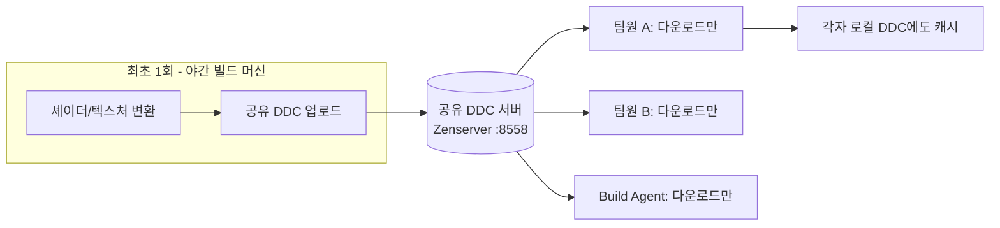

# 05. 공유 DDC — 팀 공용 파생 데이터 캐시 (Zen)

> **이 가이드 전체에서 투자 대비 효과가 가장 큰 챕터.**
> 서버 1대 + 설정 몇 줄로, 팀 전원의 "첫 부팅 셰이더 컴파일 지옥"이 사라진다.

---

## 1. DDC가 뭐길래

UE는 원본 에셋(머티리얼 그래프, 텍스처 원본)을 그대로 쓰지 않고, 플랫폼에 맞게 **파생 데이터**(컴파일된 셰이더, 압축된 텍스처)로 변환해 쓴다. 이 변환 결과를 저장하는 곳이 DDC(Derived Data Cache)다.

- DDC에 **있으면**: 다운로드해서 즉시 사용 (초 단위)
- DDC에 **없으면**: 그 자리에서 컴파일 (셰이더 수만 개 = 수십 분~시간)

**공유 DDC의 원리**: 팀에서 한 명(또는 야간 빌드 머신)이 컴파일한 결과를 서버에 올려 두면, 나머지 전원은 다운로드만 한다.



캐시는 계층형으로 동작한다: **로컬 DDC(내 PC) → 공유 DDC(서버) → 없으면 직접 빌드**. UE 5.4부터 로컬 DDC 기본값이 Filesystem에서 **Zen Store 계열**로 이동했다.

## 2. 구축 방법 두 가지

### 방법 A — 네트워크 드라이브 공유 DDC (가장 쉬움, 오늘 시작 가능)

파일 서버/NAS에 공유 폴더 하나 파고 프로젝트 설정에 지정한다.

`Config/DefaultEngine.ini` (프로젝트에 커밋 → 팀 전원 자동 적용):

```ini
[StorageServers]
; 방법 A: 파일 공유 기반 Shared DDC
Shared=(Type=FileSystem, Path="\\\\fileserver\\UE-DDC", EnvPathOverride=UE-SharedDataCachePath)
```

또는 각 PC 환경변수로: `UE-SharedDataCachePath=\\fileserver\UE-DDC`

### 방법 B — Zenserver 공유 DDC (권장 종착점)

Zenserver를 전용 서버에 상주시키고 팀이 HTTP로 접속한다.

- 실행 파일: `Engine\Binaries\Win64\zenserver.exe` (엔진에 포함)
- 기본 포트 **8558**, HTTP/1.1, 비암호화, 프록시/로드밸런서 비권장
- **UE 5.5 기준 공유 DDC 용도 production-ready는 Windows 버전만.** Linux는 로컬 DDC 수준
- 여러 엔진 버전 혼용 시 **가장 최신 UE 릴리스 번들의 zenserver**를 서버에 올린다 (후방 호환 전략)

서버 측 (서비스로 상주):

```bat
:: 데이터 디렉토리를 지정해 Zenserver 상주 실행 (예시)
zenserver.exe --port 8558 --data-dir D:\ZenData
```

클라이언트 측 `Config/DefaultEngine.ini`:

```ini
[StorageServers]
; 방법 B: Zenserver 기반 Shared DDC
Shared=(Type=Zen, Host="zen.<사내도메인>", Port=8558)
```

> **보안 재확인**: Zenserver는 인증이 없다. 사내 LAN/VPN 밖에서 접근 불가하도록 방화벽으로 막는 것이 설정의 일부다 (02장).

### 보조 수단 — DDC Pak (`Compressed.ddp`)

Epic은 엔진 콘텐츠용 `Compressed.ddp`를 제공해 엔진 셰이더 초기 컴파일 일부를 이미 줄여 둔다. 필요하면 `-DDC=CreatePak`으로 자체 배포형 DDC Pak도 만들 수 있다 (외부 협력사에 전달할 때 유용).

## 3. DDC 예열 (fill) — 야간 잡의 핵심

공유 DDC는 "누군가 먼저 빌드해야" 채워진다. 그 누군가를 사람이 아니라 **야간 빌드 머신**으로 만든다:

```bat
Engine\Binaries\Win64\UnrealEditor.exe MyProject.uproject -run=DerivedDataCache -fill
```

Epic도 이 작업을 내부에서 nightly로 수행해 DDC를 primed 상태로 유지한다. 07장 야간 BuildGraph 잡의 마지막 노드로 편입한다.

## 4. ODSC — 컴파일 자체를 줄이는 두 번째 축

DDC가 "재사용"이라면 ODSC(On-Demand Shader Compilation)는 "필요한 것만 컴파일"이다.

- UE 5.1부터 **기본 활성** — 화면에 실제로 필요한 셰이더만 컴파일
- 제어 cvar: `r.ShaderCompiler.JobCacheDDC`
- **팀 규칙**: ODSC를 습관적으로 끄지 말 것. 완전 셰이더 맵이 필요한 특정 시스템만 예외 처리

추가로 **PSO precaching**을 병행하면 런타임 첫 사용 히칭이 줄어든다 (일부 글로벌 셰이더 PSO는 기본 precache됨).

## 5. 효과 측정 — 되는지 어떻게 아나

| 확인 방법 | 기대 결과 |
|---|---|
| 새 팀원 PC에서 첫 에디터 부팅 | 셰이더 컴파일 수천 개 → **수십 개 이하** |
| 에디터 로그에서 `DerivedDataCache` 검색 | Shared 백엔드가 healthy로 잡힘 |
| 콘솔 `stat DDC` | 적중률(hit rate) 확인 — 90%+ 목표 |
| 맵 열기 시간 | 최초 1회 이후 급감 |

증상별 진단:

| 증상 | 원인 후보 |
|---|---|
| 전원이 매번 수만 개 컴파일 | Shared DDC 경로 미설정 / 방화벽 8558 차단 |
| 특정 팀원만 느림 | 그 PC의 환경변수/ini 오버라이드가 Shared를 끔 |
| 새 브랜치 전환 직후만 느림 | 정상 — 야간 fill 잡이 그 브랜치를 안 돌았음. 잡에 브랜치 추가 |
| 서버 디스크 폭발 | 정리 정책 부재 — 용량 상한/가비지 컬렉션 설정 |

## 6. 완료 체크리스트

- [ ] 공유 DDC 방식 선택 (A: 파일 공유 → B: Zenserver 순으로 진화)
- [ ] `DefaultEngine.ini`에 Shared 설정 커밋 (개인 설정이 아니라 **프로젝트 커밋**)
- [ ] 방화벽: 사내에서만 8558 허용, 외부 차단 확인
- [ ] 깨끗한 PC에서 첫 부팅 테스트 — 셰이더 컴파일 수 급감 확인
- [ ] DDC fill 명령을 수동 1회 실행해 서버가 채워지는지 확인 (07장에서 야간 잡으로 자동화)
- [ ] 서버 디스크 용량 알람 설정

## 다음 챕터

→ [06. Horde 서버·에이전트](06-horde.md)
