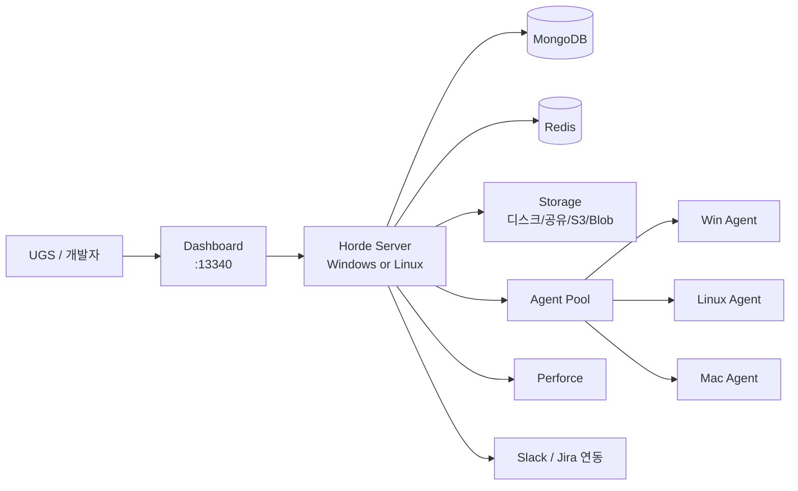

# 06. Horde 서버·에이전트 — 빌드 팜의 관제탑

> Epic이 포트나이트와 UE 자체 개발에 쓰는 빌드 팜을 그대로 설치한다.
> 이 챕터가 끝나면: 대시보드에서 잡을 보고, 워크스테이션의 C++ 컴파일이 팜으로 분산된다.

---

## 1. Horde가 제공하는 것 (전부 켤 필요 없다)

| 기능 | 설명 | 도입 시점 |
|---|---|---|
| **Build automation (CI/CD)** | BuildGraph 잡 스케줄링·실행 | 07장 |
| **Remote execution (UBA)** | 워크스테이션 C++ 컴파일을 팜으로 분산 | 이 챕터 |
| Test automation | Gauntlet 자동 테스트 | CI 안정화 후 |
| Studio analytics | 팀 텔레메트리 대시보드 (5.5+) | 09장 |
| UnrealGameSync metadata | UGS 빌드 배지 서버 | 07장과 함께 |
| Device management | 디바이스 랩 기기 예약·관리 | 랩 구축 후 |

## 2. 아키텍처



- **Server**: Windows/Linux 지원. 기본 설치는 MongoDB/Redis 내장 → 테스트·소규모용. **프로덕션은 외부 분리 권장**
- **Agent**: Windows/Mac/Linux에서 동작. 실제 노동(컴파일·쿠킹) 담당
- 빌드 자동화 예제는 **UE 5.4+ / Perforce 스트림** 전제 (legacy branch 미지원)

## 3. 서버 설치 (Windows)

1. Epic Games Launcher 또는 GitHub 릴리스에서 Horde Server 인스톨러(MSI)를 받아 서버 머신에 설치한다.
2. 설정 파일 위치: `C:\ProgramData\Epic\Horde\Server`

| 파일 | 역할 |
|---|---|
| `server.json` | 이 머신 로컬 설정 (포트, 인증 방식, DB 연결) |
| `globals.json` | 다중 인스턴스 공통 설정 (프로젝트, Perforce 클러스터, 풀) |

3. Perforce 연결 — `globals.json`에 `perforceClusters`를 구성하고 `projects` 항목에서 프로젝트/스트림 JSON을 활성화한다:

```jsonc
// globals.json (발췌 예시)
{
  "perforceClusters": [
    {
      "name": "default",
      "servers": [{ "serverAndPort": "ssl:p4.<사내도메인>:1666" }],
      "credentials": [{ "userName": "horde-svc", "password": "<시크릿 관리로>" }]
    }
  ],
  "projects": [{ "id": "mygame", "path": "mygame.project.json" }]
}
```

4. 브라우저에서 `http://<서버>:13340` 접속 → 대시보드 확인. **Server → Status 페이지**가 Perforce 연결 상태를 즉시 보여준다 (연결 오류 1순위 확인처).

## 4. 인증 — Anonymous로 시작하되 반드시 전환

`server.json`의 핵심 키: `httpPort`, `httpsPort`, `authMethod` + OIDC 관련 값.

| 모드 | 용도 | 위험 |
|---|---|---|
| `Anonymous` | 데모/최초 구동 확인용 | **모든 사용자가 원격 컴파일 전체 권한** — Epic이 명시적으로 경고 |
| `Horde` (내장 계정) | 소규모 팀 | 계정 관리 수동 |
| `OpenIdConnect` | 프로덕션 표준 | Google Workspace/Azure AD/Okta 연동 |

**규칙: 첫 잡이 도는 것을 확인한 그날, Anonymous를 끈다.** 사내 IdP가 있으면 OIDC, 없으면 내장 계정.

## 5. Agent 설치와 풀 구성

1. 각 Build Agent 머신에 Horde Agent를 설치하고 서버 URL을 지정한다.
2. 대시보드 → Agents에서 등록 승인(enrollment) 후, **풀(pool)** 에 배정한다. 예: `Win-UE5` (C++/쿠킹용), `Win-Cook` (GPU 있는 쿠킹/HLOD용).
3. 에이전트 머신 준비물:
   - 엔진/프로젝트 워크스페이스를 받을 NVMe 여유 공간
   - 05장 공유 DDC 접근 가능 (`8558`)
   - Perforce 서비스 계정 접근
   - GPU 필요 잡(HLOD)용 에이전트는 GPU + `-AllowCommandletRendering` 가능 상태

## 6. 원격 C++ 컴파일 (UBA) — 개발자 체감 1호 기능

워크스테이션에서 Ctrl+B를 누르면 컴파일이 팜 에이전트들로 흩어진다.

### 요구 조건

- **워크스테이션 ↔ Agent 간 포트 7000–7010 개방** (미개방이 연결 실패 1순위 원인)
- 튜토리얼은 **Windows 지원 중심** — Mac/Linux 원격 C++ 컴파일 기대치는 낮게
- 5.4에서 UBA는 Windows C++ 베타, 5.5부터 셰이더 컴파일 언급 확대 — 버전별 검증 필요

### 설정 — `<프로젝트>/Saved/UnrealBuildTool/BuildConfiguration.xml`

04장의 팀 표준 파일에 다음을 추가한다:

```xml
<?xml version="1.0" encoding="utf-8" ?>
<Configuration xmlns="https://www.unrealengine.com/BuildConfiguration">
  <BuildConfiguration>
    <bAllowUBAExecutor>true</bAllowUBAExecutor>
    <bUseUBTMakefiles>true</bUseUBTMakefiles>
    <bStopCompilationAfterErrors>true</bStopCompilationAfterErrors>
  </BuildConfiguration>

  <Horde>
    <Server>http://horde.<사내도메인>:13340</Server>
    <WindowsPool>Win-UE5</WindowsPool>
    <!-- 필요 시: <MaxCores> / <MaxWorkers> 로 팜 점유 상한 관리 -->
  </Horde>

  <UnrealBuildAccelerator>
    <!-- 분산 상황을 눈으로 보는 시각화 도구 -->
    <bLaunchVisualizer>true</bLaunchVisualizer>
  </UnrealBuildAccelerator>
</Configuration>
```

관련 옵션: `RemoteExecutorPriority`, `bAllowXGE`, `MaxParallelActions`, `Horde.MaxCores`, `Horde.MaxWorkers`.

### 검증

1. 로컬 빌드가 먼저 성공하는지 확인 (**철칙: 로컬 성공 → 분산 연결** 순서)
2. 빌드 실행 → UBA Visualizer에서 원격 에이전트로 액션이 흩어지는지 확인
3. 안 되면: 포트 7000–7010 → 풀 이름 오타 → 대시보드 Agent 상태 순으로 점검

## 7. 흔한 문제 4가지 (원본 보고서 요약)

| 문제 | 해결 |
|---|---|
| Perforce 연결 실패 | 대시보드 **Status 페이지**에서 즉시 확인 |
| UBA 연결 불성립 | 포트 **7000–7010** 개방 여부 |
| 권한이 너무 열려 있음 | Anonymous 장기 유지 금지 → OIDC/내장 계정 전환 |
| Mac/Linux 원격 컴파일 실패 | 문서가 Windows 기준 — 기대치 조정 |

## 8. 완료 체크리스트

- [ ] Horde Server 설치, 대시보드 접속 확인
- [ ] Perforce 클러스터 연결, Status 페이지 정상
- [ ] Agent 1대 이상 등록, 풀 배정
- [ ] Anonymous → OIDC/내장 계정 전환 완료
- [ ] 워크스테이션 1대에서 UBA 원격 컴파일 성공 (Visualizer로 확인)
- [ ] 프로덕션 전환 시: MongoDB/Redis 외부 분리 계획 수립

## 다음 챕터

→ [07. CI/CD와 BuildGraph](07-cicd-buildgraph.md) — 이제 관제탑에 실제 잡을 올린다.
