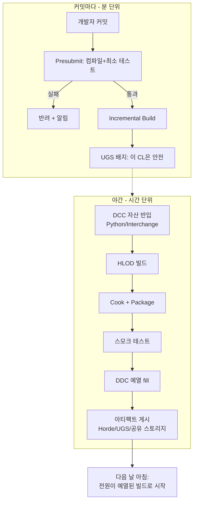

# 07. CI/CD와 BuildGraph — 프리서브밋·야간 빌드·패키징 잡 설계

> BuildGraph XML로 "무엇을 어떤 순서로 빌드할지"를 코드화하고, Horde에 잡으로 올린다.
> DCC Nightly Build 패턴(자산 반입 자동화)과 HLOD 빌드도 이 챕터에서 야간 잡으로 편입한다.

---

## 1. BuildGraph 3분 입문

BuildGraph는 UAT에 내장된 파이프라인 스크립트 언어다. 개념 4개만 알면 읽을 수 있다:

| 개념 | 의미 |
|---|---|
| **Node** | 작업 단위 (컴파일, 쿠킹, 테스트...). `Requires`로 의존 관계 선언 |
| **Agent** | 노드들이 실행될 머신(풀) 그룹 |
| **Task** | 노드 안의 실제 명령 (`<Compile>`, `<Cook>`, `<Command>`, `<Commandlet>`...) |
| **Trigger / Aggregate** | 수동 승인 지점 / 노드 묶음 별칭 |

실행 방법:

```bat
:: 로컬에서 직접 실행 (Horde 없이도 동작 - 디버깅용)
Engine\Build\BatchFiles\RunUAT.bat BuildGraph -Script=<xml> -Target=<타깃>

:: 스크립트에 정의된 타깃 목록 보기
Engine\Build\BatchFiles\RunUAT.bat BuildGraph ^
  -Script=Engine/Build/Graph/Examples/AllExamples.xml -ListOnly
```

> 엔진에 예제가 포함되어 있다: `Engine/Build/Graph/Examples/` (패키징, **BuildWorldPartitionHLODs.xml** 등). 백지에서 쓰지 말고 예제를 복사해 고친다.

## 2. 잡 설계 원칙 — 거대한 하나보다 작은 여럿

**하나의 monolith 잡은 실패 지점도 재시도 단위도 하나다.** Compile / Cook / HLOD / Test / Package / Publish로 쪼개면 병렬 실행·부분 재시도·실패 통지가 살아난다.

Epic이 Horde에 기본 제공하는 잡 템플릿이 곧 표준 답안이다:

| 템플릿 | 역할 | 트리거 |
|---|---|---|
| **Presubmit Tests** | 커밋 전 검증 — 팀을 깨뜨리는 커밋 차단 | 커밋 시도 시 |
| **Incremental Build** | 커밋마다 증분 컴파일 → UGS 배지 | 커밋마다 |
| **Packaged Project Build** | 실행 가능한 패키지 제작 | 야간/수동 |
| **Installed Engine Build** | 아티스트용 설치형 에디터 | 주기적 |
| **Remote Execution Test** | UBA 팜 건강 확인 | 주기적 |

## 3. 조직의 CI/CD 흐름 (전체 그림)



## 4. 야간 잡 실전 예시 — DCC Nightly + HLOD + DDC 예열

원본 보고서의 핵심 패턴. "밤에 자산 반입 → 월드 빌드 → 캐시 예열"을 하나의 그래프로:

```xml
<BuildGraph>
  <Agent Name="NightlyContent" Type="Win-Cook">

    <!-- 1) DCC 자산 반입: Python으로 임포트+정규화 규칙 코드화 -->
    <Node Name="ImportDccAssets">
      <Commandlet Name="pythonscript" Project="MyGame.uproject"
        Arguments='-script="D:\CI\Scripts\import_dcc_assets.py"' />
    </Node>

    <!-- 2) World Partition HLOD 빌드 (GPU 에이전트 필요) -->
    <Node Name="BuildWorldHLODs" Requires="ImportDccAssets">
      <Commandlet Name="WorldPartitionBuilderCommandlet" Project="MyGame.uproject"
        Arguments='"/Game/Maps/OpenWorld" -AllowCommandletRendering -builder=WorldPartitionHLODsBuilder' />
    </Node>

    <!-- 3) DDC 예열: 아침의 셰이더 컴파일 지옥 제거 -->
    <Node Name="PrimeDDC" Requires="BuildWorldHLODs">
      <Command Name="DerivedDataCache"
        Arguments='"MyGame.uproject" -run=DerivedDataCache -fill' />
    </Node>

  </Agent>
</BuildGraph>
```

### DCC 자산 반입 상세 (DCC Nightly Build 패턴)

"DCC Nightly Build"는 공식 기능명이 아니라 **Interchange + Python + BuildGraph + DDC fill 조합의 운영 패턴**이다.

- **낮**: 아티스트는 Live Link/USD로 DCC↔에디터 실시간 검수 (대화형)
- **밤**: 파일 기반(USD/FBX/glTF) 반입을 Python commandlet으로 재현성 있게 실행

```bat
:: Python 임포트 스크립트 단독 실행 (BuildGraph 밖에서 디버깅할 때)
UnrealEditor-Cmd.exe "D:\Proj\MyGame.uproject" ^
  -run=pythonscript ^
  -script="D:\CI\Scripts\import_dcc_assets.py"
```

임포트 스크립트에 반드시 코드화할 것: **네이밍 규칙 / 축척 / LOD 수 / 머티리얼 슬롯 / 스켈레톤 검증.** "낮의 Live Link는 맞는데 밤의 임포트가 다르다"는 사고의 원인은 두 경로가 다른 규칙을 타는 것 — 야간 빌드가 항상 같은 commandlet 경로를 타게 만들면 해결된다.

> **보안**: 원격 Python 실행(multicast endpoint 개방)은 공격 표면이다. 야간 자동화는 헤드리스 commandlet + 에이전트 로컬 실행으로 구성하고, 원격 실행은 사내망으로 제한.

> **버전 함정**: Blender 연동(BlenderTools 2.3.0)의 공식 테스트 기준은 Blender 3.3/3.4 + **UE 5.1**. 최신 UE 조합은 사내 검증 결과를 따로 기록해 둘 것.

### HLOD 레이어 설계 메모 (야간 잡에 태우기 전에)

- 레벨 전체를 HLOD 하나로 뭉치지 말 것. **수목/군집 → Instancing, 건물 블록 → Merged/Simplified, 랜드마크 → `Always Loaded` 신중 판단**
- HLOD 빌드는 비싸다 → 야간 또는 변경 감지 기반 selective rebuild로
- **5.4부터** 생성된 HLOD를 에디터에서 직접 확인·개별 업데이트 가능. 그 이전 버전은 PIE/쿡드 빌드에서만 보이던 것이 정상

## 5. 프리서브밋과 UGS 배지

1. Horde의 **Presubmit Tests** 템플릿을 Dev 스트림에 연결 — 컴파일+최소 테스트를 통과해야 커밋 반영
2. **Incremental Build**가 커밋마다 돌며 결과를 UGS metadata로 게시
3. 팀원은 UGS에서 초록 배지 CL만 sync → "어제 받은 빌드가 깨져 있는" 아침이 사라진다

알림 연동: Horde는 Slack/Jira 통합을 지원한다. 실패 통지를 `#build-status` 채널로 보내고, **실패 방치 금지(브레이크는 최우선 수정)** 를 팀 규칙으로 못박는다.

## 6. 텔레메트리 연계 (09장 예고)

BuildGraph `Command` 태스크의 `MergeTelemetryWithPrefix` 옵션으로 하위 UAT 텔레메트리를 상위 잡에 병합할 수 있다 — 야간 잡을 단계별 메트릭으로 쪼개 "쿠킹이 느려졌는지 HLOD가 느려졌는지"를 추적 가능하게 만든다.

## 7. 완료 체크리스트

- [ ] BuildGraph 예제(`-ListOnly`)를 로컬에서 실행해 구조 이해
- [ ] Presubmit + Incremental 잡을 Dev 스트림에 연결
- [ ] 야간 잡(위 XML 기반) 등록: 반입 → HLOD → Cook/Package → DDC fill
- [ ] Slack/알림 채널 연동, "브레이크 최우선 수정" 규칙 공지
- [ ] UGS 배포 + 배지 동작 확인
- [ ] 임포트 정규화 규칙을 Python 스크립트로 코드화하고 저장소에 커밋

## 다음 챕터

→ [08. 기기 반복 (Zen Streaming)](08-device-iteration.md)
