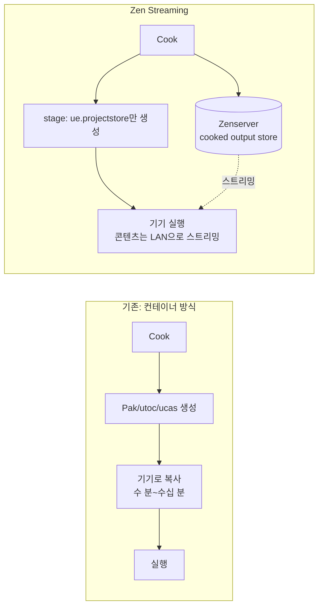

# 08. 기기 반복 — Zen Streaming으로 pak 복사 없이 테스트

> "빌드 → 기기 복사 → 실행"에서 **복사를 제거**한다.
> 콘솔/모바일 반복 테스트가 잦은 팀일수록 효과가 크다. **비출시(non-shipping) 빌드 + 신뢰 네트워크 전용.**

---

## 1. 개념 정리 — Zen 삼형제 구분

이름이 비슷해 혼동하기 쉽다. 셋은 다른 것이다:

| 이름 | 정체 | 역할 |
|---|---|---|
| **Zenserver** | 스토리지 서버 프로세스 | DDC 저장소(05장)이자 cooked output store(이 장) |
| **Zen Loader** | UE5 런타임 로더 | 컨테이너(pak/utoc/ucas)를 읽는 로딩 경로 |
| **Zen Streaming** | 스테이징/디플로이 **전략** | 컨테이너 없이 stage하고, 타깃 기기가 Zenserver에서 콘텐츠를 직접 스트리밍 |

### 왜 필요한가

대형 프로젝트의 cooked output은 수백만 개 loose file로 퍼져 파일시스템 오버헤드를 유발한다. Zenserver cooked output store가 이를 흡수하고(5.5 기준 **opt-in**, 기본값 아님), Zen Streaming은 한 걸음 더 나아가 **stage/deploy 복사 비용 자체를 제거**한다.



동작 원리: stage 시 `ue.projectstore` 메타파일(호스트/포트/프로젝트/플랫폼)이 생성되고, 런타임이 이 파일을 발견하면 Zenserver로 접속한다. 컨테이너로 stage하면 일반 Zen Loader 경로를 탄다.

## 2. 설정 절차

### 1) 프로젝트 설정

Project Settings → Packaging:
- **Use Zenserver as cooked output store** 활성화
- **Use Io Store** 활성화 확인

### 2) Zenserver를 원격 요청 수신 모드로

기본 상태의 Zenserver는 로컬 요청만 받고 필요할 때만 살아 있다. 스트리밍용으로 바꾼다.

`Config/DefaultEngine.ini`:

```ini
[Zen.AutoLaunch]
; 에디터 종료 후에도 Zenserver 유지
LimitProcessLifetime=false
; 원격(타깃 기기) 요청 허용
AllowRemoteNetworkService=true
```

### 3) 스테이징 경로 선택

| 도구 | 설정 |
|---|---|
| 에디터 Play on Device | `Pack Files for Launch = Use loose files` |
| ushell | `.stage`가 기본으로 비컨테이너 경로 사용 |
| 컨테이너로 강제(비교 테스트용) | `.stage game Win64 development pak` |

### 4) 반복 루프 (ushell)

```
.cook game Win64
.stage game Win64
.deploy game Win64
.run game Win64
```

두 번째 반복부터 변경분만 쿠킹되고 복사가 없으므로 루프가 급격히 짧아진다.

## 3. 검증 — 정말 스트리밍 중인가

| 확인 | 방법 |
|---|---|
| stage 산출물 | `Saved/StagedBuilds/<Platform>`에 `ue.projectstore` 존재 |
| 런타임 표시 | 개발/디버그 빌드 좌상단 "ZenServer streaming from …" 텍스트 |
| 처리량 그래프 | 콘솔 명령 `zen.showgraphs 1` |
| 연결 override | `-ZenStoreHost=` `-ZenStorePort=` `-ZenStoreProject=` `-ZenStorePlatform=` |

## 4. 보안과 네트워크 (다시 강조)

- **Zenserver는 인증 없는 서버** — 도달 가능하면 누구나 read/write/delete. 공개망/비신뢰망 사용 금지. **사무실 LAN 또는 VPN + debug/development/test 빌드 전용**
- 통신: HTTP/1.1 포트 **8558**, 비암호화, 프록시 없는 직접 연결, 로드밸런서 비권장
- 효과 조건: 짧은 네트워크 거리 + **1GbE 이상 유선** + Wi-Fi 회피. Epic 가이드 기준 1Gbps면 인게임 충분, 10Gbps는 부팅/로딩 개선에 유리
- 여러 UE 버전 혼용 시 **최신 릴리스 번들의 Zenserver** 사용 (후방 호환)

## 5. 판단 기준 — 언제 쓰고 언제 안 쓰나

| 상황 | 권장 |
|---|---|
| 사내 디바이스 랩에서 반복 테스트 | **Zen Streaming** — 최적 사용처 |
| QA에 외부 배포, 마일스톤 빌드 | 컨테이너(pak) — 재현성·독립성 필요 |
| Shipping 빌드 | 컨테이너 필수 (Zen Streaming은 비출시 전용) |
| 원격 근무자(VPN 저속) | 사례별 측정 — 스트리밍 지연이 복사보다 나쁠 수 있음 |

## 6. 완료 체크리스트

- [ ] Packaging 설정: cooked output store + Io Store 활성화
- [ ] `[Zen.AutoLaunch]` 설정 커밋
- [ ] 방화벽: 8558을 디바이스 랩 VLAN에만 허용
- [ ] `ue.projectstore` 생성 + 좌상단 스트리밍 텍스트 확인
- [ ] 반복 루프 시간 측정: 컨테이너 방식 대비 before/after 기록
- [ ] Shipping/외부 배포는 컨테이너 경로 유지 확인

## 다음 챕터

→ [09. 관측 (stat/Insights/Telemetry)](09-observability.md)
