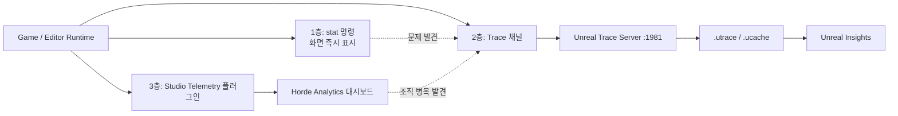

# 09. 관측 — stat / Unreal Insights / Studio Telemetry

> "뭐가 느린지 모르면 아무것도 최적화할 수 없다."
> 이 챕터는 1주차부터 병행한다 — 인프라 투자(05~08장)의 효과를 **숫자로 증명**하는 수단이기도 하다.

---

## 1. 3층 관측 구조

세 시스템은 경쟁 관계가 아니라 **깊이가 다른 층**이다:

| 층 | 도구 | 비유 | 용도 |
|---|---|---|---|
| 1층 | `stat` 명령 | 체온계 | 현장에서 즉시 확인 (프레임, GPU, 스트리밍) |
| 2층 | Trace + Unreal Insights | MRI | 병목의 근본 원인 정밀 분석 |
| 3층 | Studio Telemetry + Horde Analytics | 건강검진 통계 | 팀 전체 워크플로 병목 장기 추적 |



사용 흐름: **재현은 1층, 원인은 2층, 조직 추세는 3층.**

## 2. 1층 — stat 즉석 진단

전 팀원(아티스트 포함)이 외워야 하는 최소 세트:

```
stat unit        ; 프레임 구성: Game(CPU 로직) / Draw(렌더 스레드) / GPU
stat fps         ; 프레임레이트
stat gpu         ; GPU 패스별 비용
stat streaming   ; 텍스처 스트리밍 상태
stat DDC         ; DDC 적중률 (05장 효과 확인)
```

캡처해서 남기기:

```
stat startfile   ; 기록 시작
... 문제 재현 ...
stat stopfile    ; 반드시 종료!
```

- 결과: `<프로젝트>\Saved\Profiling\UnrealStats\*.uestats` → Session Frontend Profiler에서 열기
- **주의**: `stopfile`을 안 하면 PIE 종료 후에도 계속 기록되어 디스크가 불어난다

## 3. 2층 — Trace / Unreal Insights

### 구성 요소

| 요소 | 역할 |
|---|---|
| Trace 채널 | 어떤 이벤트를 기록할지 선택 (cpu, gpu, frame, memory, loadtime...) |
| Unreal Trace Server | `UnrealTraceServer.exe`, recorder 기본 포트 **1981** |
| 산출물 | `.utrace`(이벤트) + `.ucache`(부가 캐시) |
| Unreal Insights | 분석 UI. `Engine\Binaries\Win64\UnrealInsights.exe` (소스 엔진: `RunUBT.bat UnrealInsights Win64 Development`로 빌드) |

### 실행 예시

```
:: 필요한 채널만 켜서 실행 (공식 예시 조합)
MyGame.exe -trace=cpu,frame,bookmark -tracehost=127.0.0.1

:: 원격 수집 / 자동 시작
MyGame.exe -trace=cpu,frame -tracehost=<수집머신IP> -TraceAutoStart
```

### 운영 원칙

- **채널 최소화가 기본기** — Trace는 데이터량이 크다. 채널 preset이 존재하는 이유
- 메모리 분석은 **Memory Insights/LLM**으로 — 구형 STATS MemoryProfiler는 5.3에서 deprecated
- 빌드 팜 산출물에 `.utrace` / `.ucache` / `.uestats`를 **artifact로 보관** → 사후 분석 가능 (07장 야간 잡에 포함)

## 4. 3층 — Studio Telemetry → Horde Analytics

팀 규모가 되면 "누구의 에디터가 오래 걸리나, 쿠킹 시간 추세가 어떤가"를 조직 단위로 본다.

- **Studio Telemetry**: 5.4에 실험적(Experimental) 플러그인으로 추가, 기본 활성. Horde Analytics provider와 JSON 로그 provider 샘플 동봉
- **Horde Analytics** 튜토리얼 전제: **UE 5.5 이상 프로젝트**
- 에디터 공통 워크플로 이벤트는 `EditorTelemetry` 플러그인 경유로 자동 수집

설정 — 플러그인 활성화 후 `Config/DefaultEngine.ini`:

```ini
[StudioTelemetry.Provider.HordeAnalytics]
Name=HordeAnalytics
ProviderModule=AnalyticsET
UsageType=EditorAndClient
APIKeyET=HordeAnalytics.Dev
APIServerET="http://horde.<사내도메인>:13340/"
APIEndpointET="api/v1/telemetry/engine"
```

트러블슈팅: 대시보드에 데이터가 없으면 ① Studio Telemetry 플러그인 활성화 여부 ② `APIServerET` 값 순으로 확인.

### 빌드 잡 메트릭 연계

BuildGraph `Command` 태스크의 `MergeTelemetryWithPrefix`로 하위 UAT 텔레메트리를 상위 잡에 병합 — 야간 빌드를 "반입/HLOD/쿠킹/패키징" 단계별 시계열로 추적한다. **"쿠킹이 지난주보다 20% 느려졌다"를 사람이 아니라 대시보드가 먼저 알게 만드는 것**이 목표.

## 5. 팀 운영 규칙 제안

- [ ] 성능 이슈 제보 시 `stat unit` 스크린샷 + 재현 절차를 필수 첨부 (템플릿화)
- [ ] 정밀 분석 요청은 `.utrace` 파일 첨부 — "느려요"만으로는 접수 불가
- [ ] 주간 회의에 Horde Analytics 추세 그래프 5분 리뷰 (쿠킹 시간, 에디터 부팅 시간, DDC 적중률)
- [ ] 야간 잡 artifact에 trace/stats 파일 보관 주기(예: 2주) 정의

## 다음 챕터

→ [10. 도입 로드맵·체크리스트](10-roadmap.md) — 전체를 단계별로 묶는다.
