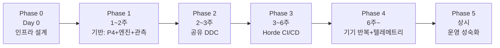

# 10. 도입 로드맵·체크리스트·트러블슈팅 FAQ

> 앞 챕터 전체를 "언제 무엇을, 어떤 완료 조건으로" 실행할지 하나의 계획표로 묶는다.
> 원칙: **여섯 개를 한 번에 완성하려 하지 말 것. 관측부터 확보하고 성숙도를 올린다.**

---

## 1. 단계별 로드맵



### Phase 0 — 인프라 설계 (Day 0) · [02장](02-infrastructure.md)

| 할 일 | 완료 조건 |
|---|---|
| 머신 역할표·네트워크 다이어그램 확정 | Zenserver가 외부에서 도달 불가함이 다이어그램에 명시 |
| Build Agent 1대 확보 | 16코어+/64GB+/NVMe |
| 방화벽 정책 초안 | 1666/13340/7000–7010/8558/1981 정리 |

### Phase 1 — 기반 구축 (1~2주) · [03](03-source-control.md)·[04](04-engine-setup.md)·[09장](09-observability.md)

| 할 일 | 완료 조건 |
|---|---|
| Perforce 서버 + Main/Dev 스트림 + typemap | 두 계정으로 `.umap` 잠금 충돌 재현 성공 |
| 백업 체계 | **복원 리허설 1회 통과** (백업 존재 ≠ 복원 가능) |
| 엔진 선택·팀 표준 BuildConfiguration 커밋 | 깨끗한 PC 온보딩 반나절 통과 |
| stat 최소 세트 팀 교육 | 전원이 `stat unit` 스크린샷을 찍을 수 있음 |

### Phase 2 — 공유 DDC (2~3주) · [05장](05-shared-ddc.md) — **가성비 최고 구간**

| 할 일 | 완료 조건 |
|---|---|
| Shared DDC 구축 (파일공유 → Zenserver) | 새 PC 첫 부팅 셰이더 컴파일 수십 개 이하 |
| `DefaultEngine.ini` 커밋으로 전원 적용 | 개인 설정 의존 없음 |
| DDC fill 수동 1회 | `stat DDC` 적중률 90%+ |

### Phase 3 — Horde CI/CD (3~6주) · [06](06-horde.md)·[07장](07-cicd-buildgraph.md)

| 할 일 | 완료 조건 |
|---|---|
| Horde 서버 + Agent 등록 | 대시보드 Status 정상 |
| Anonymous → OIDC/내장 계정 | **첫 잡 성공 당일 전환** |
| UBA 원격 컴파일 | 워크스테이션 풀빌드 시간 before/after 기록 |
| Presubmit + Incremental 잡 | 깨진 커밋이 실제로 반려되는 것 확인 |
| 야간 잡 (반입→HLOD→Cook→DDC fill) | 아침 에디터 부팅이 예열 상태 |
| UGS 배포 | 아티스트가 컴파일 없이 검증된 CL sync |

### Phase 4 — 기기 반복 + 팀 텔레메트리 (6주~) · [08](08-device-iteration.md)·[09장](09-observability.md)

| 할 일 | 완료 조건 |
|---|---|
| Zen Streaming 디바이스 랩 적용 | 반복 루프 시간 before/after 기록 |
| Studio Telemetry → Horde Analytics | 주간 회의에서 추세 그래프 리뷰 시작 |

### Phase 5 — 운영 성숙화 (상시)

- MongoDB/Redis 외부 분리, Agent 증설, Gauntlet 자동 테스트, 디바이스 관리, selective HLOD rebuild, 릴리스 스트림 운영

## 2. 마스터 체크리스트 (인쇄용)

```
[ ] P0: 역할표 / 네트워크 다이어그램 / 방화벽 초안 / Agent 1대
[ ] P1: P4 서버 / 스트림 / typemap / 백업 복원 리허설 / 엔진 표준 / 온보딩 리허설
[ ] P2: Shared DDC / ini 커밋 / 적중률 90%+ / 첫부팅 검증
[ ] P3: Horde 서버 / 인증 전환 / UBA / Presubmit / 야간 잡 / UGS
[ ] P4: Zen Streaming / Studio Telemetry / 주간 추세 리뷰
[ ] 상시: 브레이크 최우선 수정 규칙 / artifact 보관 주기 / 디스크 용량 알람
```

## 3. 트러블슈팅 FAQ

### 빌드·컴파일

| 증상 | 원인/해결 | 챕터 |
|---|---|---|
| UBA 원격 컴파일이 안 붙음 | 포트 7000–7010 미개방 → 풀 이름 오타 → Agent 상태 순 점검. 로컬 빌드 성공이 선행 조건 | 06 |
| Mac/Linux에서 원격 컴파일 실패 | 튜토리얼이 Windows 기준 — 기대치 조정 | 06 |
| 빌드 팜 CPU 낭비 | `bStopCompilationAfterErrors=true`, 잡을 monolith에서 분할 | 06·07 |
| `Unable to launch ShaderCompileWorker` | SCW 미빌드 — 에디터 빌드 시 함께 빌드 | 04 |

### DDC·셰이더

| 증상 | 원인/해결 | 챕터 |
|---|---|---|
| 전원이 매번 셰이더 수만 개 컴파일 | Shared DDC 미설정 / 8558 차단 | 05 |
| 특정인만 느림 | 개인 ini/환경변수가 Shared를 오버라이드 | 05 |
| 브랜치 전환 직후만 느림 | 정상 — 야간 fill 잡에 해당 브랜치 추가 | 05·07 |
| 특정 셰이더 컴파일 재현 | `Saved/ShaderDebugInfo`의 `DebugCompile.in` + `DebugCompileArgs.txt`. 전처리는 5.4+ `r.ShaderCompiler.BreakOnPreprocessJob=<filter>` | 05 |

### 월드·에셋

| 증상 | 원인/해결 | 챕터 |
|---|---|---|
| HLOD 빌드했는데 에디터에서 안 보임 | 5.4 미만은 PIE/쿡드에서만 가시 — 정상. 5.4+로 올리면 에디터 확인 가능 | 07 |
| 낮(Live Link)과 밤(임포트) 결과 다름 | 정규화 규칙을 Python/Interchange에 코드화, 동일 commandlet 경로 강제 | 07 |
| 두 명이 같은 맵 수정 충돌 | typemap `binary+l` 미설정 | 03 |

### Zen·기기

| 증상 | 원인/해결 | 챕터 |
|---|---|---|
| 스트리밍이 되는지 모르겠음 | `ue.projectstore` 존재 + 좌상단 텍스트 + `zen.showgraphs 1` | 08 |
| 기기에서 Zenserver 접속 실패 | `AllowRemoteNetworkService=true` 여부, 8558 방화벽, 유선 연결 | 08 |
| 스트리밍이 오히려 느림 | Wi-Fi/원거리 VPN — 1GbE 유선 전제 재확인, 컨테이너 방식과 측정 비교 | 08 |

### 관측

| 증상 | 원인/해결 | 챕터 |
|---|---|---|
| 디스크가 계속 참 | `stat stopfile` 누락 / trace 채널 과다 | 09 |
| Horde Analytics에 데이터 없음 | Studio Telemetry 플러그인 활성화 → `APIServerET` 값 | 09 |
| 메모리 분석이 막힘 | 구형 STATS MemoryProfiler는 5.3 deprecated — Memory Insights/LLM 사용 | 09 |

## 4. 마지막 한 장 요약

> **Horde는 빌드 오케스트레이션, HLOD는 원거리 비용 절감, DCC Nightly는 자산 반입 자동화 패턴, Zen Streaming은 빠른 비출시 기기 반복, Shader Build(DDC)는 반복 시간의 핵심 병목, stat/telemetry는 이 모든 것을 관측하는 기반.**
>
> 순서는 언제나: **보이게 만들고(관측) → 캐시하고(DDC) → 자동화하고(CI) → 분산하라(팜).**
