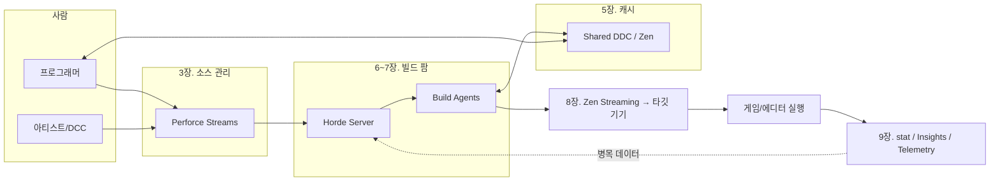

# UE5 조직 빌드 환경 구축 가이드 (초보자용)

> UE5 생태계, CI/CD, 빌드 환경을 **전혀 모르는 사람**도 따라올 수 있도록 쓴 조직용 구축 가이드.
> 근거 문서: [`../ue5-build-farm.md`](../ue5-build-farm.md) (Epic 공식 문서 기반 키워드 분석 보고서)

---

## 이 가이드가 가정하는 조직

| 항목 | 가정 |
|---|---|
| 팀 규모 | 5~30명 (프로그래머 + 아티스트 혼합) |
| 개발 OS | Windows 중심 (Horde/UBA/Zenserver의 production-ready 평가가 Windows에 집중되어 있음) |
| 엔진 | UE 5.4 이상 (가능하면 5.5+) — Horde 빌드 자동화 예제가 5.4+ Perforce 스트림 전제 |
| 소스 관리 | Perforce (Helix Core) — UE 대용량 바이너리 자산 + Horde 공식 예제 기준 |
| 네트워크 | 사내 유선 LAN 1GbE 이상 |

> git 기반 소규모 팀이라도 1~2장(개념·인프라)과 5장(DDC), 9장(관측)은 그대로 적용된다.
> 3장(Perforce)과 6~7장(Horde)은 팀이 커질 때 도입하면 된다.

## 읽는 순서

챕터는 **도입 순서 그대로** 배열되어 있다. 앞 챕터를 건너뛰고 뒤 챕터를 구축하면 대부분 실패한다.

| 챕터 | 내용 | 대상 단계 |
|---|---|---|
| [01. 개념과 용어](01-concepts.md) | UE5 빌드 생태계 전체 그림, 용어집 | 모두 (필독) |
| [02. 인프라 준비](02-infrastructure.md) | 하드웨어·네트워크·머신 역할 설계 | Day 0 |
| [03. 소스 관리 (Perforce)](03-source-control.md) | Helix Core 서버, 스트림 설계, typemap, UGS | 1주차 |
| [04. 엔진과 프로젝트 표준화](04-engine-setup.md) | 소스 엔진 빌드, BuildConfiguration, 프로젝트 규칙 | 1~2주차 |
| [05. 공유 DDC (Zen)](05-shared-ddc.md) | 팀 공용 파생 데이터 캐시 구축 — **가성비 최고 구간** | 2주차 |
| [06. Horde 서버·에이전트](06-horde.md) | 빌드 팜의 관제탑 설치와 보안 | 3~4주차 |
| [07. CI/CD와 BuildGraph](07-cicd-buildgraph.md) | 프리서브밋·야간 빌드·패키징 잡 작성 | 4~6주차 |
| [08. 기기 반복 (Zen Streaming)](08-device-iteration.md) | pak 복사 없이 타깃 기기로 콘텐츠 스트리밍 | 6주차~ |
| [09. 관측 (stat/Insights/Telemetry)](09-observability.md) | 성능 측정 3층 구조와 팀 텔레메트리 | 병행 (1주차부터) |
| [10. 도입 로드맵·체크리스트](10-roadmap.md) | 단계별 완료 조건, 트러블슈팅 FAQ | 운영 |

## 전체 그림 (한 장 요약)

## 문서 규칙

- 명령어는 Windows 기준(`.bat`, PowerShell)으로 작성.
- `<이렇게>` 표기된 값은 조직 환경에 맞게 치환.
- Epic 공식 문서에서 명시하지 않은 값은 **미지정**으로 표기하고 보수적 기본값을 제안.
