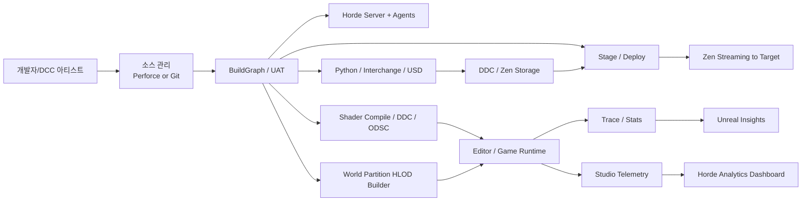
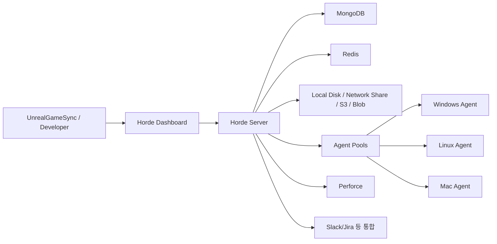
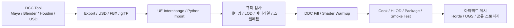
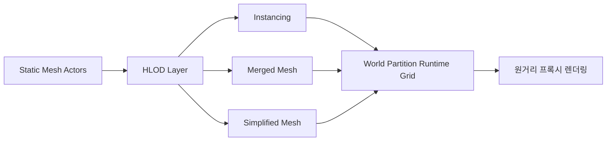
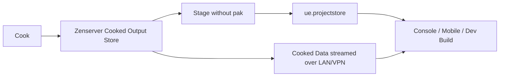
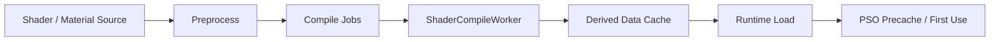
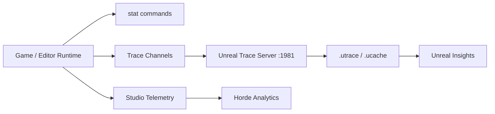

# UE5 개발 환경의 빌드 구성 키워드 분석 보고서

이 보고서는 UE5 개발 환경에서 실무적으로 자주 맞닥뜨리는 빌드·콘텐츠 파이프라인 키워드인 **Horde, HLOD, DCC Nightly Build, Zen Streaming, Shader Build, stat/telemetry**를 “학습용이지만 바로 적용 가능한 수준”으로 정리한 문서다. Epic의 최신 공개 문서 체계에서는 **Horde/Zen/Insights/Studio Telemetry**가 점점 더 긴밀하게 연결되며, 빌드 자동화·원격 실행·스토리지·계측을 하나의 운영 체계로 묶는 방향이 뚜렷하다. 특히 대규모 팀에서는 **Horde + BuildGraph + DDC/Zen + Unreal Insights** 조합이 반복 속도와 관측 가능성을 좌우하고, 오픈월드 프로젝트에서는 **HLOD + World Partition**이 성능과 제작 워크플로를 동시에 결정한다. 반면 **“DCC Nightly Build”는 공식 UE 기능명으로 분리되어 제시되기보다 DCC 연동 기능과 야간 자동화 기능이 분산 문서로 설명**되므로, 본 보고서에서는 이를 **DCC 자산 반입·검증·예열·빌드의 야간 자동화 운영 패턴**으로 정의해 분석한다. citeturn2view0turn24view0turn9view0turn17view0turn22view0turn22view3

## 범위와 비교 관점

본 보고서는 우선적으로 **Epic 공식 문서와 릴리즈 노트**를 기준으로 정리했다. 기준 문서는 주로 UE 5.8 문서와, 변경 이력 확인을 위해 5.1·5.2·5.3·5.4·5.5 릴리즈 노트를 함께 사용했다. 또한 “미지정” 표기는 Epic이 공개 문서에서 **명시적 기능명·호환 범위·운영 방식을 직접 규정하지 않은 경우**에 사용했다. citeturn21search2turn31search0turn18view2turn30view1turn18view1turn35search0

| 키워드 | 핵심 목적 | 대표 구성요소 | 설정 난이도 | 실무 우선순위 | 버전·비고 |
|---|---|---|---|---|---|
| **Horde** | 분산 빌드, 원격 실행, CI/CD, 테스트 자동화 | Horde Server, Agent, BuildGraph, UBA, Dashboard, MongoDB, Redis, Perforce 연동 citeturn2view0turn28view0turn24view3 | 높음 | 매우 높음 | Build automation 예시는 UE 5.4+ Perforce 스트림 기준, UBA 원격 컴파일 튜토리얼은 Windows 지원 중심으로 설명됨. citeturn2view1turn33search1 |
| **HLOD** | 오픈월드 원거리 렌더링 비용 절감 | HLOD Layer, Proxy Mesh, World Partition, Builder Commandlet citeturn6view0turn6view1 | 중간~높음 | 매우 높음 | 5.4부터 생성된 HLOD를 에디터에서 직접 확인 가능, 5.1/5.2에서 Water/HLOD modifiers 등 확장. citeturn30view0turn30view1turn30view2 |
| **DCC Nightly Build** | DCC 자산 반입·검증·예열·스모크 테스트 자동화 | Interchange, Python, Live Link/USD, BuildGraph, DDC fill, 소스컨트롤/아티팩트 저장소 citeturn22view0turn22view1turn22view3turn19view0turn24view0 | 높음 | 높음 | 공식 독립 기능명은 미지정. 실무 운영 패턴으로 해석하는 것이 적절함. citeturn22view0turn22view3turn24view0 |
| **Zen Streaming** | 비출시 빌드에서 빠른 스테이징·디플로이·타깃 스트리밍 | Zenserver, Cooked Output Store, `ue.projectstore`, ushell/UAT staging, Io Store/컨테이너 전환 citeturn9view1turn9view2turn9view3 | 중간 | 높음 | 신뢰 네트워크와 non-shipping 빌드 권장, Zenserver는 인증 없는 서버. citeturn26view0turn26view2 |
| **Shader Build** | 셰이더 컴파일·캐시·디버깅·초기 로딩/반복 시간 최적화 | ShaderCompileWorker, DDC, ODSC, XGE/UBA, PSO precache, ConsoleVariables citeturn19view2turn19view3turn18view2turn29view2turn35search0turn15search21 | 중간~높음 | 매우 높음 | 5.1에서 ODSC 기본 활성, 5.3부터 구형 STATS 메모리 프로파일러보다 Trace/Insights 권장. citeturn18view2turn18view1 |
| **stat/telemetry** | 로컬 성능 측정, 고속 추적, 팀 단위 운영 텔레메트리 수집 | Stat Commands, Stats System, Trace, Unreal Trace Server, Unreal Insights, Studio Telemetry, Horde Analytics citeturn17view1turn17view4turn17view0turn17view3turn17view2turn21search9 | 낮음~중간 | 매우 높음 | Studio Telemetry는 5.4에 실험적 플러그인으로 추가, Horde Analytics 튜토리얼은 5.5+ 대상. citeturn31search0turn21search2 |

아래 다이어그램은 이 보고서가 다루는 키워드들이 실제 UE5 빌드 환경에서 어떻게 맞물리는지 한 장으로 요약한 것이다. 이 구조는 Epic 문서에 흩어져 있는 BuildGraph, Horde, Zen, HLOD, Insights, Studio Telemetry의 관계를 실무 관점에서 재구성한 것이다. citeturn24view0turn2view0turn9view1turn6view1turn17view0turn17view2



## 분산 빌드와 야간 자동화

### Horde

**정의**  
Horde는 Epic이 포트나이트, Unreal Engine, 기타 프로젝트 개발에 사용하는 워크플로를 지원하는 서비스 집합이며, 원격 실행, 빌드 자동화, 테스트 자동화, 스튜디오 분석, UnrealGameSync 메타데이터, 디바이스 관리 기능을 제공한다. BuildGraph는 이 Horde 잡의 스크립트 언어로 쓰이며, 노드·태스크·에이전트·트리거를 바탕으로 대규모 빌드 파이프라인을 정의한다. citeturn2view0turn24view0turn24view3

**UE5에서의 역할과 중요성**  
UE5 팀 규모가 커질수록 로컬 빌드만으로는 C++ 컴파일, 패키징, 프리서브밋 검증, 자동 테스트, 설치형 에디터 배포를 감당하기 어렵다. Horde는 이런 병목을 **원격 실행과 BuildGraph 기반 CI/CD**로 흡수하며, Epic 문서는 실제 기본 잡 템플릿으로 **Incremental Build, Packaged Project Build, Presubmit Tests, Installed Engine Build, Remote Execution Test**를 제시한다. citeturn2view1turn3view2

**구성 요소와 아키텍처**  
Horde의 코어는 Dashboard, Server, Agent, MongoDB, Redis, Storage 계층이다. 서버는 Windows와 Linux를 지원하고, 에이전트는 Windows·Mac·Linux에서 동작한다. 기본 설치형은 테스트와 소규모 환경에 적합하며, 프로덕션에서는 MongoDB/Redis를 외부로 분리하는 구성을 권장한다. citeturn28view0turn28view1



**실제 구성·설정 단계**  
Horde Build Automation 튜토리얼 기준으로, 서버 설정 파일은 Windows 설치 시 `C:\ProgramData\Epic\Horde\Server` 아래에 놓이며, `server.json`은 머신 로컬 설정, `globals.json`은 다중 인스턴스 공통 설정을 담당한다. 기본 예제 배포는 Perforce `perforceClusters`를 구성하고, `projects` 항목에서 프로젝트/스트림 JSON을 활성화한 뒤 대시보드 기본 주소인 `http://localhost:13340`에서 상태를 확인하는 흐름으로 설명된다. 빌드 자동화 예제는 **UE 5.4 이상 Perforce stream**을 전제로 하며, legacy branch는 현재 지원되지 않는다. citeturn2view1turn3view2

원격 C++ 컴파일을 켜려면 UBT의 `BuildConfiguration.xml`에서 `bAllowUBAExecutor`와 Horde 서버/풀 정보를 지정한다. UBT는 여러 위치의 XML을 읽지만, 프로젝트별 설정은 `<PROJECT_DIRECTORY>/Saved/UnrealBuildTool/BuildConfiguration.xml`에 두는 방식이 문서상 권장된다. 튜토리얼은 워크스테이션과 Horde Agent 간 **포트 7000–7010 연결성**을 요구한다. citeturn2view2turn2view3

```xml
<?xml version="1.0" encoding="utf-8" ?>
<Configuration xmlns="https://www.unrealengine.com/BuildConfiguration">
  <BuildConfiguration>
    <bAllowUBAExecutor>true</bAllowUBAExecutor>
  </BuildConfiguration>

  <Horde>
    <Server>http://horde.my-studio.local:13340</Server>
    <WindowsPool>Win-UE5</WindowsPool>
  </Horde>

  <UnrealBuildAccelerator>
    <bLaunchVisualizer>true</bLaunchVisualizer>
  </UnrealBuildAccelerator>
</Configuration>
```

위 XML은 Epic 튜토리얼 스니펫을 실무 호스트명 형태로 치환한 예시다. 또한 Build Configuration 문서상 `RemoteExecutorPriority`, `bAllowUBAExecutor`, `bAllowXGE`, `bUseUBTMakefiles`, `MaxParallelActions`, `bStopCompilationAfterErrors`, `Horde.Server`, `Horde.WindowsPool`, `Horde.MaxCores`, `Horde.MaxWorkers` 같은 옵션을 함께 조정할 수 있다. citeturn2view3turn29view0turn29view3turn29view4

**권한·네트워크 고려사항**  
권한 모델은 `Anonymous`, `OpenID Connect`, `Built-in user accounts` 세 가지다. Epic 문서는 **Anonymous는 데모/시작용이며, 프로덕션에서는 OIDC 또는 내장 계정 사용을 권장**한다. 특히 원격 컴파일 튜토리얼은 Anonymous 모드에서는 모든 사용자가 원격 컴파일 전체 권한을 갖기 때문에 테스트 단계에서만 쓰고 곧바로 `Horde` 또는 `OpenIdConnect`로 전환하라고 경고한다. 서버 설정 차원에서는 `server.json`의 `httpPort`, `httpsPort`, `AuthMethod`, OIDC 관련 값들이 핵심이다. citeturn28view3turn4search9turn28view2turn28view4

**모범 사례와 성능 최적화 팁**  
실무적으로는 로컬 빌드 성공을 먼저 보장한 뒤 UBA/Horde를 붙이는 것이 중요하다. 그다음 `bUseUBTMakefiles`로 반복 빌드 속도를 끌어올리고, `bStopCompilationAfterErrors`로 빌드 팜 CPU 낭비를 줄이며, `MaxParallelActions`와 Horde 풀/워커 수를 별도 관리하는 편이 좋다. BuildGraph 자체도 병렬 노드 실행, 공유 스토리지 전송, 실패 통지, 수동 트리거를 전제로 설계되어 있으므로, 잡을 “하나의 거대한 monolith”가 아니라 **Compile / Cook / HLOD / Test / Package / Publish**로 쪼개는 편이 운영성이 좋다. citeturn24view0turn24view1turn29view3turn29view4

**일반적 문제와 해결책**  
문서상 자주 부딪히는 문제는 네 가지다. 첫째, Perforce 연결이 잘못되면 `Status` 페이지에서 즉시 드러난다. 둘째, 포트 7000–7010 미개방이면 UBA 연결이 성립하지 않는다. 셋째, Anonymous 모드를 장기간 유지하면 원격 실행 권한이 과도하게 열려 있다. 넷째, UBA 튜토리얼은 여전히 Windows 지원을 기준으로 작성되어 있어 Mac/Linux 원격 C++ 컴파일 기대치는 낮게 잡아야 한다. citeturn3view2turn2view3turn28view3turn33search1

**관련 도구·플러그인·버전 호환성**  
Horde는 BuildGraph, UBA, Automation Tool, Gauntlet, UnrealGameSync와 밀접하게 연결된다. 5.4 릴리즈 노트는 Horde를 “out-of-the-box CI solution”으로 설명했고, UBA를 Windows C++ 컴파일 중심 베타로 소개했으며, macOS/Linux 및 shader compilation은 후속 릴리즈 목표로 적었다. 반면 5.5 릴리즈 노트 검색 스니펫은 UBA를 **C++와 Shader Compilation을 위한 로컬/분산 컴파일 솔루션**으로 설명한다. 따라서 현 시점 문서 해석은 “기능 확대 방향은 명확하지만, 실제 안정적 채택 범위는 버전·플랫폼별 검증이 필요”가 가장 보수적이다. citeturn31search0turn35search0turn33search1

**실무 예제**  
아래 명령은 Epic 문서의 BuildGraph 사용법을 그대로 적용한 базe 형태다.

```bat
:: 예시: 설치형 엔진 빌드
Engine\Build\BatchFiles\RunUAT.bat BuildGraph ^
  -Script=Engine/Build/InstalledEngineBuild.xml ^
  -Target="Make Installed Build Win64" ^
  -set:HostPlatformOnly=true ^
  -Clean
```

```bat
:: 예시: 스크립트 목록 확인
Engine\Build\BatchFiles\RunUAT.bat BuildGraph ^
  -Script=Engine/Build/Graph/Examples/AllExamples.xml ^
  -ListOnly
```

위 둘은 BuildGraph 사용법 문서의 공식 예시를 Windows 형태로 재배치한 것이다. 설치형 빌드, 아티스트용 에디터 배포, 프리서브밋 검증, 패키징 자동화의 출발점으로 적합하다. citeturn24view1

### DCC Nightly Build

**정의**  
Epic 공식 문서는 “DCC Nightly Build”라는 단일 기능명을 별도로 정의하지 않는다. 대신 **DCC 연동은 Live Link/USD·Interchange·Blender/Maya 계열 도구**, 자동화는 **BuildGraph·Python commandlet·DDC fill** 문서로 분산되어 있다. 따라서 본 보고서에서는 이를 **“야간 배치에서 DCC 자산을 UE로 반입하고, 검증·재생성·DDC 예열·스모크 테스트까지 수행하는 운영 패턴”**으로 정의한다. 정확한 공식 기능명은 **미지정**이다. citeturn22view0turn22view1turn22view3turn19view0turn24view0

**UE5에서의 역할과 중요성**  
이 패턴은 “아티스트의 작업 시간과 빌드 팜 시간을 분리”한다는 점에서 중요하다. 낮에는 DCC에서 반복 작업을 수행하고, 밤에는 파이프라인이 자동으로 **Interchange import, Python 기반 정규화, HLOD/쿡/패키징, DDC fill**을 돌려서 다음 날 아침 에디터와 타깃 빌드를 바로 사용할 수 있게 만든다. Epic 문서는 DDC를 밤에 미리 채우는 작업을 실제로 내부에서 수행한다고 설명한다. citeturn19view0turn24view0turn22view0

**구성 요소와 아키텍처**  
DCC 쪽에서는 Maya/Houdini 같은 외부 툴과 Live Link/USD가 실시간 프리뷰 역할을 하고, 야간 빌드에서는 파일 기반 반입이 기본이다. UE 쪽에서는 Interchange가 확장 가능한 임포트 파이프라인을 제공하며, Python 스크립트를 Startup Script나 commandlet 형태로 실행할 수 있다. BuildGraph는 이 전체를 오케스트레이션하는 상위 계층이 된다. citeturn22view3turn22view0turn22view1turn24view0



**실제 구성·설정 단계**  
Interchange는 Python·Blueprint·C++로 커스터마이즈할 수 있고, Python 스크립트는 `UnrealEditor-Cmd.exe ... -ExecutePythonScript=...` 또는 `-run=pythonscript -script=...` 형태로 실행할 수 있다. USD 기반 Live Link는 Unreal과 DCC 양쪽 플러그인을 켜고, Unreal에서는 Live Link와 USD Importer를 활성화해야 한다. 원격 Python 실행을 쓰는 경우에는 Python Project Settings에서 multicast endpoint, bind address, 버퍼 크기 등 네트워크 설정을 조정한다. citeturn22view0turn22view1turn22view2turn22view3

**권한·네트워크 고려사항**  
원격 Python 실행은 네트워크에 노출되는 순간 보안 민감도가 커진다. Python Settings 문서는 bind address를 `0.0.0.0`처럼 모든 어댑터에 바인딩할 수 있음을 설명하고, Remote Control/Python 관련 API 문서는 외부 접근이 가능하면 취약점 표면이 넓어진다고 경고한다. 따라서 야간 자동화는 가능하면 **헤드리스 commandlet + 빌드 에이전트 로컬 실행**으로 구성하고, DCC↔Editor 즉시 연동은 사내망/VPN으로 제한하는 편이 안전하다. citeturn22view2turn14search16

**모범 사례와 성능 최적화 팁**  
핵심은 “임포트만 하지 말고 예열까지 같이 하라”는 점이다. 신규 에셋이 들어오면 DDC fill을 함께 수행해 다음날 첫 에디터 부팅·머티리얼 미리보기·플랫폼 쿠킹 시간을 줄이는 편이 좋다. 또한 Live Link는 대화형 검수용, 야간 빌드는 파일 기반 재현성 확보용으로 역할을 분리하는 것이 일반적으로 안정적이다. 공식 Interchange 문서가 Python 기반 커스텀 파이프라인을 지원하므로, 프로젝트 규칙을 그 안에 넣는 방식이 운영상 가장 낫다. citeturn19view0turn22view0turn22view3

**일반적 문제와 해결책**  
가장 흔한 문제는 DCC와 UE가 “같은 씬을 보고 있지만 같은 규칙을 쓰지 않는” 상태다. 이 경우 낮에는 Live Link 프리뷰가 맞는데, 밤에는 임포트 규칙으로 메시 축척·LOD·머티리얼 슬롯이 달라질 수 있다. 해결책은 Interchange 파이프라인이나 Python 스크립트에서 **정규화 규칙을 코드화**하고, 야간 빌드에서 항상 같은 commandlet 경로를 타게 만드는 것이다. 또 EpicGamesExt BlenderTools의 공개 릴리스 2.3.0은 **Blender 3.3/3.4, Unreal 5.1** 테스트 통과 기준을 명시하므로, UE 5.8 프로젝트라면 그대로 신뢰하기보다 사내 검증 상태를 별도 관리해야 한다. citeturn22view0turn22view1turn22view5

**관련 도구·플러그인·버전 호환성**  
Interchange는 5.1 릴리즈에서 “고성능·커스터마이즈 가능한 새 Import Framework”로 도입되었다. USD Live Link 워크플로는 Maya/Houdini 등 DCC와의 재연결 시나리오를 공식 튜토리얼이 설명한다. Blender 연동은 EpicGamesExt의 BlenderTools/Send to Unreal이 대표적이지만, 공개 확인 가능한 최신 릴리스 정보는 2.3.0이며 테스트 매트릭스는 Unreal 5.1 기준으로 제시되어 있다. 정확한 UE 5.8 호환 범위는 공식 릴리스 노트상 **미지정**으로 보는 것이 보수적이다. citeturn18view2turn22view3turn22view4turn22view5

**실무 예제**  
아래는 공식 기능들을 조합한 **야간 DCC 파이프라인 예시**다. Epic 문서의 BuildGraph `Commandlet`/`Command` 태스크, Python commandlet, DDC fill, HLOD builder를 한 번에 묶은 형태다. 코드는 실무형 예시이며, 프로젝트별 임포트 자세한 로직은 미지정이다. citeturn23view0turn22view1turn19view0turn6view1

```xml
<BuildGraph>
  <Agent Name="NightlyContent">
    <Node Name="ImportDccAssets">
      <Commandlet
        Name="pythonscript"
        Project="MyProject.uproject"
        Arguments='-script="D:\CI\Scripts\import_dcc_assets.py"' />
    </Node>

    <Node Name="BuildWorldHLODs" Requires="ImportDccAssets">
      <Commandlet
        Name="WorldPartitionBuilderCommandlet"
        Project="MyProject.uproject"
        Arguments='"/Game/Maps/OpenWorld" -AllowCommandletRendering -builder=WorldPartitionHLODsBuilder' />
    </Node>

    <Node Name="PrimeDDC" Requires="BuildWorldHLODs">
      <Command
        Name="DerivedDataCache"
        Arguments='"MyProject.uproject" -run=DerivedDataCache -fill' />
    </Node>
  </Agent>
</BuildGraph>
```

```bat
UnrealEditor-Cmd.exe "D:\Proj\MyProject.uproject" ^
  -run=pythonscript ^
  -script="D:\CI\Scripts\import_dcc_assets.py"
```

## 월드 스트리밍과 원거리 최적화

### HLOD

**정의**  
HLOD는 여러 Static Mesh Actor를 먼 거리에서 **하나의 프록시 메시와 머티리얼**로 묶어 드로우 콜 수를 줄이는 시스템이다. World Partition 문맥에서는 HLOD Layer를 통해 대량의 액터를 조직하고, 언로드된 그리드 셀을 시각화하는 용도로도 쓰인다. citeturn6view2turn6view0

**UE5에서의 역할과 중요성**  
UE5 오픈월드에서는 Nanite가 있어도 “원거리에서 수많은 오브젝트를 묶는 문제”는 별개다. HLOD는 World Partition과 결합될 때 특히 중요하며, 렌더 대상 액터 수를 줄여 프레임당 드로우 콜을 낮춘다. Epic 문서가 반복해서 “large open worlds”에 특히 유용하다고 강조하는 이유가 여기에 있다. citeturn6view2turn6view0

**구성 요소와 아키텍처**  
World Partition HLOD의 핵심 자산은 `HLOD Layer`다. 레이어 타입은 `Instancing`, `Merged Mesh`, `Simplified Mesh` 세 가지가 있고, `Always Loaded`, `Cell Size`, `Loading Range`, `Parent Layer`, `HLODMaterial` 같은 설정을 갖는다. Instancing은 수목·임포스터 계열에, Merged/Simplified는 원거리 건물 군집에 적합하다. citeturn6view0



**실제 구성·설정 단계**  
콘텐츠 브라우저에서 HLOD Layer asset을 만든 뒤, 월드/액터에 할당하고, Build 메뉴 또는 `WorldPartitionBuilderCommandlet`의 `WorldPartitionHLODsBuilder`로 생성한다. 공식 명령 예시는 아래와 같다. BuildGraph 예제 목록에는 아예 `BuildWorldPartitionHLODs.xml` 스크립트가 포함되어 있으므로, CI로 보내기에도 구조가 잘 맞는다. citeturn6view1turn24view1turn7search3

```bat
UnrealEditor.exe "C:\Proj\MyProject.uproject" "/Game/Maps/OpenWorldTest" ^
  -run=WorldPartitionBuilderCommandlet ^
  -AllowCommandletRendering ^
  -builder=WorldPartitionHLODsBuilder
```

**모범 사례와 성능 최적화 팁**  
레벨 전체를 한 번에 HLOD 하나로 뭉치는 방식은 좋지 않다. foliage·군집 오브젝트는 Instancing, 건물 블록은 Merged/Simplified, 항상 보여야 하는 랜드마크는 `Always Loaded` 여부를 신중히 판단하는 식으로 레이어를 분할하는 편이 보통 낫다. 또한 HLOD 빌드는 비싸므로, 야간 빌드나 변경 감지 기반 selective rebuild에 태우는 것이 운영 효율이 좋다. citeturn6view0turn6view1turn24view1

**일반적 문제와 해결책**  
대표적인 현업 문제는 “빌드했는데 에디터에서 안 보인다”는 것이다. 5.4 이전에는 생성된 HLOD가 주로 PIE/쿡드 빌드에서만 가시적이었지만, 5.4부터는 에디터 안에서 직접 볼 수 있고 개별 업데이트도 가능해졌다. 또 5.2에서는 HLOD modifier 기반 파괴형 HLOD와 런타임 수정 지원이 추가되었고, 5.1에서는 Water Body Actor 지원이 강화되었다. 즉 **버전별 워크플로 차이**를 반드시 감안해야 한다. citeturn30view0turn30view1turn30view2

**관련 도구·플러그인·버전 호환성**  
HLOD는 World Partition, Data Layers, PCG와 강하게 얽힌다. 5.2 릴리즈 노트는 World Partition HLOD 관련 이벤트, 편집성, modifier 지원, 런타임 수정 지원을 확장했고, 5.4는 Editor visibility를 개선했다. 따라서 오픈월드 팀이라면 HLOD를 단순 렌더 옵션이 아니라 **월드 빌드 파이프라인의 일부**로 보는 것이 맞다. citeturn30view1turn30view0turn7search15

**실무 예제**  
아래는 학습용 설정 체크리스트다.

```ini
; 개념형 예시
; HLOD Layer A = foliage / instancing
; HLOD Layer B = buildings / simplified mesh
; HLOD Layer C = skyline landmark / always loaded
```

이 예시는 문서의 레이어 타입과 주요 옵션을 실무적으로 재배치한 것이다. 실제 셀 크기, 로딩 범위, HLOD 머티리얼 값은 프로젝트별 시야거리·메모리 버짓에 따라 달라지므로 공개 문서 기준 **미지정**이다. citeturn6view0

### Zen Streaming

**정의**  
Zen Streaming은 **Zenserver를 cooked output store로 사용할 때, 컨테이너 파일 없이 stage/deploy하여 타깃 장치가 Zenserver에서 콘텐츠를 직접 가져오게 하는 비출시 빌드용 스트리밍 워크플로**다. 이것은 Zen Loader와 동일 개념이 아니며, Zen Loader는 런타임 로더이고, Zen Streaming은 스테이징/디플로이 전략이다. citeturn9view1turn9view2turn9view3

**UE5에서의 역할과 중요성**  
대형 프로젝트는 cooked output이 수백만 개의 파일로 퍼져 파일시스템 오버헤드를 유발할 수 있다. Zenserver cooked output store는 이 loose file 문제를 완화하고, Zen Streaming은 여기서 한 걸음 더 나아가 stage/deploy 복사 비용 자체를 줄인다. Epic 문서는 5.5 시점에 Zenserver cooked output store가 기본값이 아니며 opt-in이라고 설명한다. citeturn9view1

**구성 요소와 아키텍처**  
핵심 부품은 Zenserver, cooked output store, staging 정책(`pak` vs `nopak`/`zen`), 그리고 `ue.projectstore` 메타파일이다. `ue.projectstore`에는 host/port/project/platform 식별 정보가 담기며, 런타임은 이 파일이 있으면 Zenserver 접속을 시도한다. 반대로 컨테이너(`.pak/.utoc/.ucas`)로 stage하면 일반 Zen Loader 경로를 탄다. citeturn9view1turn25view0turn9view3



**실제 구성·설정 단계**  
먼저 Project Settings > Packaging에서 **Use Zenserver as cooked output store**를 켜고, `Use Io Store`가 활성화되어 있는지 확인한다. 이후 Zen Streaming을 실제 타깃에서 쓰려면 `DefaultEngine.ini`에 `[Zen.AutoLaunch]` 섹션을 추가해 Zenserver가 에디터 종료 후에도 살아 있고 원격 요청을 받도록 바꿔야 한다. Editor의 Play on Device는 `Pack Files for Launch = Use loose files`여야 하며, ushell에서는 `.stage game <platform>`이 기본적으로 비컨테이너 경로를 사용한다. 컨테이너로 강제 전환하려면 `pak` 매개변수를 명시한다. citeturn9view1turn26view0turn9view2

```ini
[Zen.AutoLaunch]
LimitProcessLifetime=false
AllowRemoteNetworkService=true
```

```text
.cook game Win64
.stage game Win64
.deploy game Win64
.run game Win64

:: 컨테이너 파일 강제
.stage game Win64 development pak
```

**권한·네트워크 고려사항**  
이 항목은 중요하다. Epic 문서는 Zenserver를 **인증 없는 스토리지 서버**라고 명시하며, 도달 가능한 사용자는 모두 read/write/delete 권한을 갖는 것으로 본다. 따라서 인터넷 같은 공개망이나 비신뢰 네트워크에서는 사용을 권장하지 않고, 사무실 LAN 또는 VPN 같은 신뢰 환경, 그리고 debug/development/test 빌드에서만 쓰라고 명시한다. 기본 상태의 Zenserver는 로컬 머신 요청만 받으며 프로세스가 필요할 때만 살아 있으므로, 스트리밍 전에 설정을 바꿔야 한다. citeturn26view0turn26view2turn26view3

공유 DDC 관점에서 Zenserver는 기본 **HTTP/1.1 포트 8558**, 비암호화 통신, 비프록시 직접 연결, 로드밸런서 미권장이라는 운영 제약을 가진다. 또한 UE 5.5 문서 기준으로 공유 DDC 용도에서 production-ready 평가는 Windows 버전에만 부여되어 있고, Linux는 로컬 DDC 수준으로 설명된다. 여러 UE 버전을 같이 쓸 경우에는 **가장 최신 UE 릴리스 번들의 Zenserver**를 사용하는 후방 호환 전략이 권장된다. citeturn25view4

**모범 사례와 성능 최적화 팁**  
Zen Streaming은 “항상 더 좋다”가 아니다. 네트워크 거리가 짧고, 1GbE 이상 유선 환경이며, Wi‑Fi를 피할 수 있고, shipping 빌드가 아닐 때 가장 효과적이다. Epic 내부 가이드도 1Gbps는 인게임에 충분하고 10Gbps는 부팅/로딩 개선에 유리하다고 말한다. 따라서 사내 디바이스 랩과 개발자 워크스테이션 사이에서 반복 배포 속도를 끌어올릴 때 가장 적합하다. citeturn26view0

**일반적 문제와 해결책**  
스트리밍이 실제로 켜졌는지 헷갈릴 때는 `Saved/StagedBuilds/<Platform>` 아래의 `ue.projectstore` 존재를 확인하면 된다. 또한 개발/디버그 런타임에서 좌상단의 “ZenServer streaming from …” 텍스트, `zen.showgraphs 1` 콘솔 명령으로 스트리밍 throughput 그래프를 볼 수 있다. 필요하면 `-ZenStoreHost`, `-ZenStorePort`, `-ZenStoreProject`, `-ZenStorePlatform`으로 런타임 연결 파라미터를 override할 수 있다. citeturn25view0

**관련 도구·플러그인·버전 호환성**  
Zen Storage Server는 로컬·공유·클라우드 스토리지를 지원하며, UE 5.4부터 로컬 DDC 기본값이 Filesystem에서 Zen Store 계열로 이동했다. Zen Loader는 UE5의 런타임 로더이고, Zen Streaming은 cooked output store를 기반으로 한 stage/deploy 전략이므로 둘을 혼동하면 안 된다. citeturn19view1turn9view0turn9view3

## 셰이더 빌드 파이프라인

### Shader Build

**정의**  
Shader Build는 머티리얼·글로벌 셰이더의 컴파일, 캐시, 디버깅, 반복 최적화를 포괄하는 운영 개념이다. UE는 컴파일된 셰이더를 DDC에 저장하고, 쿡 시에는 머티리얼 셰이더를 패키지에 inline 하며 글로벌 셰이더는 별도 파일로 관리한다. citeturn19view2

**UE5에서의 역할과 중요성**  
UE 팀이 체감하는 “느린 첫 부팅”, “머티리얼 열 때 멈춤”, “맵 열면 셰이더 수만 개 재컴파일”의 대부분은 결국 Shader Build 문제다. 5.1 릴리즈에서 Editor On-Demand Shader Compilation(ODSC)이 기본 활성화되었고, 화면에 실제로 필요한 셰이더만 컴파일하도록 바뀌어 대규모 프로젝트의 반복 시간을 크게 줄였다. citeturn18view2

**구성 요소와 아키텍처**  
셰이더 파이프라인은 대략적으로 **Shader source / Material graph → preprocess → compile job → ShaderCompileWorker 또는 관련 컴파일 경로 → DDC 저장 → runtime load / PSO precache** 순으로 본다. `FShaderCompilingManager`는 비동기·병렬 셰이더 컴파일을 관리하며, `FShaderCompileThreadRunnable`은 필요할 때 ShaderCompileWorker 프로세스를 띄워 입출력을 주고받는다. 5.4부터는 셰이더 전처리가 ShaderCompileWorker가 아니라 editor/cook 프로세스에서 수행된다는 점도 중요하다. citeturn15search4turn15search14turn19view3



**실제 구성·설정 단계**  
ODSC는 기본 활성화이며 `r.ShaderCompiler.JobCacheDDC`로 제어된다. DDC는 로컬 Zen Store, DDC Pak, Shared DDC, Cloud DDC를 사용할 수 있으며, Epic은 엔진 콘텐츠용 `Compressed.ddp`를 제공해 엔진 셰이더 초기 컴파일 일부를 줄인다. Shared DDC는 특히 팀 전체가 같은 셰이더 결과를 재활용하게 해 준다. citeturn18view2turn19view1

분산 셰이더 컴파일 관점에서 Build Configuration 문서는 `bUseXGEController`가 **XGE interception interface를 통한 distributed shader compilation**에 필요하다고 명시한다. 한편 5.5 릴리즈 노트 검색 스니펫은 UBA를 **C++와 Shader Compilation**에 쓰는 로컬/분산 솔루션으로 설명한다. 따라서 최신 실무에서는 “기본적으로는 XGE 문서가 가장 명시적이고, UBA는 버전별 적용 가능성 확인 후 도입”이 보수적인 접근이다. citeturn29view2turn35search0

```ini
; ConsoleVariables.ini 예시
r.ShaderDevelopmentMode=1
r.DumpShaderDebugInfo=1
r.ShaderCompiler.JobCacheDDC=1
```

이 예시는 공식 디버깅/ODSC 문서의 옵션을 묶은 학습용 구성이다. `r.ShaderDevelopmentMode`는 컴파일 오류 시 재시도와 디버깅 편의를 제공하고, `r.DumpShaderDebugInfo=1`은 `Saved/ShaderDebugInfo`에 전처리 소스·배치 파일·디버그 입력을 기록한다. citeturn19view2turn19view3turn18view2

**모범 사례와 성능 최적화 팁**  
첫째, Shared DDC 또는 Zen 기반 DDC를 반드시 마련하라. 셰이더를 빌드한 한 명의 결과를 다른 사용자가 재사용할 수 있기 때문이다. 둘째, ODSC를 되돌리는 설정을 습관적으로 끄지 말고, 필요한 시스템만 “완전 셰이더 맵”을 요구하도록 조정하라. 셋째, PSO precaching을 병행해 런타임 첫 사용 hitch를 줄여라. Epic 문서는 일부 글로벌 셰이더 PSO가 기본적으로 precache된다고 설명한다. citeturn19view1turn18view2turn15search21

**일반적 문제와 해결책**  
문서상 대표 트러블슈팅 포인트는 세 가지다. “Unable to launch ShaderCompileWorker”가 뜨면 SCW가 아직 빌드되지 않은 경우가 많다. 셰이더 컴파일 내부를 보고 싶다면 `Saved/ShaderDebugInfo` 아래의 `DebugCompile.in`, `DebugCompileArgs.txt`를 이용해 특정 컴파일 잡을 재현할 수 있다. 전처리 자체를 디버깅하려면 5.4+에서 `r.ShaderCompiler.BreakOnPreprocessJob=<filter>`를 쓰면 된다. citeturn33search12turn19view3

**관련 도구·플러그인·버전 호환성**  
ODSC는 5.1 기본 활성, 전처리 경로 변화는 5.4, UBA의 셰이더 지원 언급은 5.5 릴리즈 노트 기준이다. 또 엔진의 구형 STATS 메모리 프로파일러는 5.3에서 사실상 권장 대상에서 빠지고 Trace/Memory Insights가 권장 경로가 되었다. 셰이더 빌드 최적화는 결국 **DDC·Build Farm·Trace**를 함께 다뤄야 제대로 된다. citeturn18view2turn19view3turn35search0turn18view1

**실무 예제**  
아래는 DDC 예열 명령이다. 야간 빌드나 브랜치 전환 직후 warm-up 단계로 유용하다.

```bat
Engine\Binaries\Win64\UnrealEditor.exe MyProject.uproject -run=DerivedDataCache -fill
```

Epic은 이 작업을 nightly로 수행해 DDC를 primed 상태로 유지한다고 문서에 적고 있으며, 필요하면 `-DDC=CreatePak`으로 배포형 DDC Pak 생성도 가능하다. citeturn19view0

## 계측과 팀 운영 텔레메트리

### stat/telemetry

**정의**  
UE5의 `stat`는 인게임·에디터 콘솔에서 즉시 볼 수 있는 통계 계층이고, `Trace / Unreal Insights`는 고속 이벤트 추적 기반의 상세 분석 체계이며, `Studio Telemetry / Horde Analytics`는 팀 워크플로 메트릭을 장기간 수집하는 운영 텔레메트리 계층이다. 세 시스템은 경쟁 관계가 아니라 **깊이가 다른 관측 계층**이다. citeturn17view1turn17view4turn17view0turn17view2turn21search9

**UE5에서의 역할과 중요성**  
가벼운 현장 진단은 `stat unit`, `stat fps`, `stat gpu`, `stat streaming`으로 충분한 경우가 많다. 그러나 병목 원인을 정확히 잡으려면 Trace/Insights가 필요하고, 여러 명의 워크플로 병목을 팀 단위로 보려면 Studio Telemetry와 Horde Analytics가 맞다. Epic 문서도 Unreal Insights를 “high data rates” 텔레메트리 캡처/분석 스위트로 정의한다. citeturn17view1turn17view0turn17view2

**구성 요소와 아키텍처**  
Unreal Insights의 주요 컴포넌트는 Trace events, Unreal Trace Server, Unreal Insights UI다. Trace session은 `.utrace`, 부가 캐시는 `.ucache`로 저장되며, Trace Server는 `UnrealTraceServer.exe`로 실행되고 recorder는 기본적으로 **포트 1981**을 사용한다. Trace 채널은 데이터율을 제어하며, `-trace=cpu,frame,bookmark` 같은 식으로 필요한 채널만 켤 수 있다. citeturn17view0turn17view3turn17view5



**실제 구성·설정 단계**  
로컬 통계 캡처는 `stat startfile`과 `stat stopfile`이 가장 빠르다. 결과는 일반적으로 `<PROJECT_DIRECTORY>\Saved\Profiling\UnrealStats` 아래 `*.uestats`로 저장되며, Session Frontend Profiler에서 열 수 있다. 다만 `stopfile`을 하지 않으면 PIE 종료 후에도 계속 돌아 디스크를 불필요하게 부풀릴 수 있다. citeturn17view1

고급 추적은 Trace 채널·옵션으로 조절한다. `-trace=<channels>`로 채널을 선택하고, `-tracehost=<ip>`, `-Store=<ip>:port`, `-TraceAutoStart` 등을 쓸 수 있다. 공식 예시는 `-trace=cpu,frame,bookmark`다. Unreal Insights 실행 파일은 바이너리 엔진의 경우 `Engine\Binaries\[Platform]\UnrealInsights[.exe]`에 있고, 소스 엔진에서는 `RunUBT.bat UnrealInsights Win64 Development`로 빌드할 수 있다. citeturn17view5turn17view0

팀 텔레메트리를 Horde에 보내려면 `Studio Telemetry` 플러그인을 켠 뒤, `DefaultEngine.ini`에 Horde Analytics provider를 추가한다. Horde Analytics 튜토리얼의 전제 조건은 **UE 5.5 이상 프로젝트**다. citeturn17view2turn21search2

```ini
[StudioTelemetry.Provider.HordeAnalytics]
Name=HordeAnalytics
ProviderModule=AnalyticsET
UsageType=EditorAndClient
APIKeyET=HordeAnalytics.Dev
APIServerET="http://horde.my-studio.local:13340/"
APIEndpointET="api/v1/telemetry/engine"
```

**모범 사례와 성능 최적화 팁**  
운영적으로는 세 층을 나눠 쓰는 것이 좋다. 현장 문제 재현은 `stat`, 근본 원인 분석은 `Trace/Insights`, 조직 병목 추적은 `Studio Telemetry/Horde Analytics`다. BuildGraph 차원에서는 `Command` 태스크의 `MergeTelemetryWithPrefix` 옵션으로 하위 UAT telemetry를 상위 잡 맥락에 병합할 수 있으므로, 야간 빌드/쿡/패키징 단계를 메트릭 단위로 나누는 데 유용하다. citeturn23view0turn17view0turn17view2

**일반적 문제와 해결책**  
첫째, Trace는 데이터량이 크므로 채널을 최소화해야 한다. 이것이 채널 preset이 존재하는 이유다. 둘째, STATS 시스템만으로 메모리 병목을 계속 파고드는 것은 최신 권장 경로가 아니다. 5.3 릴리즈 노트는 STATS MemoryProfiler 경로를 deprecated로 처리하고 Memory Insights/LLM 사용을 권장한다. 셋째, 팀 텔레메트리를 켰는데 보이지 않는다면 Studio Telemetry 플러그인 활성화와 `APIServerET` 값부터 확인해야 한다. citeturn17view5turn18view1turn17view2

**관련 도구·플러그인·버전 호환성**  
5.4 릴리즈 노트는 **Experimental Studio Telemetry plugin**을 추가했고, 기본 활성화이며 Horde Analytics provider와 JSON 로그 provider 샘플을 함께 제공한다고 설명한다. `EditorTelemetry` API는 일반적인 Core/Editor 워크플로 텔레메트리 이벤트를 구현하는 모듈이고, `FStudioTelemetry` API는 Common Editor/Core Engine 텔레메트리가 EditorTelemetry 플러그인을 통해 자동 수집된다고 설명한다. Horde Analytics는 HTTP endpoint를 통해 Unreal Editor 텔레메트리를 받아 차트화한다. citeturn31search0turn21search4turn16search12turn21search9

**실무 예제**  

```text
stat unit
stat gpu
stat streaming
stat startfile
... 재현 ...
stat stopfile
```

```text
MyGame.exe -trace=cpu,frame,bookmark -tracehost=127.0.0.1
```

위 두 예시는 가장 현실적인 “로컬 성능 문제 재현 → 트레이스 심화 분석” 루프다. 빌드 팜 산출물에는 `.utrace`, `.ucache`, `.uestats`를 모두 artifact로 보관하면 사후 분석이 쉬워진다. citeturn17view1turn17view5turn17view0

## 공식·원문 링크와 실전 도입 순서

### 공식·원문 링크 목록

아래 표는 각 키워드별로 먼저 읽어야 할 **공식·원문 문서**를 압축한 목록이다. 링크는 citation을 통해 바로 열 수 있다.

| 키워드 | 우선 읽을 공식 문서 |
|---|---|
| Horde | Horde 개요 citeturn2view0 · Build Automation Tutorial citeturn2view1 · UBA Remote Compilation Tutorial citeturn2view3 · Deployment citeturn28view0 · Server/Settings/Permissions citeturn28view1turn28view2turn28view3 |
| HLOD | Hierarchical Level of Detail citeturn6view2 · World Partition HLOD citeturn6view0 · World Partition Builder Commandlet Reference citeturn6view1 · 5.4/5.2/5.1 Release Notes relevant sections citeturn30view0turn30view1turn30view2 |
| DCC Nightly Build | Interchange Importing Assets citeturn22view0 · Python Scripting in Editor citeturn22view1 · Python Settings citeturn22view2 · Live Link with USD Importer citeturn22view3 · BuildGraph / BuildGraph Usage citeturn24view0turn24view1 · DDC fill guide citeturn19view0 |
| Zen Streaming | Zen Storage Server citeturn9view0 · Zenserver as Cooked Output Store citeturn9view1 · How to Use Zenserver Streaming to Play on Target citeturn9view2 · Zen Loader citeturn9view3 · Shared DDC with Zenserver citeturn9view4 |
| Shader Build | Shader Development citeturn19view2 · Debugging Shader Compile Process citeturn19view3 · Build Configuration citeturn2view2turn29view2 · DDC guide citeturn19view0turn19view1 · UE 5.1 ODSC release notes citeturn18view2 |
| stat/telemetry | Stat Commands citeturn17view1 · Stats System Overview citeturn17view4 · Unreal Insights citeturn17view0 · Trace in UE5 citeturn17view3 · Unreal Insights Reference citeturn17view5 · Horde Analytics Tutorial/Overview citeturn17view2turn21search9 |

### 실전 도입 순서와 학습 우선순위

실제 팀이 처음 도입한다면 순서는 보통 다음이 가장 현실적이다. 먼저 **stat/telemetry**부터 체계화해 병목을 보이게 만든다. 다음으로 **Shader Build와 DDC/Zen**을 정비해 에디터 반복 시간을 줄이고, 오픈월드라면 **HLOD**를 월드 빌드 파이프라인에 넣는다. 마지막으로 팀 규모가 커질 때 **Horde와 DCC Nightly Build**를 붙여 팀 전체의 반복과 자동 검증을 표준화하는 편이 비용 대비 효과가 좋다. 이 우선순위는 Epic 문서의 기능 중요도와 실무 운영 부담을 종합한 **보고서 판단**이다. citeturn17view0turn19view0turn9view1turn6view1turn2view1

핵심만 다시 압축하면 이렇다. **Horde는 빌드 오케스트레이션**, **HLOD는 오픈월드 원거리 비용 절감**, **DCC Nightly Build는 자산 반입 자동화 패턴**, **Zen Streaming은 빠른 비출시 디바이스 반복**, **Shader Build는 반복 시간의 핵심 병목**, **stat/telemetry는 이 모든 것을 관측하는 계측 기반**이다. 이 여섯 항목을 한 번에 모두 완성하려 하기보다, 관측 가능성부터 확보하고 그다음 스토리지·셰이더·월드 빌드·분산 자동화 순서로 성숙도를 올리는 전략이 가장 안전하다. citeturn17view0turn17view2turn19view1turn30view0turn2view0